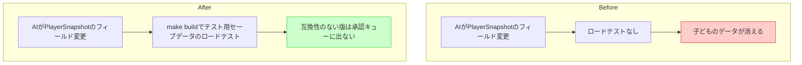

# ガードレール(5) セーブ互換テスト

## 深層的目的

「ぼくのデータなくなった」を防ぐ。

## 対象ガードレール

G10

---

## 1. Journey

## 2. Gherkin

_(Journey承認後に記入)_

## 3. Design

_(Journey承認後に記入)_

## 4. Tasklist

_(Journey承認後に記入)_

## 5. Discussion

- 2026-04-12 起票
