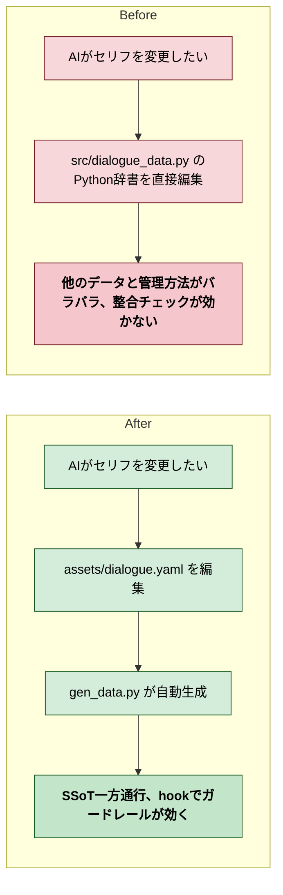

# 2026年4月12日 J36 セリフデータSSoT一方通行化

> 状態：(1) Journey
> 次のゲート：（ユーザー）Journey承認

---

## 1) Journey（どこへ行くか）

- **深層的目的**：セリフデータの散在を構造的に防ぐ
- **やらないこと**：セリフ表示のロジックバグ修正（別タスク）、他のデータ種別のSSoT化

### 現状

- セリフデータは src/dialogue_data.py にPython辞書（DIALOGUE_JA, DIALOGUE_EN）で直書き
- assets/dialogue.yaml は git status で D（削除済み）
- gen_data.py は存在しない（タスク1のSSoT基盤は設計のみで実装未完了）
- G1/G3 の hook は設定済みだが、gen_data.py がないため G3 はスキップ動作

---

## 2) Gherkin（完了条件）

_(Journey承認後に記入)_

---

## 3) Design（どうやるか）

_(Gherkin承認後に記入)_

---

## 4) Tasklist

_(Design承認後に記入)_
注: /superpowers:writing-plans で計画立案、/superpowers:test-driven-development でTDDサイクルを回す

---

## 5) Discussion（記録・反省）

### 2026年4月12日 22:30（起票）

**Observe**：セリフデータが src/dialogue_data.py にPython辞書で直書き。SSoT一方通行（YAML -> gen -> generated/）になっていない。gen_data.py も存在しない。
**Think**：まずdialogueだけに絞ってSSoTパイプラインを作る。TDDで進める（テスト先行）。他のデータ種別（spells, enemies等）は後日。
**Act**：タスクノート起票。
