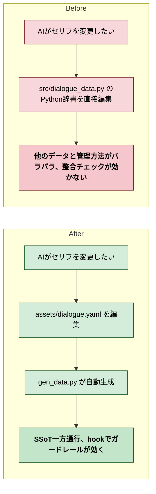
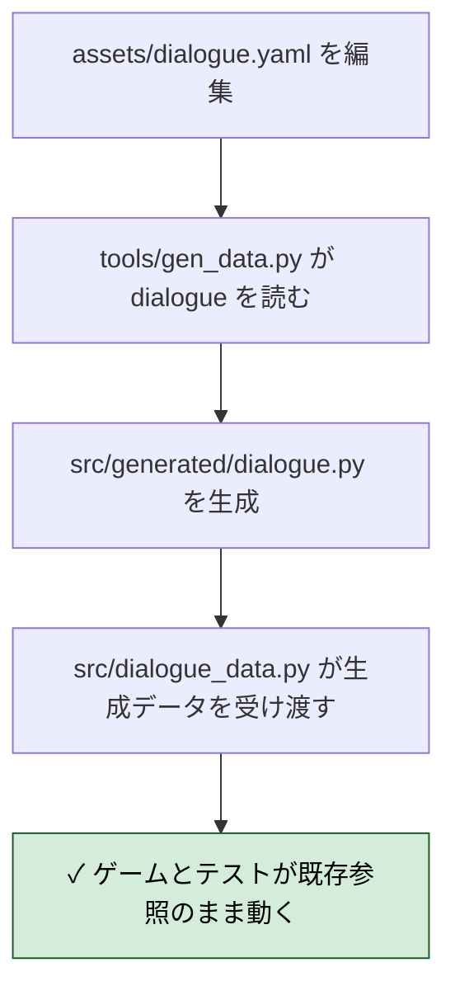
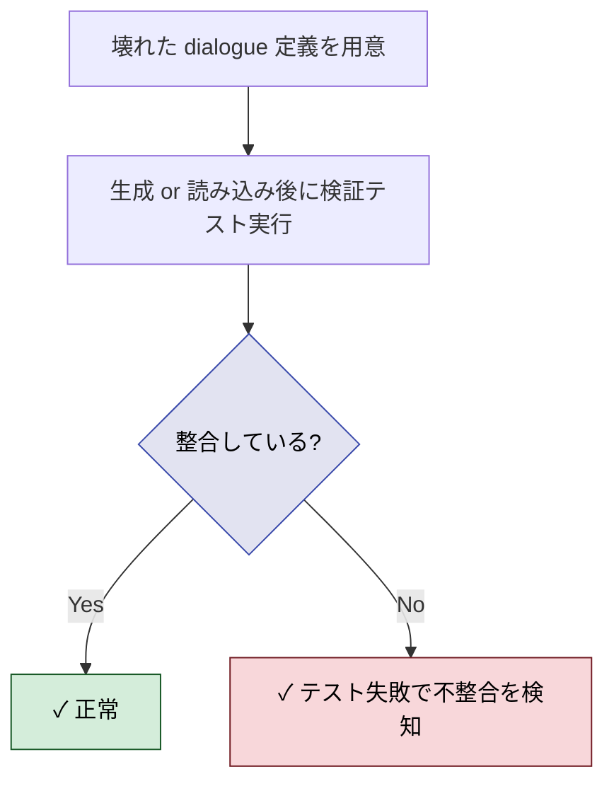
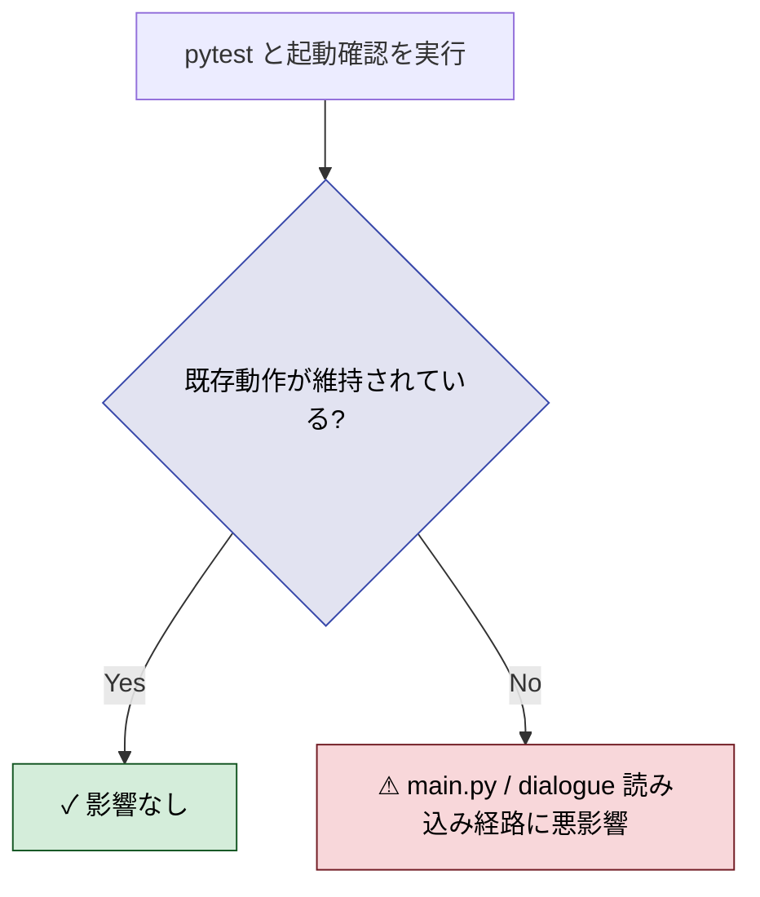
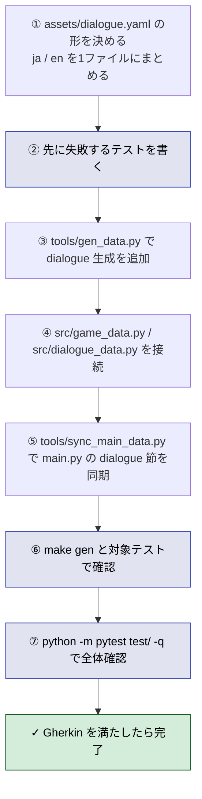
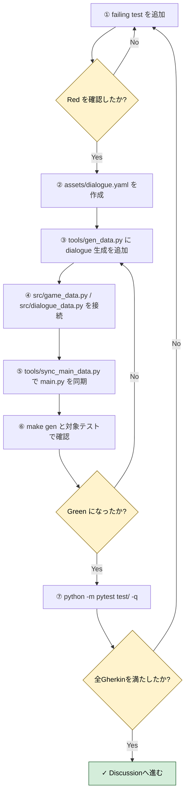

# 2026年4月12日 J36 セリフデータSSoT一方通行化

> 状態：(5) Discussion
> 次のゲート：（ユーザー）完了確認

---

## 1) Journey（どこへ行くか）

- **深層的目的**：セリフの元データを1か所にまとめる
- **やらないこと**：セリフ表示ロジックのバグ修正、他データ種別のSSoT化、大きな呼び出し側リファクタ

### 現状

- セリフデータは `src/dialogue_data.py` に Python 辞書（`DIALOGUE_JA`, `DIALOGUE_EN`）で直書き
- `assets/dialogue.yaml` は現在存在しない
- `tools/gen_data.py` はすでに存在し、他データでは YAML -> generated の流れが動いている
- 今回は dialogue も同じ一方通行にそろえ、`src/dialogue_data.py` は薄い互換レイヤーとして残す方針

### 今回の方針

- 本物の元データは `assets/dialogue.yaml` に置く
- `python tools/gen_data.py dialogue` で `src/generated/dialogue.py` を生成する
- `src/dialogue_data.py` は生成済みデータを受け渡すだけにする
- ゲーム本体とテストは、まず今の import / 参照方法を大きく変えずに動かす

### 委任度

- 🟢 CC単独で進行可能

---

## 2) Gherkin（完了条件）

### シナリオ1：正常系（dialogue を YAML から一方通行で生成できる）

> {`assets/dialogue.yaml` に日本語・英語のセリフ定義がある} で {`python tools/gen_data.py dialogue` を実行する} と {`src/generated/dialogue.py` が生成され、`src.dialogue_data` 経由で既存コードから読める}

---

### シナリオ2：異常系（壊れたセリフ定義を見逃さない）

> {`assets/dialogue.yaml` に未知の `next` 参照や壊れた構造がある} で {dialogue 検証テストを実行する} と {テストが失敗し、不整合を完了扱いにしない}

---

### シナリオ3：リスク確認（既存の呼び出し側を壊さない）

> {dialogue のSSoT化を適用済み} で {既存の dialogue 系テストと起動確認を行う} と {`src.dialogue_data` 依存の動作が維持され、ゲーム起動経路を壊していない}

### 委任度

- 🟢 CC単独で進行可能

---

## 3) Design（どうやるか）

- **関連スキル・MCP**：`manage-tasknotes`、`superpowers:writing-plans`、`superpowers:test-driven-development`、`superpowers:verification-before-completion`
- **MCP**：追加なし

```mermaid
flowchart LR
    subgraph INPUT["インプット"]
        I1["assets/dialogue.yaml\n日本語・英語の原本"]
        I2["既存の src/dialogue_data.py / main.py\n現在の呼び出し経路"]
    end

    subgraph PROCESS["処理・変換"]
        P1["tools/gen_data.py を拡張\n→ dialogue 生成対応"]
        P2["src/generated/dialogue.py を生成\n→ DIALOGUE_JA / DIALOGUE_EN"]
        P3["src/game_data.py を dialogue ローダー化"]
        P4["src/dialogue_data.py は互換レイヤー化"]
        P5["tools/sync_main_data.py を拡張\n→ main.py の dialogue 節も同期"]
    end

    subgraph OUTPUT["アウトプット"]
        O1["ゲーム本体は YAML 由来のセリフを使う"]
        O2["既存の src.dialogue_data 参照は維持"]
        O3["main.py とテストも同じデータにそろう"]
    end

    INPUT --> PROCESS --> OUTPUT

    classDef io fill:#e2e3f1,stroke:#3949ab,color:#000000;
    classDef proc fill:#fff3cd,stroke:#856404,color:#000000;
    classDef out fill:#d4edda,stroke:#155724,color:#000000;

    class I1,I2 io;
    class P1,P2,P3,P4,P5 proc;
    class O1,O2,O3 out;
```

### 設計の要点

- `assets/dialogue.yaml` は1ファイルにし、その中に `ja` と `en` の2言語データを持たせる
- `tools/gen_data.py` は `dialogue` ターゲットを追加し、`src/generated/dialogue.py` に `DIALOGUE_JA` と `DIALOGUE_EN` を生成する
- `src/generated` の直接 import を広げないため、`src/game_data.py` を dialogue 用のローダーとして広げる
- `src/dialogue_data.py` は自前の辞書をやめ、`src.game_data` から受け取った `DIALOGUE_JA` / `DIALOGUE_EN` をそのまま公開する互換レイヤーにする
- 実行入口は `main.py` なので、`tools/sync_main_data.py` を拡張して `src/dialogue_data.py` 節も generated 由来の内容へ同期する
- テストは「生成できる」「壊れた定義を検知する」「既存の runtime 経路を壊さない」の順で TDD する

### 委任度

- 🟢 CC単独で進行可能
- 夜間委任もしやすい
  - ✅ できること：YAML追加、codegen拡張、syncスクリプト更新、テスト実行、タスクノート更新
  - ❌ できないこと：Googleカレンダー記録など OAuth 系の外部連携

---

## 4) Tasklist

- 注: `manage-calendar` スキルがこの環境にないため、予定作成ステップはスキップして実装計画だけ記入する
- [x] `test/test_dialogue_ssot.py` を新規作成し、以下の Red テストを書く
- [x] `dialogue` が `tools/gen_data.py` の対象に未登録だと落ちるテストを書く
- [x] `src.game_data.load_dialogue("ja" / "en")` が未実装だと落ちるテストを書く
- [x] `tools.sync_main_data.build_inlined_dialogue_section()` が未実装だと落ちるテストを書く
- [x] `python -m pytest test/test_dialogue_ssot.py -q` を実行し、想定どおり Red になることを確認する
- [x] 既存の `src/dialogue_data.py` から `DIALOGUE_JA` と `DIALOGUE_EN` を `assets/dialogue.yaml` へ移す
- [x] YAML の形は `ja:` と `en:` をトップレベルに持つ1ファイル構成にする
- [x] `tools/gen_data.py` に `dialogue` ターゲットを追加し、`src/generated/dialogue.py` に `DIALOGUE_JA` と `DIALOGUE_EN` を生成できるようにする
- [x] `python tools/gen_data.py dialogue` を実行し、`src/generated/dialogue.py` が更新されることを確認する
- [x] `src/game_data.py` に dialogue ローダーを追加する
- [x] ローダーAPIは `load_dialogue(language: str)` とし、`"ja"` と `"en"` 以外は `ValueError` にする
- [x] `src/dialogue_data.py` は辞書本体を持たず、`src.game_data` から受け取った `DIALOGUE_JA` / `DIALOGUE_EN` を公開する薄い互換レイヤーへ置き換える
- [x] `tools/sync_main_data.py` を拡張し、`main.py` の `# === inlined: src/dialogue_data.py ===` 節も generated 由来の内容へ同期できるようにする
- [x] `python tools/sync_main_data.py` を実行し、`main.py` の generated sections を最新化する
- [x] `python -m pytest test/test_dialogue_ssot.py test/test_structured_dialog.py test/test_dialogue_integration.py test/test_game_data.py -q` を実行し、dialogue まわりの Green を確認する
- [x] `python -m pytest test/ -q` を実行し、既存テスト群が壊れていないことを確認する
- [x] `python tools/sync_main_data.py --check` を実行し、`main.py` 同期が保たれていることを確認する
- [x] `python tools/test_headless.py` は sandbox 上で終了が不安定だったため補助確認扱いにし、結果を `5) Discussion` に記録する
- [x] 結果を `5) Discussion` に記録し、Gherkin 3本をすべて満たしたかを CoVe で確認する

---

## 5) Discussion（記録・反省）

### 2026年4月12日 22:30（起票）

**Observe**：セリフデータが src/dialogue_data.py にPython辞書で直書き。SSoT一方通行（YAML -> gen -> generated/）になっていない。gen_data.py も存在しない。
**Think**：まずdialogueだけに絞ってSSoTパイプラインを作る。TDDで進める（テスト先行）。他のデータ種別（spells, enemies等）は後日。
**Act**：タスクノート起票。

### 2026年4月13日 00:20（Tasklist計画）

**Observe**：`tools/gen_data.py` はすでにあり、他データでは YAML -> generated の流れが動いている。一方で dialogue だけが `src/dialogue_data.py` 直書きのまま残っている。`main.py` は単一ファイル版を別途同期しているため、`src/dialogue_data.py` だけ直しても足りない。
**Think**：実装の境界は `assets/dialogue.yaml`、`tools/gen_data.py`、`src/game_data.py`、`src/dialogue_data.py`、`tools/sync_main_data.py` の5か所。ここを TDD で順に埋めれば、既存の呼び出し側を大きく変えずに SSoT 一方通行へ寄せられる。
**Act**：`Tasklist` セクションに実行順の計画を記入し、次のゲートを `実行` に更新した。

### 2026年4月13日 00:40（実装完了）

**Observe**：Red テストでは `dialogue` ターゲット未登録、`load_dialogue()` 未実装、`build_inlined_dialogue_section()` 未実装の3点で失敗した。`main.py` も旧来の直書き dialogue 節を持っていた。
**Think**：最小差分で通すには、`assets/dialogue.yaml` を原本化しつつ、`src/dialogue_data.py` は互換レイヤーのまま残すのが安全だった。`main.py` は実行入口なので、generated data と同期する仕組みまで同時に直す必要があった。
**Act**：`assets/dialogue.yaml` を追加し、`tools/gen_data.py` で `src/generated/dialogue.py` を生成できるようにした。`src/game_data.py` に `load_dialogue()` を追加し、`src/dialogue_data.py` を薄い公開窓口へ変更した。`tools/sync_main_data.py` を拡張して `main.py` の dialogue 節も同期対象にした。検証は `python -m pytest test/test_dialogue_ssot.py -q` で 4 pass、dialogue 関連テスト群で 51 pass、`python -m pytest test/ -q` で 134 pass、`python tools/sync_main_data.py --check` で同期OKを確認した。`python tools/test_headless.py` は sandbox 上で音声警告のあと終了が不安定で、補助確認には使えなかった。

### 反省とルール化

- 既存ノートの現状欄は、起票直後でも実装進行中の真実に合わせて早めに更新したほうが混乱が少ない
- `main.py` が単一ファイル同期を持つプロジェクトでは、SSoT 移行時に sync スクリプト更新まで最初から設計へ入れる
- 次にやること：必要なら `tools/test_headless.py` の sandbox 安定化を別タスクで切り出す
