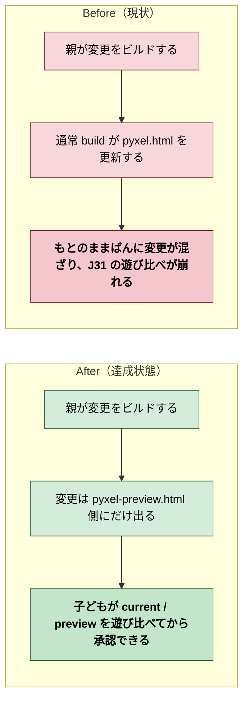
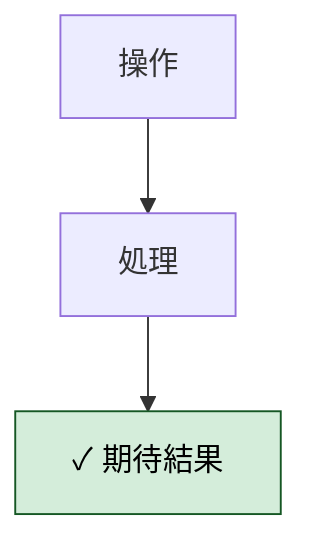
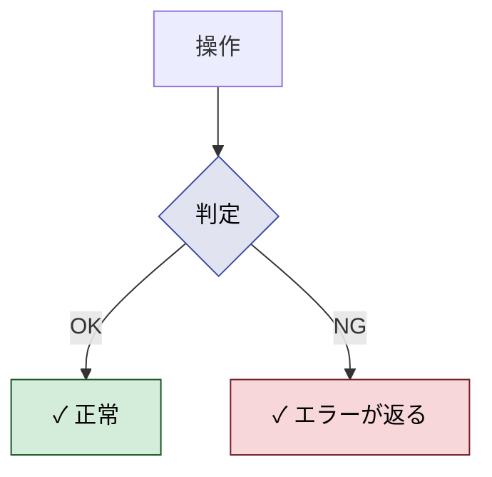
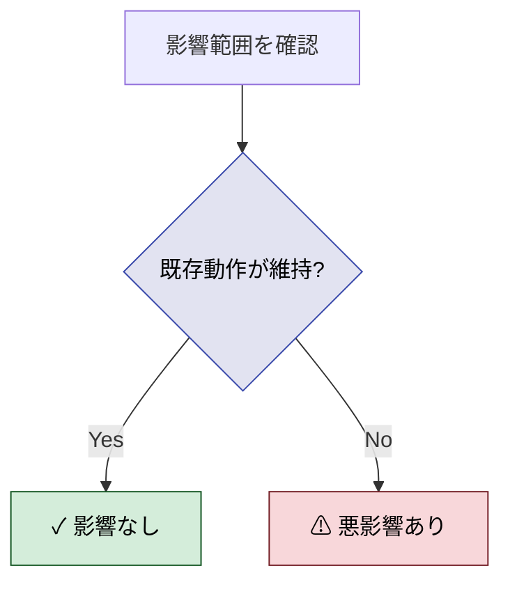
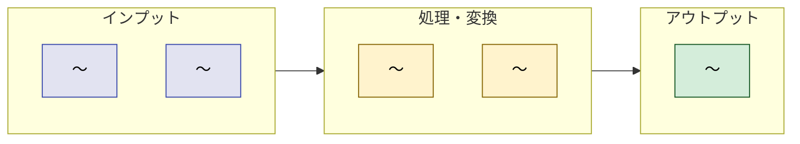
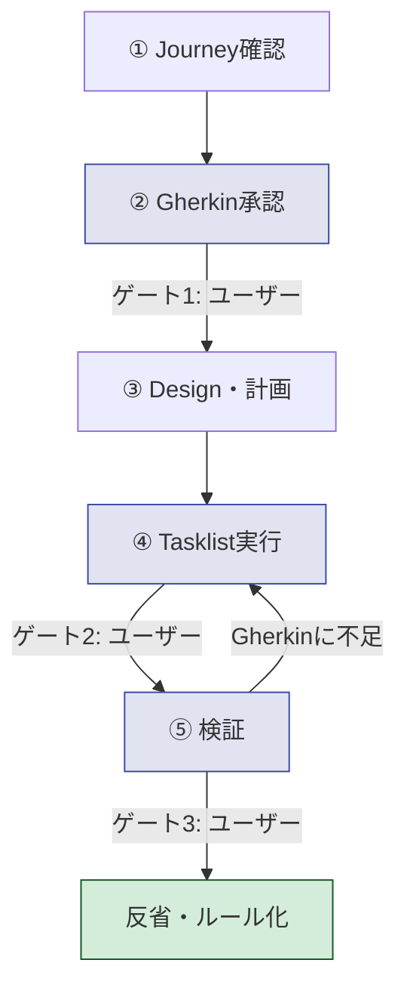
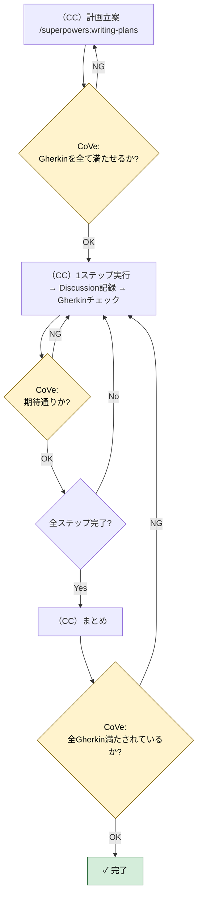

# 2026年4月12日 J38 preview build を current に混ぜない

> 状態：(1) Journey
> 次のゲート：（ユーザー）Gherkin へ進むか確認

---

## 1) Journey（どこへ行くか）

- **深層的目的**：比較導線を守る
- **やらないこと**：今日中に承認UI全体を作り直すこと、配信方式まで広げて直すこと

### 現状

- `docs/gherkins/gherkin-platform.md` の J31/J32 では、変更確認は `pyxel-preview.html` 側で行う前提になっている
- しかし現在の通常 build は `pyxel.html` / `pyxel.pyxapp` を直接更新するので、変更が current 側へ混ざる
- 今回は応急処置として preview 側へファイルを退避したが、次に `make build` を実行するとまた current 側へ出る

### 今回の方針

- preview build と current build の役割をコード上ではっきり分ける
- AI に変更を頼んだときは preview 側にだけ成果物が出る流れを先に守る
- 承認後にだけ current 側へ昇格する流れを、J31/J32 の仕様どおりに整理する

### 委任度

- 🟡 CC主導で実装は進められるが、最終判断として「通常 build を current 用に残すか」「preview build を別入口にするか」の整理が必要

---

## 2) Gherkin（完了条件）

### シナリオ1：正常系（〜が成功する）

> {前提条件} で {操作} すると {期待結果}

---

### シナリオ2：異常系（〜が失敗するケース）

> {前提条件} で {異常な操作} すると {エラーが返り副作用がない}

---

### シナリオ3：リスク確認（〜に悪影響がない）

> {変更適用済み} で {影響範囲を確認} すると {既存の動作が維持されている}

---

## 3) Design（どうやるか）

- **関連スキル・MCP**：（余計なものをロードしない）

---

## 4) Tasklist

> 必ず上から順に実施。CCがCoVeで自力検証しながら進める。

- [ ] （CC）`/superpowers:writing-plans` で計画を立てる（このセクションに記入）
- [ ] （CC）作業を1ステップ実行 → **5) Discussion に記録** → Gherkinチェック → 次へ
- [ ] （CC）作業結果をまとめ、全Gherkinを満たしているかCoVeで検証

---

## 5) Discussion（記録・反省）

> Observe → Think → Act を刻む。未来の自分が復元できることが目的。

### 2026年4月12日 23:57（起票）

**Observe**：通常 build を実行すると変更済み成果物が `pyxel.html` 側へ出てしまい、J31 の「おためしばんで確認してから承認する」流れとずれていた。今回は時間優先で preview 側へファイルを退避して応急対応した。
**Think**：問題は「ファイル名」より「build の責務分離」にある。preview build の入口と current build の入口を整理し、承認前の変更が current 側へ混ざらないようにする必要がある。
**Act**：preview build 導線の根本修正タスクとして J38 を起票した。

### 2026年4月13日 00:02（close-session 中断メモ）

**Observe**：セッション終了前の時点で、preview 側への応急退避は完了しているが、根本の build 導線修正は未着手。`index.html` のおためし版説明文は当面の文言に差し替え済み。
**Think**：次回は J38 の `Gherkin` から再開し、`make build` / `--preview` / `--promote` の責務分離を仕様に沿って整理するのが最短。
**Act**：再開ポイントをノートに追記した。

---

### 反省とルール化

- 記入先：observe-situation / manage-tasknotes / CLAUDE.md
- 次にやること：
