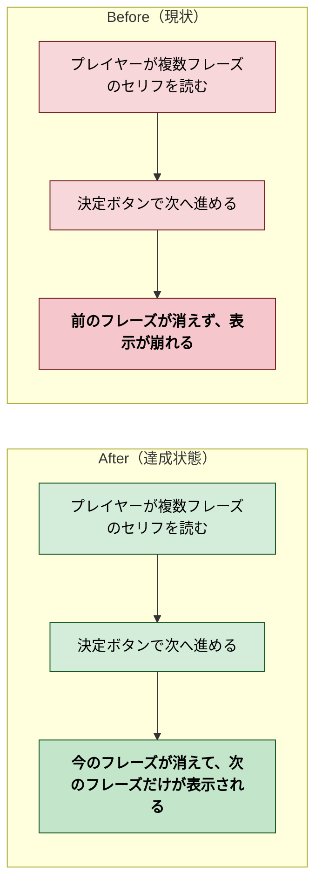
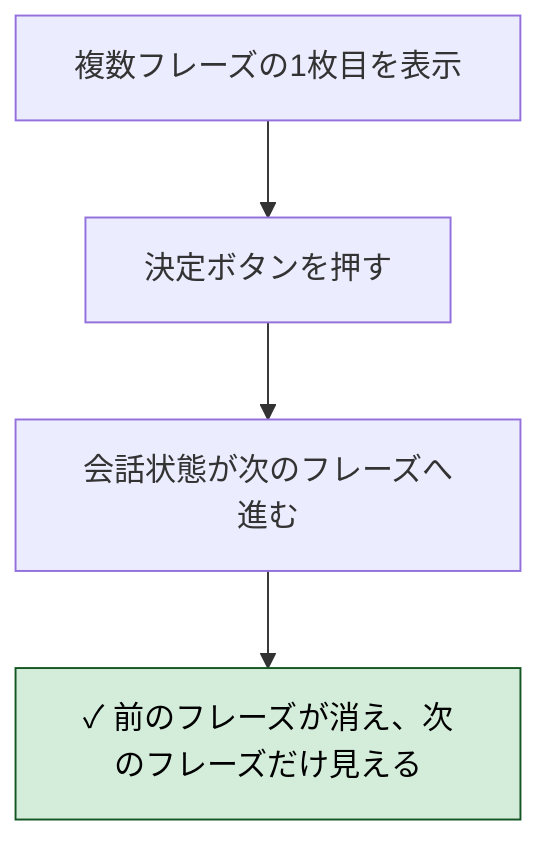
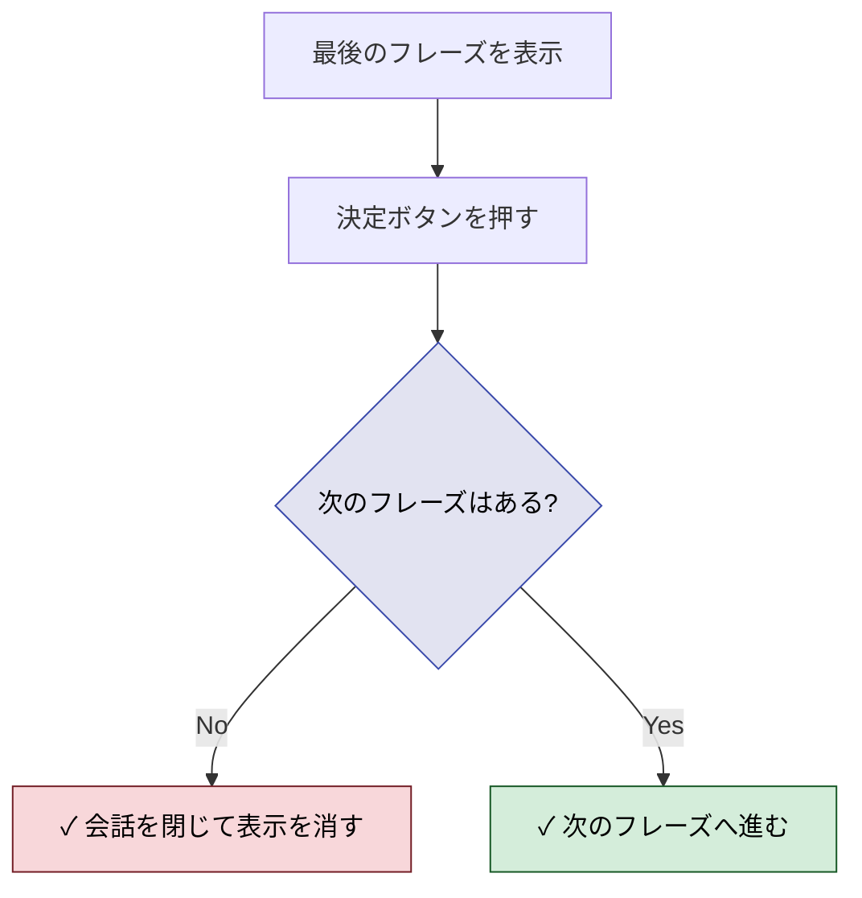
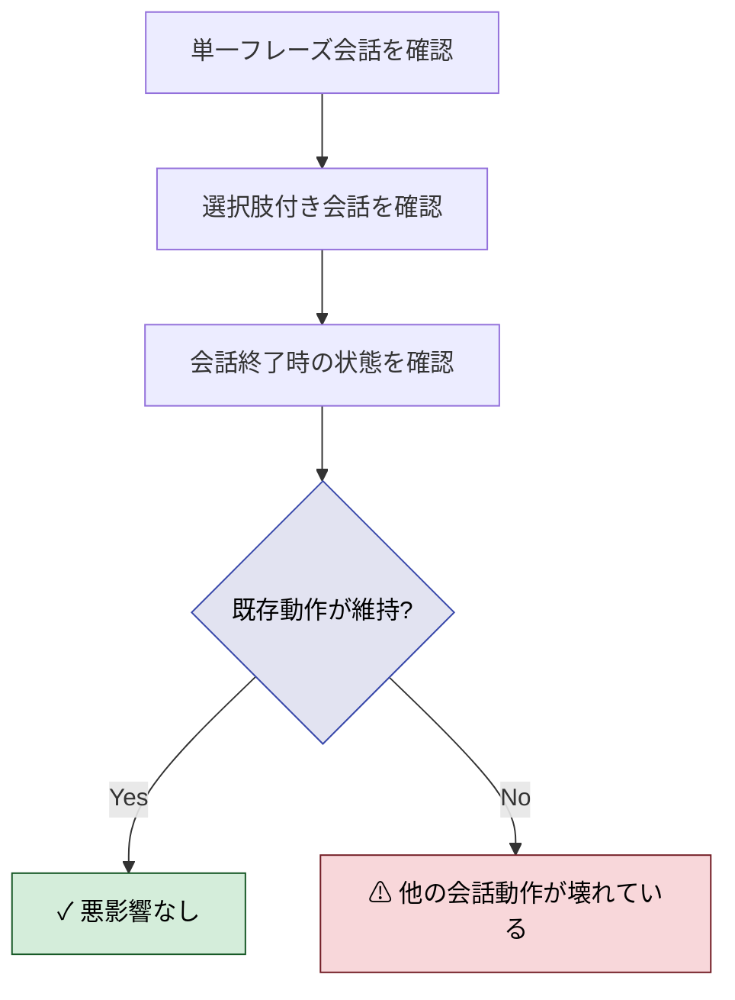
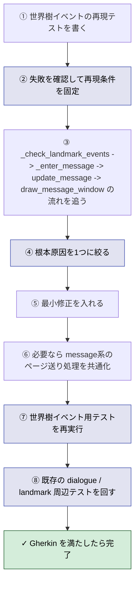
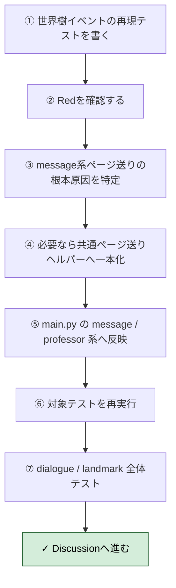

# 2026年4月13日 J37 セリフ送りで前のフレーズが消えない

> 状態：(5) Discussion
> 次のゲート：（ユーザー）必要なら実画面確認 or 次タスク

---

## 1) Journey（どこへ行くか）

- **深層的目的**：セリフ送りを正しくする
- **やらないこと**：セリフ文言の追加変更、SSoT移行のやり直し、演出の新規追加

### 現状

- 世界樹イベントの複数フレーズ会話で、決定ボタンを押しても前のフレーズが消えない
- その結果、次のフレーズ表示時に見た目が崩れ、読み進めにくい
- 世界樹イベントは `message` state を通るため、`msg_lines` / `msg_index` と `draw_message_window()` の組み合わせに原因がある可能性が高い

### 今回の方針

- まず不具合の再現条件を固定する
- 決定ボタン1回で「前のフレーズを消す -> 次のフレーズを表示する」が必ず起きる状態を目標にする
- バグ修正に直結する範囲で、重複したページ送り処理は一本化して保守しやすくする
- 単一フレーズの会話、会話終了、選択肢表示など既存の周辺動作は壊さない前提で進める

### 委任度

- 🟡 CC主導で調査と修正は進められるが、最終の見た目確認は実画面での確認があると安心

---

## 2) Gherkin（完了条件）

### シナリオ1：正常系（世界樹イベントの複数フレーズが正しく送られる）

> {世界樹イベントの複数フレーズが表示中} で {決定ボタンを1回押す} と {前のフレーズが消え、次のフレーズだけが表示される}

---

### シナリオ2：異常系（世界樹イベントの最後のフレーズ送りで表示が残らない）

> {世界樹イベントの最後のフレーズを表示中} で {決定ボタンを押す} と {会話が正しく終了し、古いフレーズ表示が画面に残らない}

---

### シナリオ3：リスク確認（既存の会話動作に悪影響がない）

> {セリフ送り修正を適用済み} で {単一フレーズ会話・選択肢付き会話・会話終了を確認する} と {既存の会話進行と入力受付が維持されている}

### 委任度

- 🟡 CC主導で調査と修正は進められるが、最終の見た目確認は実画面での確認があると安心

---

## 3) Design（どうやるか）

- **関連スキル・MCP**：`manage-tasknotes`、`superpowers:systematic-debugging`、`superpowers:test-driven-development`、`superpowers:verification-before-completion`
- **MCP**：追加なし

```mermaid
flowchart LR
    subgraph INPUT["インプット"]
        I1["世界樹イベント\nlandmark.tree.first など"]
        I2["message state\nmsg_lines / msg_index / draw_message_window"]
    end

    subgraph PROCESS["調査・修正"]
        P1["世界樹イベントの再現条件を固定"]
        P2["進行処理と描画処理を分離して観察"]
        P3["根本原因を特定"]
        P4["最小修正を実装"]
        P5["必要なら共通のページ送り処理へ一本化"]
    end

    subgraph OUTPUT["アウトプット"]
        O1["世界樹イベントで前のフレーズが残らない"]
        O2["他の message 会話も壊さない"]
    end

    INPUT --> PROCESS --> OUTPUT

    classDef io fill:#e2e3f1,stroke:#3949ab,color:#000000;
    classDef proc fill:#fff3cd,stroke:#856404,color:#000000;
    classDef out fill:#d4edda,stroke:#155724,color:#000000;

    class I1,I2 io;
    class P1,P2,P3,P4,P5 proc;
    class O1,O2 out;
```

### 設計の要点

- 調査対象は世界樹イベントに限定する
- 入口は `_check_landmark_events()`、表示経路は `_enter_message()` -> `update_message()` -> `draw_message_window()` に絞る
- まず世界樹イベントの複数フレーズ表示を再現するテストを作り、進行後に「次に表示されるべき行」だけが選ばれているかを確認する
- 修正は根本原因が判明してから1か所に絞る。候補は `msg_index` の進め方、`msg_lines` の与え方、描画対象の選び方のどれか
- もし原因が `message` 系の重複ロジックにあるなら、`update_message()` / `update_town()` など近い責務を持つページ送り処理は小さく共通化する
- ただし教授イベントの選択肢付き進行まで一気に統合すると範囲が広がるので、今回は「世界樹と同じ message 系」に限って一本化を検討する
- 既存の単一フレーズ会話や landmark の別イベントには悪影響を出さないよう、回帰テストをセットで回す

### 委任度

- 🟡 CC主導で調査と修正は進められるが、最終の見た目確認は実画面での確認があると安心

---

## 4) Tasklist

- [x] 世界樹イベントのページ送り期待値を固定する failing test を追加する
- [x] `draw_message_window()` が「現在のフレーズだけ」を描くべきことを Red で確認する
- [x] `update_message()` / `update_town()` と professor 系のページ送り重複を確認する
- [x] 必要最小限の共通ページ送りヘルパーを追加する
- [x] 世界樹・通信塔・プロフェッサーの複数フレーズ進行が同じ考え方で扱えるように main.py を調整する
- [x] 魔王戦は `battle_text` の別経路で、今回の不具合経路とは分かれていることを確認する
- [x] 対象テストを Green にする
- [x] `python -m pytest test/ -q` で回帰確認する

---

## 5) Discussion（記録・反省）

### 2026年4月13日 00:50（起票）

**Observe**：複数フレーズのセリフで、決定ボタン後も前のフレーズが消えず表示が崩れる。
**Think**：描画クリア処理か、セリフ進行時の状態更新順に問題がある可能性が高い。まず Journey と完了条件を固めてから調査に入る。
**Act**：`docs/steering/` に J37 タスクノートを起票した。

### 2026年4月13日 01:45（Tasklist開始）

**Observe**：ユーザー追記により、症状候補は世界樹・通信塔・プロフェッサー・魔王まわりの4か所にある可能性が出た。ただしコード上は世界樹と通信塔が `message` 系、プロフェッサーが専用ページ送り系で、経路が分かれている。
**Think**：まず世界樹で再現を固定し、`message` 系の根本原因を特定するのが最短。もし重複ロジックが原因なら、バグ修正に直結する範囲だけ共通化する。
**Act**：`Tasklist` を記入し、状態を `in-progress` に更新した。

### 2026年4月13日 02:05（実装・検証完了）

**Observe**：失敗テストで、`draw_message_window()` が現在ページに加えて次の2ページまで同時に描いていることを確認した。さらに `\n` を含む1ページをそのまま `text()` に渡しており、ページ単位と行単位が混ざっていた。
**Think**：根本原因は「現在ページの切り出し責務が分散していたこと」。世界樹と通信塔は `message` 系、プロフェッサーは専用描画だが、どちらも「今の1ページだけを表示する」という共通責務でそろえられる。魔王戦は `battle_text` の別経路なので今回の不具合と同根ではない。
**Act**：`main.py` に `_advance_dialog_page()` と `_current_dialog_page_lines()` を追加し、`message` / `town` / `professor` 系へ適用した。`test/test_dialogue_paging.py` を追加・拡張し、`python -m pytest test/test_dialogue_paging.py -q` で `6 passed`、`python -m pytest test/test_structured_dialog.py test/test_dialogue_integration.py test/test_game_data.py -q` で `47 passed`、`python -m pytest test/ -q` で `140 passed` を確認した。

### 反省とルール化

- 記入先：observe-situation / manage-tasknotes / CLAUDE.md
- 次にやること：必要なら実画面で世界樹・通信塔・プロフェッサーの見た目確認を行う。魔王戦の表示に別症状がある場合は、`battle_text` 専用タスクとして切り出す。
