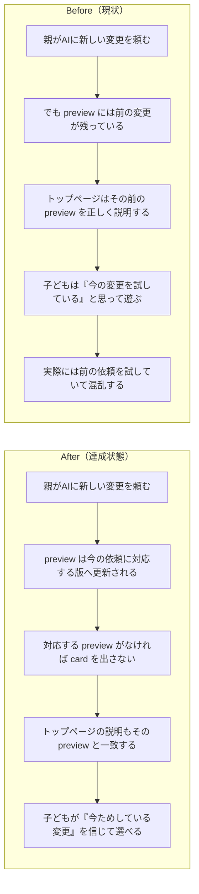

# 2026年4月16日 J48 おためしばんは今の依頼内容を表すと CJ31/CJG31 で明確化する

> 状態：(5) Discussion
> 次のゲート：（ユーザー）必要なら実装 note を別で切る

---

## 1) 改善対象ジャーニー

- **根拠となるカスタマージャーニー**：`docs/product-requirements/customer-journeys.md` の `CJ31: 子どもが変更を承認する`
- **関連するカスタマージャーニー**：`docs/product-requirements/customer-journeys.md` の `CJ33: 子どもが変更を選んで適用する`
- **深層的目的**：子どもがトップページを開いたとき、`おためしばん` が「今ためしてほしい新しい変更」を指していると信じられるようにする
- **やらないこと**：この note で個別のゲームロジック修正や build ロジック変更まで先に進めること、トップページの見た目だけを直すこと、文言だけを手で差し替えて済ませること

### 人間の期待

- **この note が `done` なら、人間は何が成立していると思うか**：`CJ31/CJG31` を読めば、`おためしばん` は「今の依頼」に対応する版だけを指すと分かる。前の依頼の preview が残っているだけなら、それを新しい依頼みたいに見せてはいけないと仕様上はっきり読める
- **その期待を裏切りやすいズレ**：`おためしばん` の説明は正しくても中身が前の依頼のまま残る、`main.py` と `main_preview.py` の役割が混ざる、preview がないのに古い card や artifact だけ残る
- **ズレを潰すために見るべき現物**：`docs/product-requirements/customer-journeys.md`、`docs/product-requirements/cj-gherkin-platform.md`、`docs/steering/20260416-j47-preview-first-selector-autogen.md`、`main.py`、`main_preview.py`、`preview_meta.json`、`index.html`、`tools/build_web_release.py`

### 現状

- `J47` で、トップページ説明は `main.py` と `main_preview.py` の差分から自動生成されるようになった
- その結果、今の `index.html` に出ている `つうしんとうの ノイズガーディアンが フィールドに でない` は stale text ではなく、現行 `main_preview.py` の実差分を正しく説明している
- しかし人間の期待はそこでは止まらず、`おためしばん` 自体が「今の依頼に対応する preview」であることまで含んでいる
- つまり現状のズレは `CJ33` の説明一致より一段深く、`CJ31` の「何を承認待ちとして見せているか」の意味づけが不足している点にある
- docs 側は `preview = 新しい変更の受け皿` へ寄せたが、`前の preview を新しい依頼として見せない` ところまではまだ明文化されていなかった

### 今回の方針

- この問題はまず `CJ31` の問題として扱う。中心は説明文ではなく、`おためしばん` の意味そのもの
- `おためしばん` は「存在する preview を何でも見せる枠」ではなく、「今ためしてほしい未承認変更」を見せる枠だと docs 上で定義し直す
- そのうえで `CJ33` 側では、その preview に対する説明が一致することを従属条件として扱う
- 今回は docs / gherkin の明確化までを閉じ、実装方法は別 note で扱える形にする

### 委任度

- 🟢 docs / gherkin の明確化までは CC 主導で進められる。実装方法の選定は次ノートでよい

---

## 2) カスタマージャーニーgherkin（完了条件）

### シナリオ1：正常系（CJ31 が今の依頼に対応するおためしばんを要求する）

> {`CJ31` を読む} で {preview の意味を確認する} と {`おためしばん` は今の依頼に対応する preview だけを指すと読める}

### シナリオ2：異常系（CJG31 が前の preview の見せ方を禁止する）

> {`CJG31` を読む} で {前の preview しか残っていない状態を確認する} と {古い preview を今の依頼の `おためしばん` として見せない条件が書かれている}

### シナリオ3：回帰確認（CJ33/CJG33 は説明一致を従属条件として保つ）

> {`CJ33/CJG33` を読む} で {変更一覧の意味を確認する} と {一覧は今の依頼に対応する `おためしばん` だけを説明すると読める}

### 対応するカスタマージャーニーgherkin

- `docs/product-requirements/cj-gherkin-platform.md` `CJG31`
- `Scenario: 親がAIに頼んだ変更はまずおためし版に入る`
- `docs/product-requirements/cj-gherkin-platform.md` `CJG31`
- `Scenario: 前の依頼の preview を今の依頼のおためし版として見せない`
- `docs/product-requirements/cj-gherkin-platform.md` `CJG31`
- `Scenario: 選択ページの変更説明が実際の配信内容と一致する`
- `docs/product-requirements/cj-gherkin-platform.md` `CJG33`
- `Scenario: 変更一覧はおためし版から自動生成される`
- `docs/product-requirements/cj-gherkin-platform.md` `CJG33`
- `Scenario: 変更一覧は今の依頼に対応するおためし版だけを説明する`

---

## 3) Design（どうやるか）

- **関連スキル・MCP**：追加なし
- **MCP**：追加なし

### 調査起点

- `tools/build_web_release.py`
  現状の preview 表示条件が「存在する差分」を見ているだけで、人間期待とずれていること
- `main.py` と `main_preview.py`
  現行 `index.html` が `ノイズガーディアン` を出しているのは stale text ではなく実差分だと確認できること
- `preview_meta.json`
  内容説明は持っているが、「今の依頼」との結びつきは持っていないこと
- `index.html`
  現物として人間の混乱が起きた入口

### 実世界の確認点

- **実際に見るURL / path**：
  `/home/exedev/code-quest-pyxel/main.py`
  `/home/exedev/code-quest-pyxel/main_preview.py`
  `/home/exedev/code-quest-pyxel/preview_meta.json`
  `/home/exedev/code-quest-pyxel/index.html`
  `/home/exedev/code-quest-pyxel/play-preview.html`
  `/home/exedev/code-quest-pyxel/pyxel-preview.html`
- **実際に動いている process / service**：
  追加なし
- **実際に増えるべき file / DB / endpoint**：
  追加なし。今回は docs / gherkin の明確化だけ

### 検証方針

- `index.html` / `main_preview.py` / `preview_meta.json` の現物を読み、混乱の原因が stale text ではなく preview の意味づけ不足だと確認する
- そのうえで `CJ31/CJ33` と `CJG31/CJG33` に、人間期待どおりの意味を追記する
- 追記後、docs だけ読んでも「前の preview を今の依頼として見せない」が読み取れることを確認する

---

## 4) Tasklist

- [x] `CJ31` と `CJ33` のどちらが主問題かを docs / note / 現物で固定する
- [x] `main.py` / `main_preview.py` / `preview_meta.json` / `index.html` の現状フローを整理する
- [x] 古い preview を新しい依頼の `おためしばん` として見せてしまう根本原因を、説明不一致ではなく意味づけ不足だと特定する
- [x] `CJ31/CJ33` に「今の依頼に対応する preview だけを見せる」期待を追記する
- [x] `CJG31/CJG33` に「前の preview を今の依頼として見せない」条件を追記する
- [x] note に docs スコープでの完了を記録する

---

## 5) Discussion（記録・反省）

> Observe → Think → Act を刻む。未来の自分が復元できることが目的。

### 2026年4月16日 07:00（起票）

**Observe**：トップページには `つうしんとうの ノイズガーディアンが フィールドに でない` と出ていたが、これは古い説明文が残っているのではなく、現行 `main_preview.py` の実差分を正しく説明していた。  
**Think**：問題は `CJ33` の説明不一致ではなく、`おためしばん` 自体が「今の依頼内容」を表していないことだった。先に直すべきなのは `CJ31` 側の意味づけ。  
**Act**：`おためしばんが今の依頼内容を表すようにする` task note として J48 を起票し、主問題を `CJ31`、従属問題を `CJ33` として切り分けた。

### 2026年4月16日 07:20（docs / gherkin 更新完了）

**Observe**：`CJ31` は preview-first を書いていたが、「前の依頼の preview が残っているだけなら今の依頼の `おためしばん` として見せない」までは書いていなかった。`CJ33` も一覧の自動生成は書いていたが、「今の依頼に対応するおためしばんだけを説明する」ことは弱かった。  
**Think**：このズレは先に docs で意味を固定しないと、実装側でも「説明は合っているからOK」と読み違えやすい。まず `CJ31/CJG31` を主語にして、`おためしばん` の意味を明文化するのが筋だった。  
**Act**：`customer-journeys.md` の `CJ31/CJ33` と `cj-gherkin-platform.md` の `CJG31/CJG33` を更新し、「今の依頼に対応する preview だけを `おためしばん` として見せる」「前の preview を新しい依頼みたいに見せない」を明記した。J48 も docs スコープの note として完了扱いに更新した。
