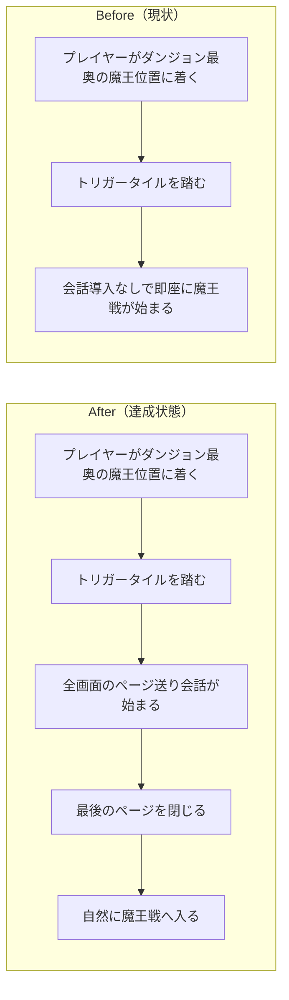

# 2026年4月18日 CJ09 魔王戦の導入をプロフェッサー型の会話モードに寄せる

> 状態：(1) 改善対象ジャーニー
> 次のゲート：（ユーザー）task note 確認後、実装へ進む

---

## 1) 改善対象ジャーニー

- **根拠となるカスタマージャーニー**：`CJ09: セリフを変えたい`
- **関連するカスタマージャーニー**：`CJ42: 子どもが冒険を最後までやり切れる`
- **深層的目的**：魔王到達時の物語導入を「即戦闘」ではなく会話で受け取れる形にし、プロフェッサー戦と同じ密度で最後の対決へ入れるようにする
- **やらないこと**：魔王戦の能力値調整、戦闘中 phase 台詞の全面改稿、分岐追加、`ending.main.*` の改変、新しい save flag の追加

### 人間の期待

- **この note が `done` なら、人間は何が成立していると思うか**：ダンジョン最奥の魔王位置を踏むと、まずプロフェッサーに近い全画面会話が始まり、読み切ったあと自然に魔王戦へ入る
- **その期待を裏切りやすいズレ**：会話データだけ増えて runtime は即戦闘のまま、魔王専用コードだけ増えて教授系より重複が増える、教授の既存会話進行が壊れる
- **ズレを潰すために見るべき現物**：`assets/dialogue.yaml`、`main.py`、`test/test_dialogue_integration.py`、`test/test_dungeon_boss_trigger.py`、ローカルの Pyxel 実行画面

### 現状

- `main.py` の `_check_tile_events()` は `T_GLITCH_LORD_TRIGGER` を踏むと即座に `_start_battle(GLITCH_LORD_DATA, is_glitch_lord=True)` を呼ぶ
- プロフェッサー側は全画面のページ送り会話と ending を持ち、魔王より導入の密度が高い
- 会話送りの基礎ヘルパーはあるが、全画面会話の update / draw は教授系に寄っていて、魔王へそのまま共有されていない
- 魔王側の narrative は主に `boss.glitch.*` の battle text と `ending.main.*` に寄っており、戦闘前の受け渡しが薄い

### 今回の方針

- 主ジャーニーは `CJ09` とし、「セリフを変える」だけでなく「セリフの受け取り方を改善する」変更として扱う
- 補助線として `CJ42` を置き、最後の対決まで気持ちよく進める流れを壊さないことも同時に見る
- `assets/dialogue.yaml` に魔王戦前の会話を足し、SSoT を維持する
- `main.py` には魔王専用の複製 state を増やさず、全画面ページ送り会話を共通 state / helper に寄せる
- その共通 helper を魔王戦前だけでなく、プロフェッサーの非分岐部分にも再利用して重複を減らす
- プロフェッサーの accept / refuse choice は無理に一般化せず、choice 部分だけ個別に残す

### 委任度

- 🟢 実装方針はかなり絞れている。CC 主導で task note から TDD 実装まで進めやすい

---

## 2) カスタマージャーニーgherkin（完了条件）

### シナリオ1：正常系

> {未撃破の状態で魔王トリガーを踏む} で {イベントを開始する} と {即戦闘ではなく、全画面のページ送り会話が始まる}

### シナリオ2：正常系

> {魔王戦前の全画面会話の最終ページを表示中} で {決定入力をする} と {会話が閉じ、`_start_battle(GLITCH_LORD_DATA, is_glitch_lord=True)` が1回だけ呼ばれる}

### シナリオ3：回帰確認

> {全画面会話の共通化を適用済み} で {プロフェッサー intro の choice と両 ending を確認する} と {ページ送りは維持され、choice の挙動も変わらない}

### 対応するカスタマージャーニーgherkin

- `CJG09: セリフを変えたい`

---

## 3) Design（どうやるか）

- **関連スキル・MCP**：`superpowers:test-driven-development`、`superpowers:verification-before-completion`
- **MCP**：追加なし

### 調査起点

- `docs/product-requirements/customer-journeys.md`
  `CJ09` と `CJ42` のどちらを主に置くべきかの根拠
- `docs/product-requirements/cj-gherkin-narrative.md`
  `CJG09` に沿う narrative 変更かどうかの確認
- `docs/steering/done/20260413-j37-dialogue-page-advance.md`
  会話送りの共通化で過去にどこまで整理したかの確認
- `docs/steering/done/20260413-j38-dungeon-boss-trigger.md`
  魔王トリガー導線の既存前提
- `docs/steering/done/20260413-j42-rpg-loop-journey.md`
  最後まで遊び切れる導線との接続

### 実世界の確認点

- **実際に見るURL / path**：`assets/dialogue.yaml`、`main.py`、`test/test_dialogue_integration.py`、`test/test_dungeon_boss_trigger.py`
- **実際に動いている process / service**：ローカルの Pyxel runtime (`python main.py` 相当)
- **実際に増えるべき file / DB / endpoint**：新規 endpoint なし。`assets/dialogue.yaml` の scene 追加と `main.py` / test 更新のみ

### 検証方針

- まず dialogue chain と trigger deferral を failing test で固定する
- その後、全画面ページ送り会話を共通 helper に寄せる
- 魔王は `trigger -> fullscreen dialog -> battle` になっていることを確認する
- プロフェッサー ending と intro choice 前のページ送りが regression していないことを確認する
- YAML を触るので `python tools/gen_data.py` を通し、必要なら `main.py` の同期手順も追う

---

## 4) Tasklist

- [ ] `CJ09` を主ジャーニー、`CJ42` を関連ジャーニーとする根拠を note に固定する
- [ ] `assets/dialogue.yaml` に魔王戦前の `boss.glitch.prebattle_*` を `ja/en` 両方で追加する
- [ ] 魔王トリガーが即戦闘ではなく会話開始になる failing test を追加する
- [ ] 魔王戦前会話の chain が `load_all_lines()` で取れる failing test を追加する
- [ ] 全画面ページ送り会話の shared state / helper を実装する
- [ ] 魔王導入を shared helper に接続する
- [ ] プロフェッサー ending と intro 非分岐部分を shared helper に寄せる
- [ ] `python tools/gen_data.py` を実行する
- [ ] 必要なら `main.py` の同期手順を実行する
- [ ] `python -m pytest test/ -q` を実行する

---

## 5) Discussion（記録・反省）

> Observe → Think → Act を刻む。未来の自分が復元できることが目的。

### 2026年4月18日 12:31（起票）

**Observe**：プロフェッサーは全画面会話で戦闘前の思想を受け取れるが、魔王は最奥トリガーを踏むと即戦闘に入る。物語上の重みが魔王側だけ薄く、しかも会話 UI の共通化も途中で止まっている。  
**Think**：この変更は分岐追加や ending 改稿ではなく、まず `CJ09` の延長で「会話をよりよい形で届ける」問題として扱うのが自然。そのうえで `CJ42` を補助線にして、最後の対決までの導線が気持ちよくつながることも守る。  
**Act**：主ジャーニーを `CJ09`、関連ジャーニーを `CJ42` と定めたうえで、魔王戦前会話を SSoT の dialogue に追加し、全画面ページ送り会話を共通 helper に寄せる task note を起票した。
