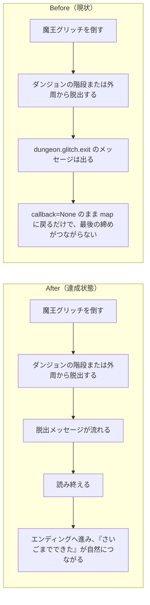

# 2026年4月18日 CJ42 魔王撃破後のダンジョン脱出をメッセージ後エンディングへつなぐ

> 状態：(5) Discussion
> 次のゲート：完了

---

## 1) 改善対象ジャーニー

- **根拠となるカスタマージャーニー**：`CJ42: 子どもが冒険を最後までやり切れる`
- **関連するカスタマージャーニー**：`CJ30: エンディングを自分たちで書く`
- **深層的目的**：魔王を倒したあとに「ダンジョンを出た」「物語が締まった」と子どもが自然に受け取れる導線を戻し、`ボス撃破 → 脱出メッセージ → エンディング` をひと続きにする
- **やらないこと**：魔王戦前会話の追加や共通化、`ending.main.*` 本文の改稿、プロフェッサー編の仕様変更、ダンジョン生成の再設計

### 人間の期待

- **この note が `done` なら、人間は何が成立していると思うか**：魔王撃破後にダンジョン出口へ出ると脱出メッセージが流れ、読み終えるとそのままエンディングへ進む。撃破前の通常脱出まで巻き込んで ending しない
- **その期待を裏切りやすいズレ**：`dungeon.glitch.exit` の文言は既にあるので「もうできている」と見誤る、実際は `callback=None` で map に戻るだけ、focused test も「without ending」を固定している、preview/change description が逆向きの説明を持ったまま残る
- **ズレを潰すために見るべき現物**：`main.py`、`test/test_dungeon_boss_trigger.py`、`tools/build_web_release.py`、`test/test_build_web_release.py`、ユーザーが参照元として示した `/home/exedev/game/index.html`

### 現状

- `main.py:5240-5248` と `main.py:5254-5263` は、ダンジョン外周脱出と階段脱出の両方で `self._enter_message(self._dialog_lines("dungeon.glitch.exit"), callback=None)` を呼んでいる
- `main.py:5608-5615` では魔王撃破時に `glitch_lord_defeated=True` を立てるが、その後は `state = "map"` に戻るため、撃破後の出口処理が ending へ接続されていない
- `test/test_dungeon_boss_trigger.py:150-168` も「glitch_lord_defeated 後に脱出しても ending しない」を今の期待値として固定している
- ユーザーが参照した `/home/exedev/game/index.html:2002-2009` では `handleDungeonExit()` が `player.bossDefeated` 時に脱出メッセージ後 `enterEnding()` を呼ぶ
- 一方で current repo には `glitch_lord_defeated` 後の隠し導線として `main.py:5280-5282` のプロフェッサー編入口や `main.py:5393-5401` の landmark epilogue があるため、単純差し戻しで後続導線を壊す可能性がある
- `tools/build_web_release.py:41` は `("dungeon.glitch.exit", "callback=None")` を「まおうを たおしたあとも つづきに すすめる」と説明しており、runtime truth を変えるなら selector/change description も再確認が要る

### 今回の方針

- `CJ42` の「ボスを倒す → エンディングに到達する」を主軸に、魔王撃破後の脱出時だけ `dungeon.glitch.exit` を ending へ接続する
- 条件は `glitch_lord_defeated` を使い、未撃破の通常脱出は現状どおり map 復帰のまま残す
- 外周脱出と階段脱出の両方を同じ条件で扱い、出口経路ごとの分岐ズレを作らない
- まず focused test を `with ending` へ更新してから実装し、message callback の実際の遷移もテストで固定する
- 実装後はプロフェッサー編導線と landmark epilogue の「クリア後に見える」前提を壊していないか確認する。必要なら ending 後の戻り方や clear-state の扱いを別途詰める
- selector/preview の変更説明が runtime truth と逆転しないよう、必要なら `tools/build_web_release.py` と関連 test も同じタスクで直す

### 委任度

- 🟡 実装箇所は狭いが、クリア後導線と build/change description のズレ確認が必要なので、単純置換ではなく回帰確認込みで進める

---

## 2) カスタマージャーニーgherkin（完了条件）

### シナリオ1：正常系

> {`glitch_lord_defeated=True` の状態でダンジョンの階段または外周から脱出する} で {出口処理を実行する} と {`dungeon.glitch.exit` のメッセージが出て、完了 callback が ending 入口を指す}

### シナリオ2：正常系

> {魔王撃破後の脱出メッセージを表示中} で {最後のページまで進める} と {`ending.main.line01` を起点に ending state へ遷移する}

### シナリオ3：回帰確認

> {`glitch_lord_defeated=False` の状態でダンジョンから脱出する} で {出口処理を実行する} と {従来どおり message 後に map へ戻り、未撃破なのに ending へ進まない}

### シナリオ4：回帰確認

> {魔王撃破後の脱出導線を ending へ戻したあと} で {クリア後導線と build change description を確認する} と {プロフェッサー編や epilogue の前提が壊れておらず、selector 上の変更説明も runtime truth と食い違わない}

### 対応するカスタマージャーニーgherkin

- `CJG38: イベント・ロジックレベルの改造`
- `CJG30: エンディングを自分たちで書く`

---

## 3) Design（どうやるか）

- **関連スキル・MCP**：`superpowers:systematic-debugging`、`superpowers:test-driven-development`、`superpowers:verification-before-completion`
- **MCP**：追加なし

### 調査起点

- `docs/product-requirements/customer-journeys.md`
  `CJ42` の「ボスを倒す → エンディングに到達する」を今回の主根拠として固定する
- `docs/product-requirements/cj-gherkin-guardrails.md`
  `CJG38` の主要パス完走と矛盾しないか確認する
- `main.py`
  ダンジョン脱出、message callback、ending 遷移、クリア後導線の現在地を確認する
- `test/test_dungeon_boss_trigger.py`
  今の期待値が `callback=None` で固定されている箇所を更新対象として見る
- `tools/build_web_release.py` と `test/test_build_web_release.py`
  top page の変更説明が runtime truth と逆向きにならないか確認する
- `/home/exedev/game/index.html`
  ユーザーが指した参照実装として `handleDungeonExit()` の流れだけ比較する

### 実世界の確認点

- **実際に見るURL / path**：`main.py`、`test/test_dungeon_boss_trigger.py`、`tools/build_web_release.py`、`test/test_build_web_release.py`、`/home/exedev/game/index.html`
- **実際に動いている process / service**：ローカル Pyxel runtime (`python main.py`)
- **実際に増えるべき file / DB / endpoint**：新規 endpoint なし。必要なら test 更新のみ。clear-state の扱いを変える場合だけ save 周辺 test も見る

### 検証方針

- まず `test/test_dungeon_boss_trigger.py` に post-boss exit の期待値を追加または更新し、階段脱出と外周脱出の両方で callback を固定する
- 必要なら message state の focused test を足し、`update_message()` が最後に `msg_callback` を呼んで ending へ入ることを確認する
- 未撃破脱出が ending しないことを別 test で維持する
- 実装後に `glitch_lord_defeated` 後のプロフェッサー入口と landmark epilogue の前提を目視または focused test で確認する
- build/change description を触った場合は `test/test_build_web_release.py` も更新し、top page の説明が嘘になっていないことを確認する
- 最後に `python -m pytest test/ -q` を通す

---

## 4) Tasklist

- [x] `CJ42` を主、`CJ30` を関連とする理由と human expectation を note に固定する
- [x] `/home/exedev/game` の exit 後 ending フローと current `main.py` の差分を実装対象として固定する
- [x] `test/test_dungeon_boss_trigger.py` の「without ending」期待値を post-boss exit 用に見直す
- [x] `main.py` / `main_preview.py` のダンジョン出口処理を `glitch_lord_defeated` 条件つきで ending callback へ接続する
- [x] 未撃破脱出が今までどおり map 復帰のまま残ることを確認する
- [x] selector のラベルを `開発版` / `本番` へ寄せ、build test と生成物を更新する
- [x] `python tools/build_web_release.py --preview` を実行する
- [x] `python -m pytest test/ -q` を実行する
- [x] `python tools/test_web_compat.py` を実行する

---

## 5) Discussion（記録・反省）

> Observe → Think → Act を刻む。未来の自分が復元できることが目的。

### 2026年4月18日 13:27（起票）

**Observe**：ユーザーは `~/game/` 側の「魔王撃破後にダンジョンを出るとメッセージが流れ、その先へ進む」挙動をこちらにも求めている。現行 `code-quest-pyxel` は `dungeon.glitch.exit` の文言自体は持つが、出口処理は `callback=None` のため map に戻るだけで、`CJ42` の「ボスを倒す → エンディングに到達する」が最後の一歩で切れている。  
**Think**：これはセリフ追加の話よりも、進行を最後までつなぐ `CJ42` の問題として扱うのが自然。ただし current repo にはクリア後の隠し導線と build/change description の前提があるため、`callback=_enter_ending` へ戻すだけで済むとは限らない。  
**Act**：主ジャーニーを `CJ42`、関連を `CJ30` として、post-boss exit を message 後 ending へつなぐ task note を起票した。実装では出口2経路、message callback、クリア後導線、selector/change description の整合まで見る前提にした。

### 2026年4月18日 13:42（実装・検証完了）

**Observe**：`main.py` と `main_preview.py` の両方で、魔王撃破後のダンジョン脱出は `dungeon.glitch.exit` を出すだけで map に戻っていた。selector も `おためしばん` / `もとのままばん` の表記で、ユーザーが指摘したように preview/current の役割が伝わりにくかった。  
**Think**：最小で筋のよい修正は、脱出 callback を `glitch_lord_defeated` 条件の helper に寄せて current / preview の両方へ同じ判定を入れることだった。同時に selector の見出しだけを `開発版` / `本番` に変えれば、build フローはそのままで user-facing のわかりやすさを上げられる。  
**Act**：`main.py` / `main_preview.py` に `_dungeon_exit_callback()` を追加して、階段脱出と外周脱出の両方を post-boss 時だけ ending へ接続した。`templates/selector.html` と `tools/build_web_release.py` では selector ラベルを `開発版` / `本番` に変更し、`top_changes.json` も現行挙動に合わせて更新した。`python -m pytest test/test_dungeon_boss_trigger.py -q` は `9 passed`、`python -m pytest test/test_preview_glitch_lord_trigger.py -q` は `7 passed`、`python -m pytest test/test_build_web_release.py -q` は `35 passed`、`python -m pytest test/ -q` は `196 passed`、`python tools/build_web_release.py --preview` は `pyxel.html` / `pyxel-preview.html` / `index.html` を再生成、`python tools/test_web_compat.py` は `OK: Web版テスト通過` を確認した。
