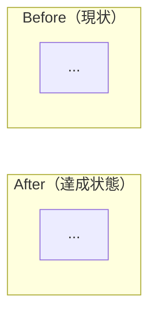

# YYYY年M月D日 JXX タイトル

> 状態：(1) Journey
> 次のゲート：（ユーザー）task note 確認後、実装へ進む

---

## 1) Journey（どこへ行くか）

- **根拠となる journey**：
- **関連する journey**：
- **深層的目的**：
- **やらないこと**：

### 人間の期待

- **この note が `done` なら、人間は何が成立していると思うか**：
- **その期待を裏切りやすいズレ**：
- **ズレを潰すために見るべき現物**：

### 現状

- 

### 今回の方針

- 

### 委任度

- 🟢 / 🟡 / 🔴

---

## 2) Gherkin（完了条件）

### シナリオ1：正常系

> {...} で {...} と {...}

### シナリオ2：異常系

> {...} で {...} と {...}

### シナリオ3：回帰確認

> {...} で {...} と {...}

### 対応する gherkin

- 

---

## 3) Design（どうやるか）

- **関連スキル・MCP**：
- **MCP**：追加なし / ...

### 調査起点

- 

### 実世界の確認点

- **実際に見るURL / path**：
- **実際に動いている process / service**：
- **実際に増えるべき file / DB / endpoint**：

### 検証方針

- 

---

## 4) Tasklist

- [ ] docs / journey / gherkin の根拠をそろえる
- [ ] 根本原因をコードだけでなく runtime / deploy まで含めて固定する
- [ ] 人間の期待を裏切るズレがないか確認する
- [ ] 実装する
- [ ] 実世界の path / process / file を直接確認する
- [ ] `python -m pytest test/ -q` を実行する

---

## 5) Discussion（記録・反省）

> Observe → Think → Act を刻む。未来の自分が復元できることが目的。

### YYYY年M月D日 HH:MM（起票）

**Observe**：
**Think**：
**Act**：

### YYYY年M月D日 HH:MM（修正・検証完了）

**Observe**：
**Think**：
**Act**：
