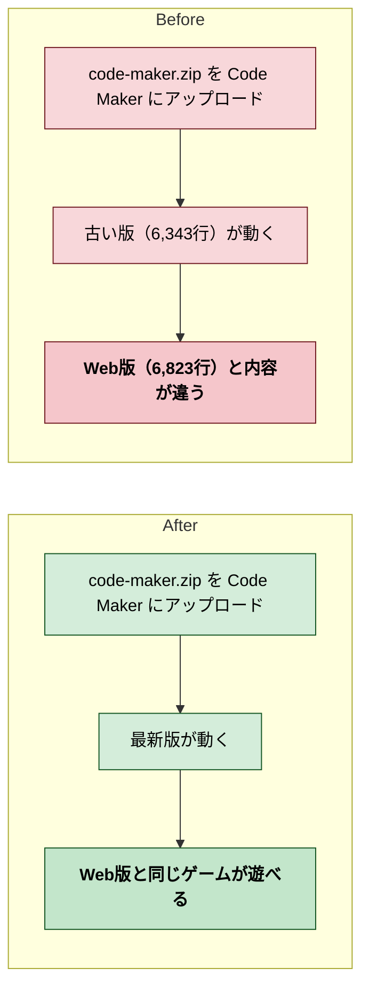
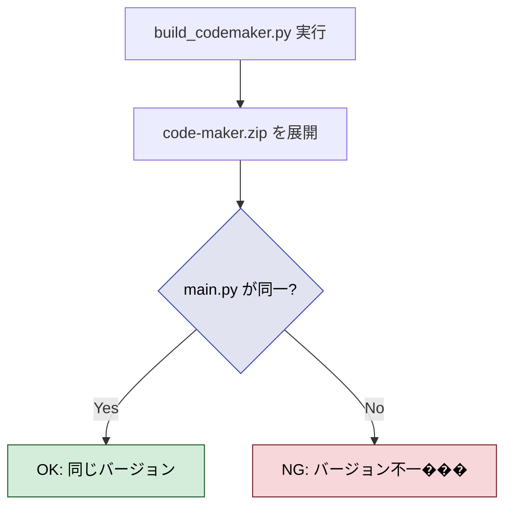
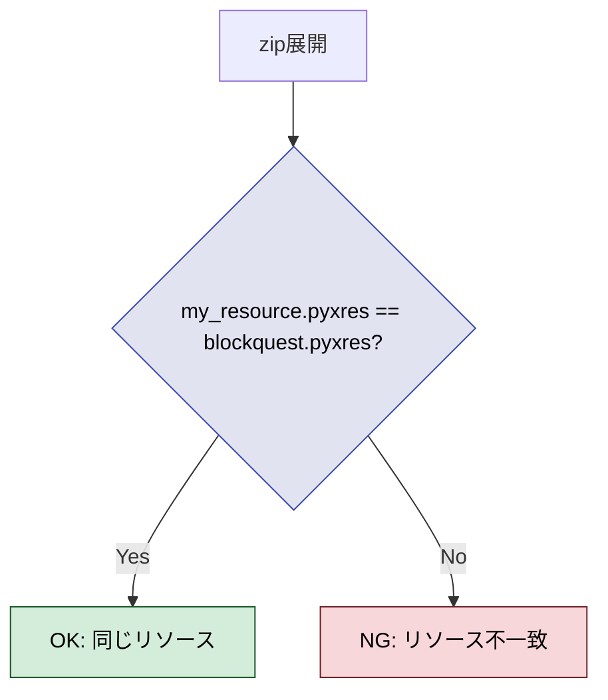
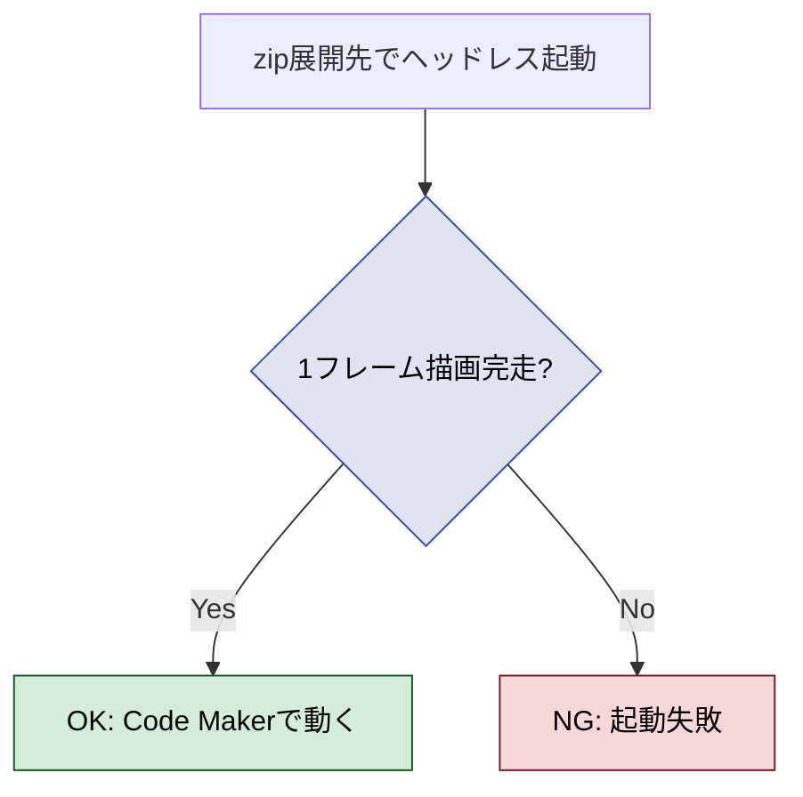
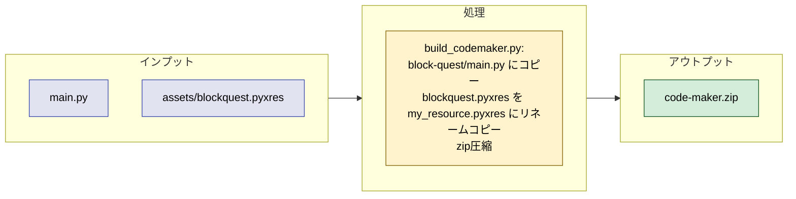

# 2026年4月12日 G12 code-maker.zip 再ビルド

> 状態：完了

---

## 1) Journey（どこへ行くか）

- **深層的目的**：Code Makerで遊ぶゲームをWeb版と同じ最新版にする
- **やらないこと**：build_codemaker.pyのインライン処理（main.pyは既にインライン済み）



### 調査結果

- code-maker.zip はコミット 8870c0b 時点で止まっている
- 現在のmain.pyは既にsrc/*.pyがインライン済みの単一ファイル（6,823行）
- pyxresは名前が違う（zip内: my_resource.pyxres、プロジェクト: blockquest.pyxres）が、main.pyは両方を探す設計
- tools/build_codemaker.py は存在しない

### やること

1. tools/build_codemaker.py を作る（main.py + pyxres を zipにまとめるだけ）
2. code-maker.zip を最新版で再ビルド
3. ヘッドレステストで起動確認

---

## 2) Gherkin（完了条件）

### シナリオ1：zip内のmain.pyがプロジェクトのmain.pyと同一

> {build_codemaker.py を実行} すると {zip内main.pyとプロジェクトのmain.pyが同一}



---

### シナリオ2：zip内のpyxresが最新

> {build_codemaker.py を実行} すると {zip内のmy_resource.pyxresがblockquest.pyxresと同一}



---

### シナリオ3：ヘッドレステストでzip版が起動する

> {zip内のmain.pyとmy_resource.pyxresで} ヘッドレス起動テストが通過する



---

## 3) Design（どうやるか）

- **関連スキル・MCP**：なし



### zip構造

```
code-maker.zip
  block-quest/
    main.py              <- プロジェクトのmain.pyそのまま
    my_resource.pyxres   <- blockquest.pyxresをリネーム
```

---

## 4) Tasklist

- [x] tools/build_codemaker.py 作成
- [x] code-maker.zip 再ビルド
- [x] シナリオ1: main.py同一チェック — OK
- [x] シナリオ2: pyxres同一チェック — OK
- [x] シナリオ3: ヘッドレス起動テスト — OK

---

## 5) Discussion（記録・反省）

### 2026年4月12日 22:00（調査・起票）

**Observe**：code-maker.zip内のmain.py(6,343行)と現在のmain.py(6,823行)が別バージョン。pyxresも異なる。build_codemaker.pyは存在しない。
**Think**：main.pyは既にインライン済みなので、zipに詰めるだけのシンプルなスクリプトで十分。pyxresはmy_resource.pyxresの名前でzipに入れる（Code Maker互換）。
**Act**：タスクノート起票。
