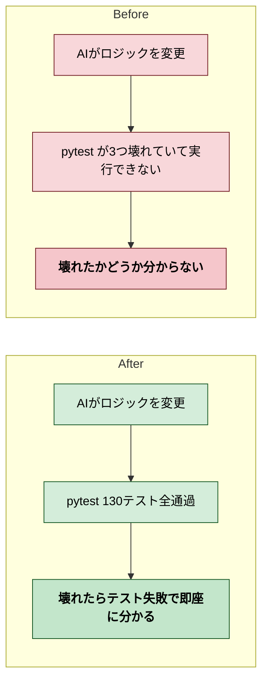

# 2026年4月12日 G15 テストコードによる挙動固定

> 状態：完了

---

## 1) Journey（どこへ行くか）

- **深層的目的**：AIの改変で壊れたらテストが即座に教えてくれる状態にする
- **やらないこと**：新機能のテスト追加、E2Eテスト（Playwright等は既にG11で対応済み）

---

## 2) Gherkin（完了条件）

G15の4シナリオ（gherkin-guardrails.md参照）の既存カバレッジ確認：

| シナリオ | カバーするテスト |
|---|---|
| 1. データ整合性 | test_game_data.py（敵13体、呪文5つ、必須キー、ボスフラグ、ショップ3町） |
| 2. 戦闘・移動ロジック | test_spell_logic.py（ダメージ計算、回復上限）、test_damage_vfx.py |
| 3. セリフ構造 | test_structured_dialog.py + test_dialogue_integration.py |
| 4. テスト失敗時の情報 | pytestの標準機能（自動） |

全シナリオが既存テストでカバー済み。追加不要。

---

## 3) Design（どうやるか）

1. src/game_data.py の `from src.simple_yaml import safe_load` を `import yaml` + `yaml.safe_load` に置換
2. tools/gen_data.py も同様に置換
3. test/test_game_data.py の `dialogue.yaml`（削除済み）参照を `enemies.yaml` に変更
4. 全テスト実行して130テスト通過を確認

---

## 4) Tasklist

- [x] src/game_data.py: simple_yaml -> PyYAML に置換
- [x] tools/gen_data.py: simple_yaml -> PyYAML に置換
- [x] test/test_game_data.py: dialogue.yaml -> enemies.yaml に変更
- [x] 全130テスト通過確認

---

## 5) Discussion（記録・反省）

### 2026年4月12日 23:00（起票）

**Observe**：既存テスト中3ファイルがimportエラーで壊れている。
**Think**：原因は simple_yaml の削除。PyYAMLに置き換えれば直る。
**Act**：タスクノート起票。

### 2026年4月12日 23:20（実装・完了）

**Observe**：simple_yaml -> PyYAML 置換で3ファイル復活。全130テスト通過。G15の4シナリオは全て既存テストでカバー済みだった。
**Think**：テスト追加は不要。壊れたテストを直すだけで「挙動固定」が機能する状態になった。
**Act**：修正コミット完了。

### 反省とルール化

- ファイル削除時にそのファイルをimportしているコードの修正漏れがあった（simple_yaml削除時にgame_data.pyとgen_data.pyが未修正）
- テストが壊れていることに気づかず長期間放置されていた。CIがあれば即座に検出できた
