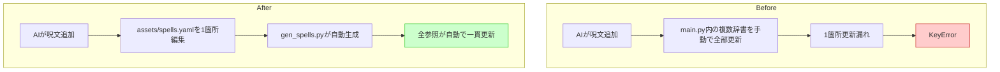

# ガードレール(1) SSoT + Codegen基盤

## 深層的目的

データ散在による不整合を構造的に防ぐ。

## やらないこと

- Hooks実装（別タスク: ガードレール(2)）

## 対象ガードレール

G1, G3, G13

## 完了コミット

df015fa

---

## 1. 改善対象ジャーニー



## 2. カスタマージャーニーgherkin

1. YAML編集 → gen実行 → src/generated/ にPythonファイル生成される
2. make gen で全データ種別を一括生成できる
3. YAML構文エラー時は gen がエラーメッセージを出して失敗する
4. 移行後もゲームの挙動が移行前と同一である
5. 派生データ（ショップ品揃え等）がYAML定義と整合している

## 3. Design

```
assets/*.yaml (6種: spells, items, weapons, armors, enemies, shops)
  ↓
tools/gen_data.py
  ↓
src/generated/*.py
  ↓
src/game_data.py (ローダ)
  ↓
main.py (sync)

Makefile に gen / build ターゲット追加
```

## 4. Tasklist

- [x] assets/ に YAML 6種を配置
- [x] tools/gen_data.py 作成
- [x] src/generated/ ディレクトリ作成
- [x] spells 生成確認
- [x] items / weapons / armors 生成確認
- [x] enemies 生成確認
- [x] shops 生成確認
- [x] src/game_data.py ローダ作成
- [x] Makefile gen / build ターゲット追加

## 5. Discussion

- 2026-04-12 起票: SSoT + Codegen基盤の必要性を整理
- 2026-04-12 改善対象ジャーニー承認 → カスタマージャーニーgherkin記入
- 2026-04-12 実装完了 (df015fa)
