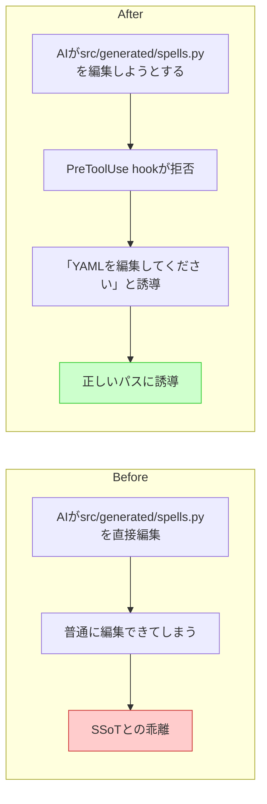

# ガードレール(2) Hooks設計・実装

## 深層的目的

AIが壊せるパスを物理的に封じる。

## やらないこと

- SSoT基盤の構築（タスク1で完了済み）
- ビルドパイプライン（タスク3）

## 対象ガードレール

G1, G2, G3, G5, G7, G14

## 依存

タスク1（完了済み）の後

## 方針

- hook スコープは `.claude/settings.json`（共有）
- デバッグ用バイパス `CLAUDE_GUARD_BYPASS=1`

---

## 1. Journey



## 2. Gherkin

根拠: [`gherkin-guardrails.md`](../gherkins/gherkin-guardrails.md) の各シナリオ

```gherkin
Feature: Claude Code Hooks でAIの誤操作を即座にブロック・誘導する
  SSoT基盤（タスク1）が整った前提で、AIが誤ったパスで
  編集しようとした瞬間にhookが介入し、正しいワークフローへ誘導する。

Background:
  Given .claude/settings.json に PreToolUse / PostToolUse hook が設定されている
  And CLAUDE_GUARD_BYPASS=1 が設定されていない

# --- PreToolUse: ブロック系 ---

Scenario: G1 — src/generated/ の直接編集をブロックする
  When AIが Edit/Write で src/generated/*.py を編集しようとする
  Then hook はツール実行を拒否する
  And 「このファイルは生成物です。assets/*.yaml を編集してください」と返る

Scenario: G2 — .pyxres の直接編集をブロックする
  When AIが Edit/Write で *.pyxres を変更しようとする
  Then hook はツール実行を拒否する
  And 「.pyxres は Code Maker 経由でのみ編集可能です」と返る

Scenario: G14 — src/generated/ の直接importをブロックする
  When AIが from src.generated.spells import ... のようなコードを書こうとする
  Then hook はツール実行を拒否する
  And 「生成物は src/game_data.py のローダ経由でアクセスしてください」と返る

# --- PostToolUse: 自動実行・lint系 ---

Scenario: G3 — SSoT編集後に自動codegenが走る
  Given AIが assets/*.yaml を編集した
  When PostToolUse hook が発火する
  Then tools/gen_data.py が自動実行され src/generated/*.py が再生成される
  And 生成に失敗した場合はエラー要約がAIに返り次のアクションが停止する

Scenario: G5 — イメージバンク番号の競合を警告する
  Given AIが pyxel.images[N] を参照するコードを書いた
  When PostToolUse の lint チェックが走る
  Then バンク番号の用途（0:タイル、1:スプライト、2:フォント）と
      競合していれば警告する

Scenario: G7 — フラグ名の重複を警告する
  Given AIが新しいイベントフラグを定義した
  When PostToolUse の lint チェックが走る
  Then 同名フラグが既存コードに存在すれば警告し一意名への変更を促す

# --- バイパス ---

Scenario: デバッグ用バイパスで全hookをスキップできる
  Given CLAUDE_GUARD_BYPASS=1 が環境変数に設定されている
  When AIが src/generated/*.py を直接編集しようとする
  Then hook はブロックせず編集を許可する
```

## 3. Design

### 決定事項

- `settings.json`（hook定義・共有）と `settings.local.json`（権限・個人）は**別々に管理**
- **初回リリース: G1, G2, G3, G14**（確実に効くブロック系 + 自動codegen）
- **後日追加: G5, G7**（lint警告系 — 誤検知リスクがあるため様子を見てから）
- 実装言語: **bash + grep**（起動速度優先）

### 全体構成

```
.claude/settings.json          ← hook定義（共有、git管理）
tools/hooks/
  guard_pre.sh                 ← PreToolUse: ブロック（G1, G2, G14）
  guard_post_gen.sh            ← PostToolUse: YAML編集後の自動codegen（G3）
  guard_post_lint.sh           ← [後日] PostToolUse: lint警告（G5, G7）
```

### .claude/settings.json のhook定義

```jsonc
{
  "hooks": {
    "PreToolUse": [
      {
        "matcher": "Edit|Write",
        "command": "bash tools/hooks/guard_pre.sh \"$TOOL_INPUT\""
      }
    ],
    "PostToolUse": [
      {
        "matcher": "Edit|Write",
        "command": "bash tools/hooks/guard_post_gen.sh \"$TOOL_INPUT\""
      }
    ]
  }
}
```

### guard_pre.sh（PreToolUse ブロック系）

入力: ツールに渡されるファイルパスとコンテンツ（stdin JSON）

```
CLAUDE_GUARD_BYPASS=1 → 即 exit 0

パス判定:
  src/generated/**  → exit 1 + G1メッセージ
  *.pyxres          → exit 1 + G2メッセージ

コンテンツ判定（G14）:
  new_string に "from src.generated" or "import src.generated" を含む
    → exit 1 + G14メッセージ
  複雑化する場合は PostToolUse lint に移す（Gherkinの議論参照）

それ以外 → exit 0（許可）
```

### guard_post_gen.sh（PostToolUse 自動codegen）

入力: 編集されたファイルパス（stdin JSON）

```
CLAUDE_GUARD_BYPASS=1 → 即 exit 0

パス判定:
  assets/*.yaml → python tools/gen_data.py を実行
    成功 → exit 0 + 「再生成しました」
    失敗 → exit 1 + エラー要約

それ以外 → exit 0（何もしない）
```

### [後日] guard_post_lint.sh（PostToolUse lint警告）

G5, G7は初回リリースに含めない。実運用で「こういう間違いが実際に起きた」と確認してから追加する。

### 判断ポイント

- **PreToolUseは exit 2 でブロック**、**PostToolUse codegenは失敗時のみ exit 1**
- bash + grep で実装し、Python依存を最小化（hookの起動速度を優先）
- G14の検出は PreToolUse の `new_string` チェックで実装。複雑化する場合はPostToolUse lintに移す

## 4. Tasklist

- [x] `.claude/settings.json` にhook定義を作成
- [x] `tools/hooks/guard_pre.sh` — G1, G2, G14（PreToolUse ブロック）
- [x] `tools/hooks/guard_post_gen.sh` — G3（PostToolUse 自動codegen）
- [x] 全パターンの手動テスト通過
- [ ] [後日] `tools/hooks/guard_post_lint.sh` — G5, G7（PostToolUse lint警告）

## 5. Discussion

- 2026-04-12 起票
- 2026-04-12 Journey承認 → Gherkin・Design記入
- 2026-04-12 G1,G2,G3,G14 実装完了。G5,G7は後日追加
- 注意: `tools/gen_data.py` が未配置のためG3は現在スキップ動作。タスク1の成果物を配置すれば自動で有効になる
