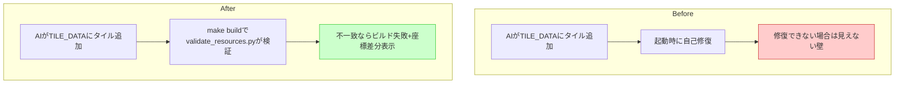

# ガードレール(4) pyxres整合チェック

## 深層的目的

pyxresとコード定数の乖離を自動検出する。

## 対象ガードレール

G4, G6

---

## 1. 改善対象ジャーニー



## 2. カスタマージャーニーgherkin

根拠: [`cj-gherkin-guardrails.md`](../product-requirements/cj-gherkin-guardrails.md) CJG37

```gherkin
Feature: pyxresとコード定数の整合性をビルド時に検証する
  TILE_DATA の順序変更やイメージバンク座標のずれにより、
  「見えない壁」や「絵が化ける」問題が起きる。
  現在は起動時に自己修復しているが、ビルド時に検出して再生成する。

Background:
  Given blockquest.pyxres はイメージバンクとサウンドバンクを含むバイナリ
  And TILE_DATA の並び順でイメージバンク上のピクセル座標が決まる
  And _tile_bank_layout_valid() が既に main.py 内に存在する

# --- G4: TILE_DATA ⇔ pyxres 整合チェック ---

Scenario: TILE_DATA変更後にpyxresとの不一致を検出し自動再生成する
  Given AIが TILE_DATA にタイルを追加または並び替えた
  When ヘッドレス起動テスト(G8)を実行する
  Then Game.__init__ 内の _setup_image_banks() が不一致を検出する
  And pyxres のイメージバンクを TILE_DATA から自動再生成する
  And 再生成後に1フレーム描画まで完走すればテスト通過

Scenario: 再生成しても起動できなければビルド失敗
  Given TILE_DATA の変更で再生成が必要だった
  And 再生成後も何らかのエラーが発生する
  When ヘッドレス起動テストが実行される
  Then テストが失敗し exit code 非0 で終了する

# --- G6: サウンド初期化順序 ---

Scenario: pyxel.load()後にサウンドが再初期化されている
  Given pyxel.load() は .pyxres のサウンドデータで sounds を上書きする
  When ヘッドレス起動テストが実行される
  Then _setup_image_banks() の後に AudioManager と SfxSystem が
      再初期化されていることが実行時に確認される
  And サウンド再生が正常に動作する
```

## 3. Design

追加実装なし。G4・G6ともにヘッドレステスト(G8, タスク3)で既にカバーされている:

- **G4**: `Game.__init__` → `_setup_image_banks()` → `_tile_bank_layout_valid()` が不一致を検出し自動再生成。ヘッドレステストがこのパスを通る
- **G6**: `Game.__init__` で `_setup_image_banks()` 後に `SfxSystem` / `AudioManager` を再初期化済み。ヘッドレステストがこのパスを通る

## 4. Tasklist

- [x] カスタマージャーニーgherkin記載（G8カバー済みであることを明記）
- 追加実装なし

## 5. Discussion

- 2026-04-12 起票
- 2026-04-12 G4・G6はヘッドレステスト(G8)で既にカバー済みと判断。追加実装不要でdone
