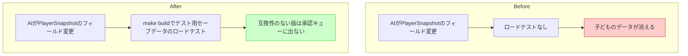

# ガードレール(5) セーブ互換テスト

## 深層的目的

「ぼくのデータなくなった」を防ぐ。

## 対象ガードレール

G10

---

## 1. Journey



## 2. Gherkin

根拠: [`gherkin-guardrails.md`](../gherkins/gherkin-guardrails.md) J40

```gherkin
Feature: 既存セーブデータとの互換性を検証する
  AIが SAVED_PLAYER_KEYS やセーブ構造を変更しても、
  子どもの既存セーブデータが壊れないことをテストで保証する。

Background:
  Given セーブデータは dump_snapshot() で dict → JSON にシリアライズされる
  And SAVE_VERSION = 1, SAVED_PLAYER_KEYS で保存フィールドが明示管理されている
  And テスト用セーブデータ (fixtures) がリポジトリに含まれる

Scenario: テスト用セーブデータで restore_snapshot が成功する
  Given リポジトリに tests/fixtures/save_v1.json が存在する
  When テストスクリプトが restore_snapshot() を実行する
  Then 例外なくプレイヤーデータが復元される
  And 復元後の player dict に必須キー (hp, x, y 等) が含まれる

Scenario: SAVED_PLAYER_KEYS からフィールドを削除しても既存データがロードできる
  Given AIが SAVED_PLAYER_KEYS からフィールドを1つ削除した
  When テスト用セーブデータで restore_snapshot() を実行する
  Then 削除されたフィールドは復元後の dict に含まれない
  And それ以外のフィールドは正常に復元される
  And 例外は発生しない

Scenario: SAVED_PLAYER_KEYS にフィールドを追加しても既存データがロードできる
  Given AIが SAVED_PLAYER_KEYS に新しいフィールドを追加した
  When テスト用セーブデータ（追加前に保存されたもの）で restore_snapshot() を実行する
  Then 新しいフィールドは復元後の dict に含まれない（保存時に存在しなかったため）
  And それ以外のフィールドは正常に復元される
  And 例外は発生しない

Scenario: ロードテスト失敗時は承認キューに出さない
  Given テスト用セーブデータで restore_snapshot() が例外を出した
  When ビルドパイプラインが実行される
  Then その版は承認キューに出ない
```

## 3. Design

### 構成

```
tests/fixtures/save_v1.json    ← テスト用セーブデータ（現行版で生成）
tools/test_save_compat.py      ← セーブ互換テストスクリプト
```

### test_save_compat.py の動作

```
1. tests/fixtures/save_v1.json を読み込む
2. restore_snapshot() を呼ぶ
3. 復元後の player dict に必須キー (hp, x, y) が含まれるか検証
4. 例外なく完走 → exit 0
5. 例外発生 → エラー要約を出力して exit 1
```

### テスト用セーブデータの生成

初回のみ dump_snapshot() で現行版のセーブデータを生成し fixtures に保存。
以降はこの固定データに対してロードテストを行う（回帰テスト）。

### 前提

- dump_snapshot / restore_snapshot は main.py にインライン化されている
- SAVE_VERSION による互換管理が既にある（SUPPORTED_SAVE_VERSIONS = (1,)）
- フィールドの追加は安全（存在しないキーは無視される）、削除も安全（`if key in player`）

## 4. Tasklist

- [x] tests/fixtures/save_v1.json — テスト用セーブデータ生成
- [x] tools/test_save_compat.py — セーブ互換テスト作成
- [x] テスト通過確認

## 5. Discussion

- 2026-04-12 起票
- 2026-04-12 Gherkin・Design記入。現行のdump/restore構造が既にフィールド追加・削除に安全な設計
