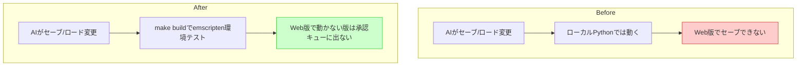

# ガードレール(6) Web配信テスト

## 深層的目的

ローカルで動いてもWeb版で動かない問題を防ぐ。

## 対象ガードレール

G11, G12

---

## 1. Journey



## 2. Gherkin

根拠: [`gherkin-guardrails.md`](../gherkins/gherkin-guardrails.md) J41

```gherkin
Feature: 技術基盤の変更がWeb配信を壊さない
  ローカルで動いてもWeb版（emscripten）で動かない、
  Code Makerで動かないといった破壊を防ぐ。

Background:
  Given ゲームは Web (emscripten) と ネイティブ (Python) の両方で動作する
  And Web版は build_web_release.py でビルドされる
  And Code Maker版は code-maker.zip に同梱される

# --- G11: Web版の静的チェック ---

Scenario: ファイルシステム依存のコードが platform ガード付きである
  Given AIがファイル操作（open, Path, os.path等）を含むコードを書いた
  When 静的チェックが走る
  Then sys.platform == "emscripten" のガードがない箇所を警告する

Scenario: 新しい外部ファイルがWebビルドに含まれる
  Given AIが新しいデータファイルを追加した
  When build_web_release.py のビルドが実行される
  Then ファイルリストに新ファイルが含まれる
  And 含まれていない場合は警告する

# --- G12: Code Maker 互換 ---

Scenario: code-maker.zip のビルドが成功する
  Given AIが main.py を変更した
  When Code Maker用ビルドが実行される
  Then code-maker.zip が生成される
  And zip内のmain.pyが構文エラーなくimportできる
```

## 3. Design

### アプローチ: Playwright + Chromium Headless

VMにPlaywright + Chromium Headlessをインストールし、Web版の実行テストを実現。

```
tools/test_web_compat.py    ← Playwright によるWeb版動作テスト
```

### test_web_compat.py の動作

```
1. pyxel.html をローカルHTTPサーバ (port 8899) で配信
2. Playwright (Chromium Headless) でページを開く
3. 10秒間コンソールメッセージを収集
4. 致命的エラー (環境依存警告を除く) があれば FAIL
5. クラッシュがなければ OK
```

### 除外するエラー（環境依存）

- ALSA関連（サウンドデバイスなし）
- favicon.ico 404
- SharedArrayBuffer / COOP 関連（ローカルサーバのヘッダ制約）

## 4. Tasklist

- [x] Gherkin記載
- [x] Playwright + Chromium Headless インストール
- [x] `tools/test_web_compat.py` — Web版動作テスト作成
- [x] テスト通過確認（10秒間クラッシュ・致命的エラーなし）
- [ ] [後日] build_web_release.py にファイル包含チェックを追加
- [ ] [後日] build_codemaker.py 整備時に構文チェックを追加

## 5. Discussion

- 2026-04-12 起票
- 2026-04-12 当初は「emscripten環境なしで実行テスト不可」と判断
- 2026-04-12 Playwright + Chromium Headless で実行テスト可能と判明。実装・テスト通過
