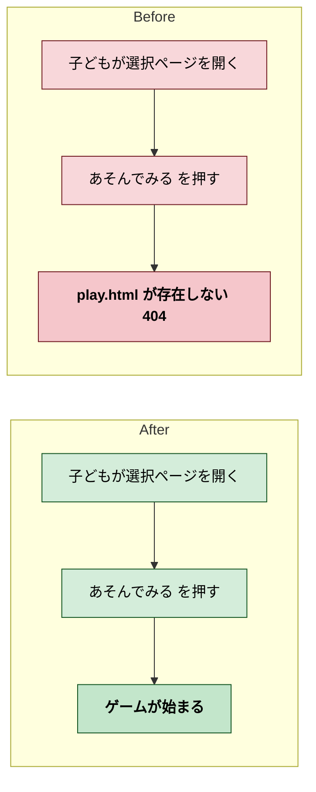
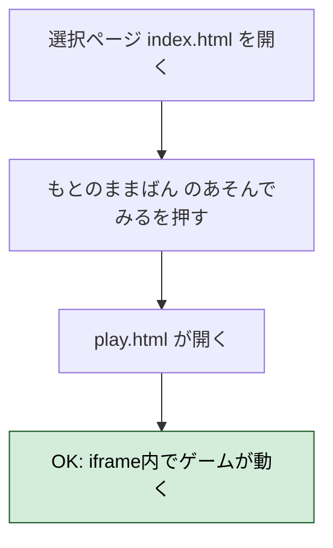
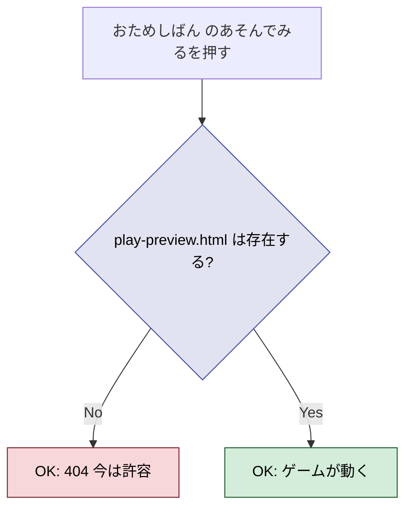
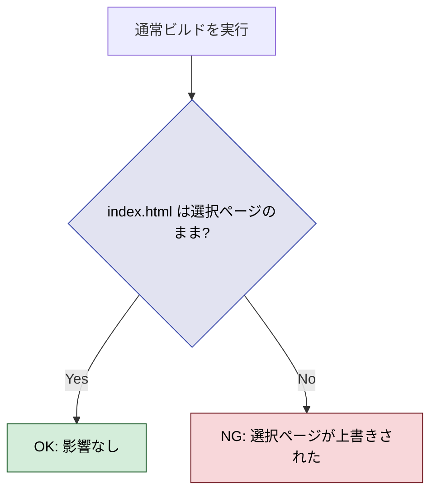
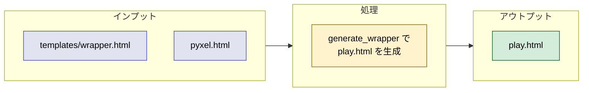

# 2026年4月12日 J31 選択ページのリンク先復旧

> 状態：完了

---

## 1) 改善対象ジャーニー

- **深層的目的**：子どもが2版を遊び比べられるようにする
- **やらないこと**：選択ページのデザイン変更、新機能追加

### 調査結果

- index.html（選択ページ）は play.html と play-preview.html にリンクしている
- どちらのファイルも存在しない
- pyxel.html（もとのまま版の実体）は存在する
- pyxel-preview.html（おためし版の実体）は存在しない
- 原因: --preview ビルドが途中で止まった、またはラッパーHTML生成ステップがスキップされた

---

## 2) カスタマージャーニーgherkin（完了条件）

### シナリオ1：もとのままばん でゲームが始まる

> {選択ページが表示されている} で {もとのままばんのあそんでみるを押す} と {ゲームが始まる}

---

### シナリオ2：おためしばん はリンク切れでも許容する

> {選択ページが表示されている} で {おためしばんのあそんでみるを押す} と {ページが開かないが今は許容}

---

### シナリオ3：通常ビルドが選択ページを壊さない

> {play.html を配置済み} で {通常ビルドを実行} すると {index.html が選択ページのまま維持される}

---

## 3) Design（どうやるか）

- **関連スキル・MCP**：なし

### 手順

1. generate_wrapper() を呼んで play.html を生成する
2. Playwrightで index.html → play.html → ゲーム表示を検証

---

## 4) Tasklist

- [x] generate_wrapper() で play.html を生成
- [x] Playwright E2E: index.html → play.html → pyxel.html 全て正常

---

## 5) Discussion（記録・反省）

### 2026年4月12日 21:30（調査・起票）

**Observe**：トップページの play.html / play-preview.html が存在せず404。
**Think**：--preview ビルドが未完走。play.html は generate_wrapper() で生成可能。
**Act**：タスクノート起票。

### 2026年4月12日 21:50（実装・検証完了）

**Observe**：generate_wrapper() で play.html (2988 bytes) 生成。Playwright E2E で index.html → play.html → pyxel.html 全通過。
**Think**：play-preview.html は未対応だが今は許容。通常ビルド時の index.html 上書き問題は残存（別タスク）。
**Act**：play.html 生成・検証完了。

### 反省とルール化

- ビルド生成物が git 管理外のため消える可能性あり。存在チェックをビルドスクリプトに入れるべき
- 残課題：通常ビルド時の index.html 上書き問題（シナリオ3は未対処）
