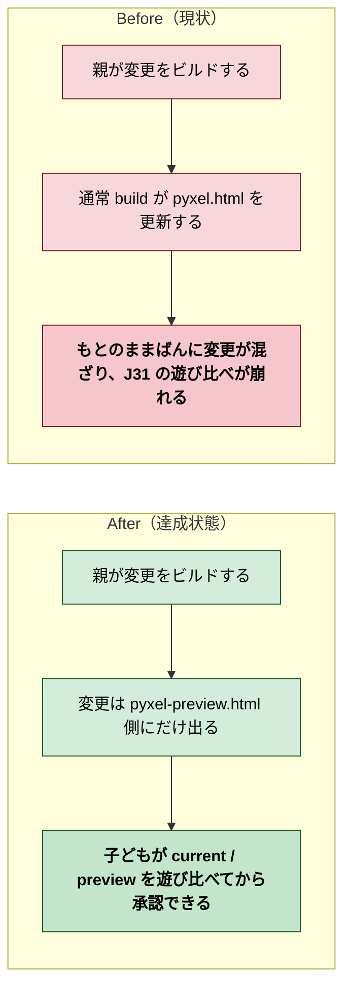
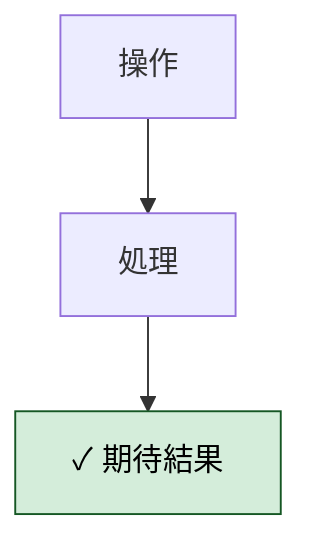
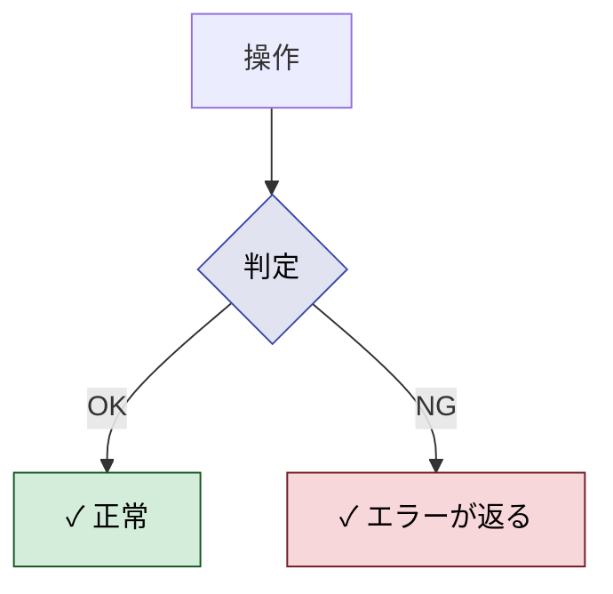
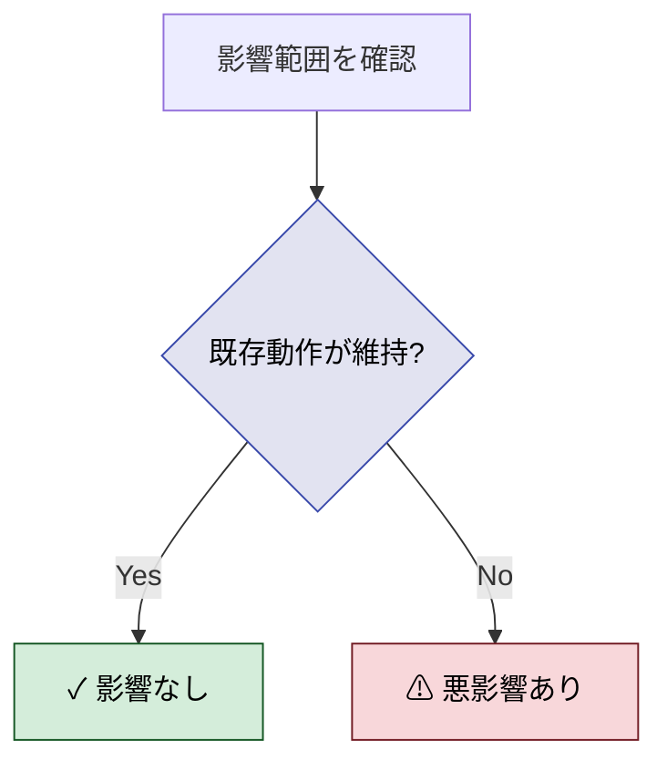

# 2026年4月12日 J38 preview build を current に混ぜない

> 状態：(5) Discussion
> 次のゲート：（ユーザー）必要なら preview 運用の案内整備 or 次タスク

---

## 1) Journey（どこへ行くか）

- **深層的目的**：比較導線を守る
- **やらないこと**：今日中に承認UI全体を作り直すこと、配信方式まで広げて直すこと

### 現状

- `docs/gherkins/gherkin-platform.md` の J31/J32 では、変更確認は `pyxel-preview.html` 側で行う前提になっている
- しかし現在の通常 build は `pyxel.html` / `pyxel.pyxapp` を直接更新するので、変更が current 側へ混ざる
- 今回は応急処置として preview 側へファイルを退避したが、次に `make build` を実行するとまた current 側へ出る

### 今回の方針

- preview build と current build の役割をコード上ではっきり分ける
- AI に変更を頼んだときは preview 側にだけ成果物が出る流れを先に守る
- 承認後にだけ current 側へ昇格する流れを、J31/J32 の仕様どおりに整理する
- 通常 `build` は current 用のまま残し、preview build は `--preview` の別入口にする

### 委任度

- 🟡 CC主導で実装は進められるが、最終判断として「通常 build を current 用に残すか」「preview build を別入口にするか」の整理が必要

---

## 2) Gherkin（完了条件）

### シナリオ1：正常系（〜が成功する）

> {前提条件} で {操作} すると {期待結果}

---

### シナリオ2：異常系（〜が失敗するケース）

> {前提条件} で {異常な操作} すると {エラーが返り副作用がない}

---

### シナリオ3：リスク確認（〜に悪影響がない）

> {変更適用済み} で {影響範囲を確認} すると {既存の動作が維持されている}

---

## 3) Design（どうやるか）

- **関連スキル・MCP**：`manage-tasknotes`、`superpowers:verification-before-completion`
- `tools/build_web_release.py`
  通常 build は `build_web_release()` のまま current 用に残し、preview 用は `build_preview_release()` と CLI の `--preview` で分離する
- `tools/build_web_release.py`
  `validate_preview_files()` で `main_preview.py` と `preview_meta.json` を受け、preview 側の stage だけ `main.py` を差し替えて `pyxel-preview.html` / `play-preview.html` / `index.html` を生成する
- `tools/build_web_release.py`
  `promote(choice="preview"|"current")` で承認/却下後の後始末をまとめ、承認時だけ `main.py` を preview 内容へ昇格させる
- `Makefile`
  `make build` は current 配信用の通常 build のまま維持し、AI 変更確認用の preview build は明示的に `python tools/build_web_release.py --preview` を使う
- `test/test_build_web_release.py`
  preview 前提条件、昇格、selector -> wrapper -> html の導線をテストで固定し、J31/J32 の「混ぜない」を回帰させない

---

## 4) Tasklist

- [x] `tools/build_web_release.py` に preview/current の責務を分ける入口を追加する
- [x] `main_preview.py` と `preview_meta.json` を preview build 専用入力として扱う
- [x] current と preview の両方の Pyxel HTML / wrapper / selector を生成できるようにする
- [x] `--promote preview|current` で承認・却下後の昇格/掃除を一箇所にまとめる
- [x] selector -> `play.html` / `play-preview.html` -> `pyxel.html` / `pyxel-preview.html` の導線をテストで固定する
- [x] `python -m pytest test/test_build_web_release.py -q` と `python -m pytest test/ -q` で回帰確認する

---

## 5) Discussion（記録・反省）

> Observe → Think → Act を刻む。未来の自分が復元できることが目的。

### 2026年4月12日 23:57（起票）

**Observe**：通常 build を実行すると変更済み成果物が `pyxel.html` 側へ出てしまい、J31 の「おためしばんで確認してから承認する」流れとずれていた。今回は時間優先で preview 側へファイルを退避して応急対応した。
**Think**：問題は「ファイル名」より「build の責務分離」にある。preview build の入口と current build の入口を整理し、承認前の変更が current 側へ混ざらないようにする必要がある。
**Act**：preview build 導線の根本修正タスクとして J38 を起票した。

### 2026年4月13日 00:02（close-session 中断メモ）

**Observe**：セッション終了前の時点で、preview 側への応急退避は完了しているが、根本の build 導線修正は未着手。`index.html` のおためし版説明文は当面の文言に差し替え済み。
**Think**：次回は J38 の `Gherkin` から再開し、`make build` / `--preview` / `--promote` の責務分離を仕様に沿って整理するのが最短。
**Act**：再開ポイントをノートに追記した。

### 2026年4月13日 23:05（実装整理・完了化）

**Observe**：`tools/build_web_release.py` には、すでに `validate_preview_files()`、`build_preview_release()`、`promote()`、CLI の `--preview` / `--promote` が実装されていた。`test/test_build_web_release.py` でも preview 前提条件、昇格、selector から preview/current を辿る導線が固定されている。
**Think**：J38 で保留だった「通常 build を current 用に残すか」「preview build を別入口にするか」は、実装上は「通常 build は current のまま、preview は `--preview` の別入口」で解決済みだった。未完了だったのはタスクノートの更新だけだった。
**Act**：J38 を `docs/steering/done/` へ移し、`python -m pytest test/test_build_web_release.py -q` の `16 passed` と `python -m pytest test/ -q` の `153 passed, 2 skipped` を根拠に完了扱いへ更新した。

---

### 反省とルール化

- 記入先：observe-situation / manage-tasknotes / AGENTS.md
- 次にやること：必要なら `--preview` / `--promote` の親向け運用手順を README か別ノートへ明文化する
