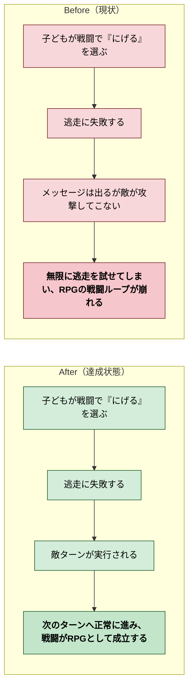

# 2026年4月13日 J39 逃走失敗後に敵ターンが来ない

> 状態：(5) Discussion
> 次のゲート：（ユーザー）必要なら battle item 系の同系統確認 or 次タスク

---

## 1) 改善対象ジャーニー

- **根拠となるカスタマージャーニー**：`docs/product-requirements/customer-journeys.md` の `CJ42: 子どもが冒険を最後までやり切れる`
- **関連する避けるジャーニー**：`docs/product-requirements/customer-journeys.md` の `CJ39: システムを変えたらゲーム全体が壊れた`
- **深層的目的**：逃走失敗後も敵ターンが正常に進み、RPGの戦闘ループが止まらない状態へ戻す
- **やらないこと**：このタスクで逃走成功率やボス逃走仕様を調整すること、戦闘システム全体を組み替えること、新しいヘッドレス基盤を作ること

### 現状

- `CJ42` では `逃走失敗で敵ターンが来ない` 状態そのものが「RPGなのに最後まで遊べない」例として入っている
- `CJ39` では、戦闘ターン制御や行動順ロジックの破損がゲーム全体を不安定にする問題として定義されている
- `docs/product-requirements/cj-gherkin-guardrails.md` の `CJG39` には `Scenario: 逃走失敗後も戦闘ターンが継続する` があり、今回のバグはこの gherkin に直接対応する
- 現行コードでは `main.py` の `update_battle()` 内で、逃走失敗時に `battle_phase = "enemy_attack"` へ遷移している一方、その `enemy_attack` フェーズ側では敵行動を起こさずタイマー後に `menu` へ戻しているように見える

### 今回の方針

- このバグは `CJ42` を壊し、`CJG39` の guardrail に反している不具合として扱う
- まず逃走失敗時の挙動をテストで固定し、期待値を明示する
- 修正対象は最小限に絞り、`Run` 失敗時の phase 遷移と敵行動起動の責務だけを見直す
- 逃走成功、通常攻撃、勝利/敗北、ボス戦で逃げられない文言など既存の周辺挙動は壊さない前提で進める

### 委任度

- 🟢 CC主導で調査・修正は進められる。主変更箇所は `main.py` の battle phase 制御と新規/既存の battle テストに寄せられる

---

## 2) カスタマージャーニーgherkin（完了条件）

### シナリオ1：正常系（逃走失敗後に敵ターンが来る）

> {通常戦闘中でボス戦ではない} で {`にげる` を選んで失敗する} と {敵ターンが1回実行され、プレイヤーHPまたは battle_text が敵行動結果へ進み、その後に次ターンの menu へ戻る}

### シナリオ2：異常系（無限に逃走を試せない）

> {逃走失敗直後} で {プレイヤーが入力を連打する} と {敵行動を飛ばして即 menu に戻ることはなく、行動不能のまま無限に逃走を試せる状態にならない}

### シナリオ3：リスク確認（既存の逃走成功や通常戦闘を壊さない）

> {逃走バグ修正済み} で {逃走成功・通常攻撃・通常の敵ターンを確認する} と {逃走成功時は従来どおり戦闘離脱し、通常戦闘フローも維持されている}

### 対応する guardrail

- `docs/product-requirements/cj-gherkin-guardrails.md` `CJG39`
- `Scenario: 逃走失敗後も戦闘ターンが継続する`
  `Then 敵ターンが正常に実行される`
  `And 次のターンへ進行できる`
  `And 行動不能のまま無限に逃走を試せる状態にならない`

---

## 3) Design（どうやるか）

- **関連スキル・MCP**：`superpowers:systematic-debugging`、`superpowers:test-driven-development`、`superpowers:verification-before-completion`
- **MCP**：追加なし

- `main.py`
  `update_battle()` の `battle_menu == 3` 分岐と `battle_phase == "enemy_attack"` 分岐を主対象にする
- `main.py`
  現状では逃走失敗時に `battle_phase = "enemy_attack"` と `battle_text_timer = 30` を設定しているが、`enemy_attack` phase 側は `_do_enemy_attack()` を呼ばず timer 後に `menu` へ戻っているため、この責務のズレを解消する
- `test/` 配下の battle テスト
  逃走失敗後に敵行動が1回発火すること、敵ターンを飛ばして menu に戻らないことを固定する

### 調査起点

- `main.py:5475-5488`
  `Run` 選択時の成功/失敗分岐
- `main.py:5569-5577`
  `enemy_attack` phase の timer 消化と phase 戻し

### 検証方針

- focused test で「逃走失敗 → 敵ターン実行 → 次ターンへ戻る」を固定する
- 可能なら「逃走成功は従来どおり離脱する」も同じテスト群で押さえる
- 最後に `python -m pytest test/ -q` を回して全体回帰を確認する

---

## 4) Tasklist

- [x] 逃走失敗後の期待挙動を固定する failing test を追加する
- [x] 逃走失敗で敵ターンが飛ばされる現状を Red で確認する
- [x] `update_battle()` の `Run` 失敗時と `enemy_attack` phase の責務を整理する
- [x] 最小修正で敵行動が1回発火するように直す
- [x] 逃走成功と通常戦闘の回帰を focused test で確認する
- [x] `python -m pytest test/ -q` で全体回帰を確認する

---

## 5) Discussion（記録・反省）

> Observe → Think → Act を刻む。未来の自分が復元できることが目的。

### 2026年4月13日 23:43（起票）

**Observe**：ユーザー報告どおり、戦闘で `にげる` に失敗しても敵が攻撃してこず、何度でも逃走を試せる状態になっている。これは `CJ42` に書いた「逃走失敗で敵ターンが来ない」そのものの症状で、`CJ39` の戦闘ターン制御破損にも当たる。  
**Think**：現行コードを見ると、逃走失敗時は `battle_phase = "enemy_attack"` へ遷移しているが、`enemy_attack` phase 側では `_do_enemy_attack()` を起こさず timer 後に `menu` へ戻すだけに見える。症状とコードが一致しているので、まずここを最小範囲で固定するのが妥当。  
**Act**：`CJ42` / `CJG39` / `Scenario: 逃走失敗後も戦闘ターンが継続する` を根拠に、逃走失敗バグ修正専用の task note を起票した。

### 2026年4月13日 23:47（修正・検証完了）

**Observe**：新規 test で、逃走失敗メッセージのあとに `_do_enemy_attack()` が一度も呼ばれないことを Red で確認できた。根本原因は、逃走失敗時のメッセージ表示に `enemy_attack` phase を使っていたことだった。`enemy_attack` phase は「敵行動後のメッセージ表示」を担当しており、敵行動そのものを起こす phase ではなかった。  
**Think**：最小修正は、逃走失敗時の phase を `enemy_attack` ではなく `player_attack` 系の流れに乗せることだった。`player_attack` phase はプレイヤー行動メッセージの表示後に `_do_enemy_attack()` を呼ぶ責務を持つため、逃走失敗後の `敵ターン実行 → 次ターンへ戻る` を自然に満たせる。  
**Act**：`test/test_battle_run_logic.py` を追加し、`main.py` の `Run` 失敗時だけ `battle_phase = "player_attack"` へ変更した。`python -m pytest test/test_battle_run_logic.py -q` で `2 passed`、`python -m pytest test/ -q` で `155 passed, 2 skipped` を確認した。

---

### 反省とルール化

- 記入先：observe-situation / manage-tasknotes / AGENTS.md
- 次にやること：必要なら item 使用時の enemy turn まわりも同じ phase 責務で点検する
