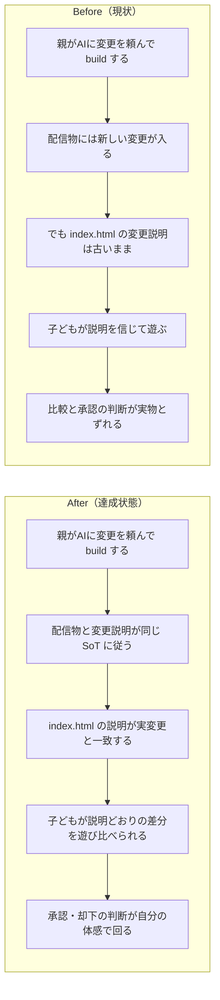

# 2026年4月14日 J33 選択ページの変更説明が実変更とずれる

> 状態：(5) Discussion
> 次のゲート：（ユーザー）必要なら commit / push or 次タスク

---

## 1) 改善対象ジャーニー

- **根拠となるカスタマージャーニー**：`docs/product-requirements/customer-journeys.md` の `CJ31: 子どもが変更を承認する`
- **直接対応するカスタマージャーニー**：`docs/product-requirements/customer-journeys.md` の `CJ33: 子どもが変更を選んで適用する`
- **深層的目的**：選択ページの「何が変わったか」が実際に配信される変更内容と一致し、子どもが説明を信じて承認・比較できる状態に戻す
- **やらないこと**：このタスクで戦闘ロジックそのものを再修正すること、トップページの全面デザイン刷新をすること、変更文言のコピーライティングだけを単独で磨くこと

### 現状

- `make build` 自体は通っており、`index.html` も毎回再生成されている
- ただし `index.html` の変更説明は `templates/selector.html` と `top_changes.json` から生成されている一方、実際の配信内容は `main.py` / `play.html` / `pyxel.html` 側で更新される
- そのため、ゲーム本体やラッパー側の重要な変更が入っても、metadata を更新しなければ選択ページだけ古い説明を出し続けられる
- これは build failure ではなく、選択ページの change list に関する SoT が実変更から分離している設計上のバグ

### 今回の方針

- この問題は `CJ31` の「変更内容が子どもに理解できる」と `CJ33` の「おためし版に含まれる変更一覧が表示される」を同時に破る不具合として扱う
- まず normal build / preview build の両方で、変更説明がどこから来るべきかを整理する
- そのうえで、説明と実変更がずれたまま build/push できる経路を潰す
- 運用で毎回人間が覚えて更新する前提を減らし、最低でも build/test でズレを検知できる形へ寄せる

### 委任度

- 🟢 CC主導で調査と task 分解は進められる。主変更箇所は `tools/build_web_release.py`、`templates/selector.html`、`top_changes.json`、関連 test、必要なら steering/task note 運用 docs

---

## 2) カスタマージャーニーgherkin（完了条件）

### シナリオ1：正常系（子どもが変更内容を正しく理解できる）

> {親がゲーム内容を変更して build した} で {子どもが選択ページを見る} と {選択ページの変更説明が実際に配信される変更内容と一致している}

### シナリオ2：異常系（古い変更説明を出したまま配信しない）

> {ゲーム本体の変更が入っている} で {選択ページの change list が古いまま build されそうになる} と {build またはテストで不整合が検知され、古い説明のまま届けない}

### シナリオ3：回帰確認（比較導線を壊さない）

> {change list の SoT を見直した} で {normal build / preview build を行う} と {`index.html` から `play.html` / `play-preview.html` への導線と比較フローはそのまま維持される}

### 対応するカスタマージャーニーgherkin

- `docs/product-requirements/cj-gherkin-platform.md` `CJG31`
- `Scenario: 変更内容が子どもに理解できる`
- `docs/product-requirements/cj-gherkin-platform.md` `CJG33`
- `Scenario: おためし版に含まれる変更一覧が表示される`

---

## 3) Design（どうやるか）

- **関連スキル・MCP**：`superpowers:systematic-debugging`、`superpowers:verification-before-completion`
- **MCP**：追加なし

- `tools/build_web_release.py`
  normal build と preview build で change list をどう読むかを整理する
- `templates/selector.html`
  表示文言の器として維持し、実データの責務は別に切り出すか現行 JSON を厳格化する
- `top_changes.json`
  normal build の入力として残すのか、別 SoT へ置き換えるのかを判断する
- `test/test_build_web_release.py`
  変更説明が実変更から乖離しにくい設計へ寄せるための regression test を追加する

### 調査起点

- `tools/build_web_release.py`
  `generate_top_selector()` / `load_top_page_changes()` / preview build の `changes` 読み込み
- `templates/selector.html`
  `{{CHANGE_LIST}}` の埋め込み位置
- `top_changes.json`
  normal build で現在唯一の change list 入力になっている点
- 既存の steering note / preview build flow
  変更説明を誰がいつ更新する想定だったか

### 検証方針

- `make build` で normal build を fresh に確認する
- `test/test_build_web_release.py` に、normal build の change list が stale なまま通る経路を固定化または失敗化するテストを追加する
- 必要なら preview build でも同種のズレが起きないことを併せて確認する

---

## 4) Tasklist

- [x] 選択ページの change list の現行データフローを normal / preview で整理する
- [x] 「実変更」と「表示説明」の SoT が分離している根本原因を特定する
- [x] normal build 用 change list の SoT を決める
- [x] stale な説明のまま build/push できない guardrail を設計する
- [x] build / test / docs のどこで検知するかを決める
- [x] 実装後に `make build` と関連テストで回帰確認する

---

## 5) Discussion（記録・反省）

> Observe → Think → Act を刻む。未来の自分が復元できることが目的。

### 2026年4月14日 00:10（起票）

**Observe**：`make build` は通っているのに、`index.html` の変更説明は「ダンジョンの おくに ボスを ついか」のままで、直前に反映した `逃走失敗後に敵ターンが来ない` 修正が選択ページへ出ていなかった。`index.html` は build 時に再生成されているが、その説明は `top_changes.json` 依存のまま残っていた。  
**Think**：これは build failure ではなく SoT failure で、子どもが選択ページを見ても「今回何が変わったか」を正しく理解できない。`CJ31` の承認判断と `CJ33` の変更一覧理解を壊すため、重大なバグとして扱うべき。  
**Act**：`CJ31/CJ33` を根拠に、選択ページの change list SoT を見直す task note を起票した。

### 2026年4月14日 00:18（修正・検証完了）

**Observe**：基本文書を読み直すと、中心は `CJ21` ではなく `CJ31/CJ33` だった。問題は「友達に見せる」ことより、「子どもが選択ページの説明を信じて比較・承認する」導線が壊れていたことだった。コード上の根本原因は、normal build の `top_changes.json` と preview build の `preview_meta.json` に freshness guard がなく、実配信ソースより古い説明でも build が通っていた点にあった。  
**Think**：手動更新を前提に残すにしても、少なくとも stale metadata を build/test で検知できなければ `CJ31/CJ33` は守れない。今回の最小修正は、change list metadata を消すことではなく、「対応するソースより古ければ失敗する」guardrail を build script に入れることだった。  
**Act**：`customer-journeys.md` と `cj-gherkin-platform.md` を `CJ31/CJ33` 軸で補強し、`test/test_build_web_release.py` に stale `top_changes.json` / stale `preview_meta.json` の failing test を追加した。`tools/build_web_release.py` に freshness validation を実装し、`top_changes.json` も current 内容へ更新した。検証は `python -m pytest test/test_build_web_release.py -q` で `18 passed`、`make build` で `157 passed, 2 skipped` + `tools/build_web_release.py` 完了、`python tools/test_web_compat.py` で `OK: Web版テスト通過` を確認した。

### 2026年4月14日 00:20（運用ルール固定）

**Observe**：今回のズレは、実装ミスだけでなく「関連 docs を先に読む」ルールが開発ガイドに明文化されていなかったことも再発要因になっていた。  
**Think**：selector / preview / build flow を触るときは、少なくとも `customer-journeys.md`、`cj-gherkin-platform.md`、対応 task note、`tools/build_web_release.py`、`test/test_build_web_release.py` を読む手順を固定すべき。  
**Act**：`AGENTS.md` に pre-read ルールを追記し、build / selector / preview / release-note 変更前の必読文書を明記した。
