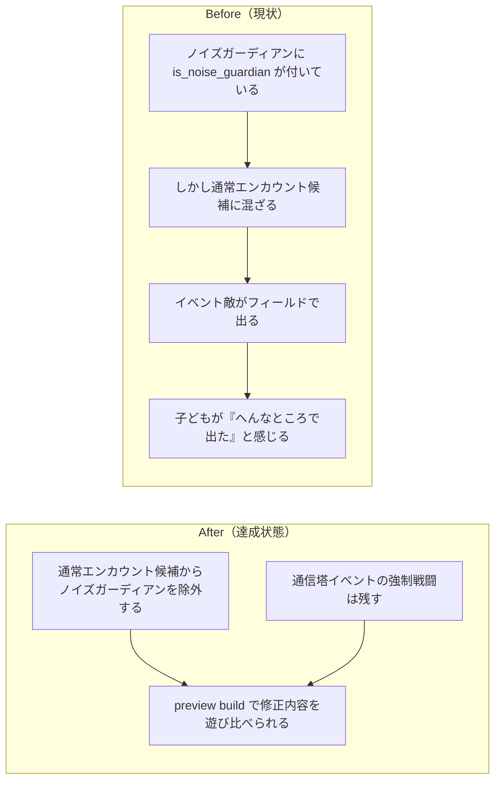

# 2026年4月14日 J45 ノイズガーディアンをイベント専用に戻して preview へ載せる

> 状態：(5) Discussion
> 次のゲート：（ユーザー）preview を遊んで採用するか判断する

---

## 1) 改善対象ジャーニー

- **根拠となるカスタマージャーニー**：`docs/product-requirements/customer-journeys.md` の `CJ42: 子どもが冒険を最後までやり切れる`
- **関連するカスタマージャーニー**：`docs/product-requirements/customer-journeys.md` の `CJ31: 子どもが変更を承認する`、`CJ33: 子どもが変更を選んで適用する`
- **深層的目的**：通信塔イベント用の敵がフィールド通常遭遇へ混ざらず、子どもが RPG の進行を違和感なく遊び切れる状態へ戻す
- **やらないこと**：通信塔イベント戦そのものを削除すること、イベント敵全般のデータ設計を今回まとめて一般化すること

### 人間の期待

- **この note が `done` なら、人間は何が成立していると思うか**：ノイズガーディアンは通信塔イベントでだけ出現し、草むらや道で普通の敵としては出てこない。その修正を `おためしばん` で遊び比べられる
- **その期待を裏切りやすいズレ**：`is_noise_guardian` は付いているのに通常エンカウントの候補へ混ざったまま、または preview の説明だけ更新されて実体が古いまま
- **ズレを潰すために見るべき現物**：`assets/enemies.yaml`、`src/game_data.py`、`main.py` の encounter 経路、`main_preview.py`、`preview_meta.json`、生成された `pyxel-preview.html` / `play-preview.html`

### 現状

- `assets/enemies.yaml` では `ノイズガーディアン` に `is_noise_guardian: true` が付いている
- しかし通常エンカウント候補を作る `_build_zone_enemies()` は `is_boss` / `is_professor` / `post_clear_only` しか除外していない
- 通信塔イベント側には `_start_noise_guardian_battle()` の専用経路があるため、通常遭遇から外してもイベント戦は別に維持できる
- preview は J44 で stale artifact を止めたため、今回 preview に載せるには新しい `main_preview.py` と `preview_meta.json` を作る必要がある

### 今回の方針

- 既存の `is_noise_guardian` を使って通常エンカウント候補から除外する
- 通信塔イベントの `_start_noise_guardian_battle()` 経路は変えない
- failing test で「通常遭遇しないがイベント戦は残る」を固定する
- 修正を `main_preview.py` と `preview_meta.json` に載せて `--preview` build する

### 委任度

- 🟢 CC主導で調査・修正・preview 生成まで進められる

---

## 2) カスタマージャーニーgherkin（完了条件）

### シナリオ1：正常系

> {通常エンカウント候補を組み立てる} で {zone 2 の敵一覧を見る} と {ノイズガーディアンが含まれない}

### シナリオ2：異常系

> {通信塔イベントに初めて到達する} で {イベント戦を開始する} と {ノイズガーディアン戦は従来どおり始まる}

### シナリオ3：回帰確認

> {修正を preview build した} で {選択ページの変更説明と `おためしばん` を確認する} と {説明どおりの preview が生成され current には混ざらない}

### 対応するカスタマージャーニーgherkin

- `docs/product-requirements/cj-gherkin-platform.md`
  `CJG31`
  `Scenario: 親がAIに頼んだ変更はまずおためし版に入る`
- `docs/product-requirements/cj-gherkin-platform.md`
  `CJG31`
  `Scenario: 選択ページの変更説明が実際の配信内容と一致する`
- `docs/product-requirements/customer-journeys.md`
  `CJ42: 子どもが冒険を最後までやり切れる`
- `docs/product-requirements/cj-gherkin-guardrails.md`
  `CJG39`
  `Scenario: イベント専用の敵は通常エンカウントに混ざらない`

---

## 3) Design（どうやるか）

- **関連スキル・MCP**：`brainstorming`、`writing-plans`、`test-driven-development`、`verification-before-completion`
- **MCP**：追加なし

### 調査起点

- `assets/enemies.yaml`
- `src/game_data.py`
- `main.py`
- `test/test_game_data.py`
- `tools/build_web_release.py`

### 実世界の確認点

- **実際に見るURL / path**：`/home/exedev/code-quest-pyxel/main_preview.py`、`/home/exedev/code-quest-pyxel/preview_meta.json`、`/home/exedev/code-quest-pyxel/play-preview.html`、`/home/exedev/code-quest-pyxel/pyxel-preview.html`、`http://127.0.0.1:8888/index.html`
- **実際に動いている process / service**：repo root を配っている `tools/web_runtime_server.py --port 8888`
- **実際に増えるべき file / DB / endpoint**：`main_preview.py`、`preview_meta.json`、preview build artifact、live `index.html` / `play-preview.html`

### 検証方針

- 先に data / encounter テストを Red にする
- 最小修正で Green にする
- `python tools/gen_data.py`
- `python -m pytest test/test_game_data.py -q`
- `python -m pytest test/ -q`
- `python tools/build_web_release.py --preview`

---

## 4) Tasklist

- [x] docs / カスタマージャーニー / カスタマージャーニーgherkin の根拠をそろえる
- [x] failing test で通常遭遇から外す期待値を固定する
- [x] 最小修正でノイズガーディアンを通常エンカウント候補から外す
- [x] 通信塔イベント戦が残ることを確認する
- [x] preview 用入力を作って `--preview` build する
- [x] `python -m pytest test/ -q` を実行する

---

## 5) Discussion（記録・反省）

> Observe → Think → Act を刻む。未来の自分が復元できることが目的。

### 2026年4月14日 13:31（起票）

**Observe**：`ノイズガーディアン` は `is_noise_guardian: true` でイベント敵らしく印付けされている一方、通常エンカウント候補を作る `_build_zone_enemies()` はそのフラグを見ていない。結果としてイベント用の敵が field encounter に混ざりうる。
**Think**：通信塔イベントの `_start_noise_guardian_battle()` は別経路で残っているので、通常遭遇候補からだけ外せば目的を満たせる。今回の目的に対しては新しい汎用フラグ追加より、既存 `is_noise_guardian` を正しく使う最小修正が妥当。
**Act**：J45 を起票し、task note を基準にテスト先行で encounter 候補・event battle・preview build まで順に進める。

### 2026年4月14日 13:36（preview 専用実装）

**Observe**：current に直接修正を入れると preview 比較の意味が消えるため、今回の変更は `main.py` ではなく preview 専用入力へ閉じ込める必要があった。
**Think**：`main_preview.py` を current から作り、`_build_zone_enemies()` の 2 箇所で `is_noise_guardian` を除外すれば、通常遭遇だけ止めて通信塔イベント戦はそのまま残せる。加えて preview の説明文は `preview_meta.json` で source of truth にするのが CJ31/CJ33 に沿う。
**Act**：`main_preview.py` にだけ除外ロジックを入れ、`test/test_preview_noise_guardian.py` を追加して「zone 2 の通常遭遇に含まれない」「`_start_noise_guardian_battle()` は従来どおり起動する」を固定した。合わせて `preview_meta.json` に `つうしんとうの ノイズガーディアンが フィールドに でない` を記録し、`docs/product-requirements/cj-gherkin-guardrails.md` に専用 guardrail を追加した。

### 2026年4月14日 13:40（検証・build 完了）

**Observe**：full pytest の途中で、既存の J44 回帰テストが repo root に `main_preview.py` がない前提で書かれていたため落ちた。また test ordering によって `resolve_pyxel_command()` が `pyxel.__spec__ is None` で落ちる防御不足も見つかった。
**Think**：preview を復活させた今、J44 のテストは fake root で「preview source 不在」を再現する形へ変える必要があった。`resolve_pyxel_command()` は `find_spec("pyxel")` の `ValueError` を握って CLI fallback へ進めば十分だった。これは今回の preview 作業を full suite で成立させるための統合作業として必要だった。
**Act**：`test/test_build_web_release.py` を fake root ベースに直し、`resolve_pyxel_command()` の回帰テストを追加してから `tools/build_web_release.py` を最小修正した。検証は `python -m pytest test/test_build_web_release.py test/test_preview_noise_guardian.py -q` で `23 passed`、`python -m pytest test/ -q` で `162 passed, 2 skipped`、`python tools/build_web_release.py --preview` で preview artifact 生成、`python tools/test_web_compat.py` で `OK: Web版テスト通過`。実世界確認は `/home/exedev/code-quest-pyxel/index.html` に preview change が出ていること、`/home/exedev/code-quest-pyxel/play-preview.html` が `pyxel-preview.html` を埋め込むこと、さらに live `http://127.0.0.1:8888/index.html` が `200 OK` で `おためしばん` と `つうしんとうの ノイズガーディアンが フィールドに でない` を返し、`http://127.0.0.1:8888/play-preview.html` も `200 OK` を返すことまで確認した。
