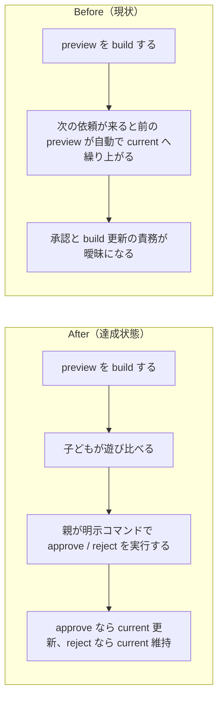

# 2026年4月18日 CJ31 preview 昇格を明示コマンドに一本化する

> 状態：(1) 改善対象ジャーニー
> 次のゲート：完了

---

## 1) 改善対象ジャーニー

- **根拠となるカスタマージャーニー**：`CJ31: 子どもが変更を承認する`
- **関連するカスタマージャーニー**：`CJ32: 子どもが変更を却下する`、`CJ33: 子どもが変更を選んで適用する`
- **深層的目的**：preview を「次に自動で通る版」ではなく「子どもが遊んだあと、親が明示コマンドで採否を確定する候補版」として再定義し、承認と却下の主体をぶらさない
- **やらないこと**：個別ゲームロジックの内容変更、selector の見た目調整、preview 差分文言ルールの大幅拡張

### 人間の期待

- **この note が `done` なら、人間は何が成立していると思うか**：`おためしばん` は親が `昇格` コマンドを打つまで preview のまま待機し、自動で current に上がらない。採用時だけ current が更新され、却下時は current が維持される
- **その期待を裏切りやすいズレ**：次の依頼で勝手に繰り上がる、preview 表示に task note の状態が混ざる、昇格コマンドを打っても配信物が current に反映されない
- **ズレを潰すために見るべき現物**：`docs/product-requirements/customer-journeys.md`、`docs/product-requirements/cj-gherkin-platform.md`、`tools/build_web_release.py`、`test/test_build_web_release.py`、`main.py`、`main_preview.py`、`preview_meta.json`、`index.html`

### 現状

- `customer-journeys.md` と `CJG31/CJG32/CJG33` は明示 `approve/reject` モデルへ更新した
- `tools/build_web_release.py` は `--approve-preview` / `--reject-preview` を user-facing CLI とし、preview request note 依存と自動繰り上げを外した
- `test/test_build_web_release.py` は helper と CLI dispatch を含めて新モデルへ固定した

### 今回の方針

- preview の採否は明示コマンドに一本化する
- 自動繰り上げと preview request note 依存は廃止する
- user-facing CLI は `--approve-preview` と `--reject-preview` にする
- preview card の表示条件は `main_preview.py` / `preview_meta.json` / preview artifact の整合だけに戻す

### 委任度

- 🟢 docs と build の両方をまとめて見直すが、境界は明確

---

## 2) カスタマージャーニーgherkin（完了条件）

### シナリオ1：正常系

> {preview を build 済み} で {親が `--approve-preview` を実行する} と {preview の内容が current に昇格し preview は消える}

### シナリオ2：異常系

> {preview を build 済み} で {親が `--reject-preview` を実行する} と {current は変わらず preview だけが消える}

### シナリオ3：回帰確認

> {古い preview artifact や task note が残っている} で {通常 build を実行する} と {preview card の表示は source と artifact の整合だけで決まり task note の状態には引っ張られない}

### 対応するカスタマージャーニーgherkin

- `CJG31`
- `CJG32`
- `CJG33`

---

## 3) Design（どうやるか）

- **関連スキル・MCP**：`superpowers:test-driven-development`、`superpowers:verification-before-completion`
- **MCP**：追加なし

### 調査起点

- `docs/product-requirements/customer-journeys.md`
- `docs/product-requirements/cj-gherkin-platform.md`
- `tools/build_web_release.py`
- `test/test_build_web_release.py`

### 実世界の確認点

- **実際に見るURL / path**：`index.html`、`play.html`、`play-preview.html`、`preview_meta.json`
- **実際に動いている process / service**：`python tools/build_web_release.py --preview`、`python tools/build_web_release.py --approve-preview`、`python tools/build_web_release.py --reject-preview`
- **実際に増えるべき file / DB / endpoint**：`main_preview.py` と `preview_meta.json` は preview 中のみ存在し、approve/reject 後は片づく

### 検証方針

- 先に build テストを「自動繰り上げなし」「明示 approve/reject」前提へ更新して Red にする
- 実装後、preview build、approve/reject の各経路、通常 build、full pytest、web 互換を確認する

---

## 4) Tasklist

- [x] CJ31/CJG31/CJG32/CJG33 を明示昇格モデルへ書き換える
- [x] build テストを新モデルに合わせて Red にする
- [x] `tools/build_web_release.py` から自動繰り上げと note 依存を外す
- [x] user-facing approve/reject CLI を追加する
- [x] preview/current build を再生成して確認する
- [x] `python -m pytest test/ -q` を実行する

---

## 5) Discussion（記録・反省）

### 2026年4月18日 13:05（起票）

**Observe**：preview の定義が「候補版」なのか「次に通る版」なのか docs と build で揺れていた。  
**Think**：自動繰り上げを維持すると、子どもの承認より「次の依頼が来たか」が本番更新のトリガーになり、CJ31/CJ32 の意図とずれる。  
**Act**：preview を明示 approve/reject コマンドで確定するモデルへ再定義し、docs と build の両方を揃える note を切り出した。

### 2026年4月18日 13:17（完了）

**Observe**：`customer-journeys.md` / `cj-gherkin-platform.md` / `tools/build_web_release.py` / `test/test_build_web_release.py` を更新し、preview note 依存と自動繰り上げを外した。`preview_meta.json` も再生成して request note 情報を持たない形へ揃った。  
**Think**：親が実行する入口は `--preview` / `--approve-preview` / `--reject-preview` の3つに絞ると、CJ31-CJ33 と実装責務が一致する。  
**Act**：`python -m pytest test/test_build_web_release.py -q` で `35 passed`、`python tools/build_web_release.py --preview`、`python -m pytest test/ -q` で `190 passed`、`python tools/build_web_release.py`、`python tools/test_web_compat.py` で `OK: Web版テスト通過（10秒間クラッシュ・致命的エラーなし）` を確認した。

### 2026年4月18日 13:23（close-session）

**Observe**：完了条件と検証結果は揃っており、active note に残し続ける理由はなくなった。  
**Think**：この task は preview/current の昇格仕様を明示コマンドへ寄せる作業として閉じてよい。以後の変更は別 note で扱うのが筋。  
**Act**：この note を `docs/steering/done/` へ移してセッションを閉じる。
