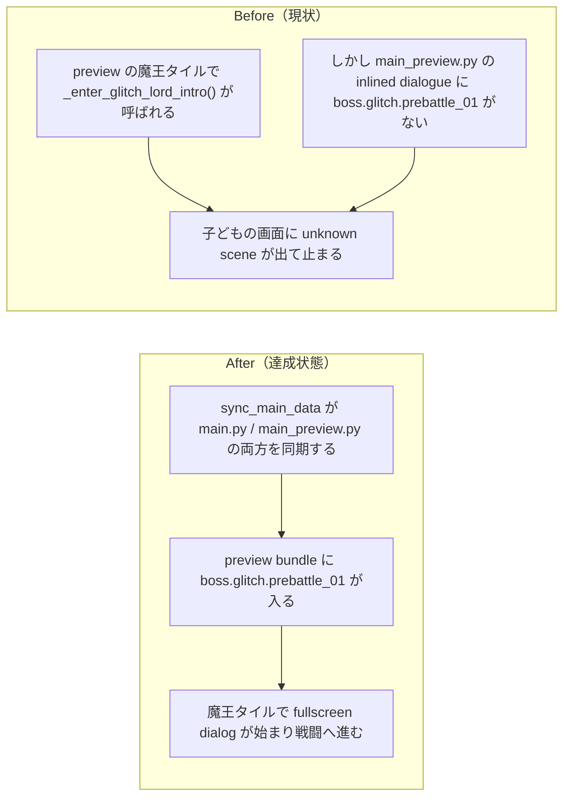

# 2026年4月18日 CJ35 preview の prebattle scene 欠落を子どもに届けない

> 状態：(5) Discussion
> 次のゲート：完了

---

## 1) 改善対象ジャーニー

- **根拠となるカスタマージャーニー**：`CJ35: AIで修正したらエラーが出て動かない`
- **関連するカスタマージャーニー**：`CJ31: 子どもが変更を承認する`
- **深層的目的**：preview に入れた新しい変更が、子どもの画面では `unknown scene` で止まらず、動く会話と戦闘導線として届く状態を守る
- **やらないこと**：魔王前会話の本文変更、魔王戦ロジックの仕様変更、selector 文言ルールの再設計

### 人間の期待

- **この note が `done` なら、人間は何が成立していると思うか**：preview で魔王タイルに乗ると `boss.glitch.prebattle_01` から会話が始まり、`unknown scene` は出ず、そのまま戦闘へ進める
- **その期待を裏切りやすいズレ**：`main_preview.py` のコードだけが新しく、inlined dialogue セクションや `pyxel-preview.html` の中身が古いまま残っていること
- **ズレを潰すために見るべき現物**：`main_preview.py`、`tools/sync_main_data.py`、`pyxel-preview.html`、`index.html`、`tools/build_web_release.py`、`test/test_dialogue_integration.py`

### 現状

- `main_preview.py` は preview 専用に `_enter_glitch_lord_intro()` から `boss.glitch.prebattle_01` を参照していた
- `src/generated/dialogue.py` と `assets/dialogue.yaml` には該当 scene が存在していた
- しかし `tools/sync_main_data.py` は `main.py` しか同期しておらず、`main_preview.py` の inlined dialogue は古いままだった
- 既存テストは `main_preview.py` が scene 名を文字列として参照していることしか見ておらず、実際にその scene 定義が bundle に入っているかは検査していなかった

### 今回の方針

- `tools/sync_main_data.py` の同期対象を `main.py` だけでなく `main_preview.py` まで広げる
- `main.py` / `main_preview.py` のコード中で使う scene id が、実際の inlined dialogue に存在することを回帰テストで機械的に検査する
- preview build を再生成し、`pyxel-preview.html` とローカル Web 起動まで確認する

### 委任度

- 🟢 root cause が bundle 同期漏れに閉じており、docs・テスト・build を同じセッションで完結できる

---

## 2) カスタマージャーニーgherkin（完了条件）

### シナリオ1：正常系

> {preview 専用魔王前会話を含む `main_preview.py`} で {`python tools/build_web_release.py --preview` を実行する} と {`pyxel-preview.html` の実体に `boss.glitch.prebattle_01` が含まれ、魔王タイルで会話が始まる}

### シナリオ2：異常系

> {preview コードが scene id を参照しているのに inlined dialogue が古い} で {`python -m pytest test/test_dialogue_integration.py -q` を実行する} と {scene 欠落が検知され、`unknown scene` のまま子どもに届かない}

### シナリオ3：回帰確認

> {`main.py` と `main_preview.py` の runtime code が参照する scene id 群} で {dialogue coverage test と sync tool test を実行する} と {両 bundle の inlined dialogue が同期漏れなく追従する}

### 対応するカスタマージャーニーgherkin

- `docs/product-requirements/cj-gherkin-guardrails.md`
  `CJG35`
  `Scenario: importエラーを起こす版は選択ページに出ない`
- `docs/product-requirements/cj-gherkin-platform.md`
  `CJG31`
  `Scenario: 親がAIに頼んだ変更はまずおためし版に入る`

---

## 3) Design（どうやるか）

- **関連スキル・MCP**：`superpowers:systematic-debugging`、`superpowers:test-driven-development`、`superpowers:verification-before-completion`
- **MCP**：追加なし

### 調査起点

- `tools/sync_main_data.py`
- `main_preview.py`
- `assets/dialogue.yaml`
- `src/generated/dialogue.py`
- `test/test_dialogue_integration.py`
- `test/test_dialogue_ssot.py`
- `tools/build_web_release.py`
- `test/test_build_web_release.py`

### 実世界の確認点

- **実際に見るURL / path**：`/home/exedev/code-quest-pyxel/main_preview.py`、`/home/exedev/code-quest-pyxel/pyxel-preview.html`、`/home/exedev/code-quest-pyxel/index.html`、`http://127.0.0.1:8899/play.html`
- **実際に動いている process / service**：`python tools/build_web_release.py --preview`、`python tools/test_web_compat.py`
- **実際に増えるべき file / DB / endpoint**：`main_preview.py` に `'boss.glitch.prebattle_01': {` が inlined され、preview build 後の `pyxel-preview.html` / `play-preview.html` がその bundle を配信する

### 検証方針

- 先に preview bundle の scene 欠落を検知するテストを追加して Red にする
- `tools/sync_main_data.py` を最小修正して `main_preview.py` も同期する
- `python -m pytest test/test_dialogue_integration.py -q`
- `python -m pytest test/test_dialogue_ssot.py -q`
- `python -m pytest test/ -q`
- `python tools/build_web_release.py --preview`
- `python tools/test_web_compat.py`

---

## 4) Tasklist

- [x] docs / カスタマージャーニー / gherkin の根拠をそろえる
- [x] root cause を `main_preview.py` の dialogue 同期漏れとして切り分ける
- [x] scene 欠落を検知する包括的な回帰テストを追加する
- [x] `tools/sync_main_data.py` を `main_preview.py` 対応に拡張する
- [x] preview build を再生成して `pyxel-preview.html` まで更新する
- [x] `python -m pytest test/ -q` を実行する

---

## 5) Discussion（記録・反省）

> Observe → Think → Act を刻む。未来の自分が復元できることが目的。

### 2026年4月18日 15:05（起票）

**Observe**：preview で魔王タイルに乗ると `unknown scene: boss.glitch.prebattle_01` が出た。`assets/dialogue.yaml` と `src/generated/dialogue.py` には scene がある一方、`main_preview.py` の inlined dialogue には存在しなかった。  
**Think**：ゲームロジックではなく preview bundle の生成経路が壊れている。`main_preview.py` が新しい scene id を参照しても、同期ツールが `main.py` しか見ていなければ実物は stale のままになる。  
**Act**：`test/test_dialogue_integration.py` に preview bundle が scene を実際に含むことを確認する Red テストを足し、`tools/sync_main_data.py` の対象範囲を見直す方針を立てた。

### 2026年4月18日 15:19（修正・検証完了）

**Observe**：既存テストは `main_preview.py` が `boss.glitch.prebattle_01` を文字列として参照していることしか見ておらず、実際の inlined dialogue coverage は無検査だった。Red テスト追加後は `main_preview.py missing JA scenes: ['boss.glitch.prebattle_01']` で落ちた。  
**Think**：今回必要なのは1件の scene 名だけを足すことではなく、bundle code が参照する scene 群を inlined dialogue が全部持っていることを継続的に検査することだった。これなら次の preview-only scene 追加でも同種の事故を防げる。  
**Act**：`tools/sync_main_data.py` を `main.py` / `main_preview.py` の両同期へ拡張し、`test/test_dialogue_integration.py` では AST から scene id を抽出して `DIALOGUE_JA` / `DIALOGUE_EN` の両方を検査、`test/test_dialogue_ssot.py` では preview 相当ファイルに対する sync tool の回帰テストを追加した。`python -m pytest test/test_dialogue_integration.py -q` は `15 passed`、`python -m pytest test/test_dialogue_ssot.py -q` は `5 passed`、`python -m pytest test/ -q` は `200 passed in 6.33s` を確認した。さらに `python tools/build_web_release.py --preview` で `pyxel.html` / `pyxel-preview.html` / `index.html` を再生成し、`python tools/test_web_compat.py` で `Opening http://127.0.0.1:8899/play.html ...` のあと `OK: Web版テスト通過（10秒間クラッシュ・致命的エラーなし）` を確認した。
