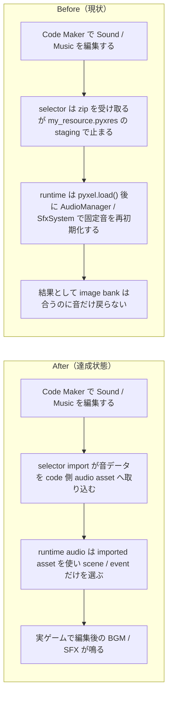

# 2026年4月20日 CJ26 Code Maker の Sound / Music を code asset として取り込む

> 状態：`open`
> 次のゲート：（ユーザー）task note 確認後、実装へ進む

---

## 1) 改善対象ジャーニー

- **根拠となるカスタマージャーニー**：`CJ15`, `CJ16`, `CJ17`, `CJ24`, `CJ26`
- **関連するカスタマージャーニー**：`CJG15`, `CJG16`, `CJG17`, `CJG24`, `CJG26`, `CJG37`, `CJG41`, `共通条件 AV`, `共通条件 Code Maker制約`
- **深層的目的**：親子が Code Maker の `Sound / Music` エディタで作った音を selector から戻し、そのまま実ゲームの BGM / SFX として聞けるようにする。`main.py` を巻き戻さず、音の authoring と runtime 再生の責務を分ける
- **やらないこと**：image bank / tilemap の責務を今回の note で作り直すこと、zip 内 `main.py` の採用、`.pyxres` の手編集、Code Maker を別 UI に置き換えること

### 人間の期待

- **この note が `done` なら、人間は何が成立していると思うか**：Code Maker で `Sound / Music` を変えて `code-maker.zip` を selector に戻すと、今の code はそのままで、実ゲームの攻撃音や場面 BGM が編集後の音に変わる
- **その期待を裏切りやすいズレ**：`pyxel.load()` で読んだ音を `AudioManager` / `SfxSystem` が固定データで上書きする、selector import が `my_resource.pyxres` の opaque staging で止まる、build が音の取り込みと export の責務を持たない
- **ズレを潰すために見るべき現物**：`src/shared/services/audio_system.py`、`main.py`、`main_development.py`、`src/shared/services/codemaker_resource_store.py`、`tools/build_codemaker.py`、`development/code-maker.zip`

### 現状

- image bank / tilemap 系は `pyxel.load()` と既存の描画責務で成立し始めている
- 一方で `AudioManager` と `SfxSystem` は `CHIPTUNE_TRACKS` / `SFX_DEFINITIONS` を runtime で `pyxel.sounds[]` / `pyxel.musics[]` へ再書き込みしている
- そのため Code Maker で作った `Sound / Music` は zip を戻しても実ゲームの音として残らない
- docs には「Sound / Music を Code Maker で作って本編で鳴る」とあるが、現在の code はその契約に一致していない

### 今回の方針

- **human authoring**：音の中身は引き続き親子が Code Maker の `Sound / Music` エディタで決める
- **import/build**：Code Maker zip から `Sound / Music` を抽出し、development 候補の code 側 audio asset へ変換する。zip 内 `main.py` は採用しない
- **runtime audio**：`audio_system.py` は scene / event ごとの選択と再生だけを持ち、固定メロディや固定 SE 定義を正本として持たない
- **packaging**：Code Maker 用 zip は current / development の code と、現在の audio asset を export した `my_resource.pyxres` を同梱する
- **verify**：Sound / Music import の round-trip を test / build で固定し、「image bank は合うが音だけ旧データ」という状態を done にしない

### 委任度

- 🟡 Code Maker import / audio runtime / build export / verify をまたぐが、`音を作る`, `音を取り込む`, `音を鳴らす`, `zip を組む` の責務は分離できる

---

## 2) カスタマージャーニーgherkin（完了条件）

### シナリオ1：正常系

> {親子が Code Maker の Music / Sound エディタで音を編集して Save した} で {selector から code-maker.zip を取り込んで play する} と {実ゲームで編集後の BGM / SFX が鳴る}

### シナリオ2：異常系

> {zip に `main.py` と `my_resource.pyxres` が入っている} で {取り込みを実行する} と {今の code は維持され、Sound / Music だけが import 対象になる}

### シナリオ3：回帰確認

> {image bank / tilemap は既に正しく反映されている} で {audio import を追加する} と {画像系の往復は壊さず、音だけが新しく本編一致する}

### 対応するカスタマージャーニーgherkin

- `CJG15: 人が Musicエディタで編集した曲をその場面で聞ける`
- `CJG16: 戦闘開始で戦闘曲に切り替わる`
- `CJG17: 人が作ったSFXを行動イベントに結びつけられる`
- `CJG24: Soundエディタで編集したSFXがゲーム内で使われる`
- `CJG26: Code Maker から戻す時は code を巻き戻さず asset を取り込む`
- `CJG37: Sound / Music import は hardcoded audio で上書きしない`
- `CJG41: Code Maker 互換はビルド時点で守る`

---

## 3) Design（どうやるか）

- **関連スキル・MCP**：`brainstorming`, `test-driven-development`, `verification-before-completion`, `pyxel`
- **MCP**：`pyxel` で runtime audio の実物確認を行う

### 調査起点

- `docs/customer-journeys.md`
- `docs/cj-gherkin-av.md`
- `docs/cj-gherkin-platform.md`
- `docs/cj-gherkin-guardrails.md`
- `docs/architecture.md`
- `src/shared/services/audio_system.py`
- `main.py`, `main_development.py`
- `src/shared/services/codemaker_resource_store.py`

### 実世界の確認点

- **実際に見るURL / path**：
  `/home/exedev/code-quest-pyxel/development/code-maker.zip`
  `/home/exedev/code-quest-pyxel/assets/blockquest.pyxres`
  `/home/exedev/code-quest-pyxel/.runtime/codemaker_resource_imports/development/my_resource.pyxres`
  `/home/exedev/code-quest-pyxel/src/shared/services/audio_system.py`
- **実際に動いている process / service**：
  `python tools/build_web_release.py --development`
  `python tools/build_web_release.py`
- **実際に増えるべき file / DB / endpoint**：
  Sound / Music の code-side asset catalog
  Code Maker audio import の manifest / generated module
  音の round-trip を固定する test

### 検証方針

- docs では「image bank は成立、audio だけ不一致」を明記する
- 実装時は `AudioManager` / `SfxSystem` の hardcoded overwrite を先に Red にする
- Code Maker import -> build -> runtime playback の round-trip test を用意する
- `python -m pytest test/ -q` と audio 周りの実物確認で閉じる

---

## 4) Tasklist

- [ ] `CJ15/CJ16/CJ17/CJ24/CJ26` の要求を audio import 前提にそろえる
- [ ] `CJG15/CJG16/CJG17/CJG24/CJG26/CJG37/CJG41` の責務を「authoring / import / playback / build」で切り分ける
- [ ] `architecture.md` に image 系と audio 系の責務差を明記する
- [ ] `AudioManager` / `SfxSystem` が imported audio を上書きしない実装方針を決める
- [ ] Code Maker zip から Sound / Music を code asset 化する import/export 経路を決める
- [ ] `python -m pytest test/ -q` を実行する

---

## 5) Discussion（記録・反省）

> Observe → Think → Act を刻む。未来の自分が復元できることが目的。

### 2026年4月20日 23:30（起票）

**Observe**：image bank 系は改善したが、`AudioManager` / `SfxSystem` は `pyxel.load()` の後に `sounds` / `musics` を固定データで再初期化しているため、Code Maker で作った `Sound / Music` が本編に残らない。  
**Think**：問題は「Code Maker で音を作る」と「runtime がどの音を鳴らすか」の責務が混ざっていることだった。音の authoring は人、scene / event の選択は code、両者をつなぐ import/build を別責務にしないと round-trip が成立しない。  
**Act**：image bank は scope から外し、`Sound / Music` だけを code asset import へ寄せる task note として起票した。
