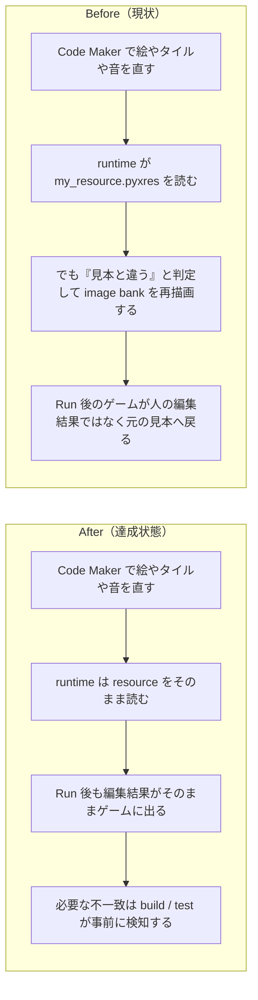

# 2026年4月20日 CJ26 Code Maker で直した image bank を runtime が巻き戻さないようにする

> 状態：`open`
> 次のゲート：（ユーザー）task note 確認後、実装へ進む

---

## 1) 改善対象ジャーニー

- **根拠となるカスタマージャーニー**：`CJ26 「自分たちのゲーム」と言えるようになる`
- **関連するカスタマージャーニー**：`CJ01`, `CJ02`, `CJ23`, `CJ24`
- **深層的目的**：子どもが Code Maker の `Tilemap / Sprite / Sound / Resource Editor` で変えたものを `Run` したとき、そのままゲーム世界の真実として見えるようにし、runtime の自己修復で人の resource を巻き戻さない
- **やらないこと**：`.pyxres` の直接編集、Code Maker を別 UI に置き換えること、zip 内 `main.py` の採用、stale resource 対応を runtime の自動再生成へ戻すこと

### 人間の期待

- **この note が `done` なら、人間は何が成立していると思うか**：Code Maker で image bank / tilemap / sound を直して `Run` すると、その変更がゲームにそのまま出る。desktop 起動だけで `.pyxres` が勝手に別内容へ保存し直されない。不一致があるなら build / test が先に止める
- **その期待を裏切りやすいズレ**：runtime は `my_resource.pyxres` を読んだあと `image bank 0` をコード定義と比較し、違うと `_paint_tile_bank()` / `_paint_sprite_bank()` / `pyxel.save()` で元の見本へ戻してしまう。結果として「編集画面では変わったのに Run 後は戻る」が起きる
- **ズレを潰すために見るべき現物**：`main.py`, `main_development.py`, `tools/build_codemaker.py`, `tools/build_web_release.py`, `src/shared/services/browser_resource_override.py`, `test/test_tilemap_editor_truth.py`, `test/test_build_web_release.py`, `production/code-maker.zip`, `development/code-maker.zip`

### 現状

- `tools/build_codemaker.py` は `main.py` を `CORE_BLOCK` として包み、`my_resource.pyxres` を同梱した Code Maker 用 zip を作っている。`pyxel.blt` などの描画コードが消えたわけではなく、見えにくくなっているだけ
- `main.py` / `main_development.py` は起動時に `my_resource.pyxres` または `assets/blockquest.pyxres` を `pyxel.load()` している
- しかし `_setup_world_tilemap()` 内の `_tile_bank_layout_valid()` が `image bank 0` を `TILE_DATA` と比較し、不一致だと runtime が `_paint_tile_bank()` / `_paint_sprite_bank()` / `_bake_*()` を実行し、desktop では `pyxel.save()` まで走る
- これは `CJG23`, `CJG24`, `CJG26`, `CJG37` の「編集面が真実」「runtime は人の resource を勝手に別物へ更新しない」と衝突する
- 2026-04-12 の `guardrails-4-pyxres-validation` note は runtime 自動再生成前提だったが、2026-04-19 注記でその前提は正本ではないと明記されている。docs は更新済みなのに runtime には旧前提が残っている

### 今回の方針

- **runtime (`main.py` / `main_development.py`)**：`my_resource.pyxres` を読む責務に絞り、人が直した image bank / tilemap / sound を「壊れている」とみなして描き直さない
- **resource staging (`src/shared/services/browser_resource_override.py`, `src/shared/services/codemaker_resource_store.py`)**：zip から `my_resource.pyxres` を opaque に運ぶ。resource の意味解釈や修復を持たない
- **build / packaging (`tools/build_codemaker.py`, `tools/build_web_release.py`)**：Code Maker 用 zip と development / production 配布物へ、選ばれた resource をそのまま載せる
- **guardrail / verify (`test/test_tilemap_editor_truth.py`, `test/test_build_web_release.py`, 新規 truth test`)**：stale resource や bank 競合、Code Maker 互換の不一致は build / test で検知する。人の `Run` 時に勝手に直さない
- **docs / note**：`CJG37` の「runtime は人の resource を勝手に別物へ更新しない」を SoT とし、古い runtime self-heal 前提をさらに残さない

### 委任度

- 🟡 runtime / build / test / docs をまたぐが、責務の切り分け自体は明確で、`resource を読む`, `resource を運ぶ`, `resource を検証する` を別パーツへ分けられる

---

## 2) カスタマージャーニーgherkin（完了条件）

### シナリオ1：正常系

> {子どもが Code Maker の Sprite / Tilemap / Sound を編集した} で {Run する} と {編集した resource がそのままゲーム内に出て runtime は image bank を描き直さない}

### シナリオ2：異常系

> {code 側の bank 定義変更で resource が古くなった} で {build または関連テストを実行する} と {不一致は build / test で検知され、desktop 起動だけで `.pyxres` を勝手に保存し直さない}

### シナリオ3：回帰確認

> {selector から取り込んだ `code-maker.zip` に `my_resource.pyxres` が入っている} で {development / production の play を開く} と {今の code はそのまま維持され、取り込んだ resource だけが反映される}

### 対応するカスタマージャーニーgherkin

- `CJG01: Run すると置いたタイルの変化がゲームに反映される`
- `CJG02: 道の見た目が編集画面とゲーム画面で一致する`
- `CJG23: Code MakerのSpriteエディタでキャラを編集できる`
- `CJG24: Soundエディタで編集したSFXがゲーム内で使われる`
- `CJG26: Tilemap / Resource Editor / Sprite / Sound で見えたものがそのままゲームに出る`
- `CJG26: Code Maker から戻す時は resource だけを取り込む`
- `CJG37: build は人が編集した resource をそのまま届ける`
- `CJG37: runtime は人の resource を勝手に別物へ更新しない`
- `CJG41: Code Maker 互換はビルド時点で守る`
- `共通条件 Code Maker制約: resource の実体は人が Code Maker で触る`

---

## 3) Design（どうやるか）

- **関連スキル・MCP**：`systematic-debugging`, `test-driven-development`, `verification-before-completion`, `pyxel`
- **MCP**：`pyxel`

### 調査起点

- `main.py`, `main_development.py`
  `_setup_image_banks()`, `_tile_bank_layout_valid()`, `_setup_world_tilemap()`, `_paint_tile_bank()`, `_paint_sprite_bank()`, `_bake_world_to_tilemap()`, `_bake_dungeon_to_tilemap()`
- `tools/build_codemaker.py`
  Code Maker 用 `main.py` の生成責務と `my_resource.pyxres` の同梱
- `tools/build_web_release.py`
  current / development resource の選択、approve / reject 時の昇格、Code Maker zip 生成
- `src/shared/services/browser_resource_override.py`
  browser 保存済み zip から `my_resource.pyxres` を runtime staging する責務
- `src/shared/services/codemaker_resource_store.py`
  selector import 時に `my_resource.pyxres` だけを保持する責務
- `test/test_tilemap_editor_truth.py`, `test/test_browser_resource_override.py`, `test/test_build_codemaker.py`, `test/test_build_web_release.py`
  既存の truth / packaging / import 回帰点
- `steering/done/20260412-guardrails-4-pyxres-validation.md`
  旧前提がどこから来たかの確認用。新しい SoT としては扱わない

### 実世界の確認点

- **実際に見るURL / path**：
  `/home/exedev/code-quest-pyxel/main.py`
  `/home/exedev/code-quest-pyxel/main_development.py`
  `/home/exedev/code-quest-pyxel/assets/blockquest.pyxres`
  `/home/exedev/code-quest-pyxel/production/code-maker.zip`
  `/home/exedev/code-quest-pyxel/development/code-maker.zip`
  `/home/exedev/code-quest-pyxel/.runtime/codemaker_resource_imports/development/my_resource.pyxres`
- **実際に動いている process / service**：
  `python tools/build_web_release.py --development`
  `python tools/build_web_release.py`
  `python -m pytest test/ -q`
  必要なら `python tools/test_web_compat.py`
- **実際に増えるべき file / DB / endpoint**：
  `test/test_codemaker_resource_truth.py` または同等の runtime truth テスト
  必要なら build 時の resource truth / stale detection helper

### 検証方針

- まず runtime の Red を作る
  Code Maker 由来の resource を読んだとき、`_paint_tile_bank()` / `_paint_sprite_bank()` / `pyxel.save()` が呼ばれないことを固定する
- 次に editor truth の Red を作る
  Sprite / Tilemap / Sound の編集結果が `Run` 後にそのまま見えることを targeted test で固定する
- そのうえで stale resource 検知を build / test 側へ寄せる
  runtime self-heal ではなく build 失敗または test failure で見つける
- 最後に Code Maker zip と development / production 配布物の回帰を確認する
  `my_resource.pyxres` がそのまま載り、selector import 後も code は巻き戻らないことを確認する

---

## 4) Tasklist

- [x] docs / カスタマージャーニー / gherkin の根拠をそろえる
- [ ] runtime が人の resource を巻き戻している根本原因をテストで固定する
- [ ] `main.py` / `main_development.py` の resource load と self-heal の責務を切り分ける
- [ ] stale resource / bank 競合の検知を build / test 側へ寄せる
- [x] Code Maker zip / selector import / development / production の回帰を確認する
- [ ] `python -m pytest test/ -q` を実行する

---

## 5) Discussion（記録・反省）

> Observe → Think → Act を刻む。未来の自分が復元できることが目的。

### 2026年4月20日 16:23（起票）

**Observe**：`my_resource.pyxres` 自体は runtime で読んでいるのに、`_tile_bank_layout_valid()` が Code Maker で変えた image bank を「不一致」とみなし、`_paint_tile_bank()` / `_paint_sprite_bank()` / `pyxel.save()` で巻き戻していた。  
**Think**：これは `pyxel.blt` が無い問題ではなく、runtime が旧ガードレール前提の self-heal を持ち続けている問題だった。子どもが見ている編集面を真実にするには、runtime repair ではなく build / verify の責務へ戻す必要がある。  
**Act**：`CJ26` を主、`CJ01/CJ02/CJ23/CJ24` を副に据え、`CJG26/CJG37/CJG41` の契約と runtime / build / staging / test の責務を分ける task note として起票した。
