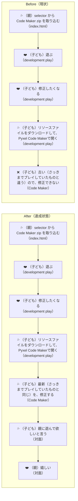
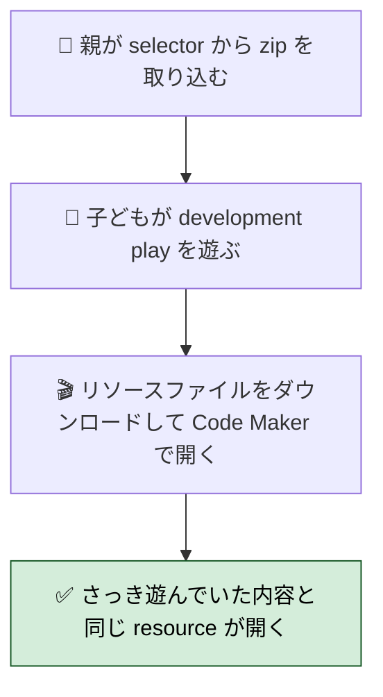
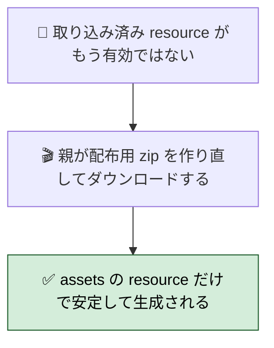
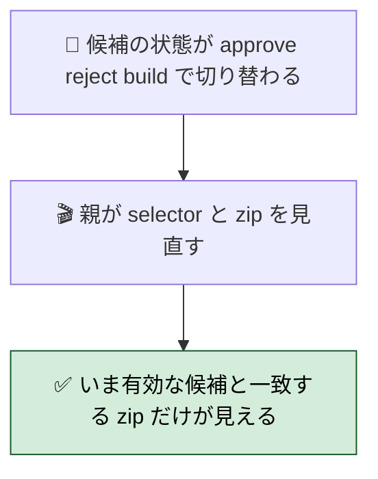
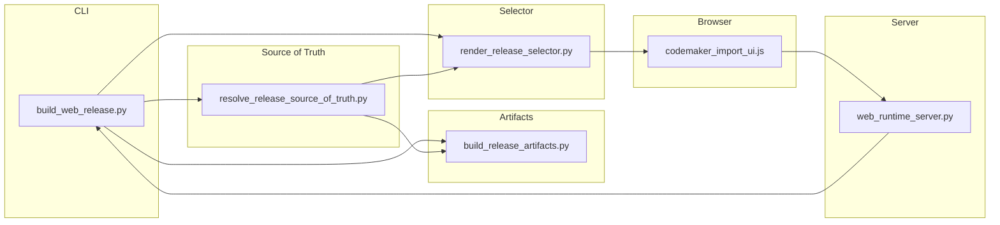
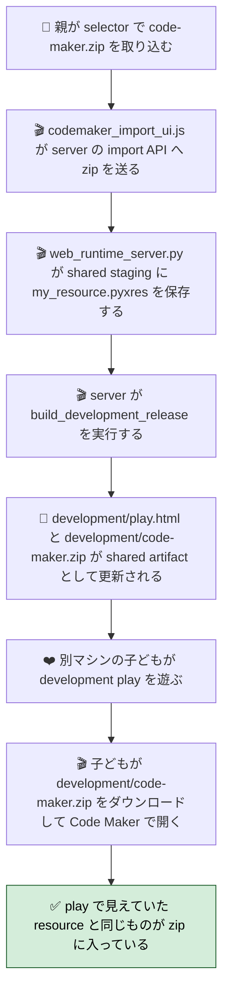

# 2026年4月22日 CJ26 読み込んだ resource と配布する resource を一致させる

> 状態：`open`
> 次のゲート：（ユーザー）task note 確認後、実装へ進む

---

## 1) 改善対象ジャーニー

- **根拠となるカスタマージャーニー**：`CJ26 「自分たちのゲーム」と言えるようになる`
- **関連するカスタマージャーニー**：`CJ22`, `CJ23`, `CJ24`, `CJ31`, `CJ33`
- **深層的目的**：親子の交流を回す

### 委任度

- 🟡 runtime staging、build、selector の責務境界をまたぐが、resource source の一本化に絞れば CC 主導で進められる

---

## 2) カスタマージャーニーgherkin（完了条件）

### シナリオ1：正常系

> 🧱 Given: 親が selector から Code Maker zip を取り込み、子どもが development play を遊んでいて、いま見えている見た目や音をこのまま直したいと思っている。🎬 When: 子どもがその流れのままリソースファイルをダウンロードして Pyxel Code Maker で開く。✅ Then: 開いた `my_resource.pyxres` はさっきまで play で読まれていた resource と一致し、子どもは同じ内容の続きを修正できる。

### シナリオ2：異常系

> 🧱 Given: 取り込み済み resource が消えている、却下された、または最初からなく、いま有効なのが `assets/blockquest.pyxres` だけである。🎬 When: 親がその状態で配布用 zip を作り直し、リソースファイルをダウンロードする。✅ Then: zip は存在しない staging file を参照せず、いま有効な `assets/blockquest.pyxres` を使って安定して生成され、壊れた古い resource を混ぜない。

### シナリオ3：回帰確認

> 🧱 Given: 親子が resource を取り込んで遊び直したあと、approve / reject や通常 build で候補の状態が切り替わる。🎬 When: 親が index.html の導線と、そこから落ちる `code-maker.zip` を見直す。✅ Then: 子どもが次に開く zip はその時点で有効な候補と一致し、さっきまで遊んでいたものと違う古い resource zip を現在候補として見せない。

### 対応するカスタマージャーニーgherkin

- `CJG22: フィードバックから修正と再共有が数分で回る`
- `CJG23: Code Maker の Sprite エディタで編集した見た目がそのまま出る`
- `CJG24: Sound エディタで編集した音がゲーム内で使われる`
- `CJG26: 持ち出した開発版は今見ている開発版そのものである`
- `CJG26: Code Maker から戻す時は code を巻き戻さず必要な asset を取り込む`
- `CJG37: build は人が編集した resource をそのまま届ける`

---

## 3) Design（どうやるか）

- **関連スキル・MCP**：`manage-tasknotes`, `systematic-debugging`, `test-driven-development`, `verification-before-completion`
- **MCP**：追加なし

### 方式比較

- **案A: browser localStorage を正本にする**
  同じ browser なら play と download を合わせやすいが、別マシン共有では破綻する
- **案B: server import staging を正本にする**
  selector が zip を server に送り、shared staging と shared build artifact を作り直す。別マシンでも同じ `development/play.html` と `development/code-maker.zip` を見られる
- **案C: selector upload と server rebuild を分離する**
  取り込みだけ先に行い、親が別途 build コマンドを叩く。責務は分かれるが、親の手数が増え、CJ26 の「数分で回る」を弱める

**推奨は案B**。今回の主語は「別マシンでも同じ resource を配る」なので、`localStorage` を正本にしてはいけない。selector は server に import を依頼し、server が shared staging を更新して shared artifact を rebuild する。

### 責務分割

- **`tools/build_web_release.py`**
  CLI と use case orchestration だけを持つ
  `build_web_release()`, `build_development_release()`, `approve_development()`, `reject_development()`, `main()`
- **`tools/resolve_release_source_of_truth.py`**
  共有配布物に使う code / resource の正本を決める
  `DevelopmentCandidate`、production/development の source 解決、dependency 計算、`development_meta.json` の read / write / validate を持つ
- **`tools/build_release_artifacts.py`**
  渡された source から shared artifact を作る
  staging、`pyxel package` / `app2html`、`code-maker.zip` 生成、legacy artifact cleanup を持つ
- **`tools/render_release_selector.py`**
  wrapper / selector HTML の生成と preview 露出判定を持つ
  `top_changes.json` 読み込み、preview link の表示可否、version token 生成、selector への import UI 埋め込みを持つ
- **`templates/codemaker_import_ui.js`**
  selector から server import API を呼ぶ
  `POST /internal/codemaker-resource-import`、status 表示、server unavailable 時の fallback を持つ
- **`tools/web_runtime_server.py`**
  shared import staging と rebuild の入口を持つ
  zip 受信、`import_codemaker_resource_zip()` 呼び出し、`build_development_release()` / `build_web_release()` 実行を持つ
- **`src/shared/services/browser_resource_override.py`**
  static fallback を残す場合のみ browser 保存済み zip から `my_resource.pyxres` を staging する
  shared artifact の正本判定は持たない

### 共有 import / download フロー

### 調査起点

- `tools/build_web_release.py`
  現状の責務密集点
- `tools/resolve_release_source_of_truth.py`
  新規。build-visible source 判定の受け皿
- `tools/build_release_artifacts.py`
  新規。artifact 生成の受け皿
- `tools/render_release_selector.py`
  新規。selector / wrapper の受け皿
- `tools/build_codemaker.py`
  `build_codemaker_zip()`
- `src/shared/services/codemaker_resource_store.py`
  server-side import 済み resource の staging と昇格
- `templates/codemaker_import_ui.js`
  selector upload と status 表示の主担当
- `tools/web_runtime_server.py`
  shared import / rebuild の主担当
- `src/shared/services/browser_resource_override.py`
  static fallback の現状確認点
- `test/test_build_web_release.py`
  import 済み resource と zip 内容の回帰点
- `test/test_browser_resource_override.py`
  browser staging の現状確認
- 必要なら新規 `test/test_codemaker_import_ui_server_import.py`
  selector upload と fallback の回帰点

### 実世界の確認点

- **実際に見るURL / path**：
  `/home/exedev/code-quest-pyxel/index.html`
  `/home/exedev/code-quest-pyxel/development/code-maker.zip`
  `/home/exedev/code-quest-pyxel/production/code-maker.zip`
  `/home/exedev/code-quest-pyxel/.runtime/codemaker_resource_imports/development/my_resource.pyxres`
  `/home/exedev/code-quest-pyxel/assets/blockquest.pyxres`
- **実際に動いている process / service**：
  `python tools/build_web_release.py --development`
  `python tools/build_web_release.py`
  `python tools/web_runtime_server.py --host 127.0.0.1 --port 8899`
  必要なら `python tools/test_web_compat.py`
- **実際に増えるべき file / DB / endpoint**：
  `tools/resolve_release_source_of_truth.py`
  `tools/build_release_artifacts.py`
  `tools/render_release_selector.py`
  必要なら browser download 再構成の test
  endpoint 追加は不要

### 検証方針

- まず Red として、selector が server import API を優先し、成功時に shared rebuild を期待する挙動を test で固定する
- 次に source 判定を `resolve_release_source_of_truth.py` へ寄せ、build 側の責務密集を解く
- そのうえで `codemaker_import_ui.js` を server-first に切り替え、server unavailable の時だけ browser fallback を使う
- `web_runtime_server.py` と build の結合点を test で固定し、shared `development/code-maker.zip` に imported resource が入ることを保つ
- 最後に `python -m pytest test/test_build_web_release.py -q`、browser UI / server の対象 test、`python -m pytest test/ -q`、必要なら web 実行で zip 中身の hash を確認する

---

## 4) Tasklist

- [x] `CJG22/CJG23/CJG24/CJG26/CJG37/CJG41` のうち、今回守る契約を task note と docs でそろえる
- [x] `tools/build_web_release.py` を 4 つに割る責務境界をコード上で固定する
- [x] `resolve_release_source_of_truth.py` に shared artifact の source 判定を移す
- [x] selector が server import API を優先する Red テストを追加する
- [x] `codemaker_import_ui.js` を server-first import に切り替える
- [x] server unavailable 時だけ browser fallback を使うことを確認する
- [x] import 後に shared `development/code-maker.zip` が imported resource を含むことを確認する
- [x] 通常 build、開発版 build、approve / reject 後の露出条件にズレがないか確認する
- [x] `python -m pytest test/ -q` を実行する

---

## 5) Discussion（記録・反省）

> Observe → Think → Act を刻む。未来の自分が復元できることが目的。

### 2026年4月22日 13:48（起票）

**Observe**：resource import と runtime load の導線はできているが、`いま読んでいる resource` と `あとで配る resource` を同じ source から選ぶ契約が明文化されていない。現状でも build 箇所によって `assets/blockquest.pyxres` 固定と `candidate.resource_source` 採用が混在している。  
**Think**：子どもに見えているゲームと、親が持ち出す `code-maker.zip` の resource が分かれると `編集面が真実` を壊す。修正の中心は `.pyxres` の中身ではなく、どの resource source を配布物の正本とみなすかの一本化にある。  
**Act**：`CJ26` を主に、読み込んだ resource と配布する resource の一致を build / verify で固定する task note として起票した。

### 2026年4月22日 16:11（別マシン共有へ設計転換）

**Observe**：browser localStorage を正本にする案だと、同じ browser 内の play と download は合わせやすいが、別マシン共有ができない。  
**Think**：今回の主語は `親が取り込んだものを別の端末の子どもがそのまま使えること` なので、正本は browser ではなく shared staging / shared artifact でなければならない。  
**Act**：selector は `tools/web_runtime_server.py` の import API を優先し、server が shared staging を更新して `development/play.html` / `development/code-maker.zip` を rebuild する設計へ切り替えた。

### 2026年4月22日 15:08（実装完了）

**Observe**：selector JS は browser 保存だけをしていて、shared import API を使っていなかった。`build_web_release.py` も source 判定、artifact 生成、selector rendering を 1 ファイルで持っていた。  
**Think**：別マシン共有を成立させるには、selector が server を優先して shared staging と shared artifact を更新し、browser 保存は fallback へ落とす必要がある。  
**Act**：`tools/resolve_release_source_of_truth.py`、`tools/build_release_artifacts.py`、`tools/render_release_selector.py` を追加して build を分割し、`codemaker_import_ui.js` を server-first import に切り替えた。`test/test_codemaker_import_ui_server_import.py` を Red-Green で追加し、`python -m pytest test/ -q` と `python tools/test_web_compat.py` を通した。
