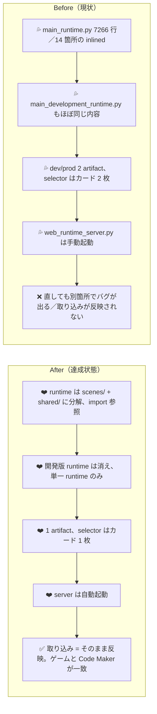

# 2026年4月22日 J53 runtime monolith 分解と dev/prod 単一化

> 状態：`in-progress`
> 次のゲート：（ユーザー）各フェーズ完了ごとに PR / コミットを確認する

---

## 1) 改善対象ジャーニー

- **根拠となるカスタマージャーニー**：`CJ26 「自分たちのゲーム」と言えるようになる`
- **関連するカスタマージャーニー**：`CJ22`, `CJ23`, `CJ24`, `CJ37`
- **深層的目的**：親子が直したい場所を直せる、直したものがそのまま届く
- **やらないこと**：ゲーム内 UI の変更、画面遷移の変更、新機能追加

### 人間の期待

- **この note が `done` なら、人間は何が成立していると思うか**：
  - `main_runtime.py` が責務別に分かれ、一箇所の修正が他所を壊さない
  - 開発版 / 本番の二重管理が消え、親子は 1 つの artifact を見て判断する
  - `web_runtime_server.py` は自動起動しており、取り込み導線が常に server-first で成立する
  - 取り込んだ resource がそのままゲームでも Code Maker でも一致する
- **その期待を裏切りやすいズレ**：
  - `code-maker.zip` は単一 main.py を要求するので、分割と Code Maker 配布の両立が壊れやすい
  - `main_development_runtime.py` への inlined ブロックがもし残ると、分離廃止後も古い挙動が復活する
  - auto-start が「どの端末で起動するか」を曖昧にすると localStorage fallback が復活する
- **ズレを潰すために見るべき現物**：
  - `development/pyxel.pyxapp` / `development/code-maker.zip` の pyxres hash
  - `production/pyxel.pyxapp` / `production/code-maker.zip` の pyxres hash
  - 廃止後：`pyxel.pyxapp` / `code-maker.zip`（単一）の pyxres hash
  - `.runtime/codemaker_resource_imports/` の manifest
  - systemd user unit または autostart 設定が有効かの確認

### 現状

- `src/runtime/main_runtime.py` が 7266 行、Game クラスだけで 2500 行ほど。`chiptune_tracks.py` / `landmark_events.py` / `player_factory.py` / `player_snapshot.py` / `save_store.py` / `browser_resource_override.py` / `sfx_system.py` / `scenes/dialog/model.py` / `audio_system.py` / `game_data.py` / `generated/dialogue.py` / `jp_font_data.py` / `input_bindings.py` が inlined されている
- `src/shared/services/*` と `src/scenes/*` に抽出済みのモジュールがあるが、runtime は inlined コピーを使っている（二重管理）
- `main_development_runtime.py` は `main_runtime.py` のコピー＋開発版差分。dev/prod は artifact レベルでも `development/` / `production/` に分かれる
- selector は 2 カード（開発版・本番）、取り込み UI 付き。`tools/web_runtime_server.py` は手動起動

### 今回の方針

- runtime は **import 参照**に切り替え、inlined は全廃
- `code-maker.zip` 用に `tools/build_codemaker.py` を **import 解決 → concat する bundler** に書き換える（単一 main.py を生成する責務はここだけに集約）
- dev/prod 分離（`main_development.py` / `main_development_runtime.py` / `DevelopmentCandidate` / `development_meta.json` / `development/` 配信 / `build_development_release` / `approve_development` / `reject_development`）は削除
- selector はカード 1 枚（play + import + download）
- `web_runtime_server.py` を systemd user unit で自動起動
- import した resource は `assets/blockquest.pyxres` を直接書き換える（ブラウザ fallback は廃止）

### 委任度

- 🔴 責務境界の再設計と全 build パイプライン書き換えが絡む。フェーズごとにユーザーの目視確認を挟む

---

## 2) カスタマージャーニーgherkin（完了条件）

### シナリオ1：正常系（取り込みから一致確認まで）

> 🧱 Given: server が自動起動していて、selector が単一カードで表示されている。🎬 When: 親が selector から Code Maker zip を取り込む。✅ Then: `pyxel.pyxapp` と `code-maker.zip` の pyxres hash が一致し、子どもが遊んで見える見た目と、Code Maker で開いた見た目が一致する。

### シナリオ2：異常系（取り込み前）

> 🧱 Given: 取り込みがまだで、`assets/blockquest.pyxres` が git の base のまま。🎬 When: 親子が selector を開く。✅ Then: カードは 1 枚、`pyxel.pyxapp` と `code-maker.zip` はどちらも base resource を含み、開発版カードは出ない。

### シナリオ3：回帰確認（Code Maker 配布）

> 🧱 Given: runtime を import 参照に分解済み。🎬 When: `python tools/build_codemaker.py` を実行する。✅ Then: 生成された zip 内の `block-quest/main.py` は依存を全部含んだ単一ファイルで、Code Maker 上で起動する。

### 対応するカスタマージャーニーgherkin

- `CJG22: フィードバックから修正と再共有が数分で回る`
- `CJG23: Code Maker の Sprite エディタで編集した見た目がそのまま出る`
- `CJG24: Sound エディタで編集した音がゲーム内で使われる`
- `CJG26: 持ち出した開発版は今見ている開発版そのものである`
- `CJG37: build は人が編集した resource をそのまま届ける`

---

## 3) Design（どうやるか）

- **関連スキル・MCP**：`manage-tasknotes`, `steer-development`, `systematic-debugging`, `test-driven-development`, `verification-before-completion`
- **MCP**：追加なし

### 調査起点

- `src/runtime/main_runtime.py`（7266 行）
- `src/runtime/main_development_runtime.py`（7328 行、削除予定）
- `src/shared/services/*`（import 先）
- `src/scenes/*`（import 先）
- `tools/build_codemaker.py`（bundler 化）
- `tools/build_web_release.py` / `tools/resolve_release_source_of_truth.py` / `tools/build_release_artifacts.py`（dev/prod 分離削除）
- `tools/web_runtime_server.py`（autostart 対象）
- `templates/selector.html` / `templates/codemaker_import_ui.js`（1 カード化、fallback 削除）
- `test/test_build_web_release.py` / `test/test_build_codemaker.py` / `test/test_architecture_layout.py`（回帰固定）

### 実世界の確認点

- **実際に見るURL / path**：
  - `http://127.0.0.1:8899/index.html`（フェーズ 3 以降は単一カード）
  - `assets/blockquest.pyxres`（取り込み後は直接書き換わる）
  - `pyxel.pyxapp` / `pyxel.html` / `code-maker.zip` / `play.html`（単一 artifact）
  - `.runtime/codemaker_resource_imports/manifest.json`（dev 文脈は消える）
  - `~/.config/systemd/user/code-quest-runtime.service`（autostart）
- **実際に動いている process / service**：
  - `python tools/build_codemaker.py`（bundler として単体実行可）
  - `python tools/build_web_release.py`（単一 build のみ）
  - `systemctl --user status code-quest-runtime.service`
- **実際に増えるべき file / DB / endpoint**：
  - `tools/codemaker_bundler.py`（または `build_codemaker.py` 内に実装）
  - `tools/systemd/code-quest-runtime.service` または `infra/autostart/` 下のユニット
  - 既存 `development/` 配信と関連テスト削除

### 検証方針

各フェーズで Red → Green。

- **Phase 1 (inlined 解体)**：`main_runtime.py` の inlined ブロックを `from src.shared...` に置換。`src.runtime.main_runtime` を import した状態で `pytest` を走らせ、挙動が変わらないことを確認。pyxapp の package も通す
- **Phase 2 (bundler)**：`tools/build_codemaker.py` を bundler 化し、生成された `main.py` が **import を含まず単一モジュールで動く** ことを `ast.parse` + smoke run で固定する
- **Phase 3 (dev/prod 廃止)**：`main_development.py` / `main_development_runtime.py` を削除し、`build_web_release.py` を単一 build のみに。selector は `templates/selector.html` を 1 カード化。`test/test_build_web_release.py` は単一 build 前提に書き換え
- **Phase 4 (autostart)**：systemd user unit を提供し、再ログイン後に server が起動していることを `systemctl --user status` で確認
- **Phase 5 (CJ26 本線)**：既存の `20260422-cj26-distribute-loaded-resource.md` を再開し、**実 artifact 一致**（hash 比較）regression テストを追加

---

## 4) Tasklist

### Phase 1: inlined 解体（main_runtime.py → shared/scenes import 参照）

- [ ] P1-1: `from src.shared.services.browser_resource_override import stage_browser_imported_resource` に置換し inlined ブロック削除
- [ ] P1-2: `from src.shared.services.input_bindings import ...` に置換し inlined ブロック削除
- [ ] P1-3: `from src.shared.services.save_store import ...` に置換し inlined ブロック削除
- [ ] P1-4: `from src.shared.services.audio_system import ...` に置換し inlined ブロック削除
- [ ] P1-5: `chiptune_tracks` を `src/shared/services/chiptune_tracks.py` に新規抽出し import 化
- [ ] P1-6: `landmark_events` を `src/shared/services/landmark_events.py` に統合（既存 service と突き合わせ）し import 化
- [ ] P1-7: `player_factory` を `src/shared/services/player_factory.py` に新規抽出し import 化
- [ ] P1-8: `player_snapshot` を `src/shared/services/player_snapshot.py` に新規抽出し import 化
- [ ] P1-9: `sfx_system` を `src/shared/services/sfx_system.py` に新規抽出し import 化
- [ ] P1-10: `scenes/dialog/model.py` は既存 `src/scenes/dialog/model.py` に一本化し import 化
- [ ] P1-11: `game_data` は既存 `src/game_data.py` に一本化し import 化
- [ ] P1-12: `generated/dialogue` は既存 `src/generated/dialogue.py` に一本化し import 化
- [ ] P1-13: `jp_font_data` を `src/shared/assets/jp_font_data.py` に抽出し import 化
- [ ] P1-14: Game クラス本体は `src/runtime/game.py` に分離し `main_runtime.py` は薄い entry に
- [ ] P1-15: `python -m pytest test/ -q` を緑に戻す

### Phase 2: code-maker.zip bundler 化

- [ ] P2-1: `tools/codemaker_bundler.py` を新規作成（`ast` で `src.*` の import を解決し 1 ファイルに concat）
- [ ] P2-2: `tools/build_codemaker.py` を bundler を呼ぶ薄いラッパーに
- [ ] P2-3: 生成 main.py が `ast.parse` 可能で `import src.` を含まないことを test で固定
- [ ] P2-4: Code Maker で実際に起動するか smoke 確認（手動 1 回、note に記録）

### Phase 3: dev/prod 分離を廃止

- [ ] P3-1: `main_development.py` / `src/runtime/main_development_runtime.py` を削除
- [ ] P3-2: `tools/resolve_release_source_of_truth.py` の `DevelopmentCandidate` 関連を削除
- [ ] P3-3: `tools/build_release_artifacts.py` の development artifact 生成を削除（production → 単なる root 配置に統一する再設計）
- [ ] P3-4: `tools/build_web_release.py` から `build_development_release` / `approve_development` / `reject_development` を削除
- [ ] P3-5: `templates/selector.html` をカード 1 枚に
- [ ] P3-6: `templates/codemaker_import_ui.js` から localStorage fallback を削除し server 到達不可なら失敗表示
- [ ] P3-7: `src/shared/services/browser_resource_override.py` を削除（もう不要）
- [ ] P3-8: `tools/web_runtime_server.py::rebuild_after_codemaker_resource_import` を単一 build 前提に簡素化。import した resource は `assets/blockquest.pyxres` に直接書き込む
- [ ] P3-9: `development_meta.json` / `top_changes.json` の役割を再定義（`top_changes.json` は残す）
- [ ] P3-10: `test/test_build_web_release.py` / 関連 test を単一 build 前提に書き換え
- [ ] P3-11: `development/` / `production/` 配下の生成物を root 直下 or `dist/` に統一（方針をここで決めて note に追記）
- [ ] P3-12: `python -m pytest test/ -q` を緑

### Phase 4: サーバー自動起動

- [ ] P4-1: `infra/autostart/code-quest-runtime.service`（systemd user unit）を追加
- [ ] P4-2: `README` もしくは `CLAUDE.md` に有効化手順（`systemctl --user enable --now ...`）を記載
- [ ] P4-3: 再ログイン後 `systemctl --user status` が `active (running)` を返すことを確認

### Phase 5: CJ26 本線（再開）

- [ ] P5-1: `20260422-cj26-distribute-loaded-resource.md` を再開
- [ ] P5-2: 取り込み後の `pyxel.pyxapp` と `code-maker.zip` の pyxres hash 一致 regression を追加
- [ ] P5-3: 取り込み → server rebuild → reload → 一致、の live 確認
- [ ] P5-4: CJ26 note を `done` に

---

## 5) Discussion（記録・反省）

### 2026年4月22日 23:54（起票）

**Observe**：
`main_runtime.py` の責務が大きすぎ、inlined と shared の二重管理で「直してもバグが出る」状態。dev/prod 分離が「取り込んだものが反映されているか」の判断を複雑化している。server が手動起動なので import 経路が localStorage fallback に落ちるリスクも残る。

**Think**：
`CJ26` の好循環を安定させる最短ルートは、**runtime を責務別に分解 → 2版並列を廃止 → server を常時化**して、1 artifact / 1 resource / 1 サーバーまで簡素化すること。Code Maker 配布の単一 main.py 要件は bundler に閉じ込める。

**Act**：
本 note を起票し、旧 `project_approval_queue_policy.md` メモリを反転（`project_single_distribution_policy.md` に差し替え）。既存 `20260422-cj26-distribute-loaded-resource.md` は本 note の Phase 5 で再開する前提で paused にする。
