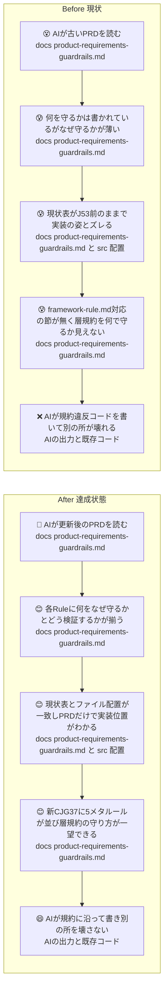
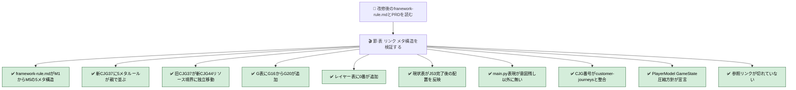
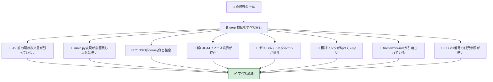
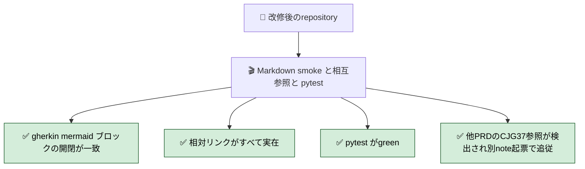

# 2026年4月24日 product-requirements-guardrails.md を現状と framework-rule.md に同期する

> 状態：(3) Design（Gherkin・Design を 5 メタ構造に書き直し完了 2026-04-24）
> 次のゲート：実装へ。town note の実装後に本 note の実装（PRD 書き換え）に着手する

---

## 1) 改善対象ジャーニー

- **根拠となるカスタマージャーニー**：（未設定。`docs/framework-rule.md` を規約根拠とし、`docs/customer-journeys.md` の現行 CJ 定義と PRD の整合性を取る）
- **関連するカスタマージャーニー**：（未設定）
- **深層的目的**：AI がガードレールに求められていることと、その理由を、**PRD と framework-rule.md を読むだけ** で把握できる状態にする
- **やらないこと**：
  - 新しいガードレール仕様の *実装*（hook / lint / test の追加コーディング）。今回は PRD と framework-rule.md の文書更新に絞る
  - `docs/customer-journeys.md` の書き換え（PRD が一方通行で追従する）
  - `docs/product-requirements-*.md` の他の PRD（battle / narrative / av / map / platform）の中身更新。CJG 番号変更が波及するなら別 note を切る
  - 実装が PRD に追いついていない箇所の「実装側の手当て」。追加した規約は `未実装` 扱いで開始する

- **スコープに含める（文書更新のみ）**：
  - `docs/product-requirements-guardrails.md` の再構成
  - `docs/framework-rule.md` の **5 メタルール（M1〜M5）構造への再編成** — 本 note で 2026-04-24 に実施済み。PRD 側もこれに合わせて参照し直す

### 人間の期待

- **この note が `done` なら、人間は何が成立していると思うか**：
  - `docs/product-requirements-guardrails.md` を開いた AI が、**各 Rule について「何を守るか / なぜ守るか / どう検証するか」の 3 要素を一度に読み取れる**
  - 新 `CJG37` = **framework-rule.md 対応** として立っている。`docs/customer-journeys.md` の `CJ37: 責務が曖昧で直すほど別の所が壊れる`（L1013）と意味が一致
  - 新 `CJG37` は **1 節にまとめて 5 メタルール（M1〜M5）を親 Rule** として並べ、各親の下に framework-rule.md の該当子節（M*-*) へのリンクをぶら下げる構造。AI はメタ 5 本を読めば全体像を把握でき、詳細は子節に降りる
  - 旧 `CJG37`（コンテンツ・演出）の内容は、**新 `CJG44` = リソース境界** として独立番号で再配置されている（複数 CJ 跨ぎ表記ではなく単独番号）
  - 「現状と目標状態」表が J53（runtime monolith 分解）完了後の姿を反映している
  - 本文の `main.py` 表現が、意図残し（Code Maker 教材版 entry / 単一配信 wrapper / Web entry）を除き、実態の `src/runtime/` / `src/scenes/` / `src/shared/` に書き換えられている
  - `PlayerModel` 新設 / `GameState` 圧縮（framework-rule.md M4-4）の方針が PRD に宣言されている
  - PRD 内すべての `CJG` 番号が `customer-journeys.md` の現行 `CJ` 定義と整合
  - ガードレール一覧表 G に、**5 メタに対応する G16〜G20 の 5 行** が追加されている（各行の実装手段欄に子ルール対応の hook/lint の束を列挙。12 個に分解しない）。実装状況はすべて `未実装` で開始
  - `docs/framework-rule.md` が **M1〜M5 の 5 メタルール構造** に再編成されている（実施済み 2026-04-24）
  - 参照切れリンク（`steering/20260411-j35-j36-gherkin-landing.md` 等）が `steering/done/` に修正されている
- **その期待を裏切りやすいズレ**：
  - 5 メタルール + 子ルールを PRD と framework-rule.md の両方に書くと冗長になる
    - 対策：PRD は **メタ 5 本を中心に検証 Scenario** を書き、子ルールの詳細は `docs/framework-rule.md` の該当節にリンクで飛ばす（二重管理を避ける）
  - `framework-rule.md` の規約を PRD にコピペしただけで、**なぜ守るか（理由）** が抜け落ちる
  - `main.py` 表現を機械的に置換して、残すべき文脈（Code Maker 教材版 / 単一配信 wrapper）まで壊す
  - 旧 `CJG37 = コンテンツ・演出` を新 `CJG44` に移す際、`G2` 等の旧 G 項目表の参照番号も更新し忘れて孤児化
  - framework-rule.md を M1〜M5 化したのに、本 note / town note 側の「2節・5節・11節」といった旧章番号参照が残る
- **ズレを潰すために見るべき現物**：
  - `docs/product-requirements-guardrails.md`
  - `docs/framework-rule.md`（M1〜M5 の 5 メタ構造 + 付録。2026-04-24 に書き換え済み）
  - `docs/customer-journeys.md`（CJ 番号の現行定義、特に L953〜L1200）
  - `src/runtime/{main_runtime.py, app.py}` / `src/scenes/*/` / `src/shared/services/*` / `src/shared/services/game_state.py`（「現状」表の根拠）
  - `main.py`（Code Maker 側の entry）、`templates/` / `production/`（単一配信 wrapper）
  - `steering/done/`（参照切れリンクの移動先）



### 現状

- 現 PRD を読んだ AI は「何を守るか」はある程度わかるが、「**なぜ守るか**」と「**どの検証手段で守るか**」が層規約（framework-rule.md 対応）について書かれていない
- J53 完了後の実態と合っていない箇所が複数：
  - 「現状と目標状態」表：「データ定義は `main.py` / `src/game_data.py` に Python 辞書で直書き」「`load_*()` が `main.py` 内に多く残る」。実際は `src/runtime/{main_runtime.py, app.py}` + `src/shared/services/*.py` + `src/scenes/<scene>/{model,presenter,view}.py` に分割済み
  - 本文全体で `main.py` 表現が残る（AI能力境界表、CJG38-39 の Background、複合改造シナリオ など）
  - `CJG37 = コンテンツ・演出（見た目・音）` と定義されているが、`customer-journeys.md` の `CJ37: 責務が曖昧で直すほど別の所が壊れる`（L1013）と意味がズレている
  - `framework-rule.md`（MVP規約）に対応するガードレール節が無い。M1〜M5 の規約（Pyxel API / 入力 / View / Presenter / Model / 共有状態 / テスト・命名）を守る Rule / Scenario が PRD に欠落
  - `PlayerModel` 新設・`GameState` 圧縮（framework-rule.md M4-4）の方針が PRD 側に未反映。メタ構造（CJG40）の `PlayerSnapshot` 言及にとどまる
  - 参照リンク `steering/20260411-j35-j36-gherkin-landing.md` が `steering/done/` に移動済みでリンク切れ
- 並行する別 note `steering/20260424-town-framework-rule-align.md` で `PlayerModel` 新設 / `GameState.current_town` 導入 / `town/scene.py` 廃止 を進める。その改修が PRD に反映されている必要がある

### 今回の方針

ユーザー決定（2026-04-24）を反映：

1. **Before/After の軸は「AI がガードレールに求められていることとその理由がわかる」** 状態の達成
2. **framework-rule.md 自体を 5 メタルール（M1〜M5）構造に書き換え**（本 note で実施済み 2026-04-24）
3. **新 `CJG37` = framework-rule.md 対応**。`customer-journeys.md` の `CJ37: 責務が曖昧で直すほど別の所が壊れる`（L1013）と意味を一致させる
4. **旧 `CJG37`（コンテンツ・演出）の内容** → **新 `CJG44` = リソース境界** として独立番号で再配置
5. **新 `CJG37` は 1 節にまとめる**。**5 メタルール（M1〜M5）を親 Rule** として並べ、各親の下に framework-rule.md の該当子節（M*-*) へのリンクをぶら下げる
6. **子ルールの詳細は framework-rule.md に一本化**。PRD 側は重複を避けるため、メタ 5 本の Rule 文 + Why + Scenario（grep 検証）+ 子節へのリンク、にとどめる
7. ガードレール一覧表 G に **G16〜G20 の 5 行**（5 メタに対応）を追加。各行の「実装手段」欄に子ルール対応の hook/lint の束を列挙する形にする（12 個に分解しない）
8. 対象は `docs/product-requirements-guardrails.md` + `docs/framework-rule.md` の **文書更新のみ**。hook / lint / test の実装は別 note
9. `customer-journeys.md` が正本。PRD は journeys に一方通行で追従
10. `main.py` 表現は文脈ごとに確認し、残すべき箇所（Code Maker 教材版 entry / 単一配信 wrapper / Web entry）は保持
11. PlayerModel / GameState 圧縮は **方針宣言のみ**。詳細実装事項は town note に任せる

### 委任度

- 🟢（ユーザー決定で主要な分岐は確定。framework-rule.md は実施済み。PRD 側は 5 メタ構造への整列なので機械的に進められる）

---

## 2) カスタマージャーニーgherkin（完了条件）

> 本 note は `docs/product-requirements-guardrails.md` と `docs/framework-rule.md` が **AI がガードレールに求められていることと理由を把握できる状態**に到達していることを完了条件にする。具体的には (1) framework-rule.md が M1〜M5 の 5 メタ構造、(2) 新 `CJG37` = framework-rule.md 対応として 5 メタルールが親 Rule で並ぶ、(3) 旧 `CJG37` の内容が新 `CJG44` = リソース境界 として独立番号で移されている、(4) 現状・customer-journeys・framework-rule.md の 3 点と整合している、の 4 点が揃うこと。シナリオは「同期が成立しているか」「古い表現が 0 件か」「PRD 全体が自己矛盾していないか」の 3 観点。

### シナリオ1：正常系（framework-rule.md が M1〜M5 構造、PRD 側も 5 メタで揃い、現状と customer-journeys に整合）

> 🧱 Given: 改修完了後の `docs/framework-rule.md` と `docs/product-requirements-guardrails.md`。
> 🎬 When: `grep` / 目視で節・表・リンクを検証する。
> ✅ Then: 次がすべて成立する：
>
> **(a0) `docs/framework-rule.md` が M1〜M5 の 5 メタルール構造**
> - 冒頭に「5 本のメタルール」の箇条書き（M1 Pyxel API と入力 / M2 View は ViewModel / M3 Presenter / M4 Model・共有状態 / M5 AI 検証可視化）が書かれている
> - 本文に `^# M1\. ` 〜 `^# M5\. ` の見出しが存在し、各見出し直下に **Rule 文 + Why** が書かれている
> - 各メタ配下に子節（`M1-1` `M1-2` 等）と「検証の目安」節が存在する
> - 末尾に旧章番号との対応表（旧 1〜12 章 → 新 M1〜M5 配下）がある
>
> **(a) 新 `CJG37` = framework-rule.md 対応の 5 メタルール（M1〜M5）が親 Rule として並ぶ**
> 新 `CJG37` 節に、親 Rule 5 本が順番通り並ぶ。各親は **Rule 文 / Why / Scenario（grep 検証）/ 子節へのリンク** の 4 要素：
>
> | # | 親 Rule（1 行） | ぶら下がる子節（framework-rule.md） | Scenario 検証概念（PRD 側に書く） |
> |---|---|---|---|
> | M1 | Pyxel API と入力は View と最外殻の 1 か所に閉じる | M1-1 / M1-2 / M1-3 | `grep 'pyxel\.'` が view.py と最外殻に限定、`grep 'pyxel\.btnp'` が Presenter/Model/View で 0 件 |
> | M2 | View は ViewModel しか見ない | M2-1 / M2-2 | View シグネチャが `vm: *ViewModel`、ViewModel に `_ratio` / `is_*` 等の解釈前フィールドが無い |
> | M3 | Presenter は入力解釈・Scene 遷移・副作用指揮のみ | M3-1 / M3-2 / M3-3 | Presenter に `pyxel.*` 描画呼び出しが無い、`game.state =` が Presenter 配下のみ |
> | M4 | Model は dataclass 中心、共有状態は明示（dict 新規 / 他 scene のぞき込み禁止） | M4-1 / M4-2 / M4-3 / M4-4 | `grep 'player\[.?["\x27]'` が 0 件（または `未実装` 宣言）、`grep '_scene\.model\.'` が対象 scene 以外で 0 件 |
> | M5 | 層規約は AI が自力で検証できる形で可視化する（命名・テスト・AI ガードレール文面） | M5-1 / M5-2 / M5-3 | `src/scenes/` 配下が命名規約に従う、Model / Presenter 単体テストが存在（または `未実装` 宣言） |
>
> 各親 Rule は「Rule 文 + Why（1 段落）+ Scenario（1 つ以上、grep / find / ファイル存在で検証可能）+ 子節リンク」で書かれる。子節の詳細は PRD で重複させず **framework-rule.md 側にリンクで飛ばす**（二重管理を避ける）。
>
> **(b) 旧 `CJG37`（コンテンツ・演出）→ 新 `CJG44` = リソース境界 に独立移動**
> - `^## CJG44` の節が存在し、「リソース境界（スプライト・サウンド authoring）」の内容（`.pyxres` 直接編集禁止 / Code Maker resource 互換 / imported Sound 上書き禁止 等）を保持している
> - `^## CJG37` の節は framework-rule.md 対応（上記 5 メタ）に置き換わっている
> - 旧 `CJG37` で参照されていた `G2` / `G4` / `G5` / `G6` の G 項目は、`CJG44` を参照する形に更新されている
>
> **(c) ガードレール一覧表 G に G16〜G20 の 5 行が追加**
> - 5 メタに対応する G 項目が表に並ぶ：
>   - `G16` M1 Pyxel API と入力の境界
>   - `G17` M2 View は ViewModel 限定
>   - `G18` M3 Presenter 責務と副作用コマンド化
>   - `G19` M4 Model dataclass と共有状態明示（PlayerModel / GameState 圧縮含む）
>   - `G20` M5 命名・テスト・AI ガードレール可視化
> - 各行の「実装手段」欄に、子ルール対応の hook/lint/test の束を列挙（例：`G16` に「`grep 'pyxel\.'` lint」「`pyxel.btnp` 直呼び検出」等）。実装状況はすべて `未実装` で開始
>
> **(d) 改造レイヤーの分類表に「0. 責務・構造」行が追加**
> - Layer 0（framework-rule.md 対応）が他レイヤー（Layer 1〜6）の前提として一番上に並ぶ
>
> **(e) 「現状と目標状態」表が J53 完了後の姿**
> - 「データ定義」行の *現状* 欄に `src/runtime/{main_runtime.py, app.py}` / `src/shared/services/*` / `src/scenes/<scene>/{model,presenter,view}.py` の現行配置が反映されている
> - 「ローダ」行の *現状* 欄に `src/shared/services/{image_banks, audio_system, save_store, world_generation, ...}` の抽出済み事実が書かれている
>
> **(f) 本文の `main.py` 表現が意図残し以外で書き換わる**
> - 残すのは Code Maker 教材版 entry / 単一配信 wrapper / Web entry のみ
> - それ以外は `src/runtime/main_runtime.py` / `src/runtime/app.py` / `src/scenes/<scene>/presenter.py` など実態に即した path に置換
>
> **(g) CJG 番号の整合（customer-journeys.md が正本）**
> - PRD 内すべての `CJG` 番号が `customer-journeys.md` の現行 `CJ` 定義と 1 対 1 で対応
> - 特に `CJG37 = CJ37 責務` / `CJG44 = CJ23+CJ24 リソース境界の派生` の対応が本文冒頭か対照表で明示されている
>
> **(h) PlayerModel / GameState 圧縮の方針宣言**
> - PRD 本文に PlayerModel 新設 / GameState 圧縮（framework-rule.md 付録 A / B）の方針が宣言されている
> - CJG40（メタ構造）節と新 CJG37（R10）節からこの方針が参照されている
>
> **(i) 参照リンクの修正**
> - `steering/20260411-j35-j36-gherkin-landing.md` 他、`steering/done/` 配下に移動済みのリンクがすべて修正されている
> - PRD が指すすべての相対パスが実在する



---

### シナリオ2：異常系（古い表現・孤児参照・Rule 漏れが 0 件）

> 🧱 Given: 改修完了後の `docs/product-requirements-guardrails.md`。
> 🎬 When: 以下の grep / find をすべて実行する。
> ✅ Then: 次がすべて成立する（該当件数 0 または条件を満たす）：
>
> **(A) J53 完了前の表現が残っていない**
> - `grep -nE 'main\.py.*Python 辞書で直書き' docs/product-requirements-guardrails.md` → 0 件
> - `grep -nE 'main\.py 内に多く残る' docs/product-requirements-guardrails.md` → 0 件
>
> **(B) `main.py` 表現が意図的残し以外にない**
> - `grep -nE 'main\.py' docs/product-requirements-guardrails.md` の各 hit を目視で確認し、残っているのは次のいずれかの文脈のみ：Code Maker 教材版 `main.py` / 単一配信 wrapper / Web entry
> - それ以外（例：「AI が main.py を編集した」「main.py の戦闘ロジック」等）は 0 件に置換
>
> **(C) CJG37 の割当が journey 側と整合**
> - `^## CJG37` 見出し行の意味が `customer-journeys.md` の `CJ37: 責務が曖昧で直すほど別の所が壊れる`（L1013）と一致
> - 旧「コンテンツ・演出」の内容が `CJG37` のまま残っていない（`CJG44` へ移動済み）
>
> **(D) 新 `CJG44 = リソース境界` が存在する**
> - `grep -nE '^## CJG44' docs/product-requirements-guardrails.md` → 1 件 hit
> - 旧 CJG37 の本文（`.pyxres` 直接編集禁止 / Code Maker resource 互換 / imported Sound 上書き禁止 等）が CJG44 配下に移植されている
>
> **(E) 新 CJG37 に 5 メタルール（M1〜M5）がすべて親 Rule として揃う**
> - `awk '/^## CJG37/,/^## CJG3[89]|^## CJG44/' docs/product-requirements-guardrails.md | grep -cE '^### M[1-5]\. |^\*\*M[1-5]\.'` が **5 以上**（節見出しの切り方に合わせて検出条件は調整）
> - M1 / M2 / M3 / M4 / M5 のいずれかが欠落していれば検出結果で不足がわかる
> - `grep -nE 'framework-rule\.md#m[1-5]' docs/product-requirements-guardrails.md` が 5 件以上 hit（各親 Rule から framework-rule.md の該当子節へリンクが張られている）
>
> **(F) 参照リンクが切れていない**
> - `grep -oE '\.\./[a-zA-Z0-9/_.-]+\.md' docs/product-requirements-guardrails.md | sort -u` で抽出した各相対パスについて `test -e docs/<path>` がすべて true
> - `steering/20260411-j35-j36-gherkin-landing.md` を直接参照していない（`steering/done/` 経由）
>
> **(G) framework-rule.md が PRD から引用されている**
> - `grep -nE 'framework-rule' docs/product-requirements-guardrails.md` が **5 件以上** hit（各親 Rule M1〜M5 の Why か Scenario かリンクで参照されている）
>
> **(H) PRD が自己参照で壊れていない**
> - `grep -oE 'CJG[0-9]+' docs/product-requirements-guardrails.md | sort -u` で列挙される各 `CJG` 番号が、PRD 内のどこかで見出し（`^## CJG`）として定義されている（孤児参照 0）
> - `grep -oE 'G[0-9]+' docs/product-requirements-guardrails.md` も同様に、一覧表で定義されている（少なくとも G1〜G20 が表内に存在）



---

### シナリオ3：回帰確認（既存ドキュメント / テストとの整合）

> 🧱 Given: 改修完了後の repository。
> 🎬 When: Markdown の整形確認 / 他 PRD との相互参照 / 既存 pytest を実行する。
> ✅ Then: 次がすべて成立する：
>
> - gherkin ブロック・mermaid ブロックの開始タグと終了タグの個数が一致している（`grep -c '^\`\`\`gherkin' docs/product-requirements-guardrails.md` と閉じタグの個数が合う）
> - PRD から `../docs/customer-journeys.md` / `../docs/framework-rule.md` / `../steering/done/*.md` 等への相対リンクがすべて実在
> - 既存テスト `python -m pytest test/ -q` が green（本 note は文書更新のみだが念のため確認）
> - 他の PRD（`product-requirements-battle.md` / `product-requirements-narrative.md` / `product-requirements-map.md` / `product-requirements-av.md` / `product-requirements-platform.md`）が旧 `CJG37` を参照している箇所を `grep -nE 'CJG37' docs/product-requirements-*.md` で検出し、内容が「コンテンツ・演出」想定なら **別 note 起票** で追従する（本 note では追従作業は行わない）



### 対応するカスタマージャーニーgherkin

- 新 `CJG37` は `customer-journeys.md` の `CJ37: 責務が曖昧で直すほど別の所が壊れる`（L1013）に対応する
- 新 `CJG44` は `CJ23: スプライトを自分で描く`（L253）と `CJ24: 効果音を自分で作る`（L276）に由来する派生ガードレール（AI 能力境界と authoring ツール境界の話）
- 完了条件は「PRD が AI から見て `求められていること + 理由 + 検証方法` の 3 要素を一度に読めるようになっている」ことで、journeys 側の gherkin を再利用せず PRD 視点（守る仕組み）で書き直す

---

## 3) Design（どうやるか）

- **関連スキル・MCP**：`manage-tasknotes` / `steer-development` / `write-prd`（PRD 編集規約の参照）
- **MCP**：追加なし（`grep` / `find` / `diff` / Markdown レンダリングだけで完結）

### 構成図

```mermaid
flowchart LR
    subgraph INPUT["インプット"]
        I1[現 docs PRD]
        I2[docs framework-rule.md]
        I3[docs customer-journeys.md]
        I4[src/runtime と src/shared と src/scenes の現状]
    end

    subgraph PROCESS["書き換え処理"]
        P0[framework-rule.mdをM1-M5構造に書き換え（済）]
        P1[CJG→CJ 対照表を作る]
        P2[現状表を J53 完了後の姿に更新]
        P3[main.py 表現を実態に置換]
        P4[CJG37を5メタ構造で新設しCJG44にリソース境界を独立移動]
        P5[PlayerModel GameState圧縮方針を追記]
        P6[G表に G16 からG20 の 5 行を追加]
        P7[参照リンクを done/ に修正]
    end

    subgraph OUTPUT["アウトプット"]
        O1[更新された docs PRD]
        O2[更新された docs framework-rule.md]
        O3[CJG対照表（この note 内）]
    end

    INPUT --> PROCESS --> OUTPUT
    classDef io fill:#e2e3f1,stroke:#3949ab,color:#000000;
    classDef proc fill:#fff3cd,stroke:#856404,color:#000000;
    classDef out fill:#d4edda,stroke:#155724,color:#000000;
    class I1,I2,I3,I4 io;
    class P0,P1,P2,P3,P4,P5,P6,P7 proc;
    class O1,O2,O3 out;
```



### 決定事項（Design フェーズの確定）

1. **framework-rule.md を M1〜M5 の 5 メタ構造に書き換え**（実施済み 2026-04-24）。旧 1〜12 章は各メタ配下の子節に再配置。旧章番号 → 新メタ位置の対応表を付録に追加
2. **新節の配置**：framework-rule.md 対応のガードレールは **新 `CJG37` として「責務が曖昧で直すほど別の所が壊れる」** で立てる（`customer-journeys.md` の `CJ37` L1013 と整合）
3. **新 CJG37 の内部構造**：1 節内に **M1〜M5 の 5 メタルールを親 Rule** として並べる。各親は `Rule 文 / Why / Scenario（grep 検証）/ 子節へのリンク` の 4 要素。子節の詳細は framework-rule.md 側に一本化（重複禁止）
4. **旧 CJG37（コンテンツ・演出）の扱い**：新 `CJG44 = リソース境界（スプライト・サウンド authoring）` として独立番号で再配置。`customer-journeys.md` の `CJ23: スプライトを自分で描く`（L253）と `CJ24: 効果音を自分で作る`（L276）に紐付く内容のため、CJ 番号はこの 2 つを引用（複数 CJ 跨ぎを単一の CJG 番号で扱う）
5. **改造レイヤーの分類表**に 1 行追加：`0. 責務・構造 (CJG37) — framework-rule.md 規約 — 横断（全レイヤーの土台）`。順序的には一番上に置く（他レイヤーの前提）
6. **ガードレール一覧表**に `G16-G20` の 5 行を追加（全て `未実装`）。各行の「実装手段」欄に子ルール対応の hook/lint/test の束を列挙：
   - `G16` M1: Pyxel API と入力の境界 — `grep 'pyxel\.'` lint / `pyxel.btnp` 直呼び検出
   - `G17` M2: View は ViewModel 限定 — View 関数シグネチャ型チェック / ViewModel 解釈済みレビュー
   - `G18` M3: Presenter 責務と副作用コマンド化 — `game.state =` 発生点の grep / コマンド化の段階導入
   - `G19` M4: Model dataclass と共有状態明示 — `player\[` grep / `_scene.model.` 他 scene 参照検出 / PlayerModel 移行チェック
   - `G20` M5: 命名・テスト・AI ガードレール可視化 — `src/scenes/<scene>/` 命名 find / Model/Presenter 単体テスト存在 / AGENTS.md 取り込み
7. **実装状況**：新設節 / 新設 G 項目はすべて `未実装` 扱いで開始する（hook/lint 未整備）。実装が進むごとに `部分実装` → `実装済み` に更新していく運用を明記
8. **現状表の書き換え粒度**：実際の `ls src/ src/runtime src/shared/services src/shared/state src/scenes` 結果を元に行単位で更新。行数・ファイル名に依存した数値表現は避け「`src/shared/services/` にサービス抽出済み」程度に留める
9. **customer-journeys.md 自体の書き換えはしない**。PRD 側を journeys に合わせる一方通行

### CJG → CJ 対照表（Design で確定、Tasklist で PRD に反映）

| 現 PRD CJG | 現 PRD 内容 | journeys 側 CJ | 同期後の PRD 見出し |
|---|---|---|---|
| CJG35 | 起動検証ゲート | CJ35 AIで修正したらエラーが出て動かない | 変更なし |
| CJG36 | データレベル | CJ36 データを変えたらバランスが崩壊した | 変更なし |
| **CJG37** | **コンテンツ・演出（見た目・音）** | **CJ37 責務が曖昧で直すほど別の所が壊れる** | **→ 新規 `CJG37`（framework-rule.md 対応、M1〜M5 の 5 メタルール）に差し替え**。旧内容は CJG44 へ移動 |
| （旧 CJG37 の内容） | コンテンツ・演出 | CJ23 / CJ24 | **→ 新 `CJG44 = リソース境界` として独立番号で再配置** |
| CJG38 | イベント・ロジック | CJ38 新しいイベントを追加したら既存が壊れた | 変更なし |
| CJG39 | システム・ルール | CJ39 システムを変えたらゲーム全体が壊れた | 変更なし |
| CJG40 | メタ構造・ゲームモード | CJ40 ゲームモードを追加したら収拾がつかなくなった | PlayerModel / GameState 圧縮方針（framework-rule.md M4-4）を追記 |
| CJG41 | 技術基盤・運用 | CJ41 技術基盤を変えたら配信できなくなった | 変更なし |

### 調査起点

- `docs/customer-journeys.md` L90〜L1200（CJ 定義一覧、特に CJ23 / CJ24 / CJ37）
- `docs/framework-rule.md` 全体（1〜12 節、付録 A / B / C）
- `docs/product-requirements-guardrails.md` 全体（置換対象）
- `src/runtime/{main_runtime.py, app.py}` / `src/scenes/` / `src/shared/services/` / `src/shared/state/`（現状表の根拠）
- `main.py`（Code Maker 教材版 entry）/ `production/` / `templates/`（単一配信 wrapper）
- `steering/done/`（参照切れリンクの移動先）

### 実世界の確認点

- **見る path**：
  - `docs/product-requirements-guardrails.md`（唯一の編集対象）
  - `docs/framework-rule.md` / `docs/customer-journeys.md`（参照のみ）
- **動かすコマンド**：
  - `grep -nE 'main\.py' docs/product-requirements-guardrails.md`（残存確認）
  - `grep -nE 'CJG[0-9]+' docs/product-requirements-guardrails.md | sort -u`（CJG 孤児参照確認）
  - `grep -oE '\.\./[a-zA-Z0-9/_-]+\.md' docs/product-requirements-guardrails.md | sort -u`（相対リンク抽出）→ 各 path について `test -e docs/<path>` で実在確認
  - `grep -c '```mermaid' docs/product-requirements-guardrails.md` / `grep -c '```$' docs/product-requirements-guardrails.md`（ブロック開閉の個数チェック）
  - `python -m pytest test/ -q`（念のため既存テスト確認）
- **増えるべき要素**：
  - PRD 内の新 `CJG37` 節（framework-rule.md 規約）
  - PRD 内の `G16`-`G21` 行
  - PRD 内の「現状と目標状態」表の現状欄の更新

### 検証方針

1. Gherkin シナリオ1 (a)〜(g) を順に PRD の diff 上で目視確認
2. Gherkin シナリオ2 (A)〜(F) の grep を全て実行し、マッチ 0 件を確認
3. Gherkin シナリオ3 の相対リンク実在確認と pytest 実行
4. 本 note 内の CJG→CJ 対照表と PRD 改修後の見出し割当が一致しているか目視照合
5. `git diff docs/product-requirements-guardrails.md` を自分で再読し、PRD 内で矛盾していないか確認

---

## 4) Tasklist

- [x] `docs/framework-rule.md` を M1〜M5 の 5 メタルール構造に書き換え（旧 1〜12 章を各メタ配下の子節に再配置、末尾に旧章→新メタ対応表を追記）
- [ ] `docs/customer-journeys.md` の現行 CJ 定義（特に CJ35-CJ42）を一覧化し、PRD 側 CJG 番号とのズレを表にする
- [ ] `docs/product-requirements-guardrails.md` の「現状と目標状態」表を J53 完了後の姿に書き換える
- [ ] 本文中の `main.py` 表現を、実態に合わせて `src/runtime/main_runtime.py` / `src/runtime/app.py` / `src/scenes/<scene>/*.py` に書き換える（ファイルごとに意味を確認。Code Maker 教材版 entry / 単一配信 wrapper / Web entry は残す）
- [ ] 旧 `CJG37`（コンテンツ・演出）の本文を PRD 内で新 `CJG44 = リソース境界` としてリネーム移動。旧 G2 / G4 / G5 / G6 の参照先を CJG44 に更新
- [ ] 新 `CJG37` 節を `framework-rule.md 対応（責務が曖昧で直すほど別の所が壊れる）` として新設。内部に M1〜M5 の 5 親 Rule を並べる：
  - M1: Pyxel API と入力は View と最外殻の 1 か所に閉じる
  - M2: View は ViewModel しか見ない
  - M3: Presenter は入力解釈・Scene 遷移・副作用指揮のみ
  - M4: Model は dataclass 中心、共有状態は明示する
  - M5: 層規約は AI が自力で検証できる形で可視化する
- [ ] 各親 Rule に `Rule 文 / Why / Scenario（grep・find・ファイル存在で検証可能）/ framework-rule.md#m* 子節へのリンク` の 4 要素を書く
- [ ] 改造レイヤーの分類表に `Layer 0 責務・構造 (CJG37)` 行を追加（他レイヤーの前提として最上段）
- [ ] ガードレール一覧表に `G16`〜`G20` の 5 行を追加（実装状況は全て `未実装`。実装手段欄に子ルール対応の hook/lint/test の束を列挙）
- [ ] `PlayerModel` 新設・`GameState` 圧縮（framework-rule.md M4-4）の方針を PRD メタ構造節（CJG40）と新 CJG37 M4 の双方から参照する形で追記
- [ ] 参照切れリンク（`steering/20260411-j35-j36-gherkin-landing.md` 他）を `steering/done/` への相対パスに修正
- [ ] 本 note 内・town note 内の framework-rule.md 章番号参照を新 M 番号に更新（`2 節 / 5 節 / 11 節` → `M3-1 / M3-2 / M5-1` 等）
- [ ] Gherkin シナリオ2 の grep 検証を全て実行し、マッチ 0 件を確認
- [ ] Gherkin シナリオ3 の Markdown smoke / 相対リンク実在 / pytest を実行
- [ ] 他 PRD（battle / narrative / map / av / platform）に旧 `CJG37` 参照があるか `grep -nE 'CJG37' docs/product-requirements-*.md` で検出。波及があれば別 note 起票（本 note スコープ外）
- [ ] `git diff docs/` を review し、framework-rule.md と PRD と note 内参照の整合性を目視確認

---

## 5) Discussion（記録・反省）

> Observe → Think → Act を刻む。未来の自分が復元できることが目的。

### 2026年4月24日 22:56（起票）

**Observe**：
- 並行する town refactor 作業の中で、`docs/product-requirements-guardrails.md` の鮮度問題が浮上
- PRD の「現状」表・`main.py` 表現が J53 完了前のまま、framework-rule.md 対応節が存在しない、CJG37 の割当が journeys 側と食い違う可能性、参照切れリンクあり
- town refactor note のスコープに含めると Gherkin も書き直しになるため別 note で切る

**Think**：
- 今回は PRD 文書の同期に絞る。ガードレール実装（hook/lint/test）は別 note に切り出す
- `PlayerModel` / `GameState.current_town` は town note 側で先に実装が進むので、PRD 側は方針宣言までにとどめる
- `customer-journeys.md` が正本。PRD はそれに追従する。journeys 書き換えは本 note の対象外

**Act**：
- `steering/20260424-guardrails-prd-framework-rule-sync.md` を `status: open` / `priority: normal` で起票
- 次ゲート：Journey 修正・承認 →「Gherkin」へ

### 2026年4月24日 23:25（メタ 5 構造への転換）

**Observe**：
- ユーザー判断：
  - Before/After 軸を「AI がガードレールに求められていることとその理由がわからない → わかる」に再設定
  - (1) 新 `CJG37` = framework-rule 対応、旧 `CJG37` 内容は `CJG44` = リソース境界 として独立番号で再配置（複数 CJ 跨ぎ不可、単独番号）
  - (2) 新 CJG37 は 1 節にまとめる
  - (3) framework-rule.md の 1〜12 章すべてを Rule 化（厳しめに、限界が見えるまで）
- 当初 12 Rule 並列で書く案を出したが、AI が読み飛ばすリスクをユーザーが指摘。1 段階メタな 3〜5 ルールに集約して下にぶら下げる構造に変更
- 結果、framework-rule.md が「結論2」で挙げていた 4 本を 1 本拡張した **M1〜M5 の 5 メタルール** を採用

**Think**：
- メタ 5 本に集約すると、AI は 5 行読むだけで全体像を把握でき、詳細は子節に降りる 2 段構造になる
- 二重管理を避けるため、子節の詳細は `docs/framework-rule.md` に一本化。PRD は親 Rule + Why + Scenario（grep 検証）+ 子節リンクに留める
- G 表も `G16〜G27` の 12 個案から `G16〜G20` の 5 個案に絞る。各行に子ルール対応の hook/lint の束を列挙する形に

**Act**：
- `docs/framework-rule.md` を M1〜M5 の 5 メタ構造に書き換え（旧 1〜12 章を各メタ配下の子節に再配置、旧章→新メタ対応表を付録に追加）
- 本 note の Journey（人間の期待 / 方針 / Before-After mermaid）を 5 メタ構造に合わせて更新
- 本 note の Gherkin（シナリオ1 (a) 12 Rule 表 → 5 メタ親 Rule 表、シナリオ1 (c) G 表 → G16〜G20、シナリオ2 (E) → 5 メタカウント）を書き直し
- 本 note の Design（決定事項 7 項目 → 9 項目に拡張、構成図に framework-rule.md 書き換えステップを追加、対照表の同期後見出しを 5 メタ構造に更新）を書き直し
- Tasklist を更新。framework-rule.md 書き換えは実施済みとしてチェック

**次ゲート**：town note の Design に進むか、あるいは town note 側の framework-rule.md 章番号参照を先に M 番号に更新するか判断する
