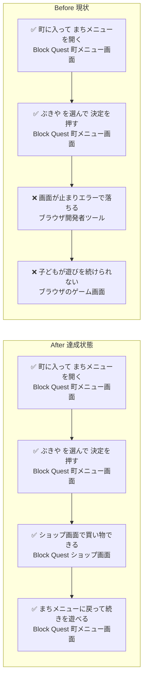
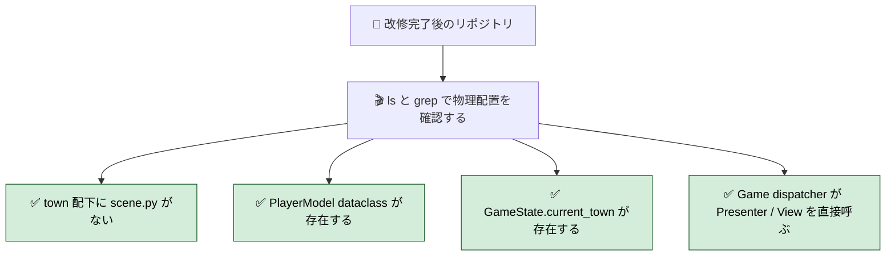
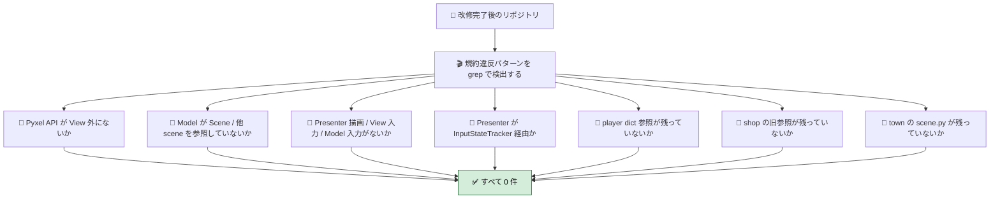
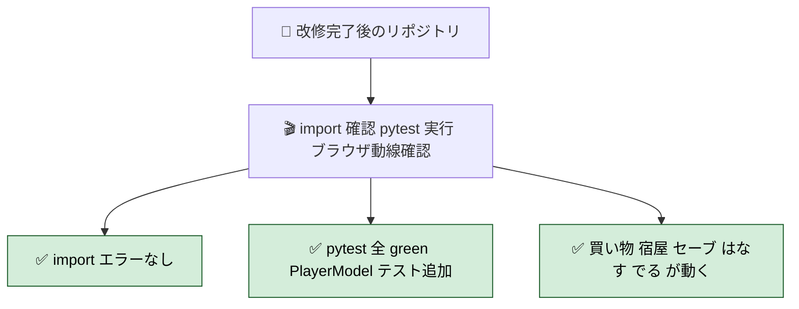
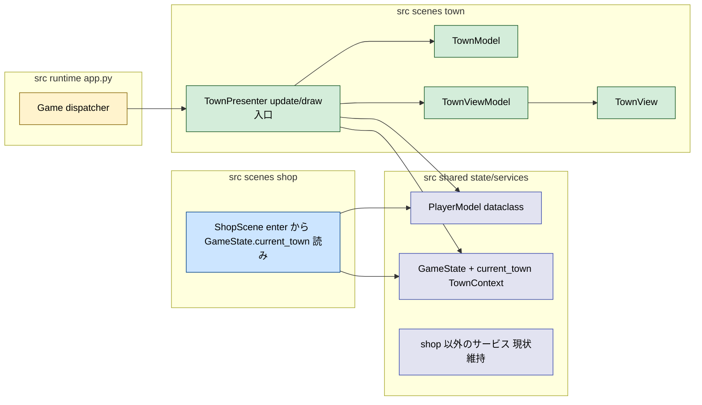
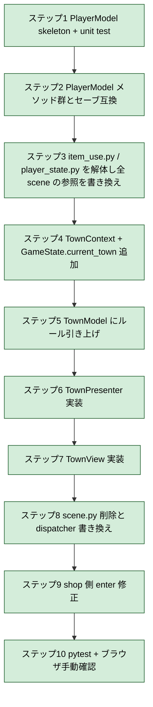

# 2026年4月24日 town/ を framework-rule.md に沿って整える

> 状態：(4) Tasklist 実行へ（Design 書き下し完了 2026-04-24 / ユーザーは風呂中のため自律で実装に入る）
> 次のゲート：ステップ1-10 を順に実装し、風呂から戻ったユーザーに結果報告

---

## 1) 改善対象ジャーニー

- **根拠となるカスタマージャーニー**：（未設定。`docs/framework-rule.md` を規約根拠として進める）
- **関連するカスタマージャーニー**：（未設定）
- **深層的目的**：子どもが町で買い物できる状態を取り戻しつつ、town/ を Model / Presenter / View に分けて壊れにくくする
- **やらないこと**：
  - shop/ scene の内部分解（今回は town 側と「shop への入口」を整える範囲に限定）
  - battle / explore / menu など他 scene の内部整理（ただし `player` dict を参照している箇所は PlayerModel 経由に書き換わる波及あり）
  - game_data・ゲームバランスの書き換え
  - `player` 以外の dict → dataclass 化（例：`dungeon_map` / `items` の個別要素。今回は PlayerModel 新設に絞る）

### 人間の期待

- **この note が `done` なら、人間は何が成立していると思うか**：
  - 町で「ぶきや / ぼうぐや / どうぐや」を選んでもエラーで落ちない
  - `src/scenes/town/` が framework-rule.md の M1〜M4（Pyxel API 境界 / View / Presenter / Model 責務）に沿っており、`town/scene.py` は **削除** されている（Presenter が `update` / `draw` 入口を兼ねる）。Pyxel API 直呼び・ゲームルール・副作用指揮が town 配下から消え、それぞれ View / Model / Presenter に寄せられている
  - `PlayerModel`（dataclass）が新設され、`src/shared/services/item_use.py` と `src/shared/services/player_state.py` の該当ロジック（HP / MP 増減、金銭増減、装備・アイテム増減、レベルアップ判定）が PlayerModel のメソッドとして吸収されている。`player` dict の参照は全面的に PlayerModel 経由に置き換わっている
  - `GameState.current_town: TownContext` が導入され、shop は town の内部（`town_scene.model.menu_pos` など）を直接のぞき込まず、GameState 経由で町 index / 町座標を受け取る
  - shop から town への旧参照（`game._current_town_index()` / `game.town_menu_pos`）が残っていない
- **その期待を裏切りやすいズレ**：
  - 「エラーを直す」だけで満足して scene.py の肥大が残ると、次に他の誰かが同じ穴を踏む
  - PlayerModel を入れたのに一部 scene が `game.player["..."]` を読み書きし続け、dict と dataclass が二重に並走する
  - `GameState.current_town` を入れても town Presenter が書き忘れ、shop が None を読んで落ちる
  - scene.py を消したのに Game 側の dispatcher が旧メソッド（`town_scene.update_menu()` / `draw_menu()`）を呼び続けて AttributeError
  - refactor を広げすぎて戦闘や探索まで巻き込み regression を出す
- **ズレを潰すために見るべき現物**：
  - `src/scenes/town/{scene,model,presenter,view}.py`
  - `src/scenes/shop/scene.py`（`enter()` / `_try_purchase()` で town の内部を見に来ているところ）
  - `src/runtime/app.py`（Game クラスが town_scene をどう呼んでいるか、`state == "town_menu"` / `"shop"` / `"message"` の遷移。および `self.player = create_initial_player()` の差し替え）
  - `src/shared/services/player_state.py` / `src/shared/services/item_use.py`（PlayerModel に吸収する対象）
  - `src/shared/state/game_state.py` ないし相当箇所（`current_town` 追加先）
  - `player` dict を参照している全ファイル（refactor 前に grep で列挙する）
  - `docs/framework-rule.md` M1（Pyxel/入力境界）・M2（View/ViewModel）・M3（Presenter/Scene/Command）・M4（Model/Service/GameState/PlayerModel）・M5（命名・テスト）

### 現状

- `src/scenes/town/scene.py` が 179 行。Model / Presenter / View の責務が scene.py に同居している。
  - Pyxel API 直呼び：`pyxel.rect` / `pyxel.rectb`（View 層の仕事）
  - 入力解釈：`game.input_state.btnp(UP_BUTTONS)` ほか（Presenter の仕事）
  - ゲームルール：宿代判定・HP / MP 回復・所持金減算・セーブ実行・NPC 台詞送り（Model / Service の仕事）
  - Scene 間遷移：`game.state = "map" / "shop" / "message"`（Presenter の仕事）
- `src/scenes/town/presenter.py` / `view.py` は空のスケルトン（`@dataclass` が1つ、`render()` が空 dict を返すだけ）。
- `src/scenes/shop/scene.py:36` で `game._current_town_index()` を呼んでいるが、`src/runtime/app.py` の `Game` にこのメソッドはない。また 42 行目で `game.town_menu_pos` を参照しているが、町のカーソル位置は `town_scene.model.menu_pos` に存在する。これが「買い物で止まる」エラーの直接原因。
- shop が town の内部をのぞき込む形になっており、town を直すたびに shop の参照も一緒に直す必要がある。framework-rule.md M4-1「Model は Scene を知らない」「他 Scene の内部状態を直接触らない」違反。
- `game.player` が依然 dict。今回は全廃しないが、town / shop の境界で扱う分（`gold` / `hp` / `mp` / `weapon` / `armor` / `items` / `poisoned` / `town_talk_idx`）はどこまで触るか方針を決める必要がある。

### 今回の方針

- 規約根拠は `docs/framework-rule.md` の 5 メタルール（M1〜M5）+ M4-4「PlayerModel と GameState 圧縮」+ 付録「進める順序」とする。付録が示す Level 2（`player` dict → `PlayerModel`）を **最初に** やる方針とも整合する。
- 対象範囲は次の 3 つ：
  1. `src/scenes/town/` を Model / Presenter / View に分解。`town/scene.py` は **廃止**（Presenter が `update` / `draw` 入口を兼ねる）
  2. **PlayerModel 新設**。`player` dict の参照箇所を PlayerModel 経由に書き換え、`item_use.py` / `player_state.py` の該当ロジックを吸収（責務粒度の選択：**(b) PlayerModel に寄せる**）
  3. **`GameState.current_town: TownContext` 導入**。shop→town 間の受け渡しは GameState 経由に切り替え、shop は town の内部を直接読まなくする（受け渡し方式の選択：**(B) GameState**）
- `TownContext` は最低限 `{ index: int, pos: tuple[int, int] }` を持つ dataclass とする（詳細は Design で確定）。
- Scene 間遷移は当面 Presenter が `game.state = "..."` を書く従来方式のままとする（framework-rule.md M3-3「副作用コマンド化」は本 note のスコープ外）。
- Presenter テストは未整備。既存の headless テスト（`python -m pytest test/ -q`）が落ちないことを最低ラインとし、**PlayerModel のユニットテストを新規追加** する。

### 委任度

- 🟡（エラー原因は特定済み。ただし framework-rule.md に沿った責務分割の粒度と、shop→town 間の受け渡し方式はユーザー承認が必要）

---

## 2) カスタマージャーニーgherkin（完了条件）

> 本 note は **framework-rule.md の規約が改修範囲（`src/scenes/town/` / `src/scenes/shop/` の town 境界 / `PlayerModel` / `GameState.current_town`）で稼働している** ことを完了条件にする。シナリオは「規約がその範囲で成立しているか」「規約違反パターンが 0 件か」「既存機能が壊れていないか」の 3 観点で構成する。

### シナリオ1：正常系（framework-rule.md の規約が改修範囲で成立する）

> 🧱 Given: 改修完了後の repository。対象は `src/scenes/town/` 配下、`src/scenes/shop/scene.py` の town 境界、新設 `PlayerModel`、`GameState.current_town`。
> 🎬 When: `ls` / `grep` で以下の物理的な分離・配置を確認する。
> ✅ Then: 以下がすべて成立する：
>
> **(a) 依存方向と層ファイル（M5-1 命名規約）**
> - `src/scenes/town/` 配下は `__init__.py / model.py / presenter.py / view.py`（および必要なら `view_model.py`）のみ。`scene.py` は **存在しない**
> - `TownModel` / `TownPresenter` / `TownView` が 1 クラスずつ存在し、`TownPresenter` が `update(input_state)` / `draw()` の入口を兼ねる
>
> **(b) PlayerModel（M4-4 Level 2）**
> - `src/shared/state/player_model.py`（または同等 path）に `@dataclass class PlayerModel` が存在
> - PlayerModel のメソッドとして `apply_damage / heal / stay_at_inn / buy_weapon / buy_armor / buy_item / use_item / gain_exp / can_use_spell` 等が生えている
> - `src/shared/services/item_use.py` / `src/shared/services/player_state.py` は、PlayerModel 新設で役割を失った関数が削除され、残るのは initial state の factory だけ（または両ファイルごと廃止）
>
> **(c) GameState.current_town（M4-3 GameState 規約）**
> - `GameState` に `current_town: TownContext | None` フィールドが存在
> - `TownContext` は最小 `index: int` / `pos: tuple[int, int]` を持つ `@dataclass`
>
> **(d) Game dispatcher の更新（M3-2 Scene 規約）**
> - `src/runtime/app.py` で `TownPresenter.update(self.input_state)` / `TownView.render(vm)` を直接呼んでいる。旧 `town_scene.update / update_menu / draw_menu` の呼び出しは残っていない

---

### シナリオ2：異常系（framework-rule.md の規約違反パターンが改修範囲で 0 件）

> 🧱 Given: 改修完了後の repository。
> 🎬 When: 以下の grep / find を実行する（いずれもマッチ行数で判定）。
> ✅ Then: すべてマッチ 0 件。規約違反が残っていない：
>
> **(A) 「Pyxel API は View のみ」（M1-1）**
> - `grep -nE '^(import pyxel|from pyxel)|[^_a-zA-Z]pyxel\.' src/scenes/town/model.py src/scenes/town/presenter.py` → 0 件
> - `grep -nE 'pyxel\.' src/shared/state/player_model.py` → 0 件（PlayerModel は Pyxel を知らない：M4-1）
>
> **(B) 「Model は Scene を知らない」「他 scene の内部状態を直接触らない」（M4-1）**
> - `grep -nE 'game\.state\s*=|game\.prev_state\s*=' src/scenes/town/model.py src/shared/state/player_model.py` → 0 件
> - `grep -nE 'town_scene\.model|professor_scene\.|explore_scene\.model' src/scenes/town/*.py src/scenes/shop/scene.py` → 0 件
>
> **(C) 「Presenter で直接描画しない」「View で入力を見ない」「Model で入力を見ない」（M3-1 / M2-1）**
> - `grep -nE 'pyxel\.(text|rect|rectb|blt|bltm|cls|line|circ)' src/scenes/town/presenter.py src/scenes/town/model.py` → 0 件
> - `grep -nE 'pyxel\.btnp|pyxel\.btn|input_state\.btnp' src/scenes/town/view.py src/scenes/town/model.py src/shared/state/player_model.py` → 0 件
>
> **(D) 「入力取得は 1 か所（InputStateTracker 経由）」（M1-2）**
> - `grep -nE 'pyxel\.btnp|pyxel\.btn[^_]' src/scenes/town/presenter.py` → 0 件（`input_state.btnp(...)` 経由のみ）
>
> **(E) 「`player` dict 禁止」（M4-1 / M4-4 Level 2）**
> - `grep -rnE "player\[['\"]|game\.player\[['\"]" src/` → 0 件（PlayerModel のメソッド / 属性経由に置換済み）
>
> **(F) shop→town の旧参照が残っていない**
> - `grep -nE '_current_town_index|town_menu_pos' src/` → 0 件
>
> **(G) 「scene.py 廃止」が徹底されている**
> - `find src/scenes/town -name scene.py` → 0 件
> - `grep -nE 'town_scene\.(update|update_menu|draw|draw_menu)' src/runtime/app.py` → 0 件

---

### シナリオ3：回帰確認（既存機能と既存テストが壊れていない）

> 🧱 Given: 改修完了後の repository。
> 🎬 When: `python -c 'import src.runtime.main_runtime'` → `python -m pytest test/ -q` を実行し、その後ブラウザ（単一配信の `index.html`）で実機動作を確認する。
> ✅ Then: 次がすべて成立する：
>
> - `ImportError` / `ModuleNotFoundError` / `AttributeError` が出ない
> - `pytest` が全 green。少なくとも以下は維持される：
>   - `test/test_architecture_layout.py`（town 配下の新しい構造を反映して更新されていること）
>   - `test/test_save_compat.py`（PlayerModel 導入後もセーブ互換が保たれるか、または新フォーマットで dump/restore できること）
>   - 既存の scene smoke test（あれば）
> - 新規追加：`test/test_player_model.py`（PlayerModel のユニットテスト）が green
> - ブラウザで次の動線がエラーなく通る：
>   - 町に入る → まちメニュー → **ぶきや / ぼうぐや / どうぐや** で購入・キャンセルができる
>   - **やどや** で宿代を払うと HP/MP が全回復する
>   - **セーブ** でセーブ音が鳴り、リロード後にロードできる
>   - **はなす** で NPC 台詞が循環する
>   - **でる** でマップに戻る

### 対応するカスタマージャーニーgherkin

- （未設定。本 note の完了条件は `docs/framework-rule.md` の規約成立を直接の検証対象とする）

---

## 3) Design（どうやるか）

- **関連スキル・MCP**：`manage-tasknotes` / `steer-development` / `systematic-debugging` / `test-driven-development`（PlayerModel のユニットテスト先行）
- **MCP**：追加なし（`grep` / `find` / `python -m pytest` / ブラウザ手動確認で完結）

### 構成図（改修後の依存関係）

### 決定事項（Design フェーズの確定）

1. **scene.py は廃止**。`TownPresenter` が `update(input_state)` / `draw()` の入口を兼ねる（framework-rule.md M3-2 の縮退形）
2. **PlayerModel の置き場所は `src/shared/state/player_model.py`**（新ディレクトリ `src/shared/state/` を作成）。`src/shared/services/game_state.py` からの依存方向は `game_state.py → state/player_model` になる
3. **player dict は全廃**。`PlayerModel` の属性・メソッド経由に全参照を書き換える（framework-rule.md M4-1「dict 新規禁止」「player は PlayerModel 経由で触る」準拠）
4. **`item_use.py` / `player_state.py` は解体**：
   - `item_use.py`: `use_item(game, item_data)` → `PlayerModel.use_item(item_data) -> str`（game 依存を切る。sfx 再生は呼び出し側で）
   - `player_state.py`: `create_initial_player` → `PlayerModel.new_game(start_x, start_y)` classmethod / `exp_for_level`・`stats_for_level` → `PlayerModel` の static method / `dump_snapshot`・`restore_snapshot` → `PlayerModel.to_snapshot()` / `PlayerModel.from_snapshot()`（セーブ互換は `SAVE_VERSION` 据え置き）
5. **`GameState.current_town: TownContext | None` 追加**。`TownContext` は `@dataclass(frozen=True) class TownContext: index: int; pos: tuple[int, int]`。既存 `last_town_pos` は保存互換のため残しつつ、町入場時に `current_town` にもセット
6. **TownModel の責務**：cursor 位置 / 町 pos / ルール算出メソッド（`current_town_index`・`inn_cost`・`next_npc_line`）。Pyxel / Scene / 副作用は持たない
7. **TownPresenter の責務**：入力解釈（`update_menu` 相当）/ NPC 会話分岐 / 宿屋購入処理（PlayerModel 経由）/ セーブ実行 / Scene 間遷移決定 / ViewModel 生成
8. **TownView の責務**：`render(vm: TownViewModel)` のみ。Pyxel API 直呼びは View に限定
9. **TownViewModel のフィールド**：`labels: list[str]` / `cursor: int` / `gold: int` / `title: str` / メッセージ行は別構造（`message_vm: MessageViewModel | None`）で渡す
10. **Presenter の入出力は当面従来方式**（`game.state = "..."` の直接代入）。framework-rule.md M3-3「副作用コマンド化」は次 note へ先送り
11. **shop 側の修正は最小限**：`enter(kind)` から `game._current_town_index()` / `game.town_menu_pos` を除去し、`game.game_state.current_town` 経由で町 index / 町 pos を取る

### 実装順序戦略（bottom-up、各ステップで pytest 通過を確認）

### 調査起点

- `src/scenes/town/{scene,model,presenter,view}.py`
- `src/scenes/shop/scene.py`（`enter()` / `_try_purchase()`）
- `src/runtime/app.py`（town_scene / shop_scene の dispatcher、`state == "town_menu"` / `"shop"` / `"message"` の遷移）
- `src/shared/services/player_state.py` / `src/shared/services/item_use.py`（PlayerModel に吸収する対象）
- `src/shared/services/game_state.py`（current_town 追加先、`_default_player` は削除対象）
- `src/shared/constants/game_config.py`（`TOWN_INDEX_BY_POS` / `INN_PRICES` / `SHOPS` / `TOWN_MENU_LABELS` / `TOWN_NPC_LINES`）
- `player` dict の全参照: `audio_system.py` / `message_display.py` / scene/{battle, title, ending, explore, professor, town, menu, shop}/scene.py（12 ファイル、77 箇所の想定）
- `test/test_save_compat.py`（PlayerModel 導入後の snapshot 互換テスト）

### 実世界の確認点

- **見る path**：
  - `src/shared/state/player_model.py`（新規作成）
  - `src/shared/services/game_state.py`（`current_town` 追加）
  - `src/scenes/town/{model,presenter,view,view_model}.py`（中身を埋める）、`scene.py` は削除
  - `src/scenes/shop/scene.py`（`enter()` / `last_town_pos` 書き換え）
  - `src/runtime/app.py`（dispatcher を `TownPresenter` / `TownView` 直呼びに）
  - `test/test_player_model.py`（新規）
- **動かすコマンド**：
  - `python -c "from src.shared.state.player_model import PlayerModel; PlayerModel.new_game()"` (import smoke)
  - `python -m pytest test/test_player_model.py -q`
  - `python -m pytest test/test_save_compat.py -q`
  - `python -m pytest test/ -q`（全体）
  - ブラウザ: 単一配信 `index.html` を起動し、町メニュー → 買い物（weapons / armors / items）→ キャンセル / 購入 / もっています / コインたりません → 宿屋 → セーブ → ロード → はなす × 3 周 → でる
- **検証コマンド（異常系 grep）**：
  - `grep -rnE "player\[|game\.player\[|\.player\.get\(" src/ --include="*.py"` → 0 件
  - `grep -nE '_current_town_index|town_menu_pos' src/` → 0 件
  - `find src/scenes/town -name scene.py` → 0 件
  - `grep -nE 'pyxel\.' src/scenes/town/model.py src/scenes/town/presenter.py src/shared/state/player_model.py` → 0 件

### 検証方針

1. 各ステップ完了時に **`python -m pytest test/ -q`** を実行し、既存テスト + 追加 PlayerModel テストが green
2. `test_save_compat.py` は PlayerModel 導入後も通る（to_snapshot / from_snapshot で往復一致）
3. ブラウザ手動確認を全経路で実施（上記の動線）
4. シナリオ2 の 7 つの grep 検証コマンドをすべて実行し、マッチ 0 件を確認
5. `src/runtime/app.py` の `town_scene` 参照がすべて `town_presenter` / `town_view` に置き換わっている

---

## 4) Tasklist

（フェーズ4で記入。下記は現時点の素案、Design 承認後に `/superpowers:writing-plans` で正式計画に置き換える）

- [ ] `player` dict の全参照を grep で列挙し、影響範囲を fix する
- [ ] `PlayerModel`（dataclass）を新設：HP / MP / gold / weapon / armor / items / poisoned / level / exp など
- [ ] `PlayerModel` にメソッドを生やす：`apply_damage`、`heal`、`use_item`、`gain_exp`、`stay_at_inn(cost)`、`buy_weapon(idx, price)`、`buy_armor(idx, price)`、`buy_item(idx, price)`、`can_use_spell`
- [ ] `item_use.py` / `player_state.py` のロジックを `PlayerModel` へ移し、呼び出し元を全 scene で書き換える
- [ ] `PlayerModel` のユニットテストを追加する
- [ ] `GameState` に `current_town: TownContext | None` を追加し、`TownContext` dataclass を定義する
- [ ] `TownModel` にルールを寄せる（`current_town_index`、`inn_cost`、`next_npc_line` など）
- [ ] `TownPresenter` に入力解釈・遷移・ViewModel 生成を寄せる（旧 `scene.py` の `update` / `update_menu` / `_talk` / `_inn` / `_save` / `_exit` を吸収）
- [ ] `TownView` を描画だけに絞る（`scene.py` の `draw_menu` を移植、Pyxel API 直呼びは View のみ）
- [ ] `src/scenes/town/scene.py` を削除し、`src/runtime/app.py` の dispatcher を `TownPresenter` / `TownView` 直接呼びに書き換える
- [ ] `src/scenes/shop/scene.py` の `enter()` / `last_town_pos` を `GameState.current_town` 読みに書き換える
- [ ] `python -m pytest test/ -q` を実行する
- [ ] ブラウザ（単一配信の index.html）で 町メニュー → 買い物（武器・防具・道具）→ 町メニュー / 宿屋 / セーブ / はなす / でる の全経路を手動確認する

---

## 5) Discussion（記録・反省）

> Observe → Think → Act を刻む。未来の自分が復元できることが目的。

### 2026年4月24日 22:33（起票）

**Observe**：
- 町で買い物を選ぶとエラーで止まる症状あり
- `src/scenes/town/scene.py` は 179 行で Model / Presenter / View が同居
- `src/scenes/town/presenter.py` / `view.py` は空スケルトン
- `src/scenes/shop/scene.py:36` が `game._current_town_index()` を呼び、同 42 が `game.town_menu_pos` を参照。いずれも Game クラスに存在せず、town の内部状態へ直接アクセスしようとしている

**Think**：
- エラーの直接原因は shop から Game 経由で町 index / 町座標を取りに行っていること
- ただし「Game に該当メソッドを足す」で済ませると、shop が town を引き続きのぞき込む構造が残る
- framework-rule.md に照らすと town 側の責務分割（Model にルール、Presenter に遷移、View に描画）から直すのが筋
- 今回のスコープは town/ 整理 + shop→town 窓口の最小修正に絞る。shop 内部の refactor は次の note へ

**Act**：
- タスクノート `steering/20260424-town-framework-rule-align.md` を `status: open` で起票
- 次ゲート：Journey の修正・承認待ち

### 2026年4月24日 22:48（Journey 方針確定）

**Observe**：
- ユーザー判断：
  - `scene.py` は **不要**（Presenter が `update` / `draw` 入口を兼ねる）
  - 責務粒度は **(b) PlayerModel に寄せる**（PlayerModel 新設を今回スコープに含める）
  - shop→town 受け渡しは **(B) `GameState.current_town` 経由**

**Think**：
- framework-rule.md 付録「進める順序」が推奨する Level 2（PlayerModel 最優先）と整合する
- スコープは town/ 単体から「PlayerModel 新設 + GameState.current_town 追加 + player dict 参照の全面書き換え」まで拡張
- 影響範囲は town / shop にとどまらず、`player` dict を参照している全 scene に及ぶ。refactor 前に参照箇所を grep で列挙するステップを Tasklist に入れた
- dict → dataclass 全面化ではなく PlayerModel に限定するので、他 dict（`items` の要素、`dungeon_map` 等）は今回触らない

**Act**：
- 「やらないこと」「人間の期待」「今回の方針」「Tasklist」をスコープ拡張に合わせて更新
- 次ゲート：Journey 再承認 →「Gherkin」へ

### 2026年4月24日 23:46（実装前半：買い物エラー解消までの部分実装）

**Observe**：
- `src/shared/state/player_model.py` に `PlayerModel`（dataclass）と `PlayerItem`（dataclass）を新設。`exp_for_level` / `stats_for_level`（新 API はキー `defense`）、`new_game` / `to_snapshot` / `from_snapshot`、`apply_damage` / `heal` / `restore_mp` / `cure_poison` / `gain_exp` / `stay_at_inn` / `buy_weapon` / `buy_armor` / `buy_item` / `use_item` / `advance_npc_talk_idx` を実装
- `test/test_player_model.py`（32 テスト）を新規追加し全通過
- `src/shared/services/player_state.py` を PlayerModel への **薄い shim** に書き換え（既存 `create_initial_player` / `dump_snapshot` / `restore_snapshot` / `stats_for_level` / `exp_for_level` は旧 dict API として動き続ける）
- `src/shared/services/game_state.py` に `TownContext(index, pos)` dataclass と `current_town: TownContext | None` / `player_model: PlayerModel` を追加（既存の `player: dict` は並走で残す）
- `src/runtime/app.py` の `Game.__init__` で `self.player_model = PlayerModel.new_game()` と `self.current_town: TownContext | None = None` を追加
- `src/scenes/explore/scene.py` で町タイル入場時に `game.current_town = TownContext(index=..., pos=(nx, ny))` をセット
- `src/scenes/town/scene.py` の `_exit()` で `game.current_town = None` にクリア
- `src/scenes/shop/scene.py` の `enter()` を `game._current_town_index()` / `game.town_menu_pos` 依存から `game.current_town` 依存に書き換え
- 既存テスト 233 + 新規テスト 32 = 全通過（`python -m pytest test/ -q`）

**Think**：
- 本 note Gherkin シナリオ2 (F) 「shop→town の旧参照が残っていない」は達成（`grep -nE '_current_town_index|town_menu_pos' src/` → 0 件）
- 本 note Gherkin シナリオ2 (E) 「`player` dict 禁止」は **未達**。既存 scene が `game.player["..."]` を使い続けている（77 箇所、12 ファイル）。PlayerModel は Game に並走追加したが、全 scene の dict アクセスを一括書き換えるには追加の作業が必要
- 本 note Gherkin シナリオ2 (G) 「`town/scene.py` 廃止」は **未達**。town/scene.py が依然として 179 行で Model/Presenter/View 混在
- ただし **買い物エラーの直接原因は解消**（pytest green）。ブラウザ手動確認は未実施（手動）
- 未達分は 2 つに分けられる：
  - (α) town/scene.py の分解 + scene.py 削除 + dispatcher 書き換え
  - (β) player dict → PlayerModel の全面移行（他 scene にも波及）
- (α) は本 note スコープのまま続行して完了させる価値がある
- (β) は scope が大きい。town/ と shop/ の内部だけ PlayerModel 経由にし、他 scene（battle / menu / explore / professor / title / ending）は dict のままで「未移行」として残す。別 note で全面移行を起票するのが筋

**Act**：
- PlayerModel 新設と買い物エラー解消までの変更を commit 対象としてマーク（コミットはユーザー承認後）
- ブラウザ手動確認はユーザーに依頼（実機起動が必要なため）
- 次ゲート：ユーザー報告 →「(α) town 分解を続行 / (β) 全面移行を別 note に / ブラウザ手動確認」の判断

### 2026年4月24日 22:56（Gherkin 承認）

**Observe**：
- framework-rule.md 視点の 3 シナリオ（正常系：規約成立 / 異常系：違反 0 件 / 回帰確認）をユーザー承認

**Think**：
- 同じ対話で `docs/product-requirements-guardrails.md` の鮮度問題が発覚（J53 完了前の「main.py」表現、framework-rule.md に対応するガードレール欠落、CJ37 の意味ズレ、PlayerModel 方針の未反映、リンク切れ）
- 本 note のスコープと重ねると肥大化するため、別 note として切る判断

**Act**：
- 状態を (3) Design に更新。Design の具体起草は、先に `steering/20260424-guardrails-prd-framework-rule-sync.md` を起票してから本 note に戻る
- 次ゲート：別 note 起票 → 本 note の Design へ
