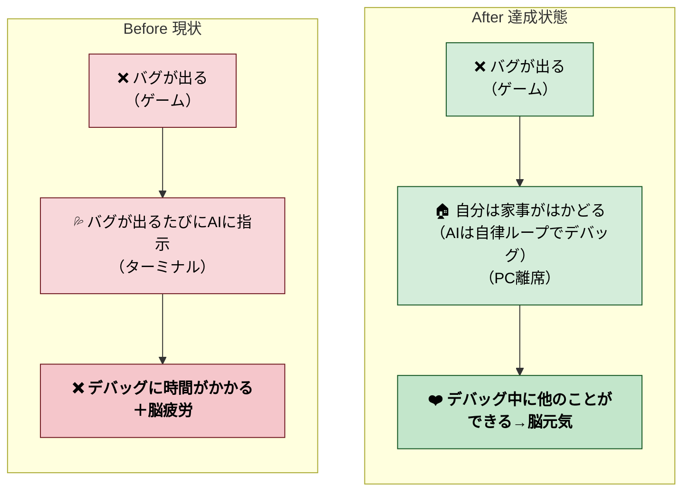
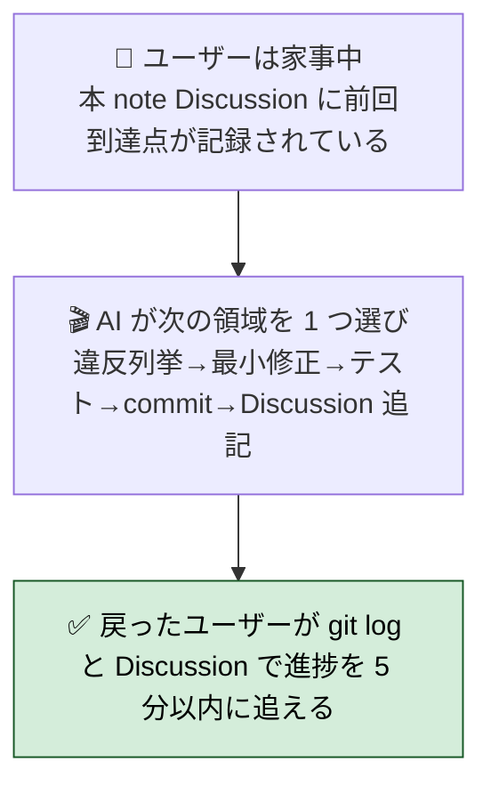
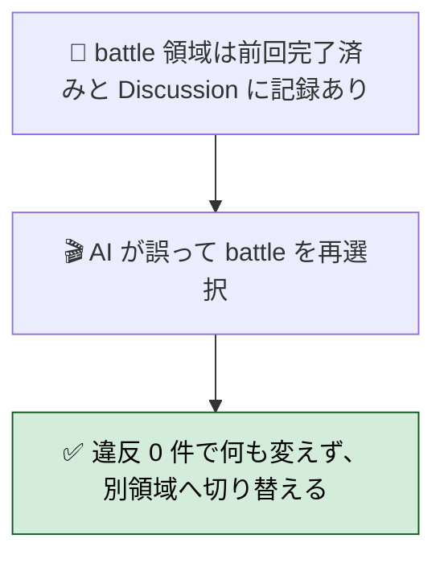
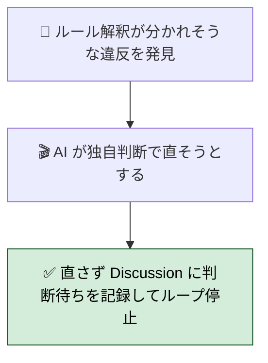
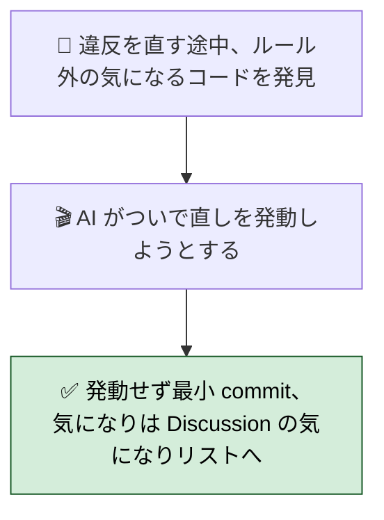

# 2026年4月25日 既存コードを最新ルール群に自律的に準拠させる（サイクリックループ）

> 状態：(2) Gherkin（Design 以降は未記入）
> 次のゲート：（ユーザー）Gherkin を確認して「Design」or「次」と指示

---

## 1) Journey（どこへ行くか）

- **深層的目的**：ルール準拠を自動で回す
- **やらないこと**：
  - ルール自体の変更・新規追加（本 note は既存ルールへの「準拠」のみ）
  - 新規機能追加・大規模 refactor（ルール違反修復に必要な最小範囲に絞る）
  - 1 ループで複数対象領域をまたいで大きく書き換える（領域は 1 つずつ）
  - 「これはルールに書いてないが気になる」系の自主判断修正

### 委任度

- 🟡（方針の骨格はユーザー承認が必要：**対象領域の選び方**と**1 ループの粒度**を Design で決めてから 🟢 に上げる）
- ループの中身自体（grep → fix → commit）は CC 単独で回せる想定。ただし **新しい種類の違反を見つけた時の判断**はユーザーに上げる必要がある

---

## 2) Gherkin（完了条件）

> 検証観点：「自律的に進められること」「同じ領域を踏んでも壊れないこと」「曖昧な時は手を出さず止まること」「気になっても scope を広げないこと」。
> いずれも **ユーザーは PC から離れている前提** で書く（家事・他仕事中）。

### シナリオ1：正常系（家事中に 1 ループ自走する）

> 🧱 Given: ユーザーは家事をしに PC から離れている。AI には事前に「ループを回して」と指示済み。本 note の Discussion 末尾に前回どこまで進めたかが記録されている。🎬 When: AI が次の対象領域を 1 つ選び、ルール違反を grep / pytest で列挙し、違反があれば最小範囲で修正 → テスト green を確認 → 1 commit → Discussion を追記する。✅ Then: ユーザーが家事から戻った時、`git log` と本 note の Discussion を順に見れば「どの領域でどのルールに対して何を直したか」と「次に判断が必要なら何を見ればよいか」が追える。

---

### シナリオ2：再試行系（同じ領域を踏んでも壊れない）

> 🧱 Given: 1 周目で `src/scenes/battle/` のルール違反を片付けたあと。Discussion に「battle: M1/M3 違反 0 件、完了」と記録されている。🎬 When: 2 周目に AI が誤って同じ `src/scenes/battle/` を再選択してしまう。✅ Then: 違反列挙の段階で 0 件と分かり、何も変更されない。Discussion に「battle は前回完了済み、別領域に切り替える」と書き、次のループは未着手領域を選ぶ。冪等。

---

### シナリオ3：異常系（曖昧な違反は手を出さず判断待ち）

> 🧱 Given: ある領域でルール解釈が分かれそうな箇所を見つけた。複数の修正方針が想定でき、AI 単独では妥当性を保証できない。🎬 When: AI が独自判断で「こう直すべき」と決めようとする瞬間。✅ Then: 直さずに Discussion に「曖昧なケース：具体的なファイル/行／想定される選択肢／ユーザー判断待ち」を残してループを停止。次にユーザーが戻った時に判断を仰いで再開する。

---

### シナリオ4：リスク確認（scope creep を起こさない）

> 🧱 Given: ルール違反を直していて、近くに「ルールには書かれていないが古くて気になるコード」を見つけた。🎬 When: AI が「ついで直し」を発動しようとする。✅ Then: 発動しない。違反箇所だけを最小範囲で 1 commit に閉じる。気になった箇所は Discussion の「気になりリスト」に記録するだけにとどめ、別 note 起票はユーザー判断に委ねる。

---

### 人間の期待

- **この note が（サイクルとして）機能している状態で、人間は何が成立していると思うか**：
  - 朝・夕に覗くと、**対象領域を 1 つ選び**→**ルール違反を列挙**→**最小修正 + テスト + commit** の痕跡が毎ループ残っている
  - 人間は「領域選択が適切か」「修正方針が妥当か」の 2 ゲートだけ見ればよい
  - ルール違反がゼロに近づいた状態が徐々に観測できる（grep ガードや architecture_layout test のヒット数が減る）
  - 家事・他仕事をしている間も作業が進んでいる（1 ループ = 30〜60 分想定、人間確認で次へ）
- **その期待を裏切りやすいズレ**：
  - 1 ループで大きな refactor を発動してしまい、レビュー負荷が跳ね上がる
  - ルール解釈を独自に広げて「ついで直し」を盛り込む（scope creep）
  - テスト green 優先で sloppy な fix（silent fallback / `try: ... except: pass` 等）を入れる
  - 領域選択が重なり、同じファイルを何周も触る
  - 途中で止まる（次にどう再開すべきか記録が残らない）
- **ズレを潰すために見るべき現物**：
  - `docs/framework-rule.md`（M1〜M5 の 5 メタルール）
  - `docs/product-requirements-guardrails.md`（PRD 側のルール参照）
  - `steering/done/` の過去 note（CJ / 改修スコープの粒度感）
  - `test/test_architecture_layout.py` 等のルール化済み自動テスト
  - さかのぼり note 3 本（`20260425-player-dict-residue-*` / `20260425-shop-keyerror-*` / `20260422-play-session-*`）に記録済みの grep レシピ
---

## 3) Design（どうやるか）

> 未記入（ユーザー Gherkin 承認後に起草する）。
>
> 現時点の案：
> - 1 ループの構造：**対象領域を決める → ルール上問題がないか調べる → あれば修正する**
> - 対象領域の選び方：`src/scenes/*` / `src/shared/services/*` / `tools/*` など粗粒度の単位から 1 つ。同じ領域を重複選択しないよう進捗を本 note に記録
> - 修正の粒度：1 ルール × 1 領域の違反を 1 commit で閉じる。framework-rule.md の M1〜M5 単位で分ける
> - ループ駆動：`/loop` 等で自動起動するか、手動で CC に「次のループを回して」と言うか。Design で決定

---

## 4) Tasklist

> 未記入（Design 承認後、`/superpowers:writing-plans` で正式計画に置き換える）

---

## 5) Result（成果物）

> ループで蓄積する成果物はここではなく各 commit / Discussion に残す

---

## 6) Discussion（記録・反省）

### 2026年4月25日 12:30（起票）

**Observe**：
- バグ連発セッションで 10 件修正 / 3 本のさかのぼり note 起票。
- ユーザーから「ルールが多くなってきた」「自律的に進めて欲しい」との要望
- 既存の tasknote はどれもゲート駆動で 1 往復型。サイクリック（繰り返し）型は本 note が初

**Think**：
- 「対象領域を決める／ルール点検／修正する」の 3 ステップを 1 サイクルにし、サイクルを繰り返す構造
- 自律性は Design で担保するが、Journey 段階では「どういう状態を目指すか」の合意が先
- 既存の 3 本さかのぼり note（player-dict / shop-keyerror / play-session）が規約化した grep レシピを、この自律ループがまさに検査ツールとして使える

**Act**：
- 本 note を `status: open` で起票、Journey のみ記入
- 次ゲート：ユーザー Journey 確認 → 「Gherkin」指示

### 2026年4月25日 13:00（Gherkin 起草）

**Observe**：
- ユーザーが Journey の Mermaid を編集：「バグ→AI に逐次指示→脳疲労」を Before、「バグ→AI が自律ループでデバッグ／自分は家事→脳元気」を After に。**焦点はバグ駆動の自律デバッグ** であることが明示された
- 「人間の期待」が Gherkin の subsection に移されている（Gherkin の検証観点を駆動する位置付け）

**Think**：
- ユーザーの実体験に近い書き出し（PC から離れている前提・帰ってきたら何が分かるか）でシナリオを 4 本起草
  1. 正常系：家事中に 1 ループ自走 → 戻ってきた人間が 5 分で進捗を追える
  2. 再試行系：同じ領域を踏んでも壊れない（冪等）
  3. 異常系：曖昧な違反は手を出さず Discussion に判断待ちを残して停止
  4. リスク確認：scope creep（ついで直し）を発動しない
- 「自律的に進められる」を観測可能にするには、**人間が戻ってきた時の追跡可能性** が鍵。git log + Discussion の二段で「何が起きたか」「次に何が必要か」が分かることを Then の核に置いた

**Act**：
- Gherkin セクションに 4 シナリオ（要約 + Mermaid）を記入
- status_changelog に Gherkin 起草を追記、状態を (2) Gherkin に
- 次ゲート：ユーザー Gherkin 確認 → 「Design」指示
