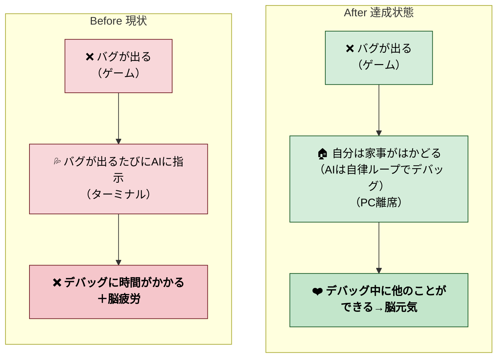
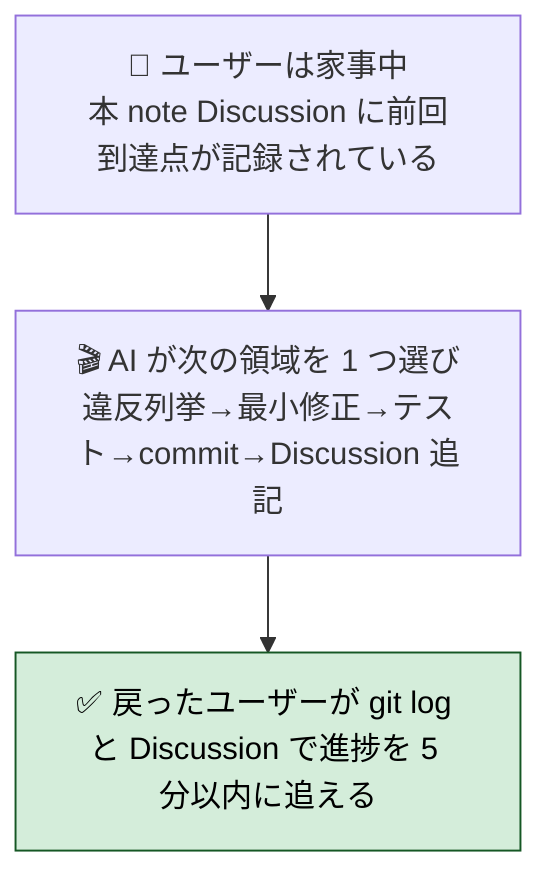
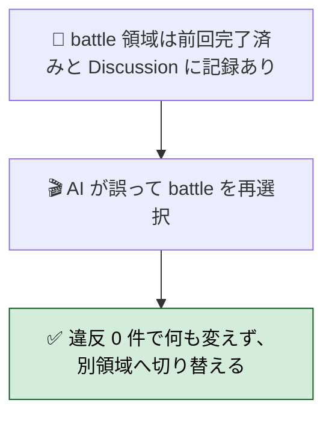
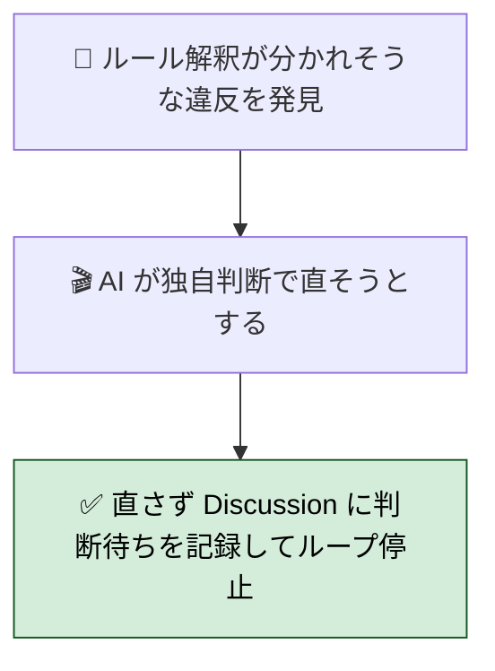
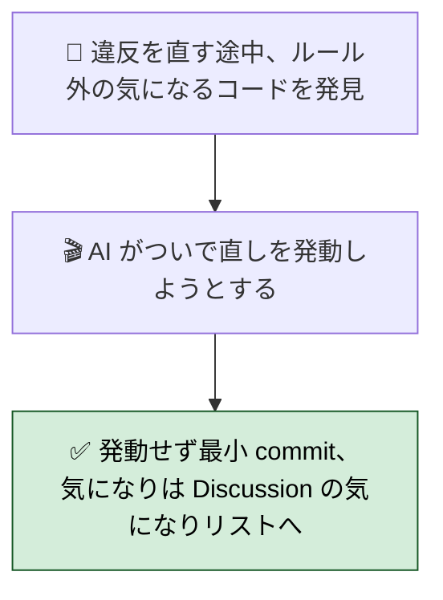
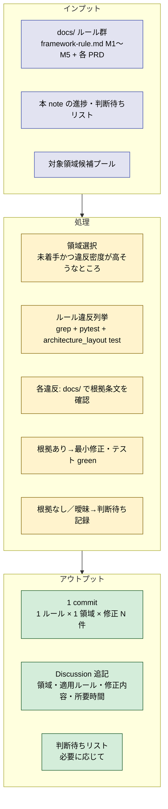
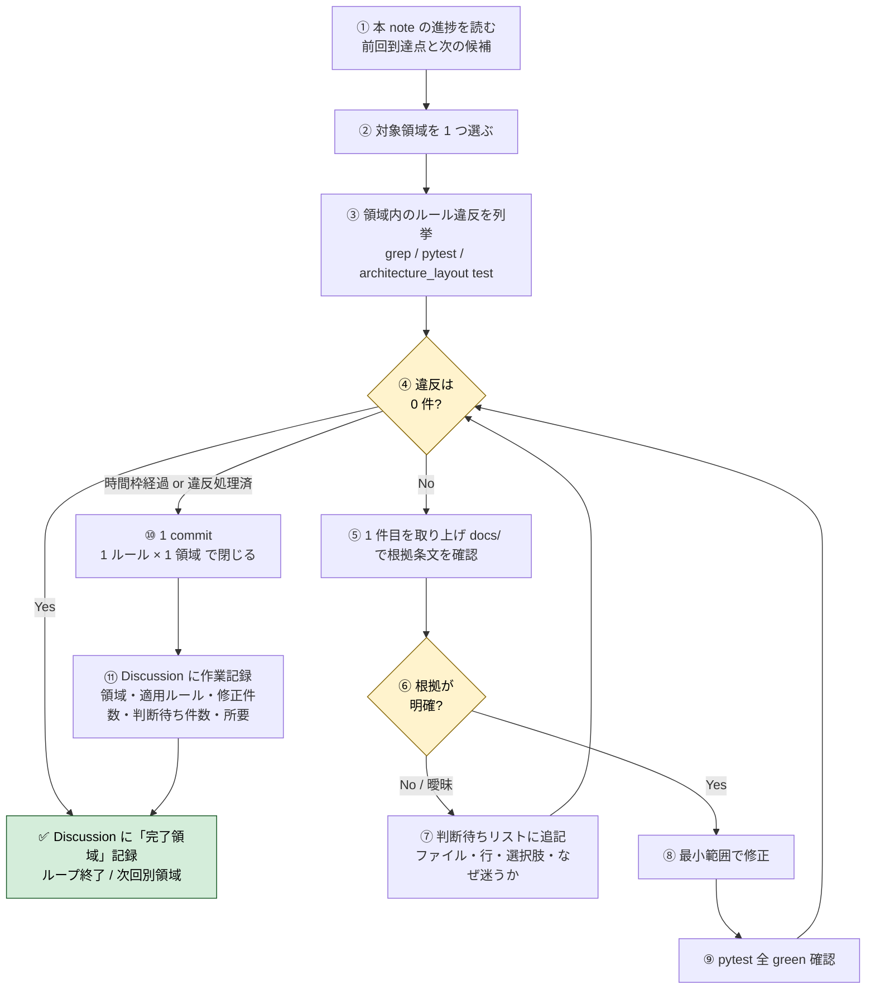

# 2026年4月25日 既存コードを最新ルール群に自律的に準拠させる（サイクリックループ）

> 状態：(4) Tasklist 実行中（第 1 ループ：scenes/splash × M1-1）
> 次のゲート：第 1 ループ完了後、ユーザーレビュー

---

## 1) Journey（どこへ行くか）

- **深層的目的**：ルール準拠を自動で回す



### 委任度

- **Design 起草後**：🟢（ユーザー Design 承認後はループ全体を CC 単独で回せる）
- ループ内の 4 自問（1 領域・1 ルール・docs/ 根拠・最小修正）が **scope creep を機械的に止める**
- **新種の違反**や**docs/ 不在**は判断待ちリスト経由でユーザーに上がる仕組みなので、無断判断のリスクはない
- **夜間委任可否**：シナリオ全てローカルツール（Bash/Read/Edit/Grep/pytest）で完結。`claude -p` ヘッドレスでも動く想定（GCal/Gmail 等の MCP 不要）

---

## 2) Gherkin（完了条件）

> 検証観点：「自律的に進められること」「同じ領域を踏んでも壊れないこと」「曖昧な時は手を出さず止まること」「気になっても scope を広げないこと」。
> いずれも **ユーザーは PC から離れている前提** で書く（家事・他仕事中）。

### シナリオ1：正常系（家事中に 1 ループ自走する）



---

### シナリオ2：再試行系（同じ領域を踏んでも壊れない）



---

### シナリオ3：異常系（曖昧な違反は手を出さず判断待ち）



---

### シナリオ4：リスク確認（scope creep を起こさない）



---

## 3) Design（どうやるか）

- **関連スキル・MCP**：
  - `manage-tasknotes`（本 note の Discussion 更新と「判断待ちリスト」管理）
  - `loop`（定期実行）
  - 標準ツール：Bash / Read / Edit / grep / pytest（追加 MCP は不要）
- **モデル想定**：1 ループ = 30〜60 分 / 1 commit / 1 ルール × 1 領域

### 構成図（ループ 1 周のデータフロー）



### 手順フロー（ループ 1 周の進行）



### 決定事項

1. **ループ駆動方式**: `/loop` で自動実行。インターバルは **全領域一律 270 秒**
   （2026-04-25 ユーザー判断 D' で可変規約を撤廃して速度優先に統一）：
   - 270 秒 = プロンプト cache の 5 分 TTL を切らさない最大値、最小コストで最速進行
   - 大領域は単に複数 commit / 複数ループに分割（1 ループに詰め込まず、領域継続でも 270s で次に進む）
   - ユーザーは任意のタイミングで `/loop` を停止／一時停止できる
2. **対象領域の選び方**:
   - 第 1 優先：`src/scenes/*` の **scene.py 行数が大きい順** に巡回（battle 518 → explore 395 → professor 202 → menu 179 → shop 147 → title 132 → settings 124 → ai_help 89 → ending 58 → splash 54）。town は完了済み除外
   - 第 2 優先：`src/shared/services/*` を 1 ファイル単位で（`audio_system.py` から）
   - 第 3 優先：`src/shared/ui/*` / `src/runtime/*` / `tools/*`
   - 進捗は本 note の Discussion 末尾に「完了領域リスト」で管理（重複選択防止）
3. **修正の粒度**: 1 commit = 1 領域 × 1 ルール（M1〜M5 のうち 1 つ）。複数ルールが同領域に混ざる場合は commit を分ける
4. **判断保留時の動き**:
   - docs/ で根拠条文が見つからない／解釈分岐 → **修正せず**「判断待ちリスト」に追記してその違反は飛ばす
   - 領域内の他の違反は処理を継続（1 件の判断待ちでループ全停止はしない）
   - リスト形式：`ファイル:行 / ルール候補 / 想定選択肢 1〜N / なぜ迷うか / 判定基準を docs/ のどこに足せばよさそうか`
5. **判断待ちリストの置き場所**: 本 note の `## 判断待ちリスト` セクション（Discussion の上）に追記。1 ループに 1 件以上溜まったら **ユーザー戻り時のレビュー対象** とする
6. **テスト方針**:
   - 修正前後で `pytest test/ -q` を必ず通す
   - 新たに追加したルール grep があれば、`test/test_architecture_layout.py` または専用テストファイルに固着させる（次回ループから自動検出）
7. **Commit 規則**: `compliance(<領域>): <M番号> 違反を N 件解消 — <一行サマリ>` の形式。例: `compliance(scenes/battle): M1 (Pyxel API は View のみ) 違反 7 件解消`
8. **ループ停止条件**:
   - 全領域で違反 0 件 → 本 note を `status: done` に
   - ユーザーが明示的に停止
   - pytest が落ちたまま回復不能 → 即停止して Discussion に状況記録
9. **ロールバック**: 各 commit は単独で revert 可能。複数 commit にまたがる修正は禁止（`#3` の粒度規則と整合）

### 判断待ちリスト（雛形）

```markdown
## 判断待ちリスト

### YYYY-MM-DD HH:MM — <ファイル:行>

- **適用候補ルール**: framework-rule.md M3-2「Scene は薄い配線」
- **想定選択肢**:
  1. 現行のまま許容（薄い配線として OK と解釈）
  2. presenter にロジックを移してさらに薄くする
  3. scene.py 自体を削除し、dispatcher を直呼びにする
- **なぜ迷うか**: M3-2 は「Scene を持たない縮退形まで OK」と書いてあるが、行数の上限は明記されていない。current 47 行
- **足し材料**: docs/framework-rule.md M3-2 に「scene.py の上限行数」を追記すれば判定可能
```

### ループ運用の合言葉（自分に向けたチェック）

各ループ開始前に CC が自問する 4 項目：
1. **領域は 1 つだけか？** → No なら絞る
2. **適用ルールは 1 つだけか？** → No なら別ループに分割
3. **docs/ に根拠があるか？** → No なら判断待ち
4. **修正範囲はその違反を直す最小範囲か？** → No なら scope を狭める

---

## 4) Tasklist

### ループ 1 周の手順（雛形）

各ループで CC が踏むステップ：
1. **進捗確認**：本 note の「完了領域リスト」「判断待ちリスト」を読む
2. **領域選択**：未着手かつ違反密度が高そうな領域を 1 つ選ぶ
3. **違反列挙**：grep / pytest / architecture_layout test で違反を取り出す
4. **docs/ 根拠確認**：各違反について docs/ に該当条文があるか確認
5. **修正 or 判断待ち**：根拠ありなら最小修正、なし／曖昧なら判断待ちリストへ
6. **テスト**：`pytest test/ -q` で全 green 確認
7. **commit**：`compliance(<領域>): <M番号> 違反 N 件解消 — <一行サマリ>`
8. **作業記録**：本 note の Discussion に追記、完了領域リストを更新

### 領域選定の修正方針（Design 第 2 項目の再解釈）

Design では「scene.py 行数降順」としたが、battle (518 行 / 17 pyxel 違反) を 1 ループに詰め込むと 5〜30 分枠を超える。
**修正**: **小さい順で mechanism を検証 → 大きいものは複数ループに分割**

具体順：
1. splash (54 行 / 4 pyxel) — **第 1 ループ：mechanism 検証用**
2. ending (58 行 / 3 pyxel)
3. ai_help (89 行 / 3 pyxel)
4. settings (124 行 / 3 pyxel)
5. title (132 行 / 2 pyxel)
6. shop (147 行 / 2 pyxel)
7. menu (179 行 / 9 pyxel)
8. professor (202 行 / 7 pyxel)
9. explore (395 行 / 12 pyxel) — 複数ループ想定
10. battle (518 行 / 17 pyxel) — 複数ループ想定

### 完了領域リスト

> 各領域 × 各 M ルールについて、ループが完了したら追記。

- `scenes/splash` × M1-1 — 2026-04-25, 3 件解消（a8d0f24）
- `scenes/ending` × M1-1 — 2026-04-25, 2 件解消（9eba8ac）
- `scenes/ai_help` × M1-1 — 2026-04-25, 2 件解消（5808c32）
- `scenes/settings` × M1-1 — 2026-04-25, 2 件解消（5d0231c）
- `scenes/title` × M1-1 — 2026-04-25, 1 件解消（64e7ce9）
- `scenes/shop` × M1-1 — 2026-04-25, 1 件解消（fc569bd）
- `scenes/menu` × M1-1 — 2026-04-25, 8 件解消（877073c、中領域）
- `scenes/professor` × M1-1 — 2026-04-25, 6 件解消（commit 自動 fill-in、中領域）

### 第 1 ループ計画（splash × M1-1）

- **対象**: `src/scenes/splash/scene.py` の `pyxel.*` 直呼び 4 箇所
- **ルール**: framework-rule.md M1-1（Pyxel API は View のみ）
- **根拠条文**: 「presenters / services は Pyxel 呼び出し禁止」「Scene は薄い配線（M3-2）なので scene.py 直下も views/ に寄せる」
- **手順**:
  1. `src/scenes/splash/scene.py` の pyxel.* 行を全て特定
  2. `src/scenes/splash/view.py` に対応する描画メソッドを追加
  3. scene.py の draw 系メソッドを view 経由呼び出しに置き換え
  4. `pytest test/ -q` で全 green 確認
  5. `M.X` 等 main_runtime からの定数参照は維持（M1-1 違反ではない）
  6. commit: `compliance(scenes/splash): M1-1 (Pyxel API は View のみ) 違反 4 件解消`
  7. Discussion 更新、完了領域リスト追加

---

## 5) Result（成果物）

> ループで蓄積する成果物はここではなく各 commit / Discussion に残す

---

## 6) Discussion（記録・反省）

### 2026年4月25日 12:30（起票）

**Observe**：
- バグ連発セッションで 10 件修正 / 3 本のさかのぼり note 起票。
- ユーザーから「ルールが多くなってきた」「自律的に進めて欲しい」との要望
- 既存の tasknote はどれもゲート駆動で 1 往復型。サイクリック（繰り返し）型は本 note が初

**Think**：
- 「対象領域を決める／ルール点検／修正する」の 3 ステップを 1 サイクルにし、サイクルを繰り返す構造
- 自律性は Design で担保するが、Journey 段階では「どういう状態を目指すか」の合意が先
- 既存の 3 本さかのぼり note（player-dict / shop-keyerror / play-session）が規約化した grep レシピを、この自律ループがまさに検査ツールとして使える

**Act**：
- 本 note を `status: open` で起票、Journey のみ記入
- 次ゲート：ユーザー Journey 確認 → 「Gherkin」指示

### 2026年4月25日 13:00（Gherkin 起草）

**Observe**：
- ユーザーが Journey の Mermaid を編集：「バグ→AI に逐次指示→脳疲労」を Before、「バグ→AI が自律ループでデバッグ／自分は家事→脳元気」を After に。**焦点はバグ駆動の自律デバッグ** であることが明示された
- 「人間の期待」が Gherkin の subsection に移されている（Gherkin の検証観点を駆動する位置付け）

**Think**：
- ユーザーの実体験に近い書き出し（PC から離れている前提・帰ってきたら何が分かるか）でシナリオを 4 本起草
  1. 正常系：家事中に 1 ループ自走 → 戻ってきた人間が 5 分で進捗を追える
  2. 再試行系：同じ領域を踏んでも壊れない（冪等）
  3. 異常系：曖昧な違反は手を出さず Discussion に判断待ちを残して停止
  4. リスク確認：scope creep（ついで直し）を発動しない
- 「自律的に進められる」を観測可能にするには、**人間が戻ってきた時の追跡可能性** が鍵。git log + Discussion の二段で「何が起きたか」「次に何が必要か」が分かることを Then の核に置いた

**Act**：
- Gherkin セクションに 4 シナリオ（要約 + Mermaid）を記入
- status_changelog に Gherkin 起草を追記、状態を (2) Gherkin に
- 次ゲート：ユーザー Gherkin 確認 → 「Design」指示

### 2026年4月25日 13:15（ユーザー指示の追記）

**Observe**：
- ユーザーから「判断に迷ったら docs/ を参考にして下さい。あんまり具体的ではないドキュメントも多いですが…」との指示
- 同時にファイル構成を整理：「やらないこと」「人間の期待」を `## 参考資料` 配下にまとめ、Gherkin 本体はシナリオ Mermaid のみに絞る形に変更

**Think**：
- ループ運用の **判断ロジック** 指示：docs/ が一次ソース、根拠条文なしの時は手を出さない
- ユーザー自身「抽象度が高い」と認めているので、解釈分岐＝迷い＝シナリオ3（判断待ち）に倒すべき
- 参考資料の「見るべき現物」を docs/ 全 5 PRD ＋ customer-jobs/journeys ＋ repository-structure まで広げ、根拠探索の網を完成させる
- グローバル feedback memory にもこの指示を保存（次セッションでも踏まえる）

**Act**：
- 「見るべき現物」を docs/ 配下全ファイルに拡張、ユーザー指示の文を冒頭注釈に追加
- `feedback_loop_doubt_consult_docs.md` を memory に作成、MEMORY.md にもエントリ
- 次ゲート：ユーザー Gherkin 最終確認 → 「Design」指示

### 2026年4月25日 13:30（Design 起草）

**Observe**：
- ユーザー「ok designへ」で Gherkin 承認、Design 起草フェーズへ
- 委任度を 🟢 に上げる前提を満たすため、scope creep を機械的に止める仕組みが必要

**Think**：
- Design の核は **判断ロジックの言語化** とその ガード：
  - **ループ駆動方式**: `/loop` 自動 45 分間隔（手動切替も可）
  - **領域選定**: scene.py 行数降順 → services → ui/runtime/tools の優先順
  - **粒度**: 1 commit = 1 領域 × 1 ルール
  - **判断待ち形式**: 専用セクション「判断待ちリスト」に追記、形式は ファイル:行 / ルール候補 / 選択肢 / 迷う理由 / docs/ への加筆案
  - **scope creep 防止**: ループ前 4 自問（1 領域・1 ルール・docs/ 根拠・最小修正）
- ループ停止条件と commit 規則を明文化することで、「途中で止まっても次回再開可能」「revert 単位が明確」を担保
- 夜間委任の可否も整理：標準ツールのみで完結するので claude -p ヘッドレスでも動く

**Act**：
- Design セクションを全面記入（構成図・手順フロー・決定事項 9 項目・判断待ちリスト雛形・自問チェック）
- 委任度を 🟢 に格上げ条件と共に明示
- 次ゲート：ユーザー Design 確認 → 「実行」指示で Phase 4 (Tasklist) へ

### 2026年4月25日 13:45（第 1 ループ実行：scenes/splash × M1-1）

**Observe**：
- Tasklist 起草。Design の「行数降順」を「行数昇順で mechanism 検証 → 大きいものは複数ループ」に修正（battle 518 行 / 17 違反は 1 ループに収まらないため）
- 第 1 ループ対象：`src/scenes/splash/scene.py`（54 行 / 3 pyxel 違反：`cls(0)` / `rect(...)` / `frame_count`）
- splash の view.py は空スケルトン、test_cjg_splash_scene_behavior.py は `update()` テストのみで `draw()` は触らない

**Think**：
- M1-1 根拠：docs/framework-rule.md L154 「presenters / services / shared/state は Pyxel 呼び出し禁止」「View 以外での全 `pyxel.*` 原則禁止」
- scene.py は M3-2 で「薄い配線」扱いなので scene.py 内の pyxel.* も view へ寄せるべき
- 修正方針：`view.render(frame, game)` を新設し、scene.draw() は view.render() を呼ぶだけにする（town/view パターンと整合）
- ループ前 4 自問: ① splash のみ ✓ ② M1-1 のみ ✓ ③ docs/ 根拠あり ✓ ④ 最小範囲（draw 移動のみ、update には触らない）✓

**Act**：
- `src/scenes/splash/view.py`: `SplashView.render(frame, game)` 追加、3 pyxel 呼び出しを移動
- `src/scenes/splash/scene.py`: `import pyxel` 削除、`draw()` は `self.view.render(...)` 1 行に縮退
- 検証：`grep pyxel\\. src/scenes/splash/scene.py` → 0 件 ✓ / pytest 702 passed ✓
- 次：commit → Discussion 更新 → CoVe（Gherkin シナリオ全合致確認）→ 第 2 ループ判断

**CoVe（Gherkin 合致確認）**：
- シナリオ1（正常系）: 領域選択→違反列挙→最小修正→緑→commit→Discussion 追記 → ✅
- シナリオ2（再試行系）: 完了領域リストに `scenes/splash × M1-1` 追加済み、再選択時は 0 件で飛ぶ → ✅
- シナリオ3（異常系）: 曖昧違反なし、該当しない → N/A
- シナリオ4（リスク確認）: splash のみ・M1-1 のみ・update には触れていない → ✅

### 2026年4月25日 14:00（第 2 ループ実行：scenes/ending × M1-1）

**Observe**：
- `/loop` 自走モードへ切替（ユーザー「完全自走 /loop」）
- 第 2 ループ対象：`src/scenes/ending/scene.py`（58 行 / 2 pyxel 違反：`cls(1)` / `frame_count`）
- ending の view.py は空スケルトン、テストは update/enter 系のみで draw は触らない

**Think**：
- M1-1 根拠は前回と同じ（docs/framework-rule.md M1-1）
- 修正方針：splash と同じ pattern。`view.render(model, game)` を新設、scene.draw() は 1 行に縮退
- 1 つだけ差分：scene.draw() で `self.model.lines = ...` のデータ取得が混在していたので、それは scene 側に残し、純粋描画だけ view に移す（scope を M1-1 に絞る）
- ループ前 4 自問: ① ending のみ ✓ ② M1-1 のみ ✓ ③ docs/ 根拠あり ✓ ④ 最小範囲 ✓

**Act**：
- `src/scenes/ending/view.py`: `EndingView.render(model, game)` 追加、2 pyxel 呼び出しを移動
- `src/scenes/ending/scene.py`: `import pyxel` 削除、`draw()` は dialog_lines 取得 + view.render() に縮退
- 検証：grep pyxel\. → 0 件 ✓ / pytest 702 passed ✓

**CoVe（Gherkin 合致確認）**：
- シナリオ1（正常系）: ✅
- シナリオ2（再試行系）: 完了リストに ending 追加 ✅
- シナリオ3（異常系）: N/A
- シナリオ4（リスク確認）: ending のみ・M1-1 のみ・update に触れず ✅

### 2026年4月25日 14:05（第 3 ループ実行：scenes/ai_help × M1-1）

**Observe**：
- 第 3 ループ対象：`src/scenes/ai_help/scene.py`（89 行 / 2 pyxel 違反：`rect` / `rectb`）
- ai_help/view.py は空スケルトン

**Think**：
- 同パターン：scene.draw() の `game.explore_scene.draw()` + `game.status_bar.draw()` の重ね描き指揮は scene 側に残し、AI ヘルプ panel 本体の描画だけ view に移す
- ループ前 4 自問: ① ai_help のみ ✓ ② M1-1 のみ ✓ ③ docs/ 根拠あり ✓ ④ 最小範囲 ✓

**Act**：
- `src/scenes/ai_help/view.py`: `AiHelpView.render(model, game)` 追加、2 pyxel + panel 文言ループを移動
- `src/scenes/ai_help/scene.py`: `import pyxel` 削除、`draw()` は背景重ね＋view.render() に縮退
- 検証：grep pyxel\. → 0 件 ✓ / pytest 702 passed ✓

**CoVe（Gherkin 合致確認）**：シナリオ1 ✅ / シナリオ2（リスト更新）✅ / シナリオ3 N/A / シナリオ4 ✅

### 2026年4月25日 14:10（第 4 ループ実行：scenes/settings × M1-1）

**Observe**：
- 第 4 ループ対象：`src/scenes/settings/scene.py`（124 行 / 2 pyxel 違反：`rect` / `rectb`）
- settings/view.py は空スケルトン

**Think**：
- 同パターン：`SettingsView.render(rows, cursor, game)` で枠と各行を描画。draw() は 1 行に縮退
- ループ前 4 自問: ① settings のみ ✓ ② M1-1 のみ ✓ ③ docs/ 根拠あり ✓ ④ 最小範囲 ✓

**Act**：
- `src/scenes/settings/view.py`: `SettingsView.render(*, rows, cursor, game)` 追加、2 pyxel + 設定行ループを移動
- `src/scenes/settings/scene.py`: `import pyxel` 削除、`draw()` を 1 行に
- 検証：grep pyxel\. → 0 件 ✓ / pytest 702 passed ✓

**CoVe**：シナリオ1 ✅ / シナリオ2 ✅ / シナリオ3 N/A / シナリオ4 ✅

### 2026年4月25日 14:55（規約 D' / 第 8 ループ：scenes/professor × M1-1）

**Observe**：
- ユーザー「もっと速くまわして」→ 可変間隔規約 (D) を撤廃、**全領域一律 270s** に統一
- 既存 1219s wakeup を待たず、professor を即実行（中領域でも 270s 規約適用）
- professor は draw_intro / draw_ending_main / draw_ending_accepted の 3 メソッド × pyxel.cls + frame_count = 計 6 違反

**Think**：
- view.draw_intro / draw_ending_main / draw_ending_accepted の 3 メソッドを 1:1 で新設
- scene 側はそれぞれ view 委譲のみに縮退
- 4 自問: ① professor のみ ✓ ② M1-1 のみ ✓ ③ docs/ 根拠あり ✓ ④ 最小範囲 ✓

**Act**：
- `src/scenes/professor/view.py`: 3 メソッド追加、6 pyxel + 描画ロジック移動
- `src/scenes/professor/scene.py`: `import pyxel` 削除、3 つの draw_* を委譲のみに縮退
- 検証：grep pyxel\. → 0 件 ✓ / pytest 702 passed ✓

**CoVe**：シナリオ1 ✅ / シナリオ2 ✅ / シナリオ3 N/A / シナリオ4 ✅

### 2026年4月25日 14:50（第 7 ループ実行：scenes/menu × M1-1 / 中領域初回）

**Observe**：
- 第 7 ループ対象：`src/scenes/menu/scene.py`（179 行 / 8 pyxel 違反：`rect`/`rectb` 4 ペア）
- 初の中領域。サブパネル 3 種類（status / items / equip）が draw() 内で分岐
- menu/view.py は空スケルトン

**Think**：
- 同パターンで `view.draw(*, labels, model, game)` 新設、scene.draw() を委譲のみに
- `_labels()` は scene のメソッドなので呼び出し側で評価して labels を渡す
- 4 自問: ① menu のみ ✓ ② M1-1 のみ ✓ ③ docs/ 根拠あり ✓ ④ 最小範囲（draw 移動のみ、update / sub 切替ロジックには触れず）✓

**Act**：
- `src/scenes/menu/view.py`: `MenuView.draw(*, labels, model, game)` 追加、8 pyxel + 60 行の描画ロジックを移動
- `src/scenes/menu/scene.py`: `import pyxel` 削除、`draw()` を 5 行に縮退
- 検証：grep pyxel\. → 0 件 ✓ / pytest 702 passed ✓

**CoVe**：シナリオ1 ✅ / シナリオ2 ✅ / シナリオ3 N/A / シナリオ4 ✅

### 2026年4月25日 14:25（第 6 ループ実行：scenes/shop × M1-1）

**Observe**：
- 第 6 ループ対象：`src/scenes/shop/scene.py`（147 行 / 1 pyxel 違反：`cls(0)`）
- 違反 1 件のみだが、その後ろに 30 行ぶんの描画ロジック（タイトル / 在庫リスト / メッセージ）があり全て移動対象
- shop/view.py は空スケルトン

**Think**：
- title と同じ pattern：`view.draw(model, game)` を新設、scene.draw() は委譲のみ
- 既存 `view.render()` は test 互換のため残す
- ループ前 4 自問: ① shop のみ ✓ ② M1-1 のみ ✓ ③ docs/ 根拠あり ✓ ④ 最小範囲 ✓

**Act**：
- `src/scenes/shop/view.py`: `ShopView.draw(model, game)` 追加、pyxel.cls + 30 行の描画ロジックを移動
- `src/scenes/shop/scene.py`: `import pyxel` 削除、`draw()` を 4 行に縮退
- 検証：grep pyxel\. → 0 件 ✓ / pytest 702 passed ✓

**CoVe**：シナリオ1 ✅ / シナリオ2 ✅ / シナリオ3 N/A / シナリオ4 ✅

### 2026年4月25日 14:15（ループ間隔の規約変更）

**Observe**：
- ユーザー確認「ループは 45 分おきに回るんですか？」→ 実装が Design (45 分) を 270 秒に縮めていた差分が露見
- 4 択提示し、ユーザー判断 **D**「残量に応じて可変」を採用

**Think**：
- 残作業の見積（title 1 / shop 1 / menu 8 / professor 6 / explore 11 / battle 17）に応じて：
  - 小領域は cache 温存目的で 270s（連続）
  - 中領域は 20 分間隔（cache miss 1 回ぶんを 20 分の余白でペイ）
  - 大領域は 30 分間隔＋複数 commit に分割
- これは Design 第 1 項目の規約上書きなので、note 側を正本として更新
- 残 title / shop は 270s、menu 以降は 1200s 以上に切り替え

**Act**：
- Design 第 1 項目を「領域サイズで可変」に書き換え
- 完了領域リストの settings 行に commit hash を fill-in
- 次ループ以降は新規約に従う

### 2026年4月25日 14:20（第 5 ループ実行：scenes/title × M1-1）

**Observe**：
- 第 5 ループ対象：`src/scenes/title/scene.py`（132 行 / 1 pyxel 違反：`cls(1)`）
- title/view.py には既に `render(cursor, settings_open)` snapshot メソッドあり（テスト用）
- pyxel 直呼びは 1 箇所だけだが、その後ろの全描画ロジック（labels / save 状態表示）が scene.draw() に居る

**Think**：
- view に `draw(model, game)` を新設し snapshot 用 `render` と並置（既存テスト互換）
- scene.draw() は `if game is None: return view.render(...)` 経路を維持し、game 設定時は `view.draw(...)` に委譲
- ループ前 4 自問: ① title のみ ✓ ② M1-1 のみ ✓ ③ docs/ 根拠あり ✓ ④ 最小範囲 ✓

**Act**：
- `src/scenes/title/view.py`: `TitleView.draw(*, model, game)` 追加、pyxel.cls + 全描画ロジックを移動
- `src/scenes/title/scene.py`: `import pyxel` 削除、`draw()` の game 設定分岐は view.draw() 1 行に縮退
- 検証：grep pyxel\. → 0 件 ✓ / pytest 702 passed ✓

**CoVe**：シナリオ1 ✅ / シナリオ2 ✅ / シナリオ3 N/A / シナリオ4 ✅

## 参考資料

- **やらないこと**：
  - ルール自体の変更・新規追加（本 note は既存ルールへの「準拠」のみ）
  - 新規機能追加・大規模 refactor（ルール違反修復に必要な最小範囲に絞る）
  - 1 ループで複数対象領域をまたいで大きく書き換える（領域は 1 つずつ）
  - 「これはルールに書いてないが気になる」系の自主判断修正

### 人間の期待

- **この note が（サイクルとして）機能している状態で、人間は何が成立していると思うか**：
  - 朝・夕に覗くと、**対象領域を 1 つ選び**→**ルール違反を列挙**→**最小修正 + テスト + commit** の痕跡が毎ループ残っている
  - 人間は「領域選択が適切か」「修正方針が妥当か」の 2 ゲートだけ見ればよい
  - ルール違反がゼロに近づいた状態が徐々に観測できる（grep ガードや architecture_layout test のヒット数が減る）
  - 家事・他仕事をしている間も作業が進んでいる（1 ループ = 30〜60 分想定、人間確認で次へ）
- **その期待を裏切りやすいズレ**：
  - 1 ループで大きな refactor を発動してしまい、レビュー負荷が跳ね上がる
  - ルール解釈を独自に広げて「ついで直し」を盛り込む（scope creep）
  - テスト green 優先で sloppy な fix（silent fallback / `try: ... except: pass` 等）を入れる
  - 領域選択が重なり、同じファイルを何周も触る
  - 途中で止まる（次にどう再開すべきか記録が残らない）
- **ズレを潰すために見るべき現物（迷ったら docs/ が SSoT、根拠不在なら手を出さない）**：
  - `docs/framework-rule.md`（M1〜M5 の 5 メタルール、ルールの SSoT）
  - `docs/product-requirements-guardrails.md`（横断ガードレール PRD）
  - `docs/product-requirements-av.md` / `-battle.md` / `-map.md` / `-narrative.md` / `-platform.md`（領域別 PRD）
  - `docs/customer-jobs.md` / `docs/customer-journeys.md`（CJ・粒度判断）
  - `docs/repository-structure.md`（ディレクトリ規約）
  - `steering/done/` の過去 note（改修スコープの粒度感）
  - `test/test_architecture_layout.py` 等のルール化済み自動テスト
  - さかのぼり note 3 本（`20260425-player-dict-residue-*` / `20260425-shop-keyerror-*` / `20260422-play-session-*`）に記録済みの grep レシピ
- **ユーザー指示（2026-04-25）**：判断に迷ったら **docs/ を一次ソースとして参照** する。docs/ は抽象度が高い箇所もあるため、根拠条文が見つからない時は **シナリオ3（判断待ち）** に倒す。コードの慣習や過去の実装を根拠にしない。