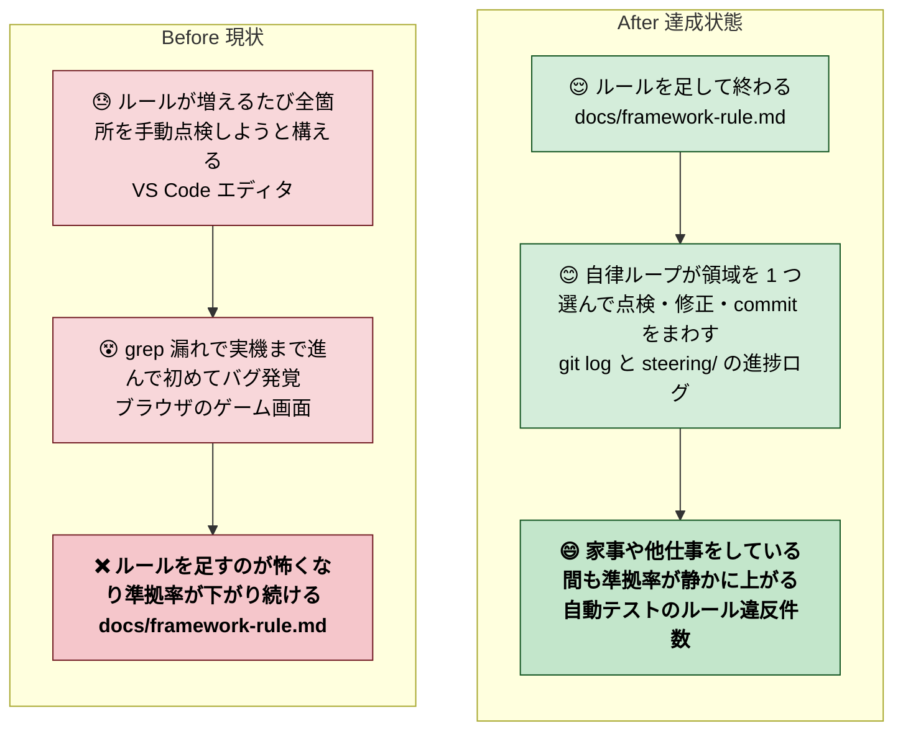

# 2026年4月25日 既存コードを最新ルール群に自律的に準拠させる（サイクリックループ）

> 状態：(1) Journey（Gherkin / Design は未記入）
> 次のゲート：（ユーザー）Journey を確認して「Gherkin」or「次」と指示

---

## 1) Journey（どこへ行くか）

- **深層的目的**：ルール準拠を自動で回す
- **やらないこと**：
  - ルール自体の変更・新規追加（本 note は既存ルールへの「準拠」のみ）
  - 新規機能追加・大規模 refactor（ルール違反修復に必要な最小範囲に絞る）
  - 1 ループで複数対象領域をまたいで大きく書き換える（領域は 1 つずつ）
  - 「これはルールに書いてないが気になる」系の自主判断修正

### 人間の期待

- **この note が（サイクルとして）機能している状態で、人間は何が成立していると思うか**：
  - 朝・夕に覗くと、**対象領域を 1 つ選び**→**ルール違反を列挙**→**最小修正 + テスト + commit** の痕跡が毎ループ残っている
  - 人間は「領域選択が適切か」「修正方針が妥当か」の 2 ゲートだけ見ればよい
  - ルール違反がゼロに近づいた状態が徐々に観測できる（grep ガードや architecture_layout test のヒット数が減る）
  - 家事・他仕事をしている間も作業が進んでいる（1 ループ = 30〜60 分想定、人間確認で次へ）
- **その期待を裏切りやすいズレ**：
  - 1 ループで大きな refactor を発動してしまい、レビュー負荷が跳ね上がる
  - ルール解釈を独自に広げて「ついで直し」を盛り込む（scope creep）
  - テスト green 優先で sloppy な fix（silent fallback / `try: ... except: pass` 等）を入れる
  - 領域選択が重なり、同じファイルを何周も触る
  - 途中で止まる（次にどう再開すべきか記録が残らない）
- **ズレを潰すために見るべき現物**：
  - `docs/framework-rule.md`（M1〜M5 の 5 メタルール）
  - `docs/product-requirements-guardrails.md`（PRD 側のルール参照）
  - `steering/done/` の過去 note（CJ / 改修スコープの粒度感）
  - `test/test_architecture_layout.py` 等のルール化済み自動テスト
  - さかのぼり note 3 本（`20260425-player-dict-residue-*` / `20260425-shop-keyerror-*` / `20260422-play-session-*`）に記録済みの grep レシピ

### 委任度

- 🟡（方針の骨格はユーザー承認が必要：**対象領域の選び方**と**1 ループの粒度**を Design で決めてから 🟢 に上げる）
- ループの中身自体（grep → fix → commit）は CC 単独で回せる想定。ただし **新しい種類の違反を見つけた時の判断**はユーザーに上げる必要がある

---

## 2) Gherkin（完了条件）

> 未記入（ユーザー Journey 承認後に起草する）。
>
> 現時点の案（確定ではない）：
> - **正常系**：1 ループで「領域選択 → ルール違反列挙 → 最小修正 → テスト green → commit → Discussion 追記」が成立する
> - **再試行系**：同じ領域で 2 週目を回しても同じ修正は発生しない（冪等）
> - **異常系**：違反が曖昧で判定できない場合、ループは修正せず「ユーザー判断待ち」を Discussion に残して停止する

---

## 3) Design（どうやるか）

> 未記入（ユーザー Gherkin 承認後に起草する）。
>
> 現時点の案：
> - 1 ループの構造：**対象領域を決める → ルール上問題がないか調べる → あれば修正する**
> - 対象領域の選び方：`src/scenes/*` / `src/shared/services/*` / `tools/*` など粗粒度の単位から 1 つ。同じ領域を重複選択しないよう進捗を本 note に記録
> - 修正の粒度：1 ルール × 1 領域の違反を 1 commit で閉じる。framework-rule.md の M1〜M5 単位で分ける
> - ループ駆動：`/loop` 等で自動起動するか、手動で CC に「次のループを回して」と言うか。Design で決定

---

## 4) Tasklist

> 未記入（Design 承認後、`/superpowers:writing-plans` で正式計画に置き換える）

---

## 5) Result（成果物）

> ループで蓄積する成果物はここではなく各 commit / Discussion に残す

---

## 6) Discussion（記録・反省）

### 2026年4月25日 12:30（起票）

**Observe**：
- バグ連発セッションで 10 件修正 / 3 本のさかのぼり note 起票。
- ユーザーから「ルールが多くなってきた」「自律的に進めて欲しい」との要望
- 既存の tasknote はどれもゲート駆動で 1 往復型。サイクリック（繰り返し）型は本 note が初

**Think**：
- 「対象領域を決める／ルール点検／修正する」の 3 ステップを 1 サイクルにし、サイクルを繰り返す構造
- 自律性は Design で担保するが、Journey 段階では「どういう状態を目指すか」の合意が先
- 既存の 3 本さかのぼり note（player-dict / shop-keyerror / play-session）が規約化した grep レシピを、この自律ループがまさに検査ツールとして使える

**Act**：
- 本 note を `status: open` で起票、Journey のみ記入
- 次ゲート：ユーザー Journey 確認 → 「Gherkin」指示
