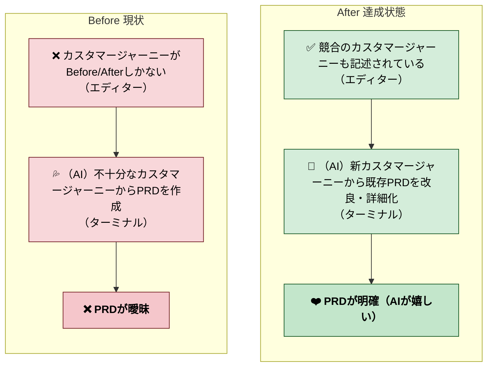
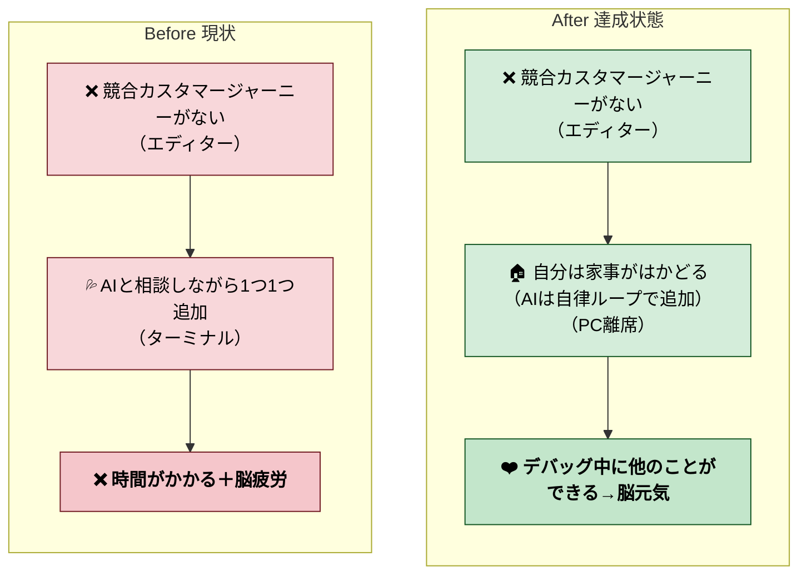
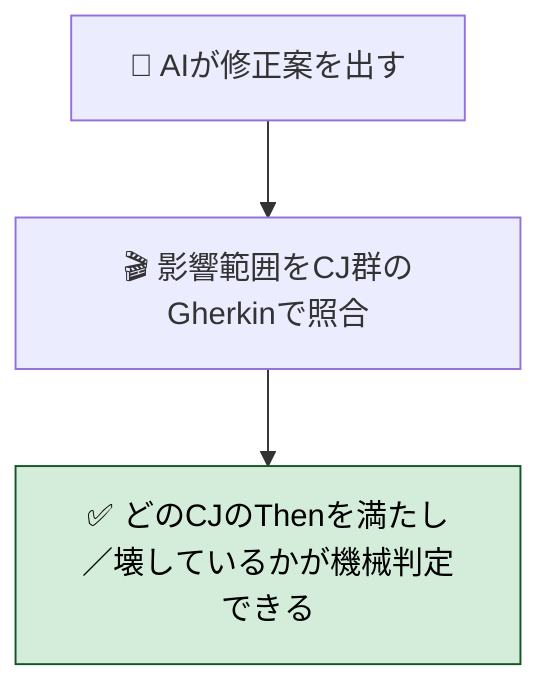
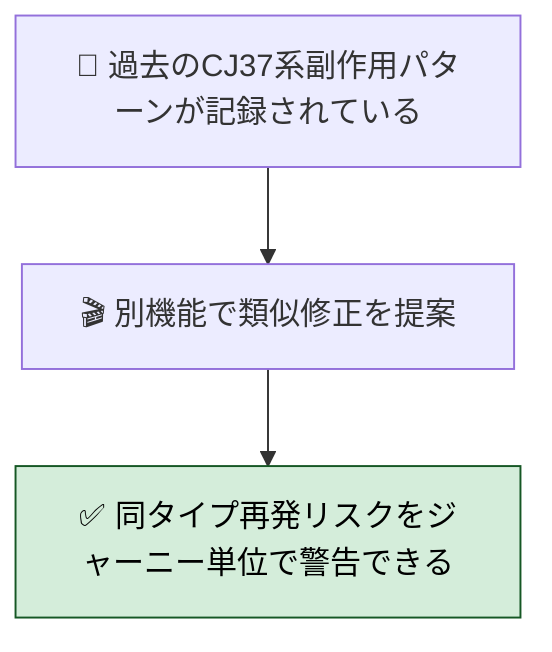
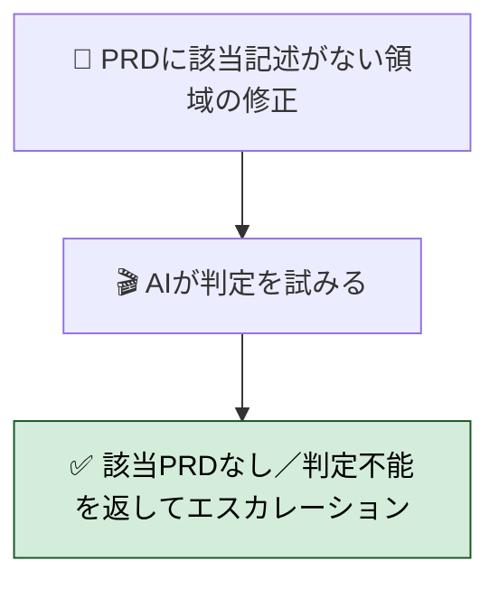
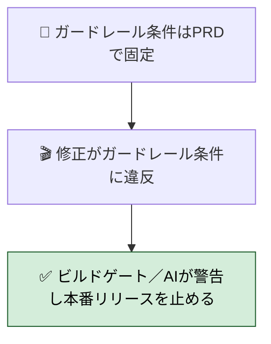
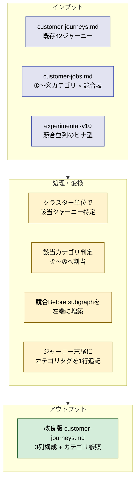
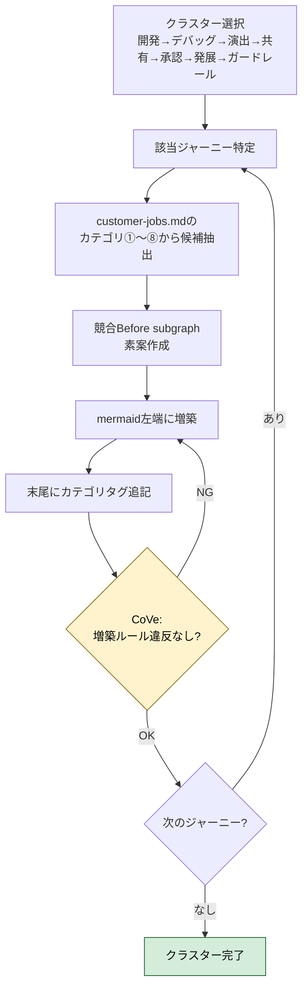
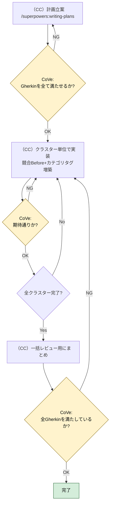

# 2026年4月25日 カスタマージャーニーをブラッシュアップして競合分析を要件に落とす

> 状態：(4) Tasklist 実行中（/loop dynamic mode・クラスター 1 開発系）
> 次のゲート：全 7 クラスター完了後、ユーザー一括レビュー

---

## 1) Journey（どこへ行くか）

- **深層的目的**：競合分析を要件に落としたい
- **やらないこと**：一から書き直すこと（既存 42 ジャーニーを保ったまま改修・増築する）

### 1-A. 直接の成果（PRD が明確になる）

### 1-B. 作業スタイル（自律ループで楽できる）

### 事前合意事項（ユーザーとの Q&A で確定済み）

| 項目 | 合意内容 |
|---|---|
| 判断対象 | 実装時のオプション判断（ジャーニーと PRD の詳細化により AI が機械判定できるようにする） |
| 粒度 | 軽量版（既存 mermaid を保ち、Before に「競合シナリオ」を増築） |
| 進め方 | 自律実行 🟢（CC が一括書き換え → 最後にユーザーが一括レビュー） |
| 親人格 | mermaid のノードラベルは現行の機能ロール（親）を維持。ジャーニー本文で `customer-jobs.md` の進歩ジョブ（JPA / JSC / JIS / JRE / JUN）と紐付ける |
| 競合 Before の物理形式 | 単一「競合 Before」subgraph に競合シナリオを縦並び（β） |
| 既存 mermaid との配置 | 3 列構成 `競合 Before / 現家庭 Before / After-CQP` の横並び（α）— 既存の現家庭 Before は保持 |
| カテゴリ表の取り扱い | `customer-jobs.md` の ①〜⑧ カテゴリ × 競合表をジャーニーから**参照**で使う（α / 重複排除） |
| 割当て主体 | CC が 42 本に対してカテゴリを自律で割当てて作業し、最後に一括レビュー（b） |

---

## 2) Gherkin（完了条件）

> ユーザー実例ヒアリング（4 質問 / 2026-04-25）を反映した CC 素案。
> **中心問題**：「修正は動くが別箇所で副作用」（CJ37 系の責務曖昧）が**複数回**再発している。
> **不可侵にしたい**：ガードレールの条件（CJ35-CJ41）。
> **判定粒度**：ジャーニー単位 + Gherkin シナリオ単位の両方で「PRD 違反」と言える状態。

---

### シナリオ 1：正常系（副作用の機械検知）

> 🧱 Given: AI がコード修正を提案する。`customer-journeys.md` の各 CJ には「競合 Before / 現家庭 Before / After-CQP」と該当カテゴリ（①〜⑧）が記述されている。🎬 When: 修正の影響範囲を該当 CJ の Gherkin シナリオで照合する。✅ Then: 「この修正は CJxx の Then を満たし、他の CJyy の Then を壊していない」と機械判定でき、副作用の有無が**ジャーニー単位 + Gherkin シナリオ単位**で言える。

---

### シナリオ 2：再試行系（同じタイプの再発をパターン検知）

> 🧱 Given: 過去に「他所で副作用が出た」修正パターン（例：CJ37 の責務曖昧由来）が複数回記録されている。🎬 When: 別の機能で類似の修正を提案する。✅ Then: AI は過去パターンと照合し、「同じタイプの再発リスクあり」を**ジャーニー単位**で警告できる。同じカテゴリ ①〜⑧ の他ジャーニーも一律でチェック対象になる。

---

### シナリオ 3：異常系（PRD 不明領域は判定不能を明示）

> 🧱 Given: PRD やジャーニーに該当する記述がない領域への修正提案。🎬 When: AI が判定を試みる。✅ Then: 勝手に判定せず「**該当 PRD なし／判定不能**」を返し、人間判断にエスカレーションする。曖昧な PRD（複数解釈可能）でも同じく「判定不能」とする。

---

### シナリオ 4：リスク確認（ガードレール条件は不可侵で固定）

> 🧱 Given: ガードレールの条件（CJ35-CJ41 の Failure / Recovery / Prevention）は PRD で**固定**されており、改修・増築の対象外。🎬 When: 修正がガードレール条件に違反する場合（例：ヘッドレス検証通過前に開発版を出す、セーブ互換テストを通さず本番リリース）。✅ Then: ビルドゲートまたは AI が**必ず警告し、本番リリースを止める**。ガードレール条件は永続的に保持され、改修・増築で書き換えられない。

---

### シナリオ 5：リスク確認（既存 42 ジャーニーの情報欠落防止）

> 🧱 Given: 既存 42 ジャーニーは CJ01 正本形式（[（主体）絵文字 文（タッチポイント）]）で揃っている。🎬 When: 競合 Before subgraph とカテゴリタグを増築する。✅ Then: 既存ノード・感情ライン・一覧表の感情列が**そのまま残る**（書き直しではなく増築）。既存の Failure / Recovery / Prevention 構造（CJ35-CJ41）も詳細を保つ。

---

## 3) Design（どうやるか）

- **関連スキル・MCP**：Edit, Read, Grep, Bash（git）。MCP は不要

### 構成図（インプット → 処理 → アウトプット）

### 増築の最小ルール（不可侵）

- **既存ノードを書き換え／削除しない**（改修ではなく増築）
- **競合 Before subgraph は左端に追加**（既存 Before-現家庭 の左、After-CQP の手前）
- **競合シナリオは縦並び**（単一 subgraph 内に 3-4 ノード、軽量版 β）
- **カテゴリタグはジャーニー末尾に 1 行**（例：`> 該当カテゴリ：①子・没入、⑤親・関係 → customer-jobs.md 参照`）
- **ガードレール系（CJ35-CJ41）の Failure / Recovery / Prevention 構造は触らない**（Gherkin シナリオ 4 と整合）
- **一覧表の感情列は触らない**（既存の `❌X→❤️Y` 形式を保持）

### 手順フロー（クラスター単位の処理）

### 終了条件

- 全 42 ジャーニーに **競合 Before subgraph** と **カテゴリタグ** が付与されている
- Gherkin シナリオ 5（既存情報欠落防止）が CoVe で OK
- 1 コミットで `docs/customer-journeys.md` の差分として固める

---

## 4) Tasklist

> Phase 4 着手前。Phase 3（Design）承認後に `/superpowers:writing-plans` で計画を立てて記入する。

- [ ] （CC）`/superpowers:writing-plans` で計画を立てる（このセクションに記入）
- [ ] （CC）クラスター単位（開発／デバッグ／演出／共有／承認／発展／ガードレール）で competitor Before subgraph と カテゴリタグを増築
- [ ] （CC）全 Gherkin を満たしているか CoVe で検証 → ユーザーレビュー

### 作業記録

> Observe → Think → Act を刻む。未来の自分が復元できることが目的。

---

## 5) Result（成果物）

ドキュメント改修なので、ここではなく `docs/customer-journeys.md` の差分を成果物とする。

---

## 6) Discussion（反省）

---

### 反省とルール化

- 記入先：observe-situation / manage-tasknotes / CLAUDE.md
- 次にやること：PRD（`product-requirements-platform.md` 等）を新ジャーニーから改良・詳細化する後続タスクの起票

---

## 委任度（Phase 1 終了時点での提示）

残り全フェーズの委任可否：

| フェーズ | 委任度 | 理由 |
|---|---|---|
| Phase 2 (Gherkin) | 🟡 | シナリオ 1-4 の素案は CC が書けるが、「AI が判断する」検証観点はユーザーの実例があると精度が上がる |
| Phase 3 (Design) | 🟢 | 進め方（3 列構成・カテゴリ参照・自律実行）は事前 Q&A で確定済み |
| Phase 4 (Tasklist) | 🟢 | 自律実行（事前 Q3-α 合意）／クラスター単位で進める／コミットも CC で |
| Phase 5/6 (Result/Discussion) | 🟢 | 結果集約と反省記録は CC で書ける |

**夜間委任の可否**：✅ ローカル MCP 不要、Bash/Read/Write/Edit/Glob/Grep のみで完結。Phase 2 だけユーザーレビューを挟めば、Phase 3-4-5 は連続で `claude -p` 実行可能。
