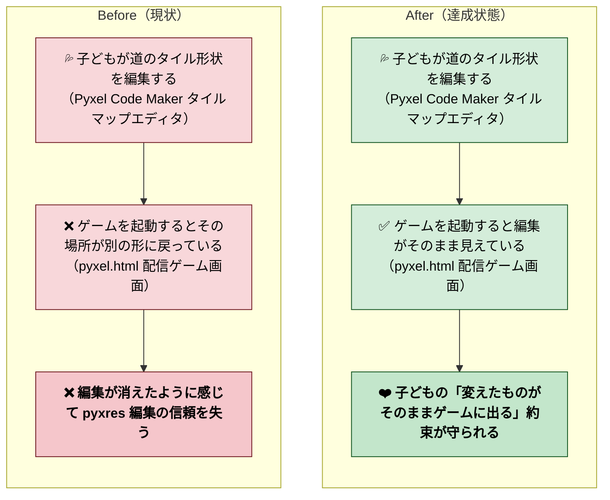
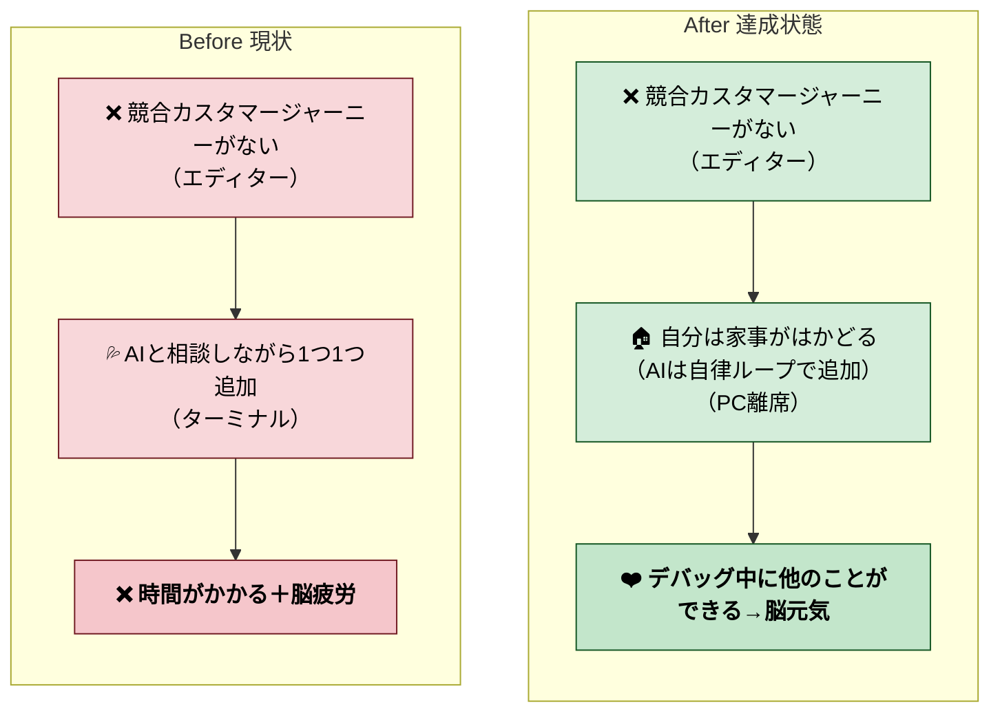
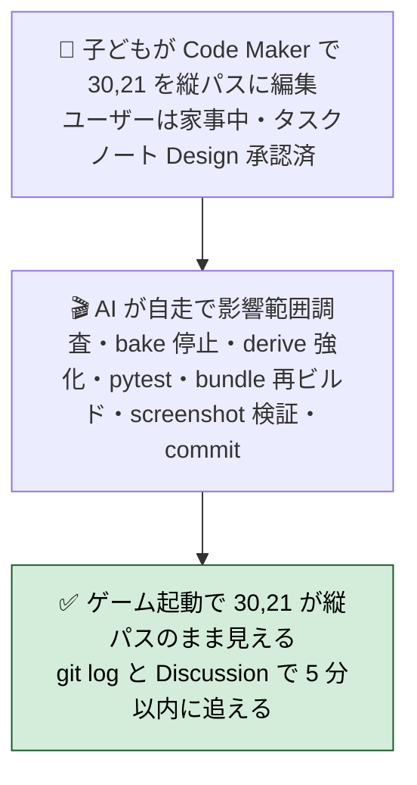
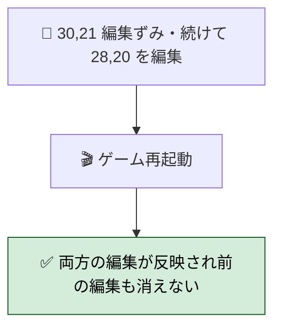
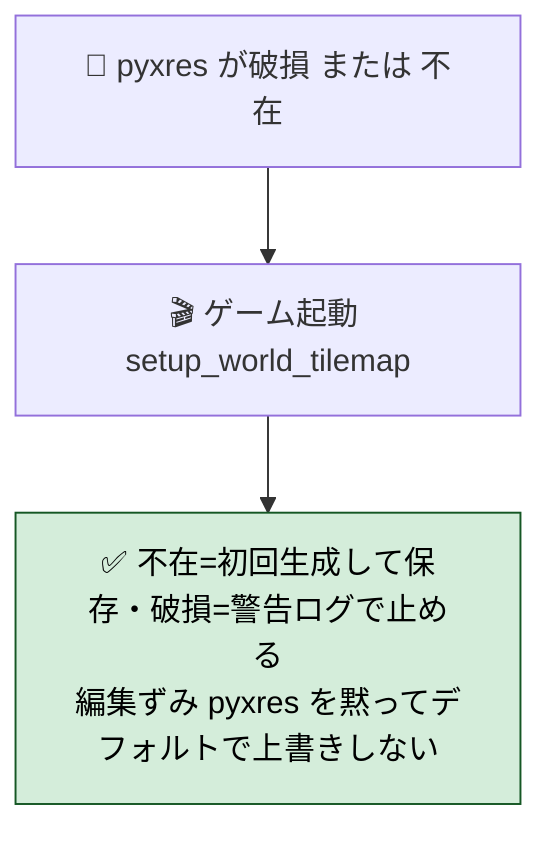
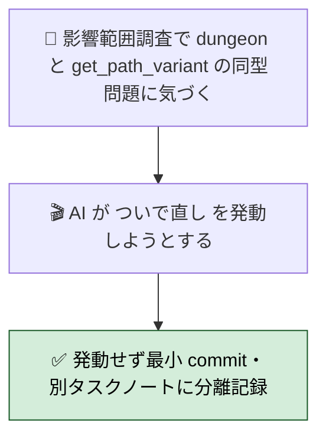
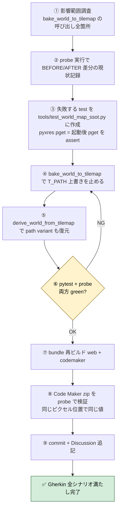

# 2026年4月25日 pyxres を world_map の SSoT にする（procedural 上書きを止める）

> 状態：① Journey 素案
> 次のゲート：（ユーザー）Journey の Before/After Mermaid と「やらないこと」を確認 →「Gherkin」or「修正」と指示

---

## 1) Journey（どこへ行くか）

- **深層的目的**：pyxres を世界マップの真実にする
- **やらないこと**：
  - `generate_world_map()` の procedural 生成自体を捨てる（pyxres 初回不在時の自動生成は残す）
  - dungeon マップの bake 変更（dungeon は procedural のみで Code Maker 編集対象外）
  - `get_path_variant` のロジック修正（B 案ではなく C 案を採るため不要）
  - 1 PR で世界マップ以外（戦闘・町・UI）に手を入れる

### 1-B. 作業スタイル（自律ループで楽できる）

関連顧客ジョブ：JCR, JCT, JSC
関連カスタマージャーニー：CJ01, CJ02

### 委任度

- **現時点（Journey 段階）**: 🟡 中
  - 影響範囲調査が必要（`bake_world_to_tilemap` 呼び出し箇所、初回 pyxres 不在時の自動生成フロー、`derive_world_from_tilemap` のタイル ID 復元精度）
  - bake 削除後の path variant 表示崩れリスクあり
  - Code Maker 実機での目視確認（pyxel.html を browser で開いて (30,21) が編集どおり表示されるか）が必要
- **Design 完了後**: 🟢 になる見込み（影響範囲が確定し、修正手順が固まれば自走可能）

### 背景（補足）

「2 番目の町 TOWN_LOGIC = (30, 22) の 1 つ上 = (30, 21) を Code Maker でどう編集してもゲームに反映されない」というユーザー報告から始まった。原因調査の結果（[直前セッションの transcript 参照]）：

1. `setup_world_tilemap()` が `derive_world_from_tilemap` で pyxres を読み戻すが、復元するのは **タイル ID（道/草/木）だけ**で道のバリアント（V/H/T_NES 等）は捨てる
2. 直後の `bake_world_to_tilemap` が `tile == T_PATH` のとき必ず `get_path_variant(wm, x, y)` で **procedural 再計算** → ユーザー編集を上書き
3. `is_path()` が町タイルを「道扱いしない」ため (30,21) は key=(F,F,F,T) で `_PATH_VARIANTS` に該当なし、fallback `PATH_H` に固定

修正方針 3 案のうち、ユーザーが C 案（最強の SSoT 化）を選択：**`bake_world_to_tilemap` の上書きをやめ、pyxres pixel そのものを描画に使う**。

---

## 2) Gherkin（完了条件）

> 検証観点：「子どもが Code Maker で編集したものが、起動後もそのまま見える」「もう一度編集しても安心」「pyxres が壊れた時に黙ってユーザー編集を捨てない」「scope を広げない」。
> いずれも **ユーザーは PC から離れている前提**（自律ループで AI が自走、戻ってきたら git log と Discussion で進捗を追う）で書く。

### シナリオ1：正常系（家事中に自律ループで SSoT 化が完了する）

> 🧱 Given: ユーザーは家事中。タスクノートに Design まで承認した状態が記録されている。子どもは Code Maker で 2 番目の町の 1 つ上 (30,21) を別の道形状（例：縦パス PATH_V）に編集して保存ずみ。
> 🎬 When: AI が影響範囲調査 → `bake_world_to_tilemap` の T_PATH 上書きを止める → `derive_world_from_tilemap` でバリアント情報も復元する → pyxres 初回不在時の自動生成パスは維持 → pytest 全 green → bundle 再ビルド → headless screenshot で (30,21) のピクセル値が編集どおりであることを確認 → commit → Discussion 追記、を自走で回す。
> ✅ Then: 戻ってきたユーザーが git log と Discussion で進捗を 5 分以内に追える。Code Maker でゲーム起動すると (30,21) の道形状が編集どおり（縦パス）になっており、procedural な横一直線に戻っていない。

---

### シナリオ2：再試行系（pyxres を再編集しても消えない）

> 🧱 Given: SSoT 化のリリース後、子どもが (30,21) を縦パスに編集して反映を確認ずみ。続けて (28,20) も別の道形状に編集して保存。
> 🎬 When: 再度ゲーム起動。
> ✅ Then: (28,20) の新しい編集も反映され、かつ前回の (30,21) 編集も残っている。「以前の編集が procedural 上書きで戻る」現象が再発していない。

---

### シナリオ3：異常系（pyxres が壊れている／不在のとき黙って初期化しない）

> 🧱 Given: pyxres ファイルが破損している、または不在のままゲーム起動。
> 🎬 When: `setup_world_tilemap()` が pyxres 読込を試みる。
> ✅ Then: pyxres **不在**なら従来どおり `generate_world_map()` で procedural 生成して `pyxel.save` で初回 pyxres を作る（既存挙動・互換性維持）。pyxres **破損**ならログに警告を出して止める。**子どもの編集ずみ pyxres を黙ってデフォルトマップで上書きしない**（No Silent Failure）。

---

### シナリオ4：リスク確認（dungeon や get_path_variant への scope creep を起こさない）

> 🧱 Given: 影響範囲調査で「dungeon の bake_dungeon_to_tilemap も同じ procedural 上書きパターンだ」「`get_path_variant` の町判定バグも気になる」と AI が気づく。
> 🎬 When: AI が「ついで直し」で dungeon や get_path_variant にも手を入れようとする。
> ✅ Then: 発動せず最小 commit で閉じる。dungeon 改修と get_path_variant 修正は **別タスクノートに分離記録**（やらないことに「dungeon マップの bake 変更」「get_path_variant のロジック修正」を明記ずみ）。

---

### 委任度（Gherkin 段階）

- **🟡 中**（Journey と同じ）。シナリオ1 の検証手段「headless screenshot で (30,21) のピクセル値確認」が技術的に可能か（既存 `tools/screenshot_test.py` 雛形と pyxres pixel 取得 API の組合せで成立するか）を Design で確定すれば 🟢 化する。

---

## 3) Design（どうやるか）

### 関連スキル・MCP

- `manage-pyxel`（**タイルマップ SSoT 検証**セクション：xvfb-run + SDL_AUDIODRIVER=dummy で headless probe / pytest 化の指針）
- `manage-tasknotes`（本ノートの Discussion 更新と判断待りリスト管理）
- 標準ツール：Bash / Read / Edit / Grep / pytest（追加 MCP 不要）

### 構成図（TDD ループ）

```mermaid
flowchart LR
    subgraph INPUT[インプット]
        I1[assets/blockquest.pyxres<br>ユーザー編集ずみ]
        I2[src/shared/services/image_banks.py]
        I3[本ノート Gherkin シナリオ1〜4]
    end
    subgraph PROCESS[TDD 処理]
        P1[① probe スクリプト作成<br>tools/probe_tilemap_ssot.py]
        P2[② 失敗する test 作成<br>test/test_world_map_ssot.py]
        P3[③ bake_world_to_tilemap 修正<br>T_PATH 上書きを止める]
        P4[④ derive_world_from_tilemap 強化<br>path variant 情報も復元]
        P5[⑤ pytest + probe 両方 green]
        P6[⑥ bundle 再ビルド + Code Maker 検証]
    end
    subgraph OUTPUT[アウトプット]
        O1[1〜N commit<br>compliance ssot で閉じる]
        O2[Discussion 追記<br>影響範囲・残課題・実測ピクセル差分]
        O3[判断待りリスト<br>dungeon と get_path_variant 同型問題]
    end
    INPUT --> PROCESS --> OUTPUT
    classDef io fill:#e2e3f1,stroke:#3949ab,color:#000000;
    classDef proc fill:#fff3cd,stroke:#856404,color:#000000;
    classDef out fill:#d4edda,stroke:#155724,color:#000000;
    class I1,I2,I3 io;
    class P1,P2,P3,P4,P5,P6 proc;
    class O1,O2,O3 out;
```

### 手順フロー

### 決定事項

1. **TDD 順序**: probe → 失敗 test → 修正 → green の順。「test を pass させる」=「procedural 上書きが消えた」と機械的に等価
2. **修正範囲（最小）**:
   - `image_banks.bake_world_to_tilemap`: `tile == T_PATH` 分岐の `get_path_variant` 呼び出しを削除し、derive で読んだピクセルをそのまま書き戻す（または bake 自体をスキップ）
   - `image_banks.derive_world_from_tilemap`: ピクセル → タイル ID だけでなく、**読んだ pixel 位置自体を保存**する dict を別途持ち、bake で再利用
   - `T_WATER` の shore variant 同型問題は **本ループ外**（dungeon / shore は別ノート分離）
3. **fallback 維持**: pyxres 不在時の初回生成 + `pyxel.save` は既存挙動のまま
4. **scope creep 防止**: dungeon の `bake_dungeon_to_tilemap` と `get_path_variant` は触らない（やらないこと宣言ずみ）。気になりは Discussion に記録のみ
5. **ロールバック単位**: 1 commit で revert 可能。test 追加 commit と修正 commit を分ける
6. **検証ハードル**:
   - pytest 全 green（既存 703 件）
   - 新規 test_world_map_ssot.py が green
   - probe で `(30,21)` と `(28,20)` の BEFORE = AFTER（pyxres と起動後 tilemap が完全一致）
   - bundle 再ビルド成功 + Code Maker zip でも同じ probe 結果

### 委任度（Design 完了後）

- **🟢 高**（自走可能）
  - 検証手段が確立（manage-pyxel スキルに記録ずみ）
  - 修正範囲が `image_banks.py` 2 メソッドに限定
  - test 駆動で「成功」「失敗」が機械判定可能
  - 失敗しても commit 単位で revert 可能
  - Code Maker 実機の人による目視は最終確認のみ

---

---

## 4) Tasklist

> （Design 承認後、`/superpowers:writing-plans` で計画立案）

### 作業記録

> Observe → Think → Act を刻む。未来の自分が復元できることが目的。

---

## 5) Result（成果物）

> 実装後にコミット ID と pyxel.html / code-maker.zip の更新サイズを記録

---

## 6) Discussion（反省）

### 2026年4月25日 18:10（夜間委任設定）

**Observe**:
- Journey / Gherkin / Design 全て承認ずみ（CC 素案）。委任度 🟢
- 検証手段（headless probe）が技術的に確立し、`manage-pyxel` スキルにも登録ずみ
- 委任先 AI の使えるツール: Bash / Read / Write / Edit / Glob / Grep（GCal MCP は不可）

**Think**:
- TDD 順序（probe → 失敗 test → 修正 → green → bundle → 再 probe）が機械検証に向いている
- bundle 再ビルド時に view_model.py manifest 漏れの再発がないか、新規追加 test (`test_codemaker_manifest_matches_scene_files`) が自動でカバー
- 失敗時は revert + Discussion に失敗記録、status は `open` のまま残す方針を委任プロンプトに明記

**Act**:
- プロンプトファイル: `~/.claude/prompts/pyxres-as-world-map-ssot.txt`（雛形は manage-tasknotes 準拠 + 本ノート Design セクションを参照）
- crontab: `0 18 25 4 * ...` = **2026-04-26 03:00 JST 一回限り** で発火、終了後に自動でエントリ削除
- 結果ログ: `/tmp/pyxres-ssot-result.log`
- GCal 記録は **翌朝のデイスタで結果ログを確認後に手動記録**（cron からは MCP 認証通らないため）

### 反省とルール化

- 記入先：observe-situation / manage-tasknotes / CLAUDE.md
- 次にやること：
  - **2026-04-26 朝**: `tail -200 /tmp/pyxres-ssot-result.log` と `git log refactor/town-framework-rule-align --oneline -10` を確認
  - 成功なら status を `done` に更新、GCal に実績記録
  - 失敗なら Discussion の「失敗記録」を読んで原因対処、再委任 or 手動修正
  - dungeon の bake と get_path_variant の同型問題（やらないこと宣言ずみ）は別タスクノート起票候補
