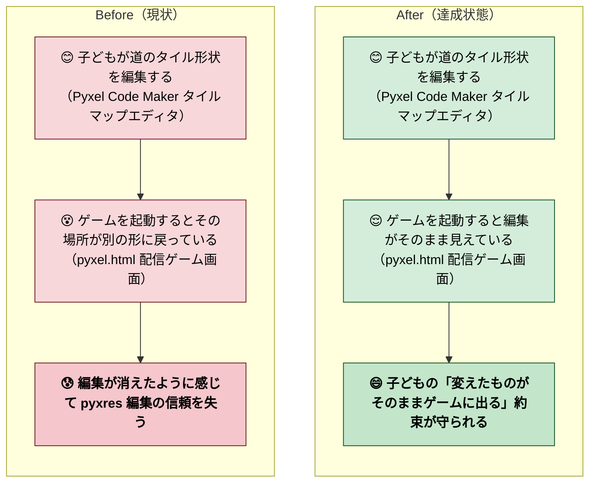

# 2026年4月25日 pyxres を world_map の SSoT にする（procedural 上書きを止める）

> 状態：① Journey 素案
> 次のゲート：（ユーザー）Journey の Before/After Mermaid と「やらないこと」を確認 →「Gherkin」or「修正」と指示

---

## 1) Journey（どこへ行くか）

- **深層的目的**：pyxres を世界マップの真実にする
- **やらないこと**：
  - `generate_world_map()` の procedural 生成自体を捨てる（pyxres 初回不在時の自動生成は残す）
  - dungeon マップの bake 変更（dungeon は procedural のみで Code Maker 編集対象外）
  - `get_path_variant` のロジック修正（B 案ではなく C 案を採るため不要）
  - 1 PR で世界マップ以外（戦闘・町・UI）に手を入れる

### 委任度

- **現時点（Journey 段階）**: 🟡 中
  - 影響範囲調査が必要（`bake_world_to_tilemap` 呼び出し箇所、初回 pyxres 不在時の自動生成フロー、`derive_world_from_tilemap` のタイル ID 復元精度）
  - bake 削除後の path variant 表示崩れリスクあり
  - Code Maker 実機での目視確認（pyxel.html を browser で開いて (30,21) が編集どおり表示されるか）が必要
- **Design 完了後**: 🟢 になる見込み（影響範囲が確定し、修正手順が固まれば自走可能）

### 背景（補足）

「2 番目の町 TOWN_LOGIC = (30, 22) の 1 つ上 = (30, 21) を Code Maker でどう編集してもゲームに反映されない」というユーザー報告から始まった。原因調査の結果（[直前セッションの transcript 参照]）：

1. `setup_world_tilemap()` が `derive_world_from_tilemap` で pyxres を読み戻すが、復元するのは **タイル ID（道/草/木）だけ**で道のバリアント（V/H/T_NES 等）は捨てる
2. 直後の `bake_world_to_tilemap` が `tile == T_PATH` のとき必ず `get_path_variant(wm, x, y)` で **procedural 再計算** → ユーザー編集を上書き
3. `is_path()` が町タイルを「道扱いしない」ため (30,21) は key=(F,F,F,T) で `_PATH_VARIANTS` に該当なし、fallback `PATH_H` に固定

修正方針 3 案のうち、ユーザーが C 案（最強の SSoT 化）を選択：**`bake_world_to_tilemap` の上書きをやめ、pyxres pixel そのものを描画に使う**。

---

## 2) Gherkin（完了条件）

> （Journey 承認後、CC が素案を記入）

---

## 3) Design（どうやるか）

> （Gherkin 承認後、CC が素案を記入）

---

## 4) Tasklist

> （Design 承認後、`/superpowers:writing-plans` で計画立案）

### 作業記録

> Observe → Think → Act を刻む。未来の自分が復元できることが目的。

---

## 5) Result（成果物）

> 実装後にコミット ID と pyxel.html / code-maker.zip の更新サイズを記録

---

## 6) Discussion（反省）

### 反省とルール化

- 記入先：observe-situation / manage-tasknotes / CLAUDE.md
- 次にやること：
