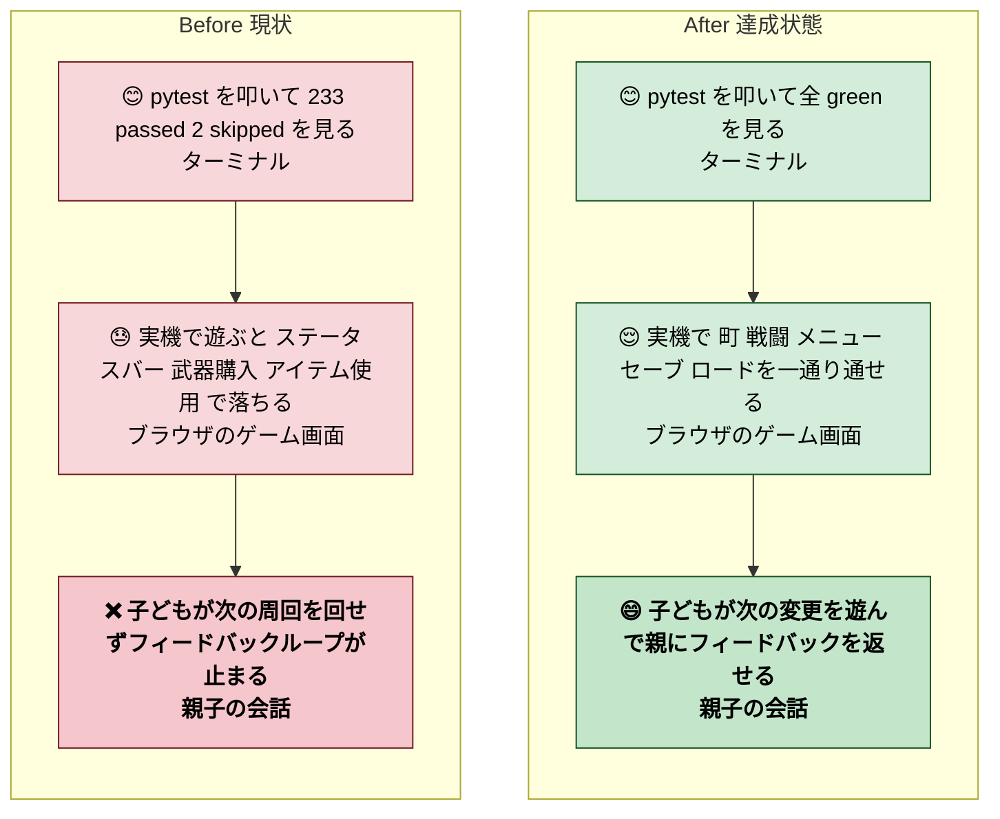
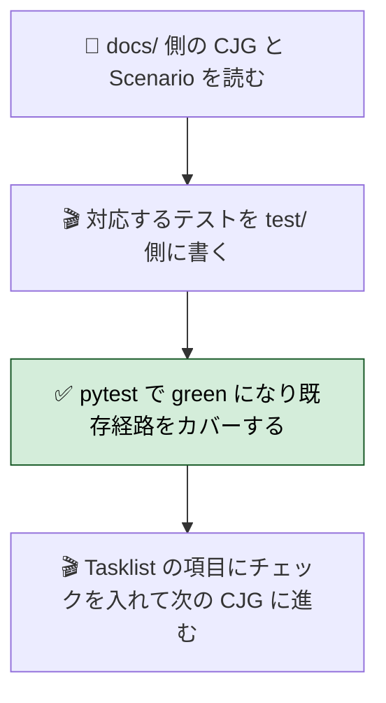
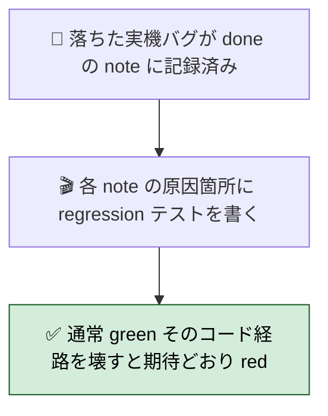
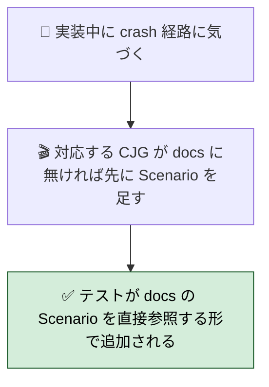
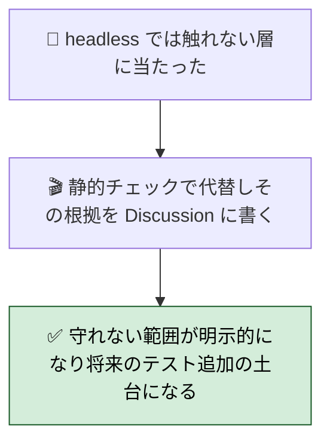
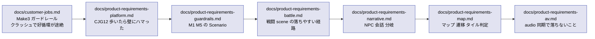
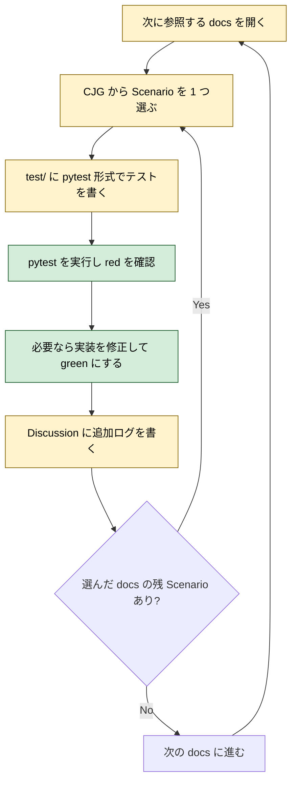

# 2026年4月25日 落ちないことを保証するテスト群を docs/ 駆動で整備する

> 状態：(4) Tasklist 実行中（docs/ を参照して順次テストを追加）
> 次のゲート：docs/ 参照の順序と優先付けについてユーザー承認（進め方の合意が済めばあとは自律）

---

## 1) Journey（どこへ行くか）

- **深層的目的**：「pytest 233 green なのに実機で落ちる」を終わらせ、テストが通ったら子どもが最後まで遊べると言えるようにする
- **やらないこと**：
  - UI 見た目の pixel-perfect テスト（検証コストに対して守れるものが少ない）
  - 既存テストの大規模書き換え（足りない観点のテストを追加することに集中する）
  - framework-rule.md の全 M1〜M5 ガードレールを一度に入れる（crash 系から順に、要求の高いものから）
  - テスト網羅の完璧主義（`docs/customer-jobs.md` Make3「クラッシュで好循環が途絶」を最低ラインとする）



### 委任度

- 🟢（進め方（docs/ 優先順）に合意がとれれば、個別テストの起票・実装・green 化は CC 単独で回せる。判断に迷う場面は Tasklist の作業記録に残して次のターンでユーザー確認）

---

## 2) Gherkin（完了条件）

> 本 note の完了条件は **docs/customer-jobs.md Make3「ガードレール」が稼働している** ことと、docs/product-requirements-*.md の各 CJG に対応する crash-prevention 観点のテストが green であること。テストを 1 本足すごとにこの note のチェックリストが 1 つ進む。

### シナリオ1：正常系（docs/ 由来の CJG から crash 観点のテストが足されていく）

> 🧱 Given: `docs/` に CJG（customer-journey-gherkin）が Feature / Rule / Scenario の形で書かれている。🎬 When: CJG を 1 つ選び、その Scenario を pytest 形式のテストに落として追加する。✅ Then: 新しい test が green で、落ちうる既存コード経路がカバーされる。Tasklist のチェックが 1 つ進む。



### シナリオ2：回帰系（実機で実際に落ちた箇所は必ずテスト化する）

> 🧱 Given: 2026-04-25 までに実機で落ちた 3 件（(a) PlayerModel dict 取りこぼし / (b) SHOPS→SHOP_LIST KeyError / (c) 町の `_current_town_index` / `town_menu_pos` 参照切れ）が `steering/done/` の note に記録されている。🎬 When: 各 note が参照するファイル・行・関数に対して「これ以上同じパターンで落ちない」テストを書く。✅ Then: 同じコードパスを踏む scene smoke テストが green で、対応する crash 条件で fail できる（テストを壊して red にする試験でも確認）。



### シナリオ3：異常系（docs/ に未記載の crash 経路に気づいたら CJG を先に足す）

> 🧱 Given: 実装中に「ここも落ちうる」と気づいたのに、対応する CJG が `docs/` にない。🎬 When: 先にテストだけ足そうとするのではなく、まず `docs/product-requirements-*.md` の該当 Feature に Scenario を 1 行足して書きかけの CJG を作る。✅ Then: docs/ とテストが対応し、レビューで「なぜこのテストがあるのか」が docs 起点で説明できる。テスト先行で docs が追いかけない状態を作らない。



### シナリオ4：撤収系（テストを書けない経路は撤収条件を明示する）

> 🧱 Given: Pyxel 描画や音声のように headless では動かない層がある。🎬 When: テストで守れない範囲に触ったら、代わりに grep / import smoke / manifest 照合などの静的チェックで代替する。✅ Then: 「この経路はテストで守らない、代わりにこうチェックする」が note の Discussion に 1 行で書かれ、後から誰かが同じ穴を踏まない。



---

## 3) Design（どうやるか）

- **関連スキル・MCP**：`manage-tasknotes` / `test-driven-development` / `systematic-debugging`
- **MCP**：追加なし（`pytest` / `grep` / `find` / 既存の Game dispatcher で headless 更新を回す）

### docs/ を参照する順序（crash 優先）



### 1 テスト追加サイクル（loop）



### 決定事項

1. **docs/ 参照順は crash ドリブン**：`customer-jobs.md` Make3 を起点に、`product-requirements-platform.md` / `-guardrails.md` / `-battle.md` / `-narrative.md` / `-map.md` / `-av.md` の順
2. **テストの命名は CJG 番号で紐付ける**：例 `test/test_cjg12_recovery.py`、関数名 `test_cjg12_scenario_X_description`
3. **ヘッドレス scene ハーネス**を作る（`InputStateTracker` を fake できる最小の harness）。Pyxel 初期化を必要とせず、`TownPresenter` / `ShopPresenter` / `BattlePresenter` を呼べる形が最低限
4. **実機で落ちた 3 件は最優先で regression テスト化**：
   - (a) `test/test_status_bar_draw_from_player_model.py` — `game.player` 参照の取りこぼしを固定化
   - (b) `test/test_shop_enter_uses_shop_list.py` — SHOPS/SHOP_LIST 分離の固定化
   - (c) `test/test_town_entry_sets_current_town.py` — `current_town` 書き込みと shop からの読み出しの整合
5. **「docs/ に CJG が無い」箇所に気付いたら先に docs/ 側に Scenario を足す**（テスト先行で docs が置き去りにならない運用）
6. **Pyxel 依存の層（描画・音声）は import smoke / grep でガードし、本 note ではランタイムテストを書かない**（撤収条件をシナリオ4で明示）

### 実世界の確認点

- **見る path**：
  - `docs/customer-jobs.md`（Make3 ガードレール）
  - `docs/customer-journeys.md`（CJ / CJG の番号体系）
  - `docs/product-requirements-*.md`（各 Feature / Rule / Scenario）
  - `test/` 以下の既存テスト（どこに足すか）
  - `steering/done/20260425-*.md`（実機バグの 3 件）
- **動かすコマンド**：
  - `python -m pytest test/ -q`
  - `python -m pytest test/test_cjgNN_*.py -v`（新規分の詳細確認）
  - grep ガード（`M\.SHOPS\b`、`game\.player[^_]`、`game\.<shim>\(` など）

---

## 4) Tasklist

```mermaid
flowchart TD
    T0[開始<br>現状 pytest 233 + 2 skipped] --> T1[ヘッドレス scene ハーネスを用意]
    T1 --> T2[実機バグ 3 件の regression テスト]
    T2 --> T3[docs/customer-jobs.md Make3 起点の smoke]
    T3 --> T4[docs/product-requirements-platform.md CJG12 から順に]
    T4 --> T5[docs/product-requirements-guardrails.md の M1 M5]
    T5 --> T6[docs/product-requirements-battle.md]
    T6 --> T7[docs/product-requirements-narrative.md]
    T7 --> T8[docs/product-requirements-map.md]
    T8 --> T9[docs/product-requirements-av.md]
    T9 --> TEND[本 note クローズ]
    classDef step fill:#fff3cd,stroke:#856404,color:#000000;
    classDef end fill:#d4edda,stroke:#155724,color:#000000;
    class T1,T2,T3,T4,T5,T6,T7,T8,T9 step;
    class TEND end;
```

> 以下の「1 項目 = 1 テストファイル or 1 測定可能単位」。項目内で pytest green にできたら `[x]`。個別 Scenario が多すぎる項目は下に sub-bullet で分割する。

### Phase A：足場

- [ ] ヘッドレス scene ハーネスを `test/_harness/scene_harness.py` として新設する（Pyxel 依存をスタブし、`InputStateTracker` を fake にできる最小セット）
- [ ] ハーネスを使う smoke テスト 1 本を書いて pytest に組み込む（ハーネス自体の green 保証）

### Phase B：実機バグ 3 件の regression

- [ ] `test_status_bar_draws_without_game_player_attr`：`game.player` が存在しなくても `StatusBar.draw()` が落ちないこと（`game.player_model` 経由で値を読む）
- [ ] `test_shop_enter_reads_shop_list_not_shops`：`ShopScene.enter('weapons')` が `SHOP_LIST[idx]` から読めていること。`SHOPS[0]` で KeyError を踏まない
- [ ] `test_town_entry_populates_current_town`：マップのタイル T_TOWN を踏むと `game.current_town = TownContext(index, pos)` がセットされ、shop から index / pos が読み出せること
- [ ] `test_menu_item_use_goes_through_item_use_service`：menu 経由のアイテム使用が `game.use_item` 非実在 shim ではなく `item_use.use_item` service を呼ぶこと

### Phase C：docs/customer-jobs.md Make3 起点の smoke

- [ ] ゲーム起動 smoke：`Game()` 相当が初期化できる（Pyxel 依存は fake）
- [ ] 主要 state 遷移 smoke：`splash` → `title` → `map` → `town_menu` → `shop` → `map` → `battle` → `map` → `menu` の各遷移で AttributeError / KeyError / TypeError が出ない

### Phase D：docs/product-requirements-platform.md（CJG12 系）

- [ ] CJG12 recovery：バグ修正後に test→build→play が閉じること（実行は統合ではなく import smoke で代替し、撤収理由を Discussion に書く）
- [ ] CJG 12 以外で「crash を防ぐ」Rule の Scenario を上から全部テストに落とす（Scenario 文を docstring に残す）

### Phase E：docs/product-requirements-guardrails.md（M1〜M5）

- [ ] M1 Pyxel API 境界：grep ガードの regression（`grep -nE '^(import pyxel|from pyxel)|[^_a-zA-Z]pyxel\.' src/scenes/*/presenter.py src/scenes/*/model.py` → 0 件、違反したら fail）
- [ ] M2 View / ViewModel：View 層で `input_state.btnp` が使われていないこと（grep ガード）
- [ ] M3 Presenter / Scene / Command：Presenter が `pyxel.text` / `pyxel.rect` 等を呼んでいないこと（grep ガード）
- [ ] M4 Model / Service / GameState / PlayerModel：`player` dict が src 配下に残っていないこと（grep ガード、`game.player` と `\bp\[['\"]` の 2 段）
- [ ] M5 命名 / テスト：`src/scenes/*/` が `scene.py? / model.py / presenter.py / view.py / view_model.py?` の範囲に収まっていること（find ガード）

### Phase F：docs/product-requirements-battle.md

- [ ] 戦闘 scene smoke：エンカウント→選択→攻撃→敵撃破→報酬→マップ復帰が AttributeError / KeyError なく通る
- [ ] 戦闘中のアイテム使用：warp 系が「せんとうちゅうはつかえない」に分岐する（既存 battle/scene.py:195）
- [ ] 戦闘 BGM 同期：`sync_audio` が `game.player_model` 経由で読める（`bgm_enabled` / `in_dungeon` / `y`）

### Phase G：docs/product-requirements-narrative.md

- [ ] NPC 会話送り：`town/presenter.py` の `advance_npc_talk_idx` が循環すること
- [ ] 教授 intro / ending：PlayerModel の `professor_intro_seen` / `professor_ending_seen` が 1 回目と 2 回目で分岐する

### Phase H：docs/product-requirements-map.md

- [ ] マップタイル判定：`T_TOWN` / `T_CASTLE` / `T_GLITCH_LORD_TRIGGER` の遷移に対応する state 変化
- [ ] セーブ→ロードの往復：`to_snapshot` / `from_snapshot` が全属性を保持する

### Phase I：docs/product-requirements-av.md

- [ ] 効果音 slot 選択：`SFX_DEFINITIONS` のキーが全部ロードされる
- [ ] BGM scene 選択：`choose_bgm_scene` が各 state × zone 組み合わせで例外を投げない

### 作業記録

> Observe → Think → Act を刻む。1 テスト追加ごとに記録を書く。

#### 2026年4月25日 02:45（起票）

**Observe**：
- 同日中に実機バグ 3 件（PlayerModel dict 取りこぼし / SHOP KeyError / 町入場時の shop 連携）がユーザー報告で発覚
- いずれも pytest 233 green だったのに発覚。テストが「crash を守る」観点を持っていない
- docs/ は customer-jobs.md / customer-journeys.md / framework-rule.md / product-requirements-*.md の合計 10 ファイル 5327 行あり、CJG 形式の Feature / Rule / Scenario が大量に書かれている

**Think**：
- docs/ の CJG はすでに「何を約束し何を壊してはいけないか」を言語化している。それを pytest に落とす変換が未整備なだけ
- 最優先は実機バグ 3 件の regression → 次に docs/customer-jobs.md Make3 → framework-rule.md M1〜M5 のガードレール → 個別 PRD
- テスト先行で docs が追いかけない状態は避ける（シナリオ3）
- Pyxel 依存の層は headless では限界がある。grep ガードと import smoke で代替し、撤収条件を Discussion に明記

**Act**：
- 本 note を `steering/20260425-tests-that-prevent-runtime-crashes.md` として起票
- status: open → in-progress
- 次ゲート：Phase A（ハーネス新設）から着手。1 項目 green ごとに commit して記録を残す

---

## 5) Result（成果物）

実装が進むごとにここに追記する。

- 2026-04-25 起票時点：未着手
- Phase A 完了時：ハーネスのパスと smoke テストの root 関数名をここに記載
- Phase B 完了時：3 件 regression テストのファイルパスを記載

---

## 6) Discussion（反省）

> Observe → Think → Act を刻む。未来の自分が復元できることが目的。

（Phase A 以降の作業で追記していく）

---

### 反省とルール化

- 記入先：observe-situation / manage-tasknotes / CLAUDE.md（本 note が done になった段階で抽出）
- 次にやること：
  - 本 note が進めば「テスト緑なのに実機で落ちる」が減るはず。落ちたら都度 Phase B に項目を足して即 regression 化
  - docs/ に対応する CJG が無い crash 経路に気付いたら、シナリオ3 のルールに従って docs/ を先に足す
  - grep ガードは pre-commit への組み込みを別 note で検討（本 note は pytest に寄せる）
