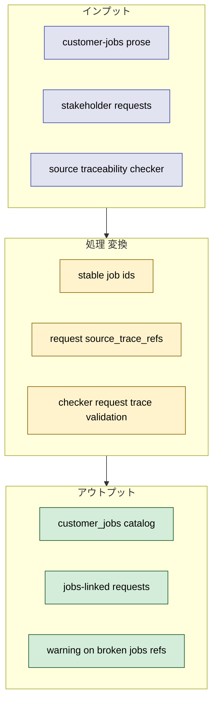
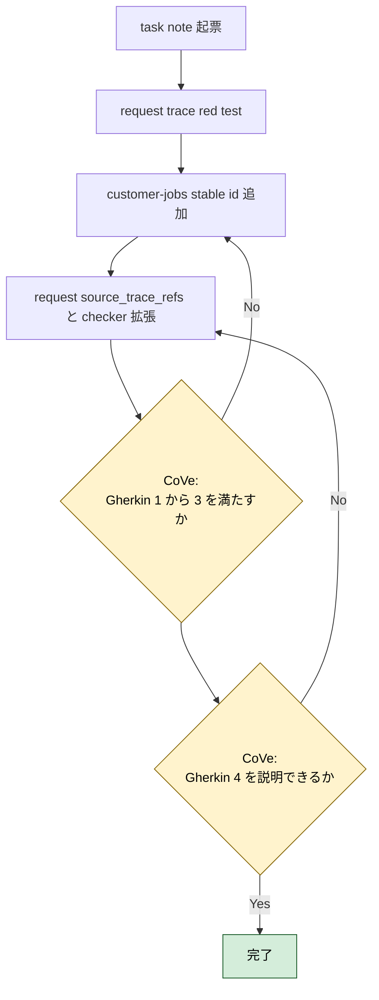
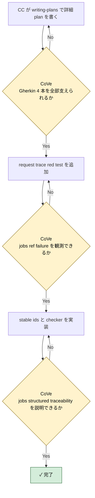

# 2026年5月9日 customer-jobs stable trace ids

> 状態：⑤ Result（実装完了）
> 実装 plan: [2026-05-09-customer-jobs-stable-trace-ids.md](/home/exedev/code-quest-pyxel/docs/superpowers/plans/2026-05-09-customer-jobs-stable-trace-ids.md)

---

## 1) Journey（どこへ行くか）

- **深層的目的**：jobs 層も機械参照可能にする
- **やらないこと**：customer-jobs の prose 全体を requirement に 1:1 展開すること

**Before（現状）**：
- 💦 [customer-jobs.md](/home/exedev/code-quest-pyxel/docs/customer-jobs.md) は重要な根拠だが、duplicate な見出しや prose 中心のため stable trace id としては扱いづらい
- 💦 `stakeholder_voices.yml` の structured traceability は `CJ / CJG / M-rule` が中心で、jobs レイヤは file path 参照止まりになっている
- 💦 requests がどの顧客 job に支えられているかを機械的に辿れない

**After（達成状態）**：
- ❤️ `customer-jobs.md` に stable trace id catalog が入り、jobs セクションを機械参照できる
- ❤️ `stakeholder_voices.yml` の requests も structured traceability の対象になる
- ❤️ checker が jobs trace ref の欠落や typo を warning にできる

---

## 2) Gherkin（完了条件）

### シナリオ1：request から customer job の stable id を辿れる

🧱 Given：AI や開発者が `stakeholder_voices.yml` の request を見る  
🎬 When：その request がどの顧客 job に支えられているか確認したい  
✅ Then：`source_trace_refs` から `customer_jobs` の stable id を機械的に辿れる

---

### シナリオ2：duplicate heading があっても stable id は曖昧にならない

🧱 Given：`customer-jobs.md` には見出し上の略号が重なる箇所がある  
🎬 When：structured traceability でその section を参照する  
✅ Then：unique な stable id で一意に識別できる

---

### シナリオ3：壊れた jobs trace ref は checker が止める

🧱 Given：request が存在しない customer job stable id を参照している  
🎬 When：checker を実行する  
✅ Then：warning を返し、壊れた ref を観測できる

---

### シナリオ4：jobs 層の structured 移植率を説明できる

🧱 Given：customer jobs の移植進捗を知りたい  
🎬 When：`stakeholder_voices.yml` の requests を見る  
✅ Then：active request のうち何件が jobs stable id と結び付いたかを説明できる

---

## 3) Design（どうやるか）

- **関連スキル・MCP**：`writing-plans`, `test-driven-development`, `verification-before-completion`
- `customer-jobs.md` 側に unique な stable token を足し、`source_documents` に `customer_jobs` を追加する
- structured traceability は request 層まで広げるが、既存の `source_refs` は人向け path として残す
- 実装順は `1. rule 先行 2. deterministic check へ昇格 3. guardian は安全な正規化だけ` を守る

---

## 4) Tasklist

> 必ず上から順に実施。CCがCoVeで自力検証しながら進める。

- [x] （CC）`/superpowers:writing-plans` で plan を書き、この note に task 単位で反映する
  plan: [2026-05-09-customer-jobs-stable-trace-ids.md](/home/exedev/code-quest-pyxel/docs/superpowers/plans/2026-05-09-customer-jobs-stable-trace-ids.md)
- [x] （CC）request 向け jobs trace red test を追加する
- [x] （CC）`customer-jobs.md` に stable trace id を追加する
- [x] （CC）`stakeholder_voices.yml` の request 層へ `source_trace_refs` を追加する
- [x] （CC）checker を request source trace aware に拡張する
- [x] （CC）Result に実装過程、Discussion に結論・懸念・次ノート候補を残す

### 作業記録

#### 2026年5月9日 起票

**Observe**：`customer-jobs.md` は file path としては参照しているが、jobs そのものは structured traceability の対象外のまま残っている。  
**Think**：jobs 層を request と結ぶには、doc 側に unique stable id を入れて checker が request trace まで辿れるようにするのが最小。  
**Act**：customer-jobs stable trace id 専用の task note を起票し、Journey / Gherkin / Design / Tasklist に jobs layer structured traceability の作業枠を固定した。

---

## 5) Result（成果物）

- `writing-plans` に従って [2026-05-09-customer-jobs-stable-trace-ids.md](/home/exedev/code-quest-pyxel/docs/superpowers/plans/2026-05-09-customer-jobs-stable-trace-ids.md) を作成し、`stable token -> request trace -> checker/fixer -> real repo verification` の順に実装計画を固定した。
- red test として [test_stakeholder_voices_checker.py](/home/exedev/code-quest-pyxel/test/test_stakeholder_voices_checker.py) に `customer_jobs` catalog 数と request 向け broken `source_trace_refs` warning を追加し、`python -m pytest test/test_stakeholder_voices_checker.py -q` で `source_documents` 不足と request 未検査を failure として確認した。
- [customer-jobs.md](/home/exedev/code-quest-pyxel/docs/customer-jobs.md) の top-level job 10 件すべてに stable token を追加した。duplicate heading がある `JSC` は `JOB:JSC_CHILD_SOCIAL` と `JOB:JSC_PARENT_GROWTH` に分離し、見出し略号の衝突を trace id から切り離した。
- [stakeholder_voices.yml](/home/exedev/code-quest-pyxel/docs/stakeholder_voices.yml) に `customer_jobs` source document を追加し、active request 9 件すべてへ `source_trace_refs` を付与した。うち 6 件は `customer_jobs:*` に直接つながり、残り 3 件は `CJ / CJG / M-rule` の技術根拠へつないだ。
- [check_stakeholder_voices.py](/home/exedev/code-quest-pyxel/tools/stakeholder_voices/check_stakeholder_voices.py) の `source_traceability_integrity` を `requests / requirements / acceptance` の 3 セクション対応に拡張した。壊れた job trace ref は deterministic warning になり、Gherkin 3 を満たす。
- safe normalization も request 側まで広げた。[fix_stakeholder_voices.py](/home/exedev/code-quest-pyxel/tools/stakeholder_voices/fix_stakeholder_voices.py) は request の duplicate `source_trace_refs` / `source_refs` を sort-dedupe できるが、stable token の意味づけや prose 追加は触らないままにした。
- CoVe:
  - シナリオ1 `request から customer job の stable id を辿れる`: `rq_child_edit_ownership` など 6 request が `customer_jobs:*` を持つ形になり達成。
  - シナリオ2 `duplicate heading があっても stable id は曖昧にならない`: `JSC` child/parent を別 token に分離して達成。
  - シナリオ3 `壊れた jobs trace ref は checker が止める`: fixture test で warning 化を確認して達成。
  - シナリオ4 `jobs 層の structured 移植率を説明できる`: active request 9 件中 6 件が `customer_jobs:*` を持つと定量説明できる状態になり達成。
- 最終確認:
  - `python -m pytest test/test_stakeholder_voices_checker.py test/test_fix_stakeholder_voices.py test/test_repair_stakeholder_voices.py -q` -> `15 passed`
  - `python tools/check_stakeholder_voices.py` -> `warning_rules: 0`
  - `python tools/fix_stakeholder_voices.py` -> `status: OK`
  - `python tools/repair_stakeholder_voices.py` -> `status: OK`

---

## 6) Discussion（反省）

- 結論：`customer-jobs.md` は heading text を正にするより、本文に埋めた stable token を正にした方が checker 実装が単純で壊れにくい。duplicate な `JSC` を token で分離できた。
- 結論：jobs 層の first pass を request までに留めたのは妥当だった。requirement / acceptance は既存の `CJ / CJG / M-rule` trace を維持しつつ、request だけに customer job 根拠を追加する方が責務が明確だった。
- 懸念：stable token は docs 本文に埋めているだけなので、今後 coverage report を出すには `customer_jobs` 専用の extraction contract が必要になる。
- 懸念：active request 9 件中 3 件は customer job ではなく technical trace のみで支えている。これは意図通りだが、`customer_jobs coverage` と `request trace coverage` を同じ指標で混ぜない方がよい。
- 次に起票すべき task note： [20260509-stakeholder-voices-coverage-report.md](/home/exedev/code-quest-pyxel/steering/20260509-stakeholder-voices-coverage-report.md)

---

### 反省とルール化

- 次にやること：coverage report task で source document ごとの extraction contract と missing stable refs の report 形式を固定する
