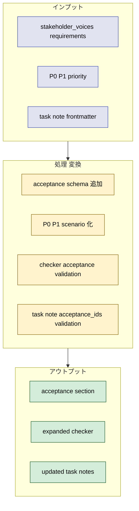
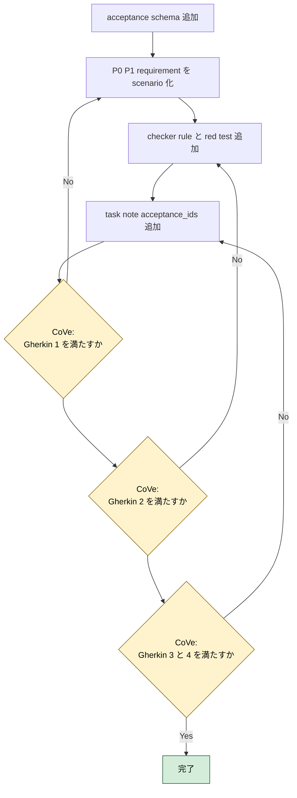
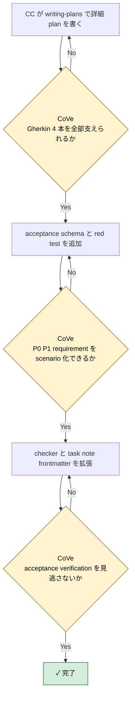

# 2026年5月9日 stakeholder_voices acceptance layer

> 状態：⑤ Result（実装完了）
> 実装 plan: `docs/superpowers/plans/2026-05-09-stakeholder-voices-acceptance-layer.md`

---

## 1) Journey（どこへ行くか）

- **深層的目的**：要求を検証可能にする
- **やらないこと**：全 requirement を一気に詳細な自動テストへ落とし切ること

**Before（現状）**：
- 💦 `docs/stakeholder_voices.yml` は requirement-first の台帳としては使えるが、Gherkin レベルの acceptance がなく「要求が満たされたか」を直接は追いにくい
- 💦 `P0 / P1` requirement も `must / must_not` の prose が中心で、checker は構造整合しか見られない
- 💦 task note frontmatter は `requirement_ids` までで、どの acceptance scenario を実装・検証したかまでは残せない

**After（達成状態）**：
- ❤️ `docs/stakeholder_voices.yml` に `acceptance` セクションが追加され、requirement から scenario を辿れる
- ❤️ まず `P0 / P1` requirement だけが `given / when / then / verification` を持つ acceptance に落ちる
- ❤️ checker が acceptance 参照と verification 欠落を見られる
- ❤️ task note frontmatter に `acceptance_ids` が追加され、どの scenario を対象にした作業か追跡できる

---

## 2) Gherkin（完了条件）

### シナリオ1：P0/P1 requirement は acceptance を持つ

🧱 Given：AI や開発者が `docs/stakeholder_voices.yml` を読み、P0 または P1 の requirement を確認する  
🎬 When：その requirement の達成条件を知りたい  
✅ Then：対応する `acceptance_ids` と `acceptance` エントリがあり、`given / when / then / verification` を辿れる

---

### シナリオ2：acceptance に verification がない requirement は checker が止める

🧱 Given：P0 または P1 requirement に対応する acceptance がある  
🎬 When：acceptance に `verification` や `verification_refs` が欠けた状態で checker を実行する  
✅ Then：checker が warning を返し、「構造はあるが検証不能な acceptance」を見逃さない

---

### シナリオ3：task note は requirement と acceptance の両方を frontmatter で持てる

🧱 Given：`steering/` に stakeholder_voices 系の task note がある  
🎬 When：その note が特定の scenario を実装・検証する  
✅ Then：frontmatter に `requirement_ids` と `acceptance_ids` の両方があり、checker が参照整合を見られる

---

### シナリオ4：manual と deterministic を acceptance ごとに分けて扱える

🧱 Given：URL 共有や承認フローのように自動化しやすさが違う acceptance が混在する  
🎬 When：AI が checker / fix / repair の適用範囲を判断する  
✅ Then：acceptance ごとに `verification.mode` を持ち、自動検査できるものと人確認が必要なものを混同しない

---

## 3) Design（どうやるか）

- **関連スキル・MCP**：`writing-plans`, `test-driven-development`, `verification-before-completion`
- 既存の `stakeholders -> requests -> requirements` は残し、`requirements` の下にぶら下がる `acceptance` 層を追加する
- `acceptance` は `requirement_id` を正に持ち、`given / when / then / verification` を固定 field にする
- 実装順は `1. schema 追加 2. P0/P1 だけ移行 3. checker 拡張 4. task note frontmatter 拡張` とし、`fix / repair` は acceptance list の安全な正規化だけに留める

---

## 4) Tasklist

> 必ず上から順に実施。CCがCoVeで自力検証しながら進める。

- [x] （CC）`/superpowers:writing-plans` で plan を書き、この note に task 単位で反映する
- [x] （CC）checker の red test に acceptance schema と frontmatter 要件を追加する
- [x] （CC）`stakeholder_voices.yml` に `acceptance` セクションを追加する
- [x] （CC）まず active な P0/P1 requirement だけ scenario 化する
- [x] （CC）checker を acceptance ベースで拡張する
- [x] （CC）fix / repair の safe normalization を acceptance-aware に保つ
- [x] （CC）task note frontmatter に `acceptance_ids` を追加する
- [x] （CC）Result に実装過程、Discussion に結論・懸念・次ノート候補を残す

### 作業記録

#### 2026年5月9日 起票

**Observe**：bootstrap note で `stakeholder_voices.yml` と `check / fix / repair` の最小一式はできたが、acceptance 層がなく requirement 満足度を直接 check できない。  
**Think**：次は `acceptance` を別 layer に切り、P0/P1 だけ先に Gherkin 化して checker へ接続するのが最小で効果が高い。  
**Act**：acceptance layer 専用の task note を起票し、Journey / Gherkin / Design / Tasklist に 4 つの実施項目を固定した。

---

## 5) Result（成果物）

- まず `writing-plans` で [2026-05-09-stakeholder-voices-acceptance-layer.md](/home/exedev/code-quest-pyxel/docs/superpowers/plans/2026-05-09-stakeholder-voices-acceptance-layer.md) を作り、この note の Tasklist を acceptance 実装順に具体化した。
- red test 1 として [test_stakeholder_voices_checker.py](/home/exedev/code-quest-pyxel/test/test_stakeholder_voices_checker.py) に `facts.acceptance`、`requirement_acceptance_integrity`、`acceptance_has_verification`、task note `acceptance_ids` の期待を追加し、`python -m pytest test/test_stakeholder_voices_checker.py -q` で `facts.acceptance` 欠落と rule 未登録を失敗として確認した。
- Gherkin 1 を満たすために [stakeholder_voices.yml](/home/exedev/code-quest-pyxel/docs/stakeholder_voices.yml) へ `facts.acceptance` を追加し、active な P0/P1 requirement 10 件すべてへ `acceptance_ids` を付与した。acceptance は 10 件作成し、`verification.mode` に `manual` と `deterministic` の両方を入れた。
- [check_stakeholder_voices.py](/home/exedev/code-quest-pyxel/tools/stakeholder_voices/check_stakeholder_voices.py) を拡張し、schema に `facts.acceptance` を必須化、ID uniqueness に acceptance を追加、`requirement_acceptance_integrity` と `acceptance_has_verification` を実装、`referenced_paths_exist` を acceptance verification refs まで広げ、task note frontmatter で `acceptance_ids` の解決と `requirement_ids` との整合を検証するようにした。
- Gherkin 1 の再確認として `python -m pytest test/test_stakeholder_voices_checker.py -q -k "real_rules_expose_requirement_first_facts or p0_requirement_lacks_acceptance or acceptance_has_no_verification or accepts_manual_verification_mode"` を実行し、4 件とも pass した。
- red test 2 として [test_fix_stakeholder_voices.py](/home/exedev/code-quest-pyxel/test/test_fix_stakeholder_voices.py) と [test_repair_stakeholder_voices.py](/home/exedev/code-quest-pyxel/test/test_repair_stakeholder_voices.py) の fixture に duplicate `acceptance_ids` を追加し、`python -m pytest test/test_fix_stakeholder_voices.py test/test_repair_stakeholder_voices.py -q` で autofix 不足を確認した。
- [fix_stakeholder_voices.py](/home/exedev/code-quest-pyxel/tools/stakeholder_voices/fix_stakeholder_voices.py) の safe normalization に `acceptance_ids` を追加し、同じ focused suite を再実行して 5 件 pass に戻した。repair の責務は引き続き check -> safe fix -> recheck だけに留め、acceptance の prose 自体は変更させていない。
- stakeholder_voices 系 task note 2 件の frontmatter に `acceptance_ids` を追加し、bootstrap note も新 contract に追随させた。
- 最終確認として `python -m pytest test/test_stakeholder_voices_checker.py test/test_fix_stakeholder_voices.py test/test_repair_stakeholder_voices.py -q` を実行し 13 passed、`python tools/check_stakeholder_voices.py` は `warning_rules: 0`、`python tools/fix_stakeholder_voices.py` と `python tools/repair_stakeholder_voices.py` はどちらも `status: OK` を確認した。

---

## 6) Discussion（反省）

- 結論：`docs/stakeholder_voices.yml` は台帳のまま残し、その中に `facts.acceptance` を sibling section として持たせる構成が check/fix/repair と最も相性が良かった。requirement を残したまま acceptance を別 layer にしたことで、「要望の根拠」と「検証単位」を混ぜずに済んだ。
- 結論：Gherkin 4 本は満たした。P0/P1 requirement は全件 acceptance を持ち、acceptance は `given / when / then / verification.mode / verification.refs` を持ち、checker は verification 欠落と task note `acceptance_ids` drift を拾えるようになった。
- 懸念：今の `verification.refs` は live path を指す contract であり、まだ「どの command を実行すれば deterministic proof になるか」までは YAML 上で固定していない。manual acceptance も docs/path ベースの証跡に留まっている。
- 懸念：task note checker は `acceptance_ids` の解決と requirement 整合までは見るが、`affected_paths` や `verification_refs` が requirement / acceptance contract の subset かまではまだ検証していない。
- 次に起票すべき task note 1：`tasknote_frontmatter_integrity` を拡張し、task note の `affected_paths` と `verification_refs` が参照 requirement / acceptance contract と矛盾していないかを deterministic に検査する。
- 次に起票すべき task note 2：acceptance の `verification` を path 参照だけでなく executable proof まで表現できるようにし、manual / deterministic の運用差を task note と checker の両方で扱えるようにする。

---

### 反省とルール化

- plan を `docs/superpowers/plans/2026-05-09-stakeholder-voices-acceptance-layer.md` に保存した
- acceptance id は `acc_<requirement short name>_<observable behavior>` で命名し、active P0/P1 requirement に 1 件以上ぶら下げる
