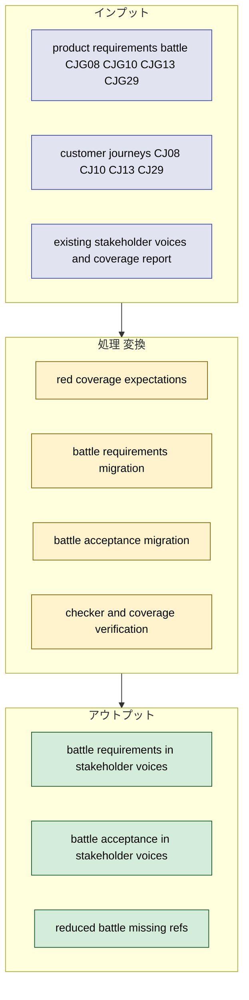
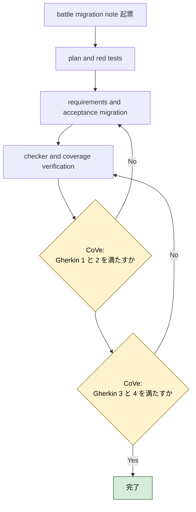
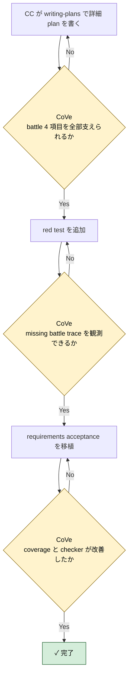

# 2026年5月9日 stakeholder_voices battle PRD migration

> 状態：⑤ Result（実装完了）
> 実装 plan: [2026-05-09-stakeholder-voices-battle-prd-migration.md](/home/exedev/code-quest-pyxel/docs/superpowers/plans/2026-05-09-stakeholder-voices-battle-prd-migration.md)

---

## 1) Journey（どこへ行くか）

- **深層的目的**：battle 系 PRD の未移植領域を stakeholder voices に取り込む
- **やらないこと**：platform / guardrails / journeys の未移植分まで同じ note で抱え込むこと

**Before（現状）**：
- 💦 coverage report で `product_requirements_battle` は `4/4 missing` になっており、`CJG08/CJG10/CJG13/CJG29` が stakeholder voices に現れていない
- 💦 敵追加、呪文追加、全体バランス調整の要求は docs にあるが、task note 起票や checker の根拠として機械参照できない
- 💦 `customer_journeys` の `CJ08/CJ10/CJ13/CJ29` も個別 trace がなく、親子のデバッグループを battle テーマで追いにくい

**After（達成状態）**：
- ❤️ `CJG08/CJG10/CJG13/CJG29` が stakeholder voices の requirement / acceptance へ移植される
- ❤️ coverage report で `product_requirements_battle` の missing refs が 0 になる
- ❤️ battle 系 task note が `doc_id:stable_ref` ベースで起票できる

---

## 2) Gherkin（完了条件）

### シナリオ1：battle PRD の 4 項目を stakeholder voices から辿れる

🧱 Given：AI や開発者が battle 系 task note を起票したい  
🎬 When：`stakeholder_voices.yml` と coverage report を見る  
✅ Then：`CJG08/CJG10/CJG13/CJG29` に対応する requirement / acceptance を機械的に辿れる

---

### シナリオ2：敵・呪文・バランス調整の体験が acceptance に落ちている

🧱 Given：`product-requirements-battle.md` には敵調整、敵追加、呪文追加、全体バランス調整の約束がある  
🎬 When：stakeholder voices に移植する  
✅ Then：子どもと親が何を変え、何を見て、どう確かめるかが acceptance で表現される

---

### シナリオ3：coverage report が battle docs の進捗改善を示す

🧱 Given：移植前は `product_requirements_battle` が `4/4 missing` である  
🎬 When：移植後に coverage report を実行する  
✅ Then：`product_requirements_battle` の referenced refs が `CJG08/CJG10/CJG13/CJG29` になり、missing refs が空になる

---

### シナリオ4：checker と task note contract を壊さない

🧱 Given：`stakeholder_voices.yml` と task note frontmatter は deterministic checker で検査される  
🎬 When：battle 系 requirement / acceptance を追加する  
✅ Then：`python tools/check_stakeholder_voices.py` は warning 0 のまま通る

---

## 3) Design（どうやるか）

- **関連スキル・MCP**：`writing-plans`, `verification-before-completion`
- `product-requirements-battle.md` の `CJG08/CJG10/CJG13/CJG29` を request 増設なしで既存 request にぶら下げ、battle 向け requirement / acceptance を厚くする
- `source_trace_refs` は `product_requirements_battle:CJGxx` と `customer_journeys:CJxx` を併記し、battle PRD と journey の両側から trace できるようにする
- 実装順は `1. rule 先行 2. deterministic check へ昇格 3. guardian は安全な正規化だけ` を守る

---

## 4) Tasklist

> 必ず上から順に実施。CCがCoVeで自力検証しながら進める。

- [x] （CC）`/superpowers:writing-plans` で plan を書き、この note に task 単位で反映する
  plan: [2026-05-09-stakeholder-voices-battle-prd-migration.md](/home/exedev/code-quest-pyxel/docs/superpowers/plans/2026-05-09-stakeholder-voices-battle-prd-migration.md)
- [x] （CC）battle migration 用 red test を追加する
- [x] （CC）`CJG08/CJG10/CJG13/CJG29` を stakeholder voices に移植する
- [x] （CC）coverage report と checker の改善を確認する
- [x] （CC）Result に実装過程、Discussion に結論・懸念・次ノート候補を残す

### 作業記録

#### 2026年5月9日 起票

**Observe**：coverage report で `product_requirements_battle` は `4/4 missing` のまま残っており、次の最小移植単位として独立させやすい。  
**Think**：battle は敵調整、敵追加、呪文追加、全体バランス調整の 4 項目だけなので、1 note で閉じても scope が暴れにくい。  
**Act**：battle PRD migration 専用の task note を起票し、Journey / Gherkin / Design / Tasklist に `CJG08/CJG10/CJG13/CJG29` 移植の作業枠を固定した。

---

## 5) Result（成果物）

- `writing-plans` に従って [2026-05-09-stakeholder-voices-battle-prd-migration.md](/home/exedev/code-quest-pyxel/docs/superpowers/plans/2026-05-09-stakeholder-voices-battle-prd-migration.md) を作成し、`coverage red -> YAML migration -> checker/report verify` の順に実装計画を固定した。
- red test として [test_source_trace_coverage_report.py](/home/exedev/code-quest-pyxel/test/test_source_trace_coverage_report.py) に `product_requirements_battle` の `referenced_refs == CJG08/CJG10/CJG13/CJG29` と `missing_refs == []` を追加し、[test_stakeholder_voices_checker.py](/home/exedev/code-quest-pyxel/test/test_stakeholder_voices_checker.py) に real repo の requirement / acceptance 数が 21 以上になる期待を追加した。移植前は `referenced_refs == []` と `requirements == 17` で red だった。
- [stakeholder_voices.yml](/home/exedev/code-quest-pyxel/docs/stakeholder_voices.yml) に battle 系 requirement 4 件と acceptance 4 件を追加した。
  - requirements: `req_enemy_balance_adjustable`, `req_new_enemy_spawn_and_render`, `req_new_spell_usable_feedback`, `req_global_balance_tunable_replay`
  - acceptance: `acc_enemy_balance_adjustable_roundtrip`, `acc_new_enemy_spawn_and_render`, `acc_new_spell_usable_feedback`, `acc_global_balance_tunable_replay`
- request は増設せず、既存の `rq_parent_fast_feedback`, `rq_child_edit_ownership`, `rq_child_decision_power` にぶら下げた。これで request 層を増やしすぎず、battle 体験の requirement / acceptance だけを拡張できた。
- `source_trace_refs` は 4 件すべてで `customer_journeys:CJ08/CJ10/CJ13/CJ29` と `product_requirements_battle:CJG08/CJG10/CJG13/CJG29` を持つため、battle PRD と journeys の両側から trace できる。
- CoVe:
  - シナリオ1 `battle PRD の 4 項目を stakeholder voices から辿れる`: coverage report で `product_requirements_battle` の `referenced_refs` が `CJG08/CJG10/CJG13/CJG29` になり達成。
  - シナリオ2 `敵・呪文・バランス調整の体験が acceptance に落ちている`: 敵調整、敵追加、呪文追加、全体バランス調整を 4 requirement / 4 acceptance に分離して達成。
  - シナリオ3 `coverage report が battle docs の進捗改善を示す`: `product_requirements_battle` は `4/4 missing` から `0 missing` へ改善し達成。
  - シナリオ4 `checker と task note contract を壊さない`: `python tools/check_stakeholder_voices.py` は `warning_rules: 0` を維持し達成。
- focused verify:
  - `python -m pytest test/test_source_trace_coverage_report.py test/test_stakeholder_voices_checker.py -q` -> `16 passed`
- full stakeholder verify:
  - `python -m pytest test/test_source_trace_coverage_report.py test/test_stakeholder_voices_checker.py test/test_fix_stakeholder_voices.py test/test_repair_stakeholder_voices.py -q` -> `21 passed`
  - `python tools/report_source_trace_coverage.py`
  - `python tools/check_stakeholder_voices.py`

---

## 6) Discussion（反省）

- 結論：battle PRD の 4 項目は request を増やさずに整理できた。親子の調整ループと子どもの所有感に battle requirement をぶら下げる形で十分に読める。
- 結論：`manual` と `deterministic` を混在させたのは妥当だった。敵調整や呪文追加は test refs に寄せ、見た目つきの遭遇や通しプレイ判定は manual に残した方が無理がない。
- 懸念：battle requirement の一部は `assets/*.yaml` と runtime の整合に依存するため、将来的に YAML 変更専用の deterministic scenario が増えると、`verification.refs` をさらに強くできる。
- 懸念：`customer_journeys` は battle 移植で 4 件減ったが、まだ `CJ09/CJ12/CJ14/CJ15/CJ16/CJ17/CJ18/CJ19/CJ20/CJ24/CJ25/CJ26/CJ27/CJ28/CJ30/CJ36/CJ38/CJ39/CJ40/CJ42` が未移植で残る。
- 次に起票すべき task note 1：`product-requirements-platform.md` の `CJG12/CJG20/CJG25/CJG26` を stakeholder voices へ移植する note
- 次に起票すべき task note 2：`customer_journeys` の残り missing を theme ごとに束ねる note

---

### 反省とルール化

- 次にやること：platform PRD migration note を起票し、`product_requirements_platform 4 missing` を次の red にする
