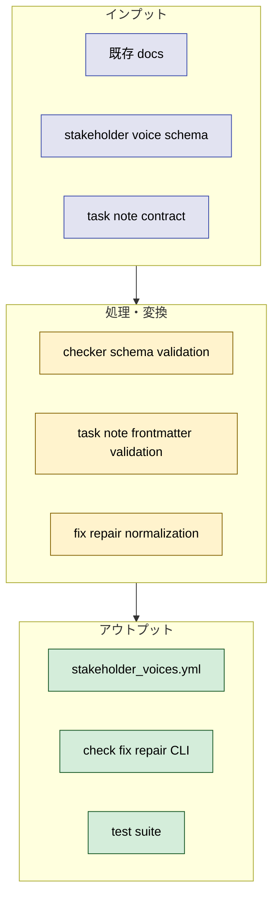
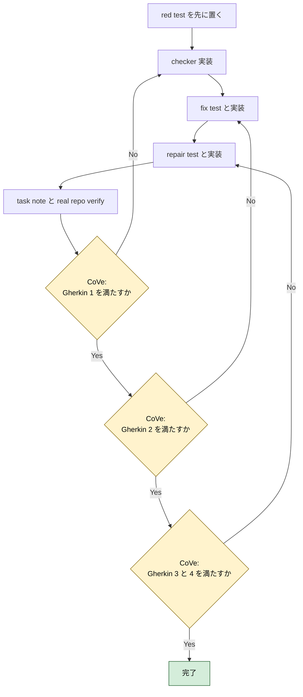

# 2026年5月9日 stakeholder_voices bootstrap

> 状態：⑤ Result（実装完了）
> 次のゲート：なし

---

## 1) Journey（どこへ行くか）

- **深層的目的**：要求の根拠 YAML を AI が安全に更新できるようにする
- **やらないこと**：既存の `customer-journeys.md` や task note 全体運用を一気に置き換えること

**Before（現状）**：
- 💦 `customer / user / developer / ai / 経営者 / marketer` を一緒に扱う正本 YAML がなく、AI が要望からコード修正根拠を毎回 prose で再解釈している
- 💦 `architecture_rules` のような `check / fix / repair` 入口がなく、task note や requirement の整合を機械で見られない
- 💦 task note に `result` / `discussion` を残しても requirement 参照とのつながりが固定されていない

**After（達成状態）**：
- ❤️ `docs/stakeholder_voices.yml` が stakeholder / request / requirement / tasknote contract / validation rule の正本として存在する
- ❤️ `tools/check_stakeholder_voices.py` / `fix` / `repair` が最低限動き、AI が安全な正規化と整合検査を回せる
- ❤️ この task note 自体が新 contract を先行利用し、`Result` に作業過程、`Discussion` に結論と懸念と次ノート候補を残せる

---

## 2) Gherkin（完了条件）

### シナリオ1：AI が根拠 YAML を更新しても参照切れを検知できる

🧱 Given：AI が `docs/stakeholder_voices.yml` に stakeholder / request / requirement を追加または更新する  
🎬 When：`python tools/check_stakeholder_voices.py` を実行する  
✅ Then：壊れた `stakeholder_id` / `request_id` / `requirement_id` 参照や欠けた code hint を warning として返せる

---

### シナリオ2：安全な YAML ドリフトは fix / repair で自動正規化できる

🧱 Given：`stakeholder_ids` や `verification_refs` に重複や順序ゆれのある YAML がある  
🎬 When：`python tools/fix_stakeholder_voices.py` または `python tools/repair_stakeholder_voices.py` を実行する  
✅ Then：安全な範囲の正規化だけが適用され、再検査で clean になる

---

### シナリオ3：task note は requirement と verification を frontmatter で追跡できる

🧱 Given：`steering/` に requirement を参照する task note がある  
🎬 When：checker が note frontmatter を読む  
✅ Then：`requirement_ids` `stakeholder_ids` `done_checks` などの必須項目を検証できる

---

### シナリオ4：実装過程と結論が note に残る

🧱 Given：この bootstrap 作業を最後まで実行する  
🎬 When：作業を区切りごとに検証して note を更新する  
✅ Then：作業過程は `Result` に、結論・懸念点・次に起票すべき task note は `Discussion` に残る

---

## 3) Design（どうやるか）

- **関連スキル・MCP**：`writing-plans`, `test-driven-development`, `verification-before-completion`
- `architecture_rules` と同じく薄い CLI + package 実装に寄せる
- ただし `tree-first` ではなく `requirement-first` schema にし、repo 木ではなく stakeholder request と code hint を主役にする
- 実装順は `1. rule 先行 2. deterministic check へ昇格 3. repair は安全な正規化だけ` を守る

---

## 4) Tasklist

- [x] `docs/superpowers/plans/2026-05-09-stakeholder-voices-bootstrap.md` に implementation plan を保存する
- [x] red：`test/test_stakeholder_voices_checker.py` を追加し、module / real YAML / deterministic warnings の失敗を確認する
- [x] green：`docs/stakeholder_voices.yml` と checker 本体を実装し、checker test を通す
- [x] red：`test/test_fix_stakeholder_voices.py` と `test/test_repair_stakeholder_voices.py` を追加し、missing module / missing autofix の失敗を確認する
- [x] green：fix / repair package と薄い CLI を実装し、safe normalization を通す
- [x] verify：focused test 3 本と CLI 実行結果を `done_checks` に記録する
- [x] note update：`Result` に作業過程、`Discussion` に結論・懸念点・次 task note を記入する

---

## 5) Result（成果物）

### 2026-05-09 00:00 Planning

- `writing-plans` / `manage-tasknotes` / `TDD` / `verification-before-completion` の手順を読み、worktree はユーザー確認禁止のため現ワークツリーで進めると決めた
- この note を起票し、frontmatter に requirement / stakeholder / affected path / verification ref を先に置いた
- Gherkin を 4 本に固定し、bootstrap 範囲を `docs/stakeholder_voices.yml` と `tools/stakeholder_voices/` と focused tests に絞った

### 2026-05-09 00:10 Checker Red

- `test/test_stakeholder_voices_checker.py` を追加した
- `python -m pytest test/test_stakeholder_voices_checker.py -q` を実行し、`docs/stakeholder_voices.yml` と `tools/check_stakeholder_voices.py` が未作成で失敗することを確認した
- これで Gherkin 1 の「壊れた参照や欠けた code hint を checker が見る」前提に必要な red を確保した

### 2026-05-09 00:20 Checker Green

- `docs/stakeholder_voices.yml` に 7 stakeholder、9 request、10 requirement、task note contract、7 validation rule を追加した
- `tools/check_stakeholder_voices.py` と `tools/stakeholder_voices/check_stakeholder_voices.py` を実装した
- deterministic rule は `id_uniqueness` `stakeholder_reference_integrity` `request_reference_integrity` `requirement_has_code_hints` `referenced_paths_exist` `tasknote_frontmatter_integrity` `normalized_requirement_lists` を持つ
- `python -m pytest test/test_stakeholder_voices_checker.py -q` を再実行し、5 pass を確認した
- これで Gherkin 1 と Gherkin 3 の最小成立条件を満たした

### 2026-05-09 00:30 Fix Repair Red

- `test/test_fix_stakeholder_voices.py` と `test/test_repair_stakeholder_voices.py` を追加した
- `python -m pytest test/test_fix_stakeholder_voices.py test/test_repair_stakeholder_voices.py -q` を実行し、`tools/fix_stakeholder_voices.py` と `tools/repair_stakeholder_voices.py` が未作成で失敗することを確認した
- synthetic fixture では `normalized_requirement_lists` を autofix できること、`referenced_paths_exist` は human 判断を残すことをテストで固定した

### 2026-05-09 00:40 Fix Repair Green

- `tools/fix_stakeholder_voices.py` / `tools/repair_stakeholder_voices.py` と package 本体を実装した
- autofix は requirement list の sort / dedupe だけに限定し、他の warning は `NEEDS_HUMAN` で止めるようにした
- `python -m pytest test/test_fix_stakeholder_voices.py test/test_repair_stakeholder_voices.py -q` を再実行し、5 pass を確認した
- これで Gherkin 2 の「安全な YAML ドリフトは fix / repair で自動正規化できる」を満たした

### 2026-05-09 00:50 Final Verify

- `python -m pytest test/test_stakeholder_voices_checker.py test/test_fix_stakeholder_voices.py test/test_repair_stakeholder_voices.py -q` を実行し、10 pass を確認した
- `python tools/check_stakeholder_voices.py` を実行し、7 rule / warning 0 の JSON を確認した
- `python tools/fix_stakeholder_voices.py` を実行し、`status: OK` と `applied_fixes: []` を確認した
- `python tools/repair_stakeholder_voices.py` を実行し、`status: OK` と `cycles: 1` を確認した
- `done_checks` 更新後に同じ 4 コマンドを再実行し、task note frontmatter を含めても clean のままであることを確認した
- これで Gherkin 4 の「作業過程と結論が note に残る」を満たす証拠が揃った

---

## 6) Discussion（反省）

- 結論：`docs/stakeholder_voices.yml` を requirement-first な正本として追加し、`check / fix / repair` の最小一式と focused test を bootstrap できた
- 結論：task note frontmatter validation は opt-in 方式にしたことで、既存 `steering/` を壊さずに新 contract を先行適用できた
- 懸念点：現時点では `tasknote_frontmatter_integrity` は「必須 key と参照 id の整合」までで、note の `affected_paths` / `verification_refs` が requirement と本当に一致するかまでは見ていない
- 懸念点：`stakeholder_voices.yml` は新規 docs / tools を repo の構造文書や `architecture_rules.yml` へまだ接続していない
- 次に起票すべき task note：`stakeholder_voices を customer-journeys / repository-structure / architecture_rules に接続する`
- 次に起票すべき task note：`tasknote_frontmatter_integrity を requirement の path / verification subset まで昇格する`

### 反省とルール化

- 次にやること：`stakeholder_voices` を既存 journey / PRD / repository map にどう接続するかを別ノートで詰める
