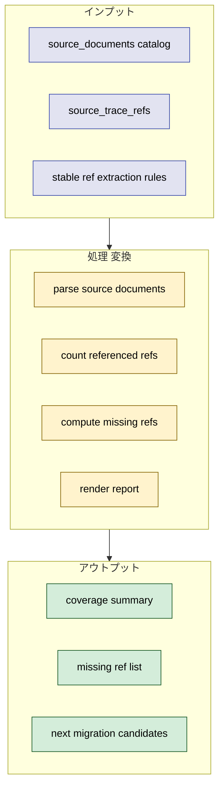
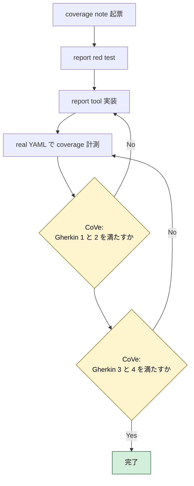
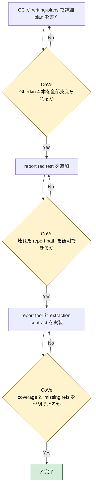

# 2026年5月9日 stakeholder_voices coverage report

> 状態：⑤ Result（実装完了）
> 実装 plan: [2026-05-09-stakeholder-voices-coverage-report.md](/home/exedev/code-quest-pyxel/docs/superpowers/plans/2026-05-09-stakeholder-voices-coverage-report.md)

---

## 1) Journey（どこへ行くか）

- **深層的目的**：未移植 docs を見える化する
- **やらないこと**：coverage が低い docs をこの task で全部 requirement 化すること

**Before（現状）**：
- 💦 `source_trace_refs` は入ったが、どの docs のどの stable ref がまだ YAML に出てこないかを一覧できない
- 💦 `どこまで移植できたか` を話すたびに ad-hoc 集計が必要で、継続運用しにくい
- 💦 `customer-jobs` のような docs を追加しても、coverage が上がったのか下がったのか比較しにくい

**After（達成状態）**：
- ❤️ source document ごとの total / referenced / missing stable ref を report できる
- ❤️ `stakeholder_voices.yml` の structured traceability 進捗を機械的に説明できる
- ❤️ 次にどの journey / requirement を移植すべきかを report から起票できる

---

## 2) Gherkin（完了条件）

### シナリオ1：source document ごとの coverage を見られる

🧱 Given：`stakeholder_voices.yml` に source document catalog と `source_trace_refs` がある  
🎬 When：coverage report を実行する  
✅ Then：doc ごとに total stable refs / referenced refs / missing refs が出る

---

### シナリオ2：missing stable ref を次タスク候補として拾える

🧱 Given：まだ YAML に現れていない `CJ / CJG / job / rule` がある  
🎬 When：coverage report を見る  
✅ Then：missing ref 一覧から次に移植すべき docs 項目を判断できる

---

### シナリオ3：report 生成が壊れた traceability を隠さない

🧱 Given：unknown doc id や parse できない source document がある  
🎬 When：report を実行する  
✅ Then：coverage を成功したふりで出さず、異常を見える形で返す

---

### シナリオ4：coverage report は継続運用できる

🧱 Given：今後 source document が増える  
🎬 When：同じ report を再実行する  
✅ Then：追加 docs も同じ contract で集計でき、少なくとも既存 docs を壊さない

---

## 3) Design（どうやるか）

- **関連スキル・MCP**：`writing-plans`, `test-driven-development`, `verification-before-completion`
- `stakeholder_voices.yml` 側で source document ごとの ref extraction contract を持ち、report tool はそれを読む
- report は first pass では JSON または markdown の deterministic summary を返せばよい
- 実装順は `1. rule 先行 2. deterministic check へ昇格 3. guardian は安全な正規化だけ` を守る

---

## 4) Tasklist

> 必ず上から順に実施。CCがCoVeで自力検証しながら進める。

- [x] （CC）`/superpowers:writing-plans` で plan を書き、この note に task 単位で反映する
  plan: [2026-05-09-stakeholder-voices-coverage-report.md](/home/exedev/code-quest-pyxel/docs/superpowers/plans/2026-05-09-stakeholder-voices-coverage-report.md)
- [x] （CC）coverage report 用 red test を追加する
- [x] （CC）source document extraction contract と report tool を実装する
- [x] （CC）real YAML の coverage を計測する
- [x] （CC）Result に実装過程、Discussion に結論・懸念・次ノート候補を残す

### 作業記録

#### 2026年5月9日 起票

**Observe**：structured traceability は入ったが、coverage report がないので未移植領域をすぐには棚卸しできない。  
**Think**：report を tool 化すれば、task note 起票の根拠と優先順位付けに再利用できる。  
**Act**：coverage report 専用の task note を起票し、Journey / Gherkin / Design / Tasklist に report 化の作業枠を固定した。

---

## 5) Result（成果物）

- `writing-plans` に従って [2026-05-09-stakeholder-voices-coverage-report.md](/home/exedev/code-quest-pyxel/docs/superpowers/plans/2026-05-09-stakeholder-voices-coverage-report.md) を作成し、`red test -> extraction contract -> report module -> real repo verification` の順で作業境界を固定した。
- red test として [test_source_trace_coverage_report.py](/home/exedev/code-quest-pyxel/test/test_source_trace_coverage_report.py) を追加し、`counts`, `missing extraction contract`, `unknown doc id`, `real repo CLI` の 4 観点を先に定義した。`python -m pytest test/test_source_trace_coverage_report.py -q` は tool 未実装の時点で 4 failures を返し、plan の想定どおり red になった。
- [stakeholder_voices.yml](/home/exedev/code-quest-pyxel/docs/stakeholder_voices.yml) の `facts.source_documents` 7 件すべてに extraction contract を追加した。`customer_jobs` は `JOB:[A-Z0-9_]+`、`customer_journeys` は `CJ\d+`、PRD docs は `CJG\d+`、`framework_rule` は `M1-M5` + `SSoT / Golden Path Test / No Silent Failure` の mixed extraction とした。
- 新規 module [source_trace_coverage.py](/home/exedev/code-quest-pyxel/tools/stakeholder_voices/source_trace_coverage.py) を追加し、source document ごとの `total_refs / referenced_refs / missing_refs / unexpected_referenced_refs` を集計できるようにした。壊れた doc id、missing file、invalid extraction contract、doc から消えた literal は `BROKEN_TRACEABILITY` として fail closed する。
- thin CLI [report_source_trace_coverage.py](/home/exedev/code-quest-pyxel/tools/report_source_trace_coverage.py) を追加し、report を JSON で返せるようにした。追加 doc は `source_documents` entry に contract を足すだけで同じ集計に入る。
- CoVe:
  - シナリオ1 `source document ごとの coverage を見られる`: `python tools/report_source_trace_coverage.py` で 7 docs それぞれの total/referenced/missing を確認でき、達成。
  - シナリオ2 `missing stable ref を次タスク候補として拾える`: real repo の missing count は `customer_journeys 31`, `product_requirements_map 7`, `product_requirements_guardrails 5`, `product_requirements_battle 4`, `product_requirements_platform 4`, `customer_jobs 3`, `framework_rule 0` と集計でき、次タスク候補を定量化できた。
  - シナリオ3 `report 生成が壊れた traceability を隠さない`: fixture で `unknown_doc_id` と `invalid_extraction_contract` を `BROKEN_TRACEABILITY` にすることを確認し、達成。
  - シナリオ4 `coverage report は継続運用できる`: extraction contract は `source_documents` entry ごとの local contract に閉じており、既存 docs 7 件はすべて `status: ok` で継続実行できることを確認した。
- real repo の coverage summary:
  - total documents: `7`
  - broken documents: `0`
  - total extracted refs: `92`
  - total referenced refs: `38`
  - total missing refs: `54`
- 最終確認:
  - `python -m pytest test/test_source_trace_coverage_report.py test/test_stakeholder_voices_checker.py test/test_fix_stakeholder_voices.py test/test_repair_stakeholder_voices.py -q` -> `19 passed`
  - `python tools/report_source_trace_coverage.py` -> `status: OK`
  - `python tools/check_stakeholder_voices.py` -> `warning_rules: 0`

---

## 6) Discussion（反省）

- 結論：coverage report は first pass では JSON で十分だった。task note 起票の根拠として必要なのは見た目より deterministic な total/referenced/missing で、そこは達成できた。
- 結論：`source_documents` に extraction contract を持たせたことで、coverage 集計は checker 本体に依存せず doc catalog だけで拡張できるようになった。
- 懸念：regex ベースの extraction は doc 内 token の存在を拾うだけで、将来的に section-level coverage や prose の意味的対応までは見ない。必要になれば `stable_ref -> label` catalog へ進める余地がある。
- 懸念：missing refs の母数が大きく、全部を 1 note で移植するのは悪手。`customer_journeys` 31 件をさらにテーマごとに分割して task note 化した方がよい。
- 次に起票すべき task note 1：`product-requirements-map.md` の `CJG01-CJG07` を stakeholder voices へ移植する note
- 次に起票すべき task note 2：`product-requirements-battle.md` の `CJG08/CJG10/CJG13/CJG29` を stakeholder voices へ移植する note

---

### 反省とルール化

- 次にやること：coverage report を根拠に `map` と `battle` の未移植 PRD を別 task note に切り出す
