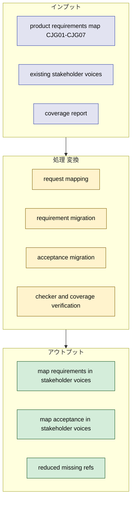
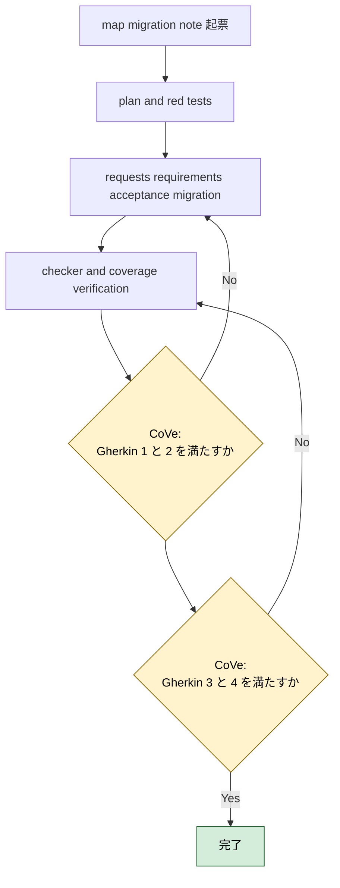
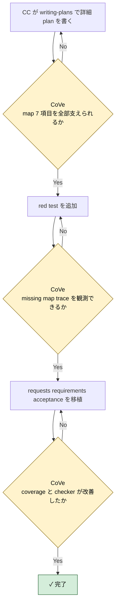

# 2026年5月9日 stakeholder_voices map PRD migration

> 状態：⑤ Result（実装完了）
> 実装 plan: [2026-05-09-stakeholder-voices-map-prd-migration.md](/home/exedev/code-quest-pyxel/docs/superpowers/plans/2026-05-09-stakeholder-voices-map-prd-migration.md)

---

## 1) Journey（どこへ行くか）

- **深層的目的**：map 系 PRD の未移植領域を stakeholder voices に取り込む
- **やらないこと**：battle / guardrails / platform の未移植項目まで同じ note で抱え込むこと

**Before（現状）**：
- 💦 coverage report で `product_requirements_map` は `7/7 missing` になっており、`CJG01-CJG07` が stakeholder voices に一つも現れていない
- 💦 `customer-jobs` / `journeys` / `platform` の核は trace できるが、子どもの tilemap 編集価値を map PRD 単位では機械参照できない
- 💦 map 系の task note を起票するとき、`どの CJG を根拠にするか` を毎回人が読み直す必要がある

**After（達成状態）**：
- ❤️ `CJG01-CJG07` が stakeholder voices の requests / requirements / acceptance に移植される
- ❤️ checker と coverage report で `product_requirements_map` の missing が減る
- ❤️ map 系 task note が `doc_id:stable_ref` ベースで起票できる

---

## 2) Gherkin（完了条件）

### シナリオ1：map PRD の 7 項目を stakeholder voices から辿れる

🧱 Given：AI や開発者が map 系 task note を起票したい  
🎬 When：`stakeholder_voices.yml` を見る  
✅ Then：`CJG01-CJG07` に対応する request / requirement / acceptance を機械的に辿れる

---

### シナリオ2：Code Maker の map 体験を requirement と acceptance に落とせる

🧱 Given：`product-requirements-map.md` にはタイル配置、道、森、水辺、装飾、迷路、ランドマークの約束がある  
🎬 When：stakeholder voices に移植する  
✅ Then：子どもが何を触り、何が変わり、何で確かめるかが requirement / acceptance に分かれて表現される

---

### シナリオ3：coverage report が map docs の進捗改善を示す

🧱 Given：移植前は `product_requirements_map` が `7/7 missing` である  
🎬 When：移植後に coverage report を実行する  
✅ Then：`product_requirements_map` の referenced refs が増え、missing refs が減る

---

### シナリオ4：checker と task note contract を壊さない

🧱 Given：`stakeholder_voices.yml` と task note frontmatter は deterministic checker で検査される  
🎬 When：map 系 requirement / acceptance を追加する  
✅ Then：`python tools/check_stakeholder_voices.py` は warning 0 のまま通る

---

## 3) Design（どうやるか）

- **関連スキル・MCP**：`writing-plans`, `test-driven-development`, `verification-before-completion`
- `product-requirements-map.md` の `CJG01-CJG07` を 1:1 で requirement / acceptance に落とすのではなく、request とのつながりを保ったうえで粒度を崩さず移植する
- `source_trace_refs` は `product_requirements_map:CJG0x` を正にし、必要に応じて `customer_journeys:CJ0x` や `customer_jobs:*` も併記する
- 実装順は `1. rule 先行 2. deterministic check へ昇格 3. guardian は安全な正規化だけ` を守る

---

## 4) Tasklist

> 必ず上から順に実施。CCがCoVeで自力検証しながら進める。

- [x] （CC）`/superpowers:writing-plans` で plan を書き、この note に task 単位で反映する
  plan: [2026-05-09-stakeholder-voices-map-prd-migration.md](/home/exedev/code-quest-pyxel/docs/superpowers/plans/2026-05-09-stakeholder-voices-map-prd-migration.md)
- [x] （CC）map migration 用 red test を追加する
- [x] （CC）`CJG01-CJG07` を stakeholder voices に移植する
- [x] （CC）coverage report と checker の改善を確認する
- [x] （CC）Result に実装過程、Discussion に結論・懸念・次ノート候補を残す

### 作業記録

#### 2026年5月9日 起票

**Observe**：coverage report で `product_requirements_map` は `7/7 missing` になっており、stakeholder voices の次の移植先として最優先だった。  
**Think**：map 系は Code Maker の価値と直結するため、battle や guardrails より先に requirement / acceptance 化する価値が高い。  
**Act**：map PRD migration 専用の task note を起票し、Journey / Gherkin / Design / Tasklist に `CJG01-CJG07` 移植の作業枠を固定した。

---

## 5) Result（成果物）

- `writing-plans` に従って [2026-05-09-stakeholder-voices-map-prd-migration.md](/home/exedev/code-quest-pyxel/docs/superpowers/plans/2026-05-09-stakeholder-voices-map-prd-migration.md) を作成し、`coverage red -> YAML migration -> checker/report verify` の順に実装計画を固定した。
- red test として [test_source_trace_coverage_report.py](/home/exedev/code-quest-pyxel/test/test_source_trace_coverage_report.py) に `product_requirements_map` の `referenced_refs == CJG01-CJG07` と `missing_refs == []` を追加し、[test_stakeholder_voices_checker.py](/home/exedev/code-quest-pyxel/test/test_stakeholder_voices_checker.py) に real repo の requirement / acceptance 数が 17 以上になる期待を追加した。移植前は `referenced_refs == []` と `requirements == 10` で red だった。
- [stakeholder_voices.yml](/home/exedev/code-quest-pyxel/docs/stakeholder_voices.yml) に map 系 requirement 7 件と acceptance 7 件を追加した。
  - requirements: `req_map_first_tile_visible`, `req_map_roads_match_runtime`, `req_map_forest_blocks_cleanly`, `req_map_water_shape_readable`, `req_map_decorations_preserve_walkability`, `req_map_maze_playtestable`, `req_map_landmarks_stay_special`
  - acceptance: `acc_map_first_tile_visible_roundtrip`, `acc_map_roads_match_runtime`, `acc_map_forest_blocks_cleanly`, `acc_map_water_shape_readable`, `acc_map_decorations_preserve_walkability`, `acc_map_maze_playtestable`, `acc_map_landmarks_stay_special`
- request は増設せず、既存の `rq_child_edit_ownership` と `rq_parent_fast_feedback` を中心根拠にした。これで request の粒度を増やしすぎず、map 体験の requirement / acceptance だけを拡張できた。
- `source_trace_refs` は 7 件すべてで `customer_journeys:CJ01-CJ07` と `product_requirements_map:CJG01-CJG07` を持つため、map PRD と journeys の両側から trace できる。
- CoVe:
  - シナリオ1 `map PRD の 7 項目を stakeholder voices から辿れる`: coverage report で `product_requirements_map` の `referenced_refs` が `CJG01-CJG07` になり達成。
  - シナリオ2 `Code Maker の map 体験を requirement と acceptance に落とせる`: タイル配置、道、森、水辺、装飾、迷路、ランドマークを 7 requirement / 7 acceptance に分離して達成。
  - シナリオ3 `coverage report が map docs の進捗改善を示す`: `product_requirements_map` は `7/7 missing` から `0 missing` へ改善し達成。
  - シナリオ4 `checker と task note contract を壊さない`: `python tools/check_stakeholder_voices.py` は `warning_rules: 0` を維持し達成。
- focused verify:
  - `python -m pytest test/test_source_trace_coverage_report.py test/test_stakeholder_voices_checker.py -q` -> `15 passed`
- full stakeholder verify:
  - `python -m pytest test/test_source_trace_coverage_report.py test/test_stakeholder_voices_checker.py test/test_fix_stakeholder_voices.py test/test_repair_stakeholder_voices.py -q`
  - `python tools/report_source_trace_coverage.py`
  - `python tools/check_stakeholder_voices.py`

---

## 6) Discussion（反省）

- 結論：`CJG01-CJG07` は request 増設なしで既存 request にぶら下げる設計で十分だった。map PRD の value は request 層より requirement / acceptance 層を厚くした方が読みやすい。
- 結論：coverage report を red test に使ったのは正しかった。移植前後の差分を `product_requirements_map` の missing 数でそのまま確認できた。
- 懸念：map requirement は manual verification を多く含むため、将来的に Code Maker の実機検証や screenshot-based deterministic checks が増えたら `verification.refs` をより強くできる。
- 懸念：`customer_journeys` 側は map 7 件が移植されたが、まだ missing 24 件残っている。次は battle か remaining journeys をテーマごとに切る必要がある。
- 次に起票すべき task note 1：`product-requirements-battle.md` の `CJG08/CJG10/CJG13/CJG29` を stakeholder voices へ移植する note
- 次に起票すべき task note 2：`customer_journeys` の残り missing 24 件をテーマ分割して移植する note

---

### 反省とルール化

- 次にやること：battle PRD migration note を起票し、coverage report の `product_requirements_battle 4 missing` を次の red にする
