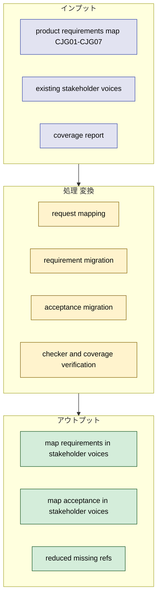
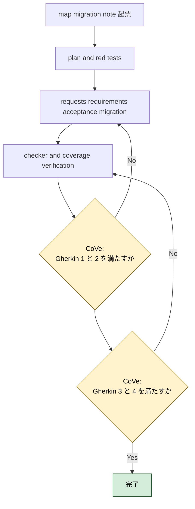
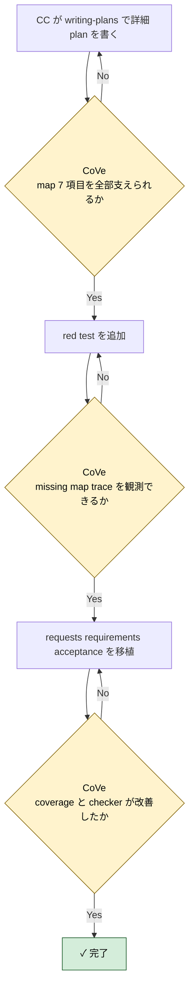

# 2026年5月9日 stakeholder_voices map PRD migration

> 状態：① Journey
> 次のゲート：（CC）`product-requirements-map.md` の `CJG01-CJG07` を requirement / acceptance へ落とす plan を書く

---

## 1) Journey（どこへ行くか）

- **深層的目的**：map 系 PRD の未移植領域を stakeholder voices に取り込む
- **やらないこと**：battle / guardrails / platform の未移植項目まで同じ note で抱え込むこと

**Before（現状）**：
- 💦 coverage report で `product_requirements_map` は `7/7 missing` になっており、`CJG01-CJG07` が stakeholder voices に一つも現れていない
- 💦 `customer-jobs` / `journeys` / `platform` の核は trace できるが、子どもの tilemap 編集価値を map PRD 単位では機械参照できない
- 💦 map 系の task note を起票するとき、`どの CJG を根拠にするか` を毎回人が読み直す必要がある

**After（達成状態）**：
- ❤️ `CJG01-CJG07` が stakeholder voices の requests / requirements / acceptance に移植される
- ❤️ checker と coverage report で `product_requirements_map` の missing が減る
- ❤️ map 系 task note が `doc_id:stable_ref` ベースで起票できる

---

## 2) Gherkin（完了条件）

### シナリオ1：map PRD の 7 項目を stakeholder voices から辿れる

🧱 Given：AI や開発者が map 系 task note を起票したい  
🎬 When：`stakeholder_voices.yml` を見る  
✅ Then：`CJG01-CJG07` に対応する request / requirement / acceptance を機械的に辿れる

---

### シナリオ2：Code Maker の map 体験を requirement と acceptance に落とせる

🧱 Given：`product-requirements-map.md` にはタイル配置、道、森、水辺、装飾、迷路、ランドマークの約束がある  
🎬 When：stakeholder voices に移植する  
✅ Then：子どもが何を触り、何が変わり、何で確かめるかが requirement / acceptance に分かれて表現される

---

### シナリオ3：coverage report が map docs の進捗改善を示す

🧱 Given：移植前は `product_requirements_map` が `7/7 missing` である  
🎬 When：移植後に coverage report を実行する  
✅ Then：`product_requirements_map` の referenced refs が増え、missing refs が減る

---

### シナリオ4：checker と task note contract を壊さない

🧱 Given：`stakeholder_voices.yml` と task note frontmatter は deterministic checker で検査される  
🎬 When：map 系 requirement / acceptance を追加する  
✅ Then：`python tools/check_stakeholder_voices.py` は warning 0 のまま通る

---

## 3) Design（どうやるか）

- **関連スキル・MCP**：`writing-plans`, `test-driven-development`, `verification-before-completion`
- `product-requirements-map.md` の `CJG01-CJG07` を 1:1 で requirement / acceptance に落とすのではなく、request とのつながりを保ったうえで粒度を崩さず移植する
- `source_trace_refs` は `product_requirements_map:CJG0x` を正にし、必要に応じて `customer_journeys:CJ0x` や `customer_jobs:*` も併記する
- 実装順は `1. rule 先行 2. deterministic check へ昇格 3. guardian は安全な正規化だけ` を守る

---

## 4) Tasklist

> 必ず上から順に実施。CCがCoVeで自力検証しながら進める。

- [ ] （CC）`/superpowers:writing-plans` で plan を書き、この note に task 単位で反映する
- [ ] （CC）map migration 用 red test を追加する
- [ ] （CC）`CJG01-CJG07` を stakeholder voices に移植する
- [ ] （CC）coverage report と checker の改善を確認する
- [ ] （CC）Result に実装過程、Discussion に結論・懸念・次ノート候補を残す

### 作業記録

#### 2026年5月9日 起票

**Observe**：coverage report で `product_requirements_map` は `7/7 missing` になっており、stakeholder voices の次の移植先として最優先だった。  
**Think**：map 系は Code Maker の価値と直結するため、battle や guardrails より先に requirement / acceptance 化する価値が高い。  
**Act**：map PRD migration 専用の task note を起票し、Journey / Gherkin / Design / Tasklist に `CJG01-CJG07` 移植の作業枠を固定した。

---

## 5) Result（成果物）

実装の場合はここに記入しなくて良い

---

## 6) Discussion（反省）

- 起票時点の仮説：`CJG01-CJG07` は request を増やしすぎず、既存の child/parent request にぶら下げながら requirement / acceptance を増やす方が扱いやすい
- 起票時点の仮説：移植後は `product_requirements_map` の missing を `0` か、それに近いところまで落とせる

---

### 反省とルール化

- 次にやること：`writing-plans` で map 7 項目の exact migration shape を固定する
