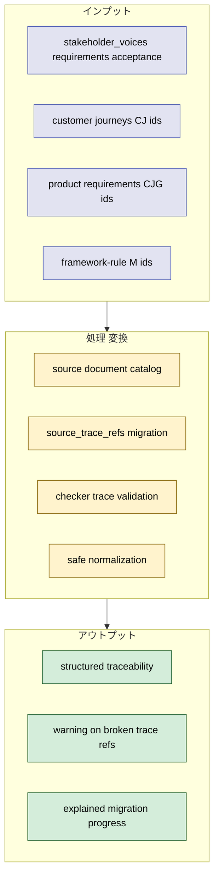
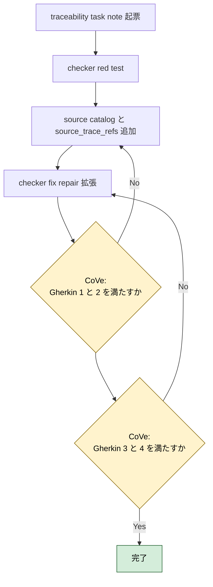
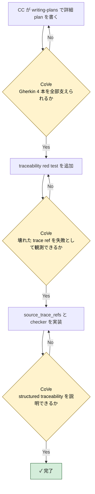

# 2026年5月9日 stakeholder_voices source traceability

> 状態：⑤ Result（実装完了）
> 実装 plan: `docs/superpowers/plans/2026-05-09-stakeholder-voices-source-traceability.md`

---

## 1) Journey（どこへ行くか）

- **深層的目的**：移植率を測れるようにする
- **やらないこと**：全 docs を一度に 1:1 requirement 化すること

**Before（現状）**：
- 💦 `stakeholder_voices.yml` は requirement / acceptance の核を持つが、どの `CJ / CJG / M-rule` を移したのかは `source_refs` の file path から人が推測するしかない
- 💦 移植率を聞かれても、「何本 docs があり、そのうち何本が structured に追えているか」を checker で示せない
- 💦 既存 docs に stable id がある部分とない部分が混在しているのに、YAML 側では同じ重みで扱っている

**After（達成状態）**：
- ❤️ `stakeholder_voices.yml` に source document catalog と structured trace ref が入り、requirement / acceptance から `CJ / CJG / M-rule` を機械参照できる
- ❤️ checker が unknown trace ref や missing trace ref を warning にできる
- ❤️ `どこまで移植できたか` を少なくとも active requirement / acceptance 単位では定量的に説明できる

---

## 2) Gherkin（完了条件）

### シナリオ1：requirement から元 docs の stable id を辿れる

🧱 Given：AI や開発者が `docs/stakeholder_voices.yml` の requirement を見る  
🎬 When：その requirement がどの既存 docs 根拠から来たかを確認したい  
✅ Then：`source_trace_refs` から `customer-journeys` の `CJxx`、`product-requirements-*` の `CJGxx`、`framework-rule` の `M-rule` を機械的に辿れる

---

### シナリオ2：壊れた trace ref は checker が止める

🧱 Given：requirement または acceptance が存在しない `doc_id` や `ref` を trace ref に持つ  
🎬 When：checker を実行する  
✅ Then：warning を返し、`どの trace ref が壊れているか` を観測できる

---

### シナリオ3：active requirement と acceptance の structured 移植率を説明できる

🧱 Given：移植の進み具合を知りたい  
🎬 When：`stakeholder_voices.yml` を見る  
✅ Then：active requirement と acceptance が structured trace ref を持っているかで、少なくとも核の移植率を説明できる

---

### シナリオ4：trace ref の list drift は safe fix できる

🧱 Given：`source_trace_refs` に重複や並び順 drift がある  
🎬 When：fix / repair を実行する  
✅ Then：trace の意味を変えずに safe normalization だけ適用される

---

## 3) Design（どうやるか）

- **関連スキル・MCP**：`writing-plans`, `test-driven-development`, `verification-before-completion`
- stable id がある docs だけを先に structured trace の対象にする。第1弾は `customer-journeys.md`, `product-requirements-map.md`, `product-requirements-battle.md`, `product-requirements-platform.md`, `product-requirements-guardrails.md`, `framework-rule.md`
- `source_refs` は file path のまま残し、別に `source_trace_refs` を足す。これで人向け参照と機械向け trace を分ける
- 実装順は `1. rule 先行 2. deterministic check へ昇格 3. guardian は安全な正規化だけ` を守る

---

## 4) Tasklist

> 必ず上から順に実施。CCがCoVeで自力検証しながら進める。

- [x] （CC）`/superpowers:writing-plans` で plan を書き、この note に task 単位で反映する
- [x] （CC）traceability 用 red test を追加する
- [x] （CC）`stakeholder_voices.yml` に source document catalog と `source_trace_refs` を追加する
- [x] （CC）checker を structured trace ref ベースで拡張する
- [x] （CC）fix / repair の safe normalization を trace ref aware に保つ
- [x] （CC）Result に実装過程、Discussion に結論・懸念・次ノート候補を残す

### 作業記録

#### 2026年5月9日 起票

**Observe**：acceptance 層は入ったが、`どの CJ/CJG/M-rule を移したか` はまだ file path だけで、機械的な移植率説明ができない。  
**Think**：stable id がある docs を先に structured trace 化すれば、全部 1:1 に移し切る前でも移植の核は測れる。  
**Act**：source traceability 専用の task note を起票し、Journey / Gherkin / Design / Tasklist に traceability schema と checker 拡張の作業枠を固定した。

---

## 5) Result（成果物）

- `writing-plans` に従って [2026-05-09-stakeholder-voices-source-traceability.md](/home/exedev/code-quest-pyxel/docs/superpowers/plans/2026-05-09-stakeholder-voices-source-traceability.md) を作り、source catalog・trace ref・checker・safe normalization の順で実装計画を固定した。
- red test として [test_stakeholder_voices_checker.py](/home/exedev/code-quest-pyxel/test/test_stakeholder_voices_checker.py) に `facts.source_documents` と `source_traceability_integrity` の期待を追加し、`python -m pytest test/test_stakeholder_voices_checker.py -q` で `source_documents` 欠落と rule 未登録を failure として確認した。
- [stakeholder_voices.yml](/home/exedev/code-quest-pyxel/docs/stakeholder_voices.yml) に `facts.source_documents` を 6 件追加した。catalog 対象は `customer-journeys.md`, `product-requirements-map.md`, `product-requirements-battle.md`, `product-requirements-platform.md`, `product-requirements-guardrails.md`, `framework-rule.md` とした。
- active requirement 10 件と active acceptance 10 件すべてに `source_trace_refs` を追加した。形式は `doc_id:stable_ref` で、`CJ`, `CJG`, `M1-M5`, `SSoT`, `Golden Path Test`, `No Silent Failure` のような docs 内 stable token を機械参照できるようにした。
- [check_stakeholder_voices.py](/home/exedev/code-quest-pyxel/tools/stakeholder_voices/check_stakeholder_voices.py) を拡張し、schema に `facts.source_documents` を必須化、ID uniqueness に source document ids を追加、`source_traceability_integrity` rule を実装した。checker は `doc_id` の解決、catalog path の実在、stable token の docs 内存在を deterministic に検証する。
- red test 2 として [test_fix_stakeholder_voices.py](/home/exedev/code-quest-pyxel/test/test_fix_stakeholder_voices.py) と [test_repair_stakeholder_voices.py](/home/exedev/code-quest-pyxel/test/test_repair_stakeholder_voices.py) に duplicate `source_trace_refs` を追加し、[fix_stakeholder_voices.py](/home/exedev/code-quest-pyxel/tools/stakeholder_voices/fix_stakeholder_voices.py) の safe normalization を `source_trace_refs` まで広げた。trace の prose や docs 選定は autofix しないまま維持した。
- structured traceability の現状値は `source_documents: 6`, `active requirements with source_trace_refs: 10/10`, `active acceptance with source_trace_refs: 10/10` になった。これで active な核については structured 移植率を 100% と説明できる。
- 最終確認として `python -m pytest test/test_stakeholder_voices_checker.py test/test_fix_stakeholder_voices.py test/test_repair_stakeholder_voices.py -q` を実行し 14 passed、`python tools/check_stakeholder_voices.py` は `warning_rules: 0`、`python tools/fix_stakeholder_voices.py` と `python tools/repair_stakeholder_voices.py` はどちらも `status: OK` を確認した。

---

## 6) Discussion（反省）

- 結論：`source_refs` と `source_trace_refs` を分離したのは正しかった。前者は人向けの参照 path、後者は checker が扱う `doc_id:stable_ref` として役割分担できた。
- 結論：移植率を「docs 全体の prose 量」ではなく、「active requirement / acceptance が structured trace ref を持っているか」で測る軸ができた。少なくとも現在の核 20 エントリについては structured traceability 100% まで進んだ。
- 懸念：`customer-jobs.md` は stable id が曖昧な見出しがあり、今回の structured trace 対象から外している。jobs レイヤの移植率はまだ数えられない。
- 懸念：`source_traceability_integrity` は token presence を見ているだけで、ref が本当に一番適切な requirement / acceptance に対応しているかまでは semantic に判断しない。
- 次に起票すべき task note 1：`customer-jobs.md` 向けの stable trace id catalog を設計し、jobs 層も structured traceability の対象にする。
- 次に起票すべき task note 2：`source_trace_refs` を使って docs 別・CJ/CJG 別の coverage report を出し、まだ YAML に現れていない journey / requirement を棚卸しできるようにする。

---

### 反省とルール化

- plan を `docs/superpowers/plans/2026-05-09-stakeholder-voices-source-traceability.md` に保存した
- `source_trace_refs` は `doc_id:stable_ref` 形式の list とし、file path 向けの `source_refs` とは分離する
