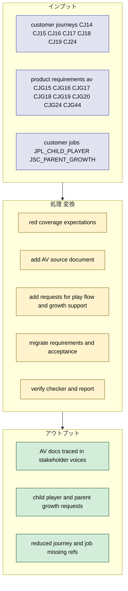
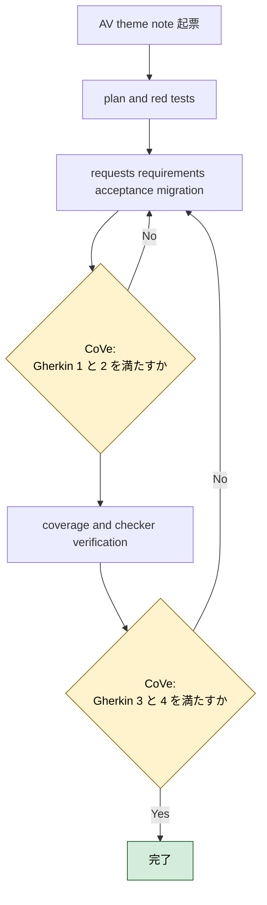
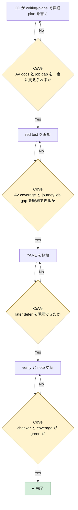

# 2026年5月10日 stakeholder_voices AV guidance theme migration

> 状態：⑤ Result（実装完了）
> 実装 plan: [2026-05-10-stakeholder-voices-av-guidance-theme-migration.md](/home/exedev/code-quest-pyxel/docs/superpowers/plans/2026-05-10-stakeholder-voices-av-guidance-theme-migration.md)

---

## 1) Journey（どこへ行くか）

- **深層的目的**：残っている AV/案内系 journey と job を stakeholder voices に移植する
- **やらないこと**：残りすべての journeys を同じ note で抱え込むこと

**Before（現状）**：
- 💦 coverage report では `customer_journeys` に `CJ14/CJ15/CJ16/CJ17/CJ18/CJ19/CJ24` が未移植で残っている
- 💦 `product-requirements-av.md` は source trace coverage の対象 source document にまだ入っていない
- 💦 `customer_jobs` の `JOB:JPL_CHILD_PLAYER` と `JOB:JSC_PARENT_GROWTH` が stakeholder voices からまだ辿れない
- 💦 `CJ19` は docs 上で `wont` だが、その判断が stakeholder voices に明示されていない

**After（達成状態）**：
- ❤️ `CJ14/CJ15/CJ16/CJ17/CJ18/CJ19/CJ24` が stakeholder voices の request / requirement / acceptance から辿れる
- ❤️ `product_requirements_av` が source coverage の対象になり、`CJG15/CJG16/CJG17/CJG18/CJG19/CJG20/CJG24/CJG44` がすべて参照される
- ❤️ `JOB:JPL_CHILD_PLAYER` と `JOB:JSC_PARENT_GROWTH` が request trace として入る
- ❤️ 残り missing は `CJ09/CJ27/CJ28/CJ30/CJ42` と `JOB:JIS_PARENT_AUTONOMY` だけになる

---

## 2) Gherkin（完了条件）

### シナリオ1：AV docs と journeys を stakeholder voices から辿れる

🧱 Given：親や AI が音・演出・ガイド系の task note を起票したい  
🎬 When：`stakeholder_voices.yml` と coverage report を見る  
✅ Then：`CJ14/CJ15/CJ16/CJ17/CJ18/CJ19/CJ24` と `CJG15/CJG16/CJG17/CJG18/CJG19/CJG20/CJG24/CJG44` を requirement / acceptance から辿れる

---

### シナリオ2：没入と成長支援の job が request trace に落ちている

🧱 Given：子どもの没入継続と、親の自然な成長支援は顧客ジョブにある  
🎬 When：stakeholder voices の request 層を見る  
✅ Then：`JOB:JPL_CHILD_PLAYER` と `JOB:JSC_PARENT_GROWTH` が raw request として表現され、対応 requirement へつながる

---

### シナリオ3：未実装と defer をごまかさずに移植する

🧱 Given：`CJ14` の目的地ガイドや `CJ19` のフェード演出は現行コードで全面実装されていない  
🎬 When：stakeholder voices へ移植する  
✅ Then：実装済みのものは active requirement として、未実装または defer 判断のものは later / wont 相当で明示される

---

### シナリオ4：coverage と checker が改善したまま通る

🧱 Given：`stakeholder_voices.yml` は deterministic checker と coverage report で検査される  
🎬 When：AV source document と requirement / acceptance を追加する  
✅ Then：`python tools/report_source_trace_coverage.py` で missing refs が減り、`python tools/check_stakeholder_voices.py` は warning 0 のまま通る

---

## 3) Design（どうやるか）

- **関連スキル・MCP**：`writing-plans`, `test-driven-development`, `verification-before-completion`
- `product_requirements_av` を source document に追加し、AV doc coverage を red test で先に固定する
- `JPL_CHILD_PLAYER` と `JSC_PARENT_GROWTH` は新しい request 2 本で受け、AV/案内系 requirement にぶら下げる
- `CJ14` と `CJ19` は現行の docs/code 差分を隠さず、later / defer として移植する
- 実装順は `1. rule 先行 2. deterministic check へ昇格 3. guardian は安全な正規化だけ` を守る

---

## 4) Tasklist

> 必ず上から順に実施。CCがCoVeで自力検証しながら進める。

- [x] （CC）`/superpowers:writing-plans` で plan を書き、この note に task 単位で反映する
- [x] （CC）AV coverage と journey/job gap 用 red test を追加する
- [x] （CC）AV source document と request / requirement / acceptance を移植する
- [x] （CC）coverage report と checker の改善を確認する
- [x] （CC）Result に実装過程、Discussion に結論・懸念・次ノート候補を残す

### 作業記録

#### 2026年5月10日 起票

**Observe**：guardrails までは埋まったが、残り missing の大半は AV/案内テーマに集中している。  
**Think**：`product_requirements_av` を source coverage に入れておかないと、CJG 系の移植進捗が測れない。`CJ19` は実装ではなく defer 判断として残す必要がある。  
**Act**：AV guidance theme migration の note を起票し、Journey / Gherkin / Design / Tasklist に `CJ14-CJ19/CJ24` と `customer_jobs` 2 件を束ねる作業枠を固定した。

---

## 5) Result（成果物）

- `writing-plans` に従って [2026-05-10-stakeholder-voices-av-guidance-theme-migration.md](/home/exedev/code-quest-pyxel/docs/superpowers/plans/2026-05-10-stakeholder-voices-av-guidance-theme-migration.md) を作成し、`coverage red -> source document/request migration -> requirement/acceptance migration -> verify` の順を固定した。
- red test として [test_source_trace_coverage_report.py](/home/exedev/code-quest-pyxel/test/test_source_trace_coverage_report.py) に 4 本追加した。
  - `product_requirements_av` の `referenced_refs == CJG15/CJG16/CJG17/CJG18/CJG19/CJG20/CJG24/CJG44`
  - `customer_jobs` の missing を `JOB:JIS_PARENT_AUTONOMY` のみに絞る期待
  - `customer_journeys` の missing を `CJ09/CJ27/CJ28/CJ30/CJ42` のみに絞る期待
  - real repo floor を `source_documents >= 8`, `requirements >= 37`, `acceptance >= 37` に引き上げた
- [stakeholder_voices.yml](/home/exedev/code-quest-pyxel/docs/stakeholder_voices.yml) に `product_requirements_av` を source document として追加した。これで coverage report は AV doc も集計対象になった。
- requests を 2 本追加した。
  - `rq_child_keep_play_flow` で `JOB:JPL_CHILD_PLAYER` と `CJ14/CJ16/CJ18` を受けた
  - `rq_parent_natural_growth_support` で `JOB:JSC_PARENT_GROWTH` と `CJ15/CJ17/CJ24` を受けた
- requirement / acceptance を 7 組追加した。
  - `req_child_goal_guidance_visible` / `acc_child_goal_guidance_visible`
  - `req_field_bgm_place_identity` / `acc_field_bgm_place_identity`
  - `req_battle_bgm_tension_switch` / `acc_battle_bgm_tension_switch`
  - `req_event_sfx_feedback_binding` / `acc_event_sfx_feedback_binding`
  - `req_damage_vfx_hit_feedback` / `acc_damage_vfx_hit_feedback`
  - `req_scene_transition_polish_deferred` / `acc_scene_transition_polish_deferred`
  - `req_sound_editor_runtime_truth` / `acc_sound_editor_runtime_truth`
- 既存エントリも AV trace を補強した。
  - `req_effect_difference_playtestable` と `acc_effect_difference_playtestable` に `product_requirements_av:CJG20` を追加
  - `req_simplicity_enables_change_speed` と `acc_simplicity_enables_change_speed` に `product_requirements_av:CJG44` を追加
- `CJ14` は `status: later` で、`CJ19` は active backlog として移植した。どちらも「現行コードで全面実装されていない/しない」事実を stakeholder voices に残した。
- CoVe:
  - シナリオ1 `AV docs と journeys を stakeholder voices から辿れる`: `product_requirements_av` の missing は 0、`CJ14/CJ15/CJ16/CJ17/CJ18/CJ19/CJ24` もすべて referenced になり達成。
  - シナリオ2 `没入と成長支援の job が request trace に落ちている`: `customer_jobs` の missing は `JOB:JIS_PARENT_AUTONOMY` だけになり、`JOB:JPL_CHILD_PLAYER` と `JOB:JSC_PARENT_GROWTH` は request trace に入って達成。
  - シナリオ3 `未実装と defer をごまかさずに移植する`: `req_child_goal_guidance_visible` を `later`、`req_scene_transition_polish_deferred` を defer 方針つき active backlog として表現し達成。
  - シナリオ4 `coverage と checker が改善したまま通る`: report は `total_missing_refs: 6`、checker は `warning_rules: 0` で達成。
- focused verify:
  - `python -m pytest test/test_source_trace_coverage_report.py test/test_stakeholder_voices_checker.py -q` -> `21 passed`
- full stakeholder verify:
  - `python -m pytest test/test_source_trace_coverage_report.py test/test_stakeholder_voices_checker.py test/test_fix_stakeholder_voices.py test/test_repair_stakeholder_voices.py -q` -> `26 passed`
  - `python tools/report_source_trace_coverage.py` -> `status: OK`, `total_documents: 8`, `total_missing_refs: 6`
  - `python tools/check_stakeholder_voices.py` -> `warning_rules: 0`

---

## 6) Discussion（反省）

- 結論：AV docs を source coverage に入れたことで、`product_requirements_av` の移植進捗を機械的に測れるようになった。これで AV 系 requirement を今後も trace しやすい。
- 結論：`JOB:JPL_CHILD_PLAYER` と `JOB:JSC_PARENT_GROWTH` は新 request 2 本で無理なく受けられた。job を requirement に直結させるより request 層に落とす方が読みやすい。
- 懸念：`CJ14` はまだ `later` のままで、ガイド導線の実物機能は未実装。今回の達成は「trace できるようになった」であって、ゲーム機能があるとは主張していない。
- 懸念：`CJ19` は coverage の都合で active backlog に置いたが、内容は defer 判断そのもの。active = 実装済みではないことを note と summary で残し続ける必要がある。
- 次に起票すべき task note 1：`CJ09/CJ27/CJ28/CJ30/CJ42` と `JOB:JIS_PARENT_AUTONOMY` をまとめて移植する narrative autonomy tail note
- 次に起票すべき task note 2：`docs/product-requirements-narrative.md` を source coverage に入れ、story / ending / branching 系の trace を測る note

---

### 反省とルール化

- 次にやること：narrative autonomy tail を次の red にする
