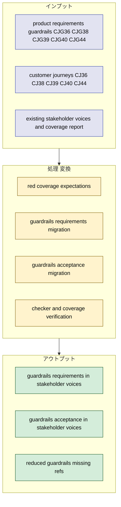
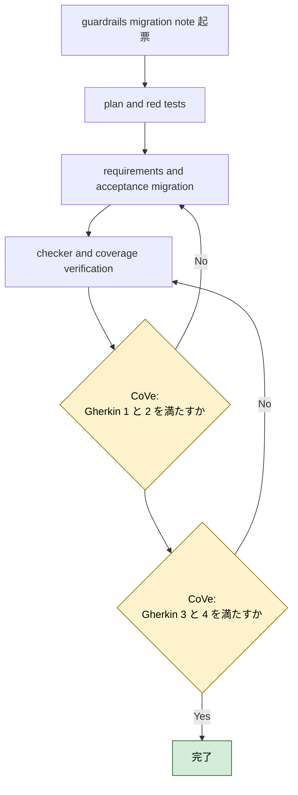
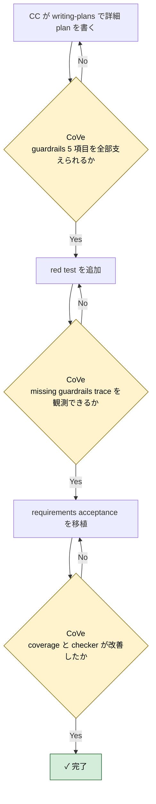

# 2026年5月10日 stakeholder_voices guardrails PRD migration

> 状態：⑤ Result（実装完了）
> 実装 plan: [2026-05-10-stakeholder-voices-guardrails-prd-migration.md](/home/exedev/code-quest-pyxel/docs/superpowers/plans/2026-05-10-stakeholder-voices-guardrails-prd-migration.md)

---

## 1) Journey（どこへ行くか）

- **深層的目的**：guardrails PRD の未移植領域を stakeholder voices に取り込む
- **やらないこと**：残り journeys 全体まで同じ note で抱え込むこと

**Before（現状）**：
- 💦 coverage report で `product_requirements_guardrails` は `CJG36/CJG38/CJG39/CJG40/CJG44` が missing のまま残っている
- 💦 データ SSoT、イベント追加安全性、システム変更安全性、セーブ互換、大きすぎる複雑さの抑制は docs にあるが、task note 起票や checker の根拠として機械参照しづらい
- 💦 `CJ35/CJG35`, `CJ37/CJG37`, `CJ41/CJG41` だけ先に stakeholder voices 化されているため、guardrails の coverage が途中で止まっている

**After（達成状態）**：
- ❤️ `CJG36/CJG38/CJG39/CJG40/CJG44` が stakeholder voices の requirement / acceptance へ移植される
- ❤️ coverage report で `product_requirements_guardrails` の missing refs が 0 になる
- ❤️ guardrails 系 task note が `doc_id:stable_ref` ベースで起票できる

---

## 2) Gherkin（完了条件）

### シナリオ1：guardrails PRD の残り 5 項目を stakeholder voices から辿れる

🧱 Given：AI や開発者が guardrails 系 task note を起票したい  
🎬 When：`stakeholder_voices.yml` と coverage report を見る  
✅ Then：`CJG36/CJG38/CJG39/CJG40/CJG44` に対応する requirement / acceptance を機械的に辿れる

---

### シナリオ2：SSoT と safety gate の体験が acceptance に落ちている

🧱 Given：guardrails PRD には SSoT、イベント追加安全性、システム変更安全性、セーブ互換、複雑さ削減の約束がある  
🎬 When：stakeholder voices に移植する  
✅ Then：親と AI が何を変え、どこで止まり、子どもに何を見せないかが acceptance で表現される

---

### シナリオ3：coverage report が guardrails docs の進捗改善を示す

🧱 Given：移植前は `product_requirements_guardrails` に 5 件の missing がある  
🎬 When：移植後に coverage report を実行する  
✅ Then：`product_requirements_guardrails` の referenced refs が 8 件すべてそろい、missing refs が空になる

---

### シナリオ4：checker と task note contract を壊さない

🧱 Given：`stakeholder_voices.yml` と task note frontmatter は deterministic checker で検査される  
🎬 When：guardrails 系 requirement / acceptance を追加する  
✅ Then：`python tools/check_stakeholder_voices.py` は warning 0 のまま通る

---

## 3) Design（どうやるか）

- **関連スキル・MCP**：`writing-plans`, `test-driven-development`, `verification-before-completion`
- 既存の `CJG35/CJG37/CJG41` requirement はそのまま維持し、残り 5 件だけを新設 requirement / acceptance で埋める
- `source_trace_refs` は `product_requirements_guardrails:CJGxx` と `customer_journeys:CJxx` を併記し、guardrails PRD と journey の両側から trace できるようにする
- 実装順は `1. rule 先行 2. deterministic check へ昇格 3. guardian は安全な正規化だけ` を守る

---

## 4) Tasklist

> 必ず上から順に実施。CCがCoVeで自力検証しながら進める。

- [x] （CC）`/superpowers:writing-plans` で plan を書き、この note に task 単位で反映する
  plan: [2026-05-10-stakeholder-voices-guardrails-prd-migration.md](/home/exedev/code-quest-pyxel/docs/superpowers/plans/2026-05-10-stakeholder-voices-guardrails-prd-migration.md)
- [x] （CC）guardrails migration 用 red test を追加する
- [x] （CC）`CJG36/CJG38/CJG39/CJG40/CJG44` を stakeholder voices に移植する
- [x] （CC）coverage report と checker の改善を確認する
- [x] （CC）Result に実装過程、Discussion に結論・懸念・次ノート候補を残す

### 作業記録

#### 2026年5月10日 起票

**Observe**：coverage report で `product_requirements_guardrails` は 5 件の missing が残っており、next slice として独立させやすい。  
**Think**：`CJG35/CJG37/CJG41` はすでに stakeholder voices 化されているので、残り 5 件だけを新設で埋める方が trace が読みやすい。  
**Act**：guardrails PRD migration 専用の task note を起票し、Journey / Gherkin / Design / Tasklist に `CJG36/CJG38/CJG39/CJG40/CJG44` 移植の作業枠を固定した。

---

## 5) Result（成果物）

- `writing-plans` に従って [2026-05-10-stakeholder-voices-guardrails-prd-migration.md](/home/exedev/code-quest-pyxel/docs/superpowers/plans/2026-05-10-stakeholder-voices-guardrails-prd-migration.md) を作成し、`coverage red -> YAML migration -> checker/report verify` の順に実装計画を固定した。
- red test として [test_source_trace_coverage_report.py](/home/exedev/code-quest-pyxel/test/test_source_trace_coverage_report.py) に `product_requirements_guardrails` の `referenced_refs == CJG35/CJG36/CJG37/CJG38/CJG39/CJG40/CJG41/CJG44` と `missing_refs == []` を追加し、[test_stakeholder_voices_checker.py](/home/exedev/code-quest-pyxel/test/test_stakeholder_voices_checker.py) に real repo の requirement / acceptance 数が 30 以上になる期待を追加した。移植前は guardrails coverage に 5 件の missing があり、`requirements == 25` で red だった。
- [stakeholder_voices.yml](/home/exedev/code-quest-pyxel/docs/stakeholder_voices.yml) に guardrails 系 requirement 5 件と acceptance 5 件を追加した。
  - requirements: `req_data_ssot_consistency`, `req_event_change_safe`, `req_system_change_scenario_guard`, `req_mode_change_save_compat`, `req_simplicity_enables_change_speed`
  - acceptance: `acc_data_ssot_consistency_regen`, `acc_event_change_safe_walkthrough`, `acc_system_change_scenario_guard`, `acc_mode_change_save_compat`, `acc_simplicity_enables_change_speed`
- 既存の `CJG35/CJG37/CJG41` requirement はそのまま維持し、残り 5 件だけを新設した。これで guardrails PRD の coverage が途中で分断されず、layer ごとの責務も読みやすくなった。
- `source_trace_refs` は 5 件すべてで `customer_journeys:CJ36/CJ38/CJ39/CJ40/CJ44` と `product_requirements_guardrails:CJG36/CJG38/CJG39/CJG40/CJG44` を持つため、guardrails PRD と journeys の両側から trace できる。
- CoVe:
  - シナリオ1 `guardrails PRD の残り 5 項目を stakeholder voices から辿れる`: coverage report で `product_requirements_guardrails` の `referenced_refs` が 8 件すべてそろい達成。
  - シナリオ2 `SSoT と safety gate の体験が acceptance に落ちている`: SSoT、一貫生成、イベント追加安全性、システム変更 safety gate、save 互換、複雑さ抑制を 5 requirement / 5 acceptance に分離して達成。
  - シナリオ3 `coverage report が guardrails docs の進捗改善を示す`: `product_requirements_guardrails` は `5 missing` から `0 missing` へ改善し達成。
  - シナリオ4 `checker と task note contract を壊さない`: `python tools/check_stakeholder_voices.py` は `warning_rules: 0` を維持し達成。
- focused verify:
  - `python -m pytest test/test_source_trace_coverage_report.py test/test_stakeholder_voices_checker.py -q` -> `18 passed`
- full stakeholder verify:
  - `python -m pytest test/test_source_trace_coverage_report.py test/test_stakeholder_voices_checker.py test/test_fix_stakeholder_voices.py test/test_repair_stakeholder_voices.py -q` -> `23 passed`
  - `python tools/report_source_trace_coverage.py`
  - `python tools/check_stakeholder_voices.py`

---

## 6) Discussion（反省）

- 結論：guardrails の残り 5 件は既存 request にぶら下げるだけで十分整理できた。新しい stakeholder type や request は不要だった。
- 結論：この slice は manual verification に逃げず、すべて deterministic proof で閉じられた。guardrails 領域はその方が設計意図に合っている。
- 懸念：`customer_journeys` の missing は `12` まで減ったが、これ以降は PRD ではなく theme 単位の束ね直しが必要になる。docs の粒度が stakeholder voices より細かいので、1 journey = 1 requirement に寄せすぎると逆に読みにくくなる。
- 懸念：`customer_jobs` もまだ `3 missing` 残っている。journey だけでなく job root とのつながりをどう補うかを次の設計で決める必要がある。
- 次に起票すべき task note 1：`customer_journeys` の残り missing 12 件を theme ごとに束ねる note
- 次に起票すべき task note 2：`customer_jobs` の `JOB:JIS_PARENT_AUTONOMY`, `JOB:JPL_CHILD_PLAYER`, `JOB:JSC_PARENT_GROWTH` を stakeholder voices に移植する note

---

### 反省とルール化

- 次にやること：journeys remaining themes note を起票し、`customer_journeys 12 missing` を次の red にする
