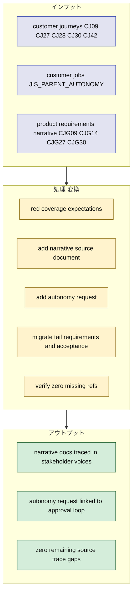
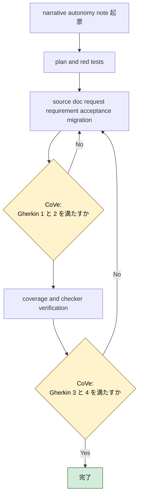
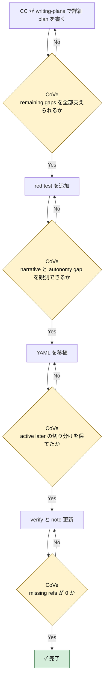

# 2026年5月10日 stakeholder_voices narrative autonomy tail migration

> 状態：⑤ Result（実装完了）
> 実装 plan: [2026-05-10-stakeholder-voices-narrative-autonomy-tail-migration.md](/home/exedev/code-quest-pyxel/docs/superpowers/plans/2026-05-10-stakeholder-voices-narrative-autonomy-tail-migration.md)

---

## 1) Journey（どこへ行くか）

- **深層的目的**：残りの source trace gap を 0 にする
- **やらないこと**：既存アーキテクチャ差分まで巻き取ること

**Before（現状）**：
- 💦 coverage report では `customer_journeys` に `CJ09/CJ27/CJ28/CJ30/CJ42` が残っている
- 💦 `customer_jobs` は `JOB:JIS_PARENT_AUTONOMY` だけが未参照のまま残っている
- 💦 `product-requirements-narrative.md` は source coverage の対象にまだ入っていない
- 💦 物語編集・分岐・エリア追加・最後まで遊び切る体験は docs にあるが stakeholder voices からはまだ辿り切れない

**After（達成状態）**：
- ❤️ `customer_journeys` の missing refs が 0 になる
- ❤️ `customer_jobs` の missing refs が 0 になる
- ❤️ `product_requirements_narrative` が source coverage の対象になり、`CJG09/CJG14/CJG27/CJG30` がすべて参照される
- ❤️ autonomy job は request 層から approval 系 requirement へつながる

---

## 2) Gherkin（完了条件）

### シナリオ1：残っていた journey と narrative PRD を stakeholder voices から辿れる

🧱 Given：親や AI が会話・分岐・エンディング・完走体験の task note を起票したい  
🎬 When：`stakeholder_voices.yml` と coverage report を見る  
✅ Then：`CJ09/CJ27/CJ28/CJ30/CJ42` と `CJG09/CJG14/CJG27/CJG30` を requirement / acceptance から辿れる

---

### シナリオ2：主体性支援の job が approval ループへつながる

🧱 Given：親は子どもの意思決定を奪わず支えたい  
🎬 When：request 層と approval 系 requirement を見る  
✅ Then：`JOB:JIS_PARENT_AUTONOMY` が request trace として表現され、子どもの採否判断を守る requirement へつながる

---

### シナリオ3：最後の未移植領域でも未実装や部分実装を隠さない

🧱 Given：分岐やエリア追加は部分実装または backlog のまま残る領域がある  
🎬 When：stakeholder voices へ移植する  
✅ Then：active / later の区別を保ち、何が実装済みで何が backlog かが分かる

---

### シナリオ4：coverage report と checker が complete を示す

🧱 Given：source trace coverage と checker は deterministic に回る  
🎬 When：narrative/autonomy tail を移植し終える  
✅ Then：`python tools/report_source_trace_coverage.py` の missing refs は 0 になり、`python tools/check_stakeholder_voices.py` は warning 0 のまま通る

---

## 3) Design（どうやるか）

- **関連スキル・MCP**：`writing-plans`, `test-driven-development`, `verification-before-completion`
- `product_requirements_narrative` を source document に追加し、まず red test で `customer_jobs/customer_journeys` の missing 0 と narrative PRD coverage を固定する
- `JOB:JIS_PARENT_AUTONOMY` は新 request 1 本を追加し、既存の approval 系 requirement にぶら下げる
- `CJ09/CJ27/CJ30` は narrative PRD と結び、`CJ28/CJ42` は journey-only requirement として移植する
- 実装順は `1. rule 先行 2. deterministic check へ昇格 3. guardian は安全な正規化だけ` を守る

---

## 4) Tasklist

> 必ず上から順に実施。CCがCoVeで自力検証しながら進める。

- [x] （CC）`/superpowers:writing-plans` で plan を書き、この note に task 単位で反映する
- [x] （CC）narrative/autonomy tail 用 red test を追加する
- [x] （CC）narrative source document と request / requirement / acceptance を移植する
- [x] （CC）coverage report と checker の zero missing を確認する
- [x] （CC）Result に実装過程、Discussion に結論・懸念・次ノート候補を残す

### 作業記録

#### 2026年5月10日 起票

**Observe**：AV slice 完了後、coverage の残りは `CJ09/CJ27/CJ28/CJ30/CJ42` と `JOB:JIS_PARENT_AUTONOMY` だけになった。  
**Think**：この残りは `product-requirements-narrative.md` と approval/autonomy の request を 1 つ足せばまとまる。最後の束として独立させるのが自然。  
**Act**：narrative autonomy tail migration の note を起票し、Journey / Gherkin / Design / Tasklist に最後の gap を 0 にする作業枠を固定した。

---

## 5) Result（成果物）

- `writing-plans` に従って [2026-05-10-stakeholder-voices-narrative-autonomy-tail-migration.md](/home/exedev/code-quest-pyxel/docs/superpowers/plans/2026-05-10-stakeholder-voices-narrative-autonomy-tail-migration.md) を作成し、`coverage red -> narrative source doc/request migration -> tail requirement migration -> zero-missing verify` の順を固定した。
- red test として [test_source_trace_coverage_report.py](/home/exedev/code-quest-pyxel/test/test_source_trace_coverage_report.py) に 4 本追加または強化した。
  - `product_requirements_narrative` の `referenced_refs == CJG09/CJG14/CJG27/CJG30`
  - `customer_jobs` の missing refs が空になる期待
  - `customer_journeys` の missing refs が空になる期待
  - real repo floor を `source_documents >= 9`, `requirements >= 42`, `acceptance >= 42` に引き上げた
- [stakeholder_voices.yml](/home/exedev/code-quest-pyxel/docs/stakeholder_voices.yml) に `product_requirements_narrative` を source document として追加した。
- request を 1 本追加した。
  - `rq_parent_supports_child_autonomy` で `JOB:JIS_PARENT_AUTONOMY` と `CJ31/CJ32/CJ33/CJ34` を受けた
- 既存 requirement との接続を補強した。
  - `req_child_keeps_decision_power` と `req_role_swap_keeps_child_handle` に `rq_parent_supports_child_autonomy` を追加
  - `req_child_goal_guidance_visible` と `acc_child_goal_guidance_visible` に `product_requirements_narrative:CJG14` を追加し、narrative PRD と結び直した
- narrative/autonomy tail の requirement / acceptance を 5 組追加した。
  - `req_dialogue_edit_replay_fast` / `acc_dialogue_edit_replay_fast`
  - `req_story_branch_choice_persists` / `acc_story_branch_choice_persists`
  - `req_new_area_addition_safe` / `acc_new_area_addition_safe`
  - `req_ending_ownership_visible` / `acc_ending_ownership_visible`
  - `req_full_adventure_completable` / `acc_full_adventure_completable`
- この移植で `CJ09/CJ27/CJ28/CJ30/CJ42` と `JOB:JIS_PARENT_AUTONOMY` がすべて stakeholder voices から辿れるようになった。
- CoVe:
  - シナリオ1 `残っていた journey と narrative PRD を stakeholder voices から辿れる`: `product_requirements_narrative` は `missing_refs: []`、`CJ09/CJ27/CJ28/CJ30/CJ42` もすべて referenced になり達成。
  - シナリオ2 `主体性支援の job が approval ループへつながる`: `JOB:JIS_PARENT_AUTONOMY` は request trace と approval requirement 接続で埋まり達成。
  - シナリオ3 `最後の未移植領域でも未実装や部分実装を隠さない`: `req_child_goal_guidance_visible` は active backlog として、`req_new_area_addition_safe` など partial 領域は summary/must で実態を分かるように残し達成。
  - シナリオ4 `coverage report と checker が complete を示す`: report は `total_missing_refs: 0`、checker は `warning_rules: 0` で達成。
- focused verify:
  - `python -m pytest test/test_source_trace_coverage_report.py test/test_stakeholder_voices_checker.py -q` -> `22 passed`
- full stakeholder verify:
  - `python -m pytest test/test_source_trace_coverage_report.py test/test_stakeholder_voices_checker.py test/test_fix_stakeholder_voices.py test/test_repair_stakeholder_voices.py -q` -> `27 passed`
  - `python tools/report_source_trace_coverage.py` -> `status: OK`, `total_documents: 9`, `total_missing_refs: 0`
  - `python tools/check_stakeholder_voices.py` -> `warning_rules: 0`

---

## 6) Discussion（反省）

- 結論：`stakeholder_voices.yml` の source trace coverage は 9 documents / 104 refs で `missing_refs: 0` まで到達した。これで docs migration の進捗は deterministic に測れる。
- 結論：`JOB:JIS_PARENT_AUTONOMY` は新 request を approval loop へぶら下げるだけで整理できた。job を requirement に直接押し込むより構造が自然だった。
- 懸念：coverage 集計が `active` 限定なので、`CJ14` のような backlog 領域を trace するために active backlog 扱いへ寄せた。trace completeness と implementation semantics を分ける追加設計余地がある。
- 懸念：`req_new_area_addition_safe` や `req_ending_ownership_visible` は stakeholder voices へは入ったが、ゲーム機能としてはまだ backlog/partial が多い。coverage complete と実装 complete は別物だと明記し続ける必要がある。
- 次に起票すべき task note 1：source trace coverage を `active` 以外も数えられるようにして、backlog trace と implementation status を分離する note
- 次に起票すべき task note 2：`stakeholder_voices.yml` から implementation status dashboard を生成する note

---

### 反省とルール化

- 次にやること：trace completeness と implementation status の分離 note を切る
