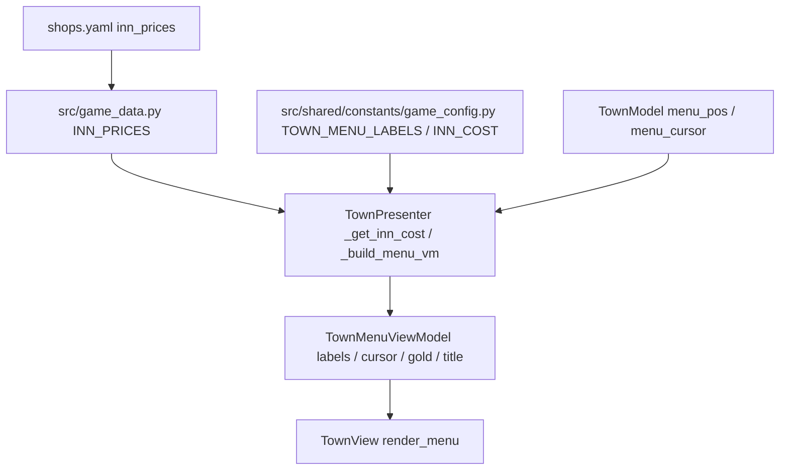

# 2026年5月17日 まちメニュー「やどや」に宿代を併記する

> 状態：② ユーザーストーリーマップ
> 次のゲート：（ユーザー指示）自走で実装まで進める（途中ゲートなし）

---

## 1) Journey（どこへ行くか）

> 補足：深層的目的 子どもが「いまここで泊まると何G減るか」を選ぶ前に分かり、安心して決められる
> 補足：やらないこと ぶきや / ぼうぐや / どうぐや のラベルには値段を併記しない（複数アイテムで価格が一意でないため）
> 補足：責務分担厳格度 full

1. 前提条件
   1. 💦 町ごとの宿代は `shops.yaml` の `inn_prices`（フォールバックは `INN_COST=10`）
   2. 💦 まちメニューラベルは `TOWN_MENU_LABELS` の固定タプルで、ラベルは静的に決まっている
   3. 💦 町ごとの宿代は `TownPresenter._get_inn_cost()` で取得済み

2. Before
   1. 💦 「やどや」を選んでも、決定するまで何 G かかるか見えない
   2. 💦 所持金が足りずに `INN_LACK_MSG` が出るまで気づけないことがある
   3. ❌ もどかしい

3. After
   1. 💦 まちメニュー画面で「やどや（5G）」のように費用が見える
   2. ✅ 子どもが所持金と見比べて泊まるか決められる
   3. ❤️ 安心

4. 例外
   1. 日本語フォントが無いとき（英語ラベル）の表示揺れ
   2. 町 index が INN_PRICES の範囲外（フォールバック INN_COST）のとき

5. 境界条件
   1. ラベル文字列幅が広がるとメニューウィンドウのレイアウトに収まるか
   2. 「やどや」以外のラベル（ぶきや等）には値段を出さない

6. 委任度
   1. 🟢 全体としてCC単独で進められる
   2. 🟢 CCのみで可：Presenter で labels を組み立てる際に「やどや」だけ宿代を埋め込む実装
   3. 🟡 一部判断要：英語ラベル `INN` 時の表記（`INN (5G)` か否か）はユーザー確認

---

## 2) ユーザーストーリーマップ

> 今回の仕事をどの順番で進めるかを Gherkin の前にそろえる。
> 委任度：🟢 ユーザー指示で自走実装まで継続
> 残る曖昧さ：なし

1. 👀 tasknote確認済み：`20260424-town-framework-rule-align`, `20260425-shop-keyerror-shop-list-unpack`, `20260425-menu-shim-crash-fix`
2. 👀 skill・tool・MCP確認済み：`manage-tasknotes` skill / `rg` / `pytest`
3. 👀 `TownPresenter._build_menu_vm` と `TownMenuViewModel` の現在の責務境界を確認する
4. 👀 「やどや」「INN」ラベルだけを宿代付きに整形する場所を Presenter 側に決める
5. ✂️ 表記ルールを固定：日本語は `やどや（5G）` の全角括弧、英語は `INN (5G)` の半角括弧
6. 📝 `_build_menu_vm` で `_get_inn_cost()` の値を「やどや」「INN」のみに埋め込むよう実装する
7. 📝 `test/test_cjg_town_presenter_actions.py` 系に `_build_menu_vm` の表記検証ケースを追加する
8. ✅ 既存テスト（728件）+ 追加ケースが pytest で全て通ることを CoVe で確認する
9. 📝 Result / Discussion に変更点と判断を記録し、Close待ちへ更新する

---

## 3) Gherkin（完了条件）

> 委任度：🟢 自走で実装まで進められる
> 残る曖昧さ：なし

### シナリオ一覧

#### シナリオ1：正常系（日本語ラベルで宿代が併記される）

1. 🧱 日本語フォントあり、町 index 0（`INN_PRICES[0]` が存在）でメニューを開いている
2. 🎬 `TownPresenter.build_menu_view_model()` を呼ぶ
3. ✅ `labels` の中に `やどや（{INN_PRICES[0]}G）` の形式の文字列が1つだけ含まれ、`はなす` / `ぶきや` / `ぼうぐや` / `どうぐや` / `セーブ` / `でる` は宿代付きにならない

---

#### シナリオ2：再試行系（英語ラベルでも宿代が併記される）

1. 🧱 英語フォントのみ、町 index 0 でメニューを開いている
2. 🎬 `TownPresenter.build_menu_view_model()` を呼ぶ
3. ✅ `labels` の中に `INN ({INN_PRICES[0]}G)` の形式の文字列が1つだけ含まれ、他の英語ラベルは宿代付きにならない

---

#### シナリオ3：境界条件（INN_PRICES の範囲外の町でも INN_COST にフォールバック）

1. 🧱 `menu_pos` が `TOWN_INDEX_BY_POS` に無い座標、もしくは `INN_PRICES` の範囲外 index を指している
2. 🎬 `TownPresenter.build_menu_view_model()` を呼ぶ
3. ✅ 「やどや」ラベルに `INN_COST`（=10）の値が併記され、crash しない

---

#### シナリオ4：異常系（金額表記が壊れても他ラベル/カーソル/GOLDは崩れない）

1. 🧱 既存の `_stay_at_inn` / `_save` / `_exit` / カーソル移動が動いている状態
2. 🎬 ラベル整形を加えたあとも `TownMenuViewModel` の `cursor` / `gold` / `title` は従来通りに組み立てる
3. ✅ 既存テスト（pytest 728 + 追加分）が全て通り、ラベル件数は 7 のまま変わらない

---

## 4) Design（どうやるか）

### 責務分担概要

| 親ディレクトリ | 責務概要 |
|---|---|
| `src/scenes/town/` | 町シーンの状態・入力解釈・遷移決定・描画用データ生成 |
| `src/shared/constants/` | ラベル定数 / 宿代フォールバック / 町 index マッピング |
| `src/` | `shops.yaml` 由来の `INN_PRICES` を提供 |
| `test/` | TownPresenter の表記とアクションを検証 |

### 責務分担概要図

### 責務分担詳細

#### 親ディレクトリ: `src/scenes/town`

- ファイル名: `presenter.py`
- 既存/新規: 既存
- 責務内容:
  - `_build_menu_vm`: 日本語/英語ラベル配列を取得した上で、`_get_inn_cost()` を呼び、「やどや」/「INN」ラベルのみ `f"やどや（{cost}G）"` / `f"INN ({cost}G)"` に置換した tuple を `TownMenuViewModel.labels` に渡す
  - `_format_inn_label` (新規 private helper): 1ラベルを受け取り、`やどや` / `INN` の場合だけ宿代を埋め込んで返す。それ以外はそのまま返す
- 置く理由: 表示文字列の組み立ては Presenter の責務（M3-1）であり、判定込みのラベル整形は View や Model に染み出させない

#### 親ディレクトリ: `src/scenes/town`

- ファイル名: `view_model.py`
- 既存/新規: 既存
- 責務内容:
  - `TownMenuViewModel.labels`: 既存の `tuple[str, ...]` のまま、整形済み文字列だけを受け取る（型・スキーマ変更なし）
- 置く理由: ViewModel は「描画判定済みの文字列」を運ぶ責務だけを持ち、整形ロジックは持たない

#### 親ディレクトリ: `src/scenes/town`

- ファイル名: `view.py`
- 既存/新規: 既存
- 責務内容:
  - `_render_menu_window`: そのまま `vm.labels` を描画する。判定や整形はしない
- 置く理由: View は ViewModel と Pyxel API だけを扱う（M2-2）

#### 親ディレクトリ: `src/shared/constants`

- ファイル名: `game_config.py`
- 既存/新規: 既存
- 責務内容:
  - `TOWN_MENU_LABELS` / `TOWN_MENU_LABELS_EN` / `INN_COST`: 文言・フォールバック値の SSoT。今回は変更しない
- 置く理由: ラベル文字列の SSoT を Presenter から逆流させない

#### 親ディレクトリ: `test`

- ファイル名: `test_cjg_town_presenter_actions.py`
- 既存/新規: 既存
- 責務内容:
  - `TownMenuViewModelLabelTest`（新規追加クラス）: シナリオ1〜4 を `_build_menu_vm` / `build_menu_view_model` で検証する。fake game の has_jp_font 切替・menu_pos 切替・所持金固定で labels の中身を確かめる
- 置く理由: 既存の TownPresenter テスト群と並べることで、町メニューの単体観点を1ファイルに集約しテスト疎結合性を保つ

- **関連スキル・MCP**：`manage-tasknotes` のみ。他は不要

---

---

## 5) Tasklist

（Design 承認後に記入）

---

## 6) Result（成果物）

（実行後に記入）

---

## 7) Discussion（残課題の起票）

### 残課題メモ

- なし（実行後に更新）

---

### 反省とルール化

- 記入先：observe-situation / manage-tasknotes / CLAUDE.md
- 次にやること：

---

## 8) 参考文献

- `src/scenes/town/presenter.py` `_get_inn_cost` / `_build_menu_vm`
- `src/scenes/town/view_model.py` `TownMenuViewModel`
- `src/shared/constants/game_config.py` `TOWN_MENU_LABELS` / `INN_COST`
- `src/game_data.py` `INN_PRICES`（shops.yaml 由来）
