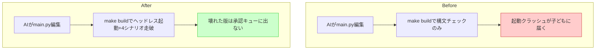

# ガードレール(3) ヘッドレステスト基盤

## 深層的目的

壊れた版を子どもに届けない最後の防壁。

## 対象ガードレール

G8, G9

---

## 1. 改善対象ジャーニー



## 2. カスタマージャーニーgherkin

根拠: [`cj-gherkin-guardrails.md`](../../docs/cj-gherkin-guardrails.md) CJG35

```gherkin
Feature: 壊れた版を子どもに届けない
  AIがコードを壊しても、ビルド時にヘッドレステストで検出し、
  壊れた版は承認キューに出さない。

Background:
  Given ビルドパイプラインは make build から実行される
  And Pyxel はヘッドレスモード（画面なし）で起動できる

# --- G8: 起動テスト ---

Scenario: importエラーを起こす版はビルド失敗になる
  Given AIが main.py を編集した
  And その編集で NameError / ImportError 等が発生する
  When make build を実行する
  Then ヘッドレス起動テストが失敗する
  And exit code 非0 で終了する
  And エラー要約（ファイル名・行番号・例外名）が表示される

Scenario: 初期化から1フレーム描画まで完走できればテスト通過
  Given AIが main.py を編集した
  And 構文・import・初期化に問題がない
  When make build を実行する
  Then ヘッドレスモードでゲームが起動し1フレーム描画まで完走する
  And exit code 0 で終了する

# --- G9: シナリオテスト（4シナリオ） ---

Scenario: 主要シナリオが走破できなければビルド失敗になる
  Given AIが任意のコードを修正した
  When make build のシナリオテストステップが実行される
  Then 以下の4シナリオが順に実行される
    | シナリオ | 内容 |
    | 移動 | フィールドを数歩歩く |
    | 戦闘開始 | エンカウントして戦闘画面に入る |
    | 1ターン行動 | 攻撃または呪文を1回実行する |
    | セーブ | セーブ処理を実行してロードできる |
  And いずれか1つでも例外またはタイムアウトなら失敗する
  And 失敗したシナリオ名が表示される

# --- 承認キューとの連携 ---

Scenario: 壊れた版は承認キューから除外される
  Given 2版ビルド (A版/B版) のうち A版が失敗した
  When 承認キュー生成ステップが実行される
  Then B版のみが選択ページに並ぶ
  And A版のスロットには「このばんは うごきませんでした」と表示される
```

## 3. Design

### 前提

- Pyxel 2.8.10 インストール済み（`headless=True` サポート: v2.7.10+）
- `main.py:4540` で `pyxel.init(256, 256, ...)` → `Game()` → `game.start()` → `pyxel.run()`

### 初回スコープ

- **G8（起動テスト）のみ実装**。G9（4シナリオ）は後日
- 理由: 起動テストだけで importエラー・初期化クラッシュの大半を防げる。シナリオテストはゲーム内部状態の操作が必要で設計が重い

### 構成

```
tools/test_headless.py    ← ヘッドレス起動テストスクリプト
```

### test_headless.py の動作

```
1. main.py を import（構文エラー・importエラーを検出）
2. Game.__init__ 内の pyxel.init() を headless=True 付きに差し替え
3. Game() をインスタンス化（初期化処理を完走させる）
4. update() と draw() を1回ずつ呼ぶ（1フレーム描画）
5. 例外なく完走 → exit 0
6. 例外発生 → エラー要約を出力して exit 1
```

### headless=True の差し込み方

`pyxel.init` をモンキーパッチして `headless=True` を強制注入:
```python
original_init = pyxel.init
def headless_init(*args, **kwargs):
    kwargs["headless"] = True
    original_init(*args, **kwargs)
pyxel.init = headless_init
```

これにより main.py のコードを一切変更しない。

### make build との統合

既存の `tools/build_web_release.py` の前段で `test_headless.py` を実行。
Makefile がないため、当面は手動またはhookから呼ぶ。

## 4. Tasklist

- [x] `tools/test_headless.py` — G8 起動テスト作成
- [x] 正常ケース・異常ケースのテスト
- [ ] [後日] G9 シナリオテスト（移動・戦闘・行動・セーブ）
- [ ] [後日] `make build` への統合

## 5. Discussion

- 2026-04-12 起票
- 2026-04-12 改善対象ジャーニー承認 → カスタマージャーニーgherkin・Design記入
- 2026-04-12 Pyxel 2.8.10 で headless=True ネイティブサポート確認
- 2026-04-12 初回スコープ: G8のみ、G9は後日
- 2026-04-12 G8 実装完了。ヘッドレス起動+1フレーム描画テスト通過確認
