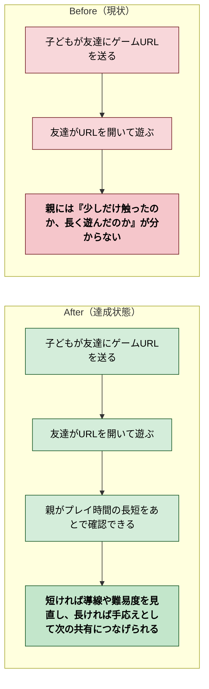
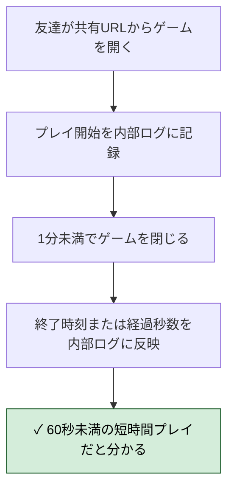
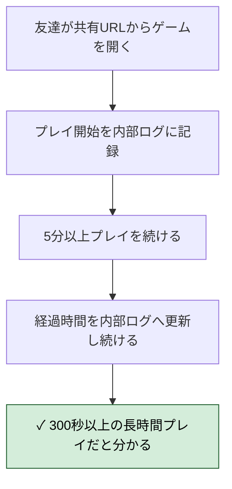
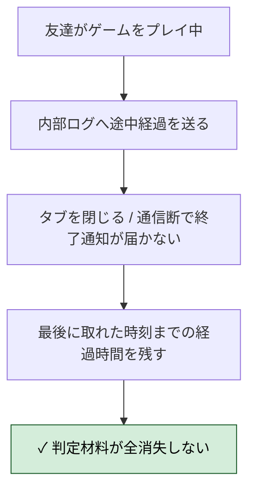
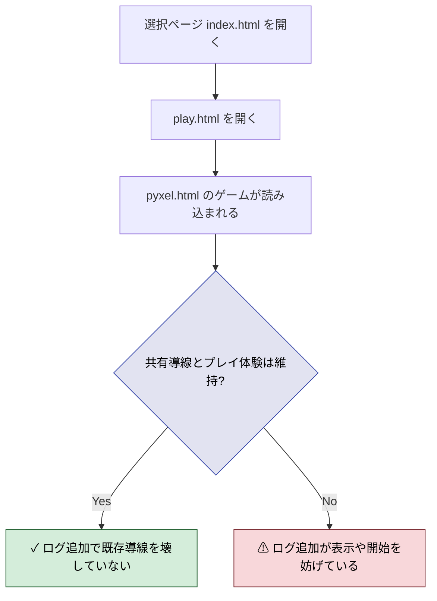
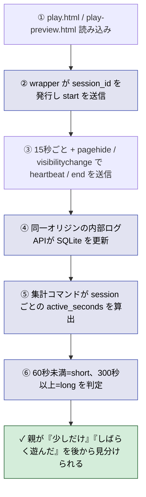
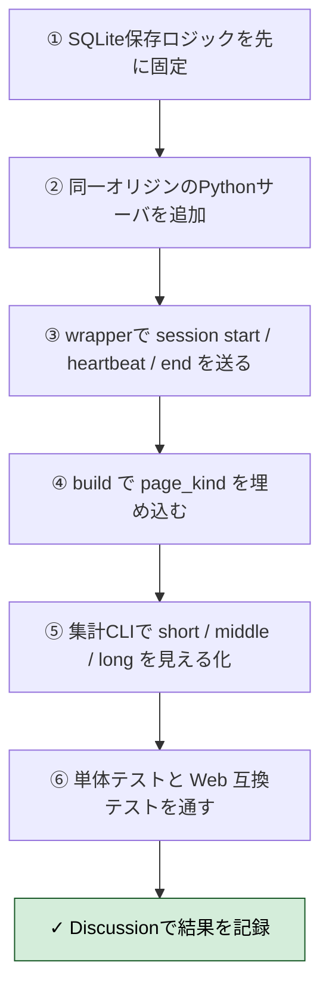

# 2026年4月13日 J21 共有後のプレイ時間がわかるようにする

> 状態：(5) Discussion
> 次のゲート：（ユーザー）必要なら運用手順追記 or 次タスク

---

## 1) 改善対象ジャーニー

- **深層的目的**：共有したゲームが「少しだけ触られた」のか「しばらく遊ばれた」のかを親が把握できるようにして、次の声かけや改善判断につなげる
- **やらないこと**：プレイ内容の完全リプレイ、個人特定を前提にした追跡、会員登録機能の追加、ゲーム本編の遊び方変更

### 現状

- `docs/cj-gherkin-platform.md` の CJG21-4 は「日別・ページ別のアクセス数」が中心だが、今回ほしいのは件数だけでなく「どれくらい遊んでいたか」の手がかり
- 現在のリポジトリには `index.html` / `play.html` / `pyxel.html` などの Web 配信物はあるが、プレイ時間の長短を内部で残す仕組みは見当たらない
- そのため今は URL を送った後に、「開かれた」こと以上の情報がなく、すぐ離脱したのか、夢中で遊んだのかを区別できない

### 今回の方針

- まずは共有URLから始まったプレイについて、短時間なのか長時間なのかを後から判定できる内部ログを最小構成で成立させる
- 子どもや友達に追加の登録や操作を求めず、URLを開くだけの軽さは維持する
- 今回ほしいのは厳密な行動分析ではなく、「ちょっと触った」「しばらく遊んだ」を見分けられる程度の滞在・プレイ時間の手がかり
- 可視化UIや親向けダッシュボードは今回のスコープに入れず、まずは後段で参照できるログ事実を内部に残す

### 委任度

- 🟢 CC主導で改善対象ジャーニーの再定義は進められる。次は「何をもって短い/長いと見るか」をカスタマージャーニーgherkinで固定すればよい

---

## 2) カスタマージャーニーgherkin（完了条件）

### シナリオ1：短時間プレイだと分かる

> {共有URLから友達がゲームを開いた} で {1分未満でゲームを閉じる} と {内部ログに 60 秒未満のプレイ時間が残り「少ししか遊ばなかった」と後から判定できる}

---

### シナリオ2：長時間プレイだと分かる

> {共有URLから友達がゲームを開いた} で {5分以上プレイを続ける} と {内部ログに 300 秒以上のプレイ時間が残り「しばらく遊んでいた」と後から判定できる}

---

### シナリオ3：異常系（終了通知が飛ばなくても長短判定の材料を残せる）

> {共有URLから友達がゲームを開いてプレイ中} で {タブを閉じる・通信断になる等で終了通知が届かない} と {最後に取れた時刻までの経過時間が内部ログに残り、短時間か長時間かの判定材料が失われない}

---

### シナリオ4：リスク確認（既存の共有導線を壊さない）

> {プレイ時間ログを追加済み} で {`index.html` から `play.html` を経由してゲームを開く} と {共有URLからのプレイ開始は従来どおり動き、ログ追加でゲーム体験を壊していない}

### 委任度

- 🟢 CC主導でカスタマージャーニーgherkin は固まった。Tasklist ではセッション開始・途中経過・終了をどの粒度で実装するかへ落とし込める

---

## 3) Design（どうやるか）

- **関連スキル・MCP**：`superpowers:brainstorming`、`superpowers:verification-before-completion`、`tools/test_web_compat.py`
- **MCP**：追加なし

```mermaid
flowchart LR
    subgraph INPUT["インプット"]
        I1["共有URL\nplay.html / play-preview.html"]
        I2["既存の Pyxel Web 配信物\npyxel.html / pyxel-preview.html"]
        I3["内部ログ保存先\n.runtime/play_sessions.sqlite3"]
    end

    subgraph PROCESS["処理・変換"]
        P1["ラッパーHTMLで session_id を発行"]
        P2["start / heartbeat / end を同一オリジンへ送信"]
        P3["軽量Pythonサーバが SQLite に upsert"]
        P4["集計スクリプトが active_seconds を日別・ページ別に要約"]
    end

    subgraph OUTPUT["アウトプット"]
        O1["各プレイの started_at / last_seen_at / active_seconds"]
        O2["short / middle / long を判定できる要約結果"]
    end

    INPUT --> PROCESS --> OUTPUT

    classDef io fill:#e2e3f1,stroke:#3949ab,color:#000000;
    classDef proc fill:#fff3cd,stroke:#856404,color:#000000;
    classDef out fill:#d4edda,stroke:#155724,color:#000000;

    class I1,I2,I3 io;
    class P1,P2,P3,P4 proc;
    class O1,O2 out;
```

### 設計の要点

- 計測点は `pyxel.html` 本体ではなく `templates/wrapper.html` 由来の `play.html` / `play-preview.html` に置く。Pyxel の生成HTMLへ直接手を入れるより保守しやすく、`pagehide` や `visibilitychange` などブラウザのライフサイクルを素直に使えるため
- 共有導線は今のまま `index.html -> play.html -> pyxel.html` を維持し、プレイ時間の計測対象は実プレイ導線である `play.html` / `play-preview.html` に限定する。`index.html` の滞在はゲームプレイ時間に混ぜない
- 送信方式は 3 段階に分ける。`start` はページ読み込み直後に1回、`heartbeat` は 15 秒ごとに可視状態で送信、`end` は `pagehide` と `visibilitychange=hidden` で `navigator.sendBeacon()` を優先して送る
- ブラウザ都合で `end` が飛ばない前提で設計する。そのためサーバ側は `last_seen_at` を常に更新し、最後に受けた heartbeat までの経過秒数を確定値として残す
- 保存先は新設の `.runtime/play_sessions.sqlite3` を前提にする。JSONL よりも「同じ session_id の更新」「途中 heartbeat の upsert」「日別集計」が簡単で、内部ログ用途に十分軽い
- セッション識別子はラッパー読み込みごとにランダム UUID を発行し、個人特定情報は持たない。最低限の列は `session_id`, `page_kind`, `started_at`, `last_seen_at`, `ended_at`, `active_seconds`, `ended_cleanly` とする
- 判定は保存時に固定しすぎず、まず `active_seconds` を正として残す。集計時に `short < 60`, `long >= 300`, その間は `middle` として扱う。これで 2 分遊んだケースを無理に短い/長いへ丸めずに済む
- 内部ログAPIは同一オリジンの軽量 Python HTTP サーバとして別追加する。静的ファイル配信に対して `POST /internal/play-sessions/start`, `POST /internal/play-sessions/heartbeat`, `POST /internal/play-sessions/end` を生やし、将来 UI を足す場合もこの保存形式を再利用する
- 親向けダッシュボードは今回作らない。代わりに内部確認用として、日別・ページ別・時間帯別に `active_seconds` を要約する CLI か簡易レポート出力スクリプトを用意する

### 既存ファイルとの対応

- `templates/wrapper.html`
  ラッパーJSに session tracker を追加し、`page_kind` とログAPIのURLを埋め込めるようにする
- `tools/build_web_release.py`
  `play.html` と `play-preview.html` にそれぞれ異なる `page_kind` を埋めてラッパー生成する
- `index.html`
  リンク構造は維持。必要なら共有URLとして `play.html` を明示する文言調整だけにとどめる
- `tools/test_web_compat.py`
  既存の Web 起動テストを壊さないことを確認し、必要なら内部ログAPI起動込みの互換テストへ拡張する
- 新規の内部ログサーバ
  SQLite への保存、session upsert、集計用の読み出しを担当する
- 新規のログ確認コマンド
  日別・ページ別の session 数と `active_seconds`、short / middle / long の件数を確認する

### 検証方針

- 単体テストで session 集計ロジックを固定する。`start -> heartbeat -> end` の正常系、`start -> heartbeat` までで終了通知なしの異常系、境界値 59 秒 / 60 秒 / 299 秒 / 300 秒の分類を確認する
- `tools/test_web_compat.py` 系では、`play.html` を開いてゲームが従来どおり表示されることと、コンソールエラーを増やしていないことを確認する
- 共有導線の手動確認では `index.html -> play.html -> pyxel.html` と `play-preview.html` の両方で、ログ送信追加後も全画面ボタンや iframe 表示が壊れていないことを確認する

### 委任度

- 🟡 CC主導で実装設計までは固められるが、配信先で同一オリジンの Python ログAPIをどう常駐させるかは運用判断が必要

---

## 4) Tasklist

- [x] `src/play_session_logging.py` を新規作成し、`.runtime/play_sessions.sqlite3` のスキーマ作成、`start_session()`、`heartbeat_session()`、`end_session()`、`summarize_sessions()` を実装する
- [x] `test/test_play_session_logging.py` を追加し、`59秒=short`、`60秒=middle`、`299秒=middle`、`300秒=long`、終了通知なしでも `last_seen_at` から判定できることを Red/Green で固定する
- [x] `tools/web_runtime_server.py` を新規作成し、静的ファイル配信と `POST /internal/play-sessions/start|heartbeat|end` を同じ Python プロセスで受ける `http.server` ベースの軽量サーバを実装する
- [x] `templates/wrapper.html` に session tracker を追加し、ページ読み込み直後の `start`、15秒ごとの `heartbeat`、`pagehide` / `visibilitychange` 時の `end` を `navigator.sendBeacon()` 優先で送る
- [x] `tools/build_web_release.py` の `generate_wrapper()` を拡張し、`play.html` と `play-preview.html` に `page_kind=current|preview` と内部ログAPIパスを埋め込めるようにする
- [x] `tools/report_play_sessions.py` を新規作成し、日別・ページ別の session 数、平均 `active_seconds`、`short / middle / long` 件数を端末で確認できるようにする
- [x] `tools/test_web_compat.py` を `play.html` ベースの確認へ寄せるか、必要ならログAPI込みの補助テストを追加して、共有導線と iframe 表示が壊れていないことを確認する
- [x] `python -m pytest test/ -q` と `python tools/test_web_compat.py` を実行し、タスクノートのカスタマージャーニーgherkin に対して不足がないか CoVe で見直す

---

## 5) Discussion（記録・反省）

> Observe → Think → Act を刻む。未来の自分が復元できることが目的。

### 2026年4月13日 20:47（Tasklist化）

**Observe**：ユーザー了承により、配信先では「同一オリジンの Python サーバが静的ファイル配信と内部ログAPIをまとめて持つ」前提で進めてよくなった。  
**Think**：これで CORS や別サービス連携を先送りでき、最小構成で「プレイ時間の長短を判定できる内部ログ」に集中できる。まず保存ロジックを先に固定し、その後に wrapper とサーバをつなぐのが安全。  
**Act**：`Tasklist` を追加し、保存層、同一オリジンサーバ、wrapper 計測、build 埋め込み、集計CLI、検証の順に実装を進める形へ整理した。

### 2026年4月13日 20:55（実装・検証完了）

**Observe**：保存層、同一オリジンサーバ、wrapper 計測、build 埋め込み、集計CLI まで実装し、`play.html` 経由で `POST /internal/play-sessions/start` が届くところまで確認できた。ソケットを開くテストだけは sandbox 制約があるため、通常の `pytest` では skip に寄せ、権限付き実行で実際の通過を別確認した。  
**Think**：計測点を `play.html` ラッパーに寄せたことで、Pyxel 生成HTMLを直接いじらずに「開始・途中経過・終了」の記録を足せた。分類は保存時に固定せず `active_seconds` を残す形にしたので、将来の閾値変更にも耐えやすい。  
**Act**：`src/play_session_logging.py`、`tools/web_runtime_server.py`、`tools/report_play_sessions.py` を追加し、`templates/wrapper.html` / `tools/build_web_release.py` / `tools/test_web_compat.py` を更新した。`python tools/build_web_release.py`、`python -m pytest test/ -q` で `146 passed, 2 skipped`、権限付きで `python -m pytest test/test_web_runtime_server.py -q` で `2 passed`、`python tools/test_web_compat.py` で `OK: Web版テスト通過` を確認した。

### 2026年4月13日 23:08（完了処理）

**Observe**：ノート本文は `Tasklist` 完了と実装・検証完了まで記録済みだったが、`status: open` のまま `steering/` に残っていた。実装ファイルとテストは現行ツリー上にも残っている。  
**Think**：未完了だったのは実装ではなく、タスクノートの完了処理だけだった。close 前に fresh な検証を取り直してから `done` へ移すのが安全。  
**Act**：`python tools/test_web_compat.py` を権限付きで再実行して `OK: Web版テスト通過（10秒間クラッシュ・致命的エラーなし）`、`python -m pytest test/ -q` で `153 passed, 2 skipped` を確認し、J21 を `steering/done/` へ移した。

---

### 反省とルール化

- 記入先：observe-situation / manage-tasknotes / AGENTS.md
- 次にやること：必要なら `tools/report_play_sessions.py` の使い方と `tools/test_web_compat.py` の実行条件を運用メモへ追記する
